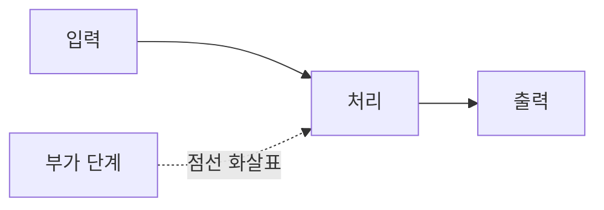

# 블로그 글 작성 가이드

이 폴더(`blog/src/posts/`)의 `.md` 파일 1개가 블로그 글 1편입니다. 파일을 추가하면 자동으로 목록에 노출됩니다.
(이 `README.md`는 로더에서 자동 제외됩니다.)

## 새 글 추가하기

1. `blog/src/posts/` 에 `my-post-slug.md` 파일을 만든다. **파일명이 URL slug**가 됩니다 → `https://blog.kahnco.me/my-post-slug`
2. 맨 위에 frontmatter를 작성한다:

```markdown
---
title: 글 제목 (검색 키워드를 자연스럽게 포함)
date: 2026-07-01
description: 검색 결과·SNS 공유에 노출되는 한 줄 요약. 120자 내외 권장.
tags: [DevOps, CI/CD, GitHub Actions]
thumbnail: /cover.png        # 선택. public/ 기준 절대경로
draft: false                 # true면 목록·배포에서 제외 (개발 모드에서만 미리보기)
---

여기부터 마크다운 본문.
```

3. 본문을 마크다운으로 작성한다. 표·체크리스트(GFM), 코드 블록 구문 강조 모두 지원.

## 어투

블로그 전체 글은 **정중한 합니다체**로 작성합니다. 단정 평어체("~다")나 명령형("~해라")은 쓰지 않고,
의견 있는 내용은 유지하되 전달 어투만 부드럽게 합니다.

## 다이어그램 (Mermaid)

아키텍처·플로우 도식은 ` ```mermaid ` 코드 블록으로 넣으면 자동으로 다크 테마 SVG로 렌더링됩니다.
(mermaid는 지연 로드되고, 문법 오류로 렌더에 실패하면 원본 코드 블록으로 폴백됩니다.)

````markdown

````

작성 팁:
- **라벨은 따옴표로 감싼다** — 한글·괄호·`=`·`/` 등 특수문자가 있으면 `["..."]` 처럼 큰따옴표로 감싸야 안전합니다.
- **줄바꿈은 `<br/>`** — 라벨 안에서 줄을 나눌 때 씁니다. (예: `A["HPA<br/>파드 수 ↑"]`)
- **방향**: `flowchart LR`(가로) / `TD`·`TB`(세로) / `RL`·`BT`. 노드가 많으면 세로가 읽기 좋습니다.
- **점선/실선**: 실선 `-->`, 점선 `-.->`, 라벨은 `-->|"문구"|`.
- **모양**: `["사각"]`, `("둥근")`, `{"마름모(분기)"}`, `[("원통=저장소")]`.
- flowchart 외에 `sequenceDiagram`(시퀀스), `stateDiagram-v2`(상태) 등도 지원됩니다. 글 내용에 맞는 형식을 고르세요.

도식은 "글의 핵심 구조를 한 장으로 보여주는" 자리에 1개 정도가 적절합니다. 너무 많으면 오히려 산만해집니다.

## 마크다운 주의 — 강조(**)와 한글·따옴표

CommonMark의 flanking 규칙 때문에, **강조 기호가 큰따옴표·한글과 바로 붙으면 깨져서 `**`가 그대로 노출**될 수 있습니다.
특히 `**"인용"**` 바로 뒤에 한글이 오는 경우가 대표적입니다.

```text
✗ 깨짐:  그것을 **"기존 삭제 + 새 생성"**으로 해석합니다   ← 닫는 ** 가 " 와 한글 사이
✓ 정상:  그것을 "**기존 삭제 + 새 생성**"으로 해석합니다   ← 따옴표를 ** 바깥으로
✓ 정상:  ...쓰지 않는다는 뜻**입니다                       ← 강조 끝을 한글 경계로
```

규칙: **따옴표는 `**`의 바깥에 두거나(`"**텍스트**"`), 강조의 끝이 한글(또는 공백)에 닿도록** 합니다.
의심되면 `grep -nE '[""]\*\*[가-힣]' *.md` 로 점검하세요.

## SEO 체크리스트

- **title**: 사람들이 실제로 검색하는 표현을 넣는다.
- **description**: 글의 핵심을 한 문장으로. 검색 결과 스니펫에 그대로 쓰인다.
- **첫 문단**: 무슨 문제를 푸는 글인지 바로 명시한다.
- **헤딩(##)**: 키워드를 자연스럽게 배치. 자동으로 id가 붙어 앵커 링크가 된다.
- **내부 링크**: 관련 글끼리 `[다른 글](/other-slug)` 로 연결한다.

## 빌드 & 배포

```bash
cd blog
yarn build                            # sitemap 생성 + 타입체크 + 번들
firebase deploy --only hosting:blog   # 레포 루트에서 실행
```

> 참고: 이 사이트는 클라이언트 렌더링 SPA라 검색엔진 JS 실행에 의존한다.
> 더 강한 SEO가 필요해지면 빌드 타임 프리렌더링(react-snap 등) 도입을 검토할 것.
