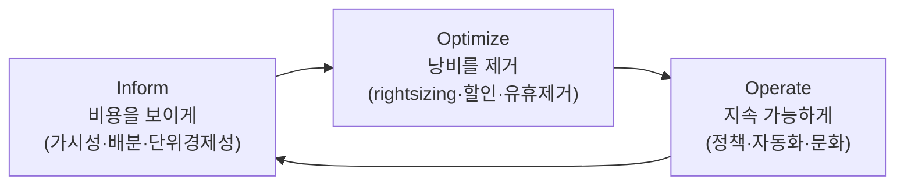
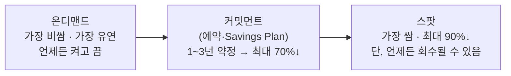
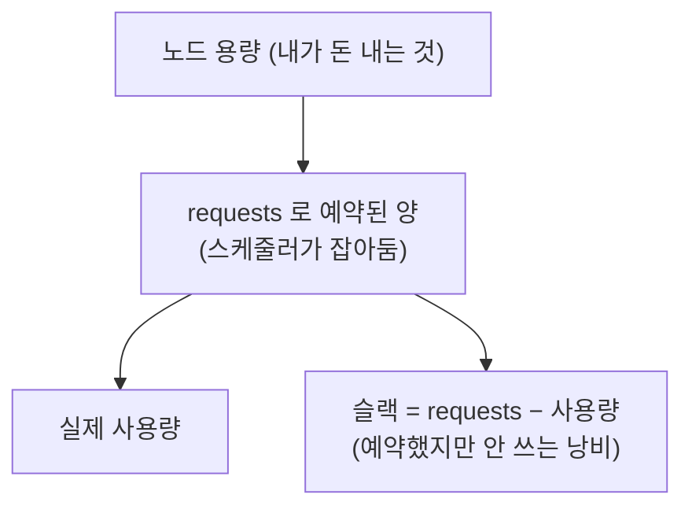

인프라를 코드로 정의하고([CDK](/taming-aws-cdk-in-production)), 자동으로 배포·확장하고([GitOps](/gitops-with-argocd)·[오토스케일링](/kubernetes-autoscaling-resource-tuning)), 눈을 뜨고 운영하는([관찰성](/observability-three-pillars)) 법을 이야기했습니다. 그런데 이 모든 걸 잘 해내도 매달 도착하는 **클라우드 청구서**를 보며 한숨 쉬는 팀이 많습니다. "우리가 이렇게 많이 쓰고 있었나?" 클라우드의 편리함은 공짜가 아니었고, 그 대가를 다스리는 것이 이 글의 주제 — **FinOps** 입니다.

FinOps는 "비용을 아끼는 잔기술 모음"이 아닙니다. **클라우드 비용을 엔지니어링·재무·비즈니스가 함께 다루는 문화이자 실천 체계**입니다. 이 글은 왜 클라우드가 비용의 성격을 바꿨는지부터, 비용을 보이게 만들고, 낭비를 제거하고, 그것을 지속 가능하게 운영하는 전 과정을 밑바닥까지 파고듭니다.

## 1. 클라우드는 비용을 바꿔놓았다

FinOps를 이해하려면 먼저 클라우드가 비용의 **성격 자체**를 어떻게 바꿨는지 봐야 합니다.

전통적인 온프레미스에서는 서버를 **미리 사둡니다.** 큰돈을 한 번에 들여(자본지출, CapEx) 하드웨어를 구매하고, 그걸 몇 년간 씁니다. 비용은 예측 가능하고, 고정적이며, 살 때 한 번 결재하면 끝입니다. 무엇보다 "리소스를 늘리려면 구매 절차를 거쳐야" 하니, 비용이 함부로 늘지 않습니다.

클라우드는 정반대입니다. **쓴 만큼 냅니다(운영지출, OpEx).** 이건 엄청난 장점입니다 — 필요할 때 즉시 늘리고, 안 쓰면 끄고, 초기 투자 없이 시작할 수 있습니다. 그런데 바로 그 유연함이 비용을 다루기 어렵게 만듭니다.

- **비용이 가변적이고 실시간입니다.** 매 순간의 사용량이 곧 비용이라, 청구서가 나오기 전엔 얼마가 나올지 정확히 모릅니다.
- **누구나 비용을 만들 수 있습니다.** 개발자가 콘솔에서 클릭 몇 번, 코드 몇 줄로 값비싼 리소스를 켤 수 있습니다. 구매 승인 절차라는 자연스러운 제동 장치가 사라졌습니다.
- **비용이 흩어집니다.** 수백 개의 서비스·계정·리전에 비용이 조각조각 분산돼, "무엇이 왜 비싼지"를 파악하기 어렵습니다.

결과적으로 클라우드에서는 **"쓴 만큼 낸다"가 관리 없이 방치되면 "모르는 만큼 샌다"** 가 됩니다. 켜두고 잊은 리소스, 필요 이상으로 큰 인스턴스, 아무도 안 보는 로그 저장소가 조용히 돈을 태웁니다. 비용을 다시 엔지니어링의 통제 아래로 가져오는 것 — 그것이 FinOps입니다.

## 2. FinOps란 무엇인가 — 정의와 라이프사이클

FinOps는 "Finance"와 "DevOps"를 합친 말입니다. 정의를 옮기면, **엔지니어링·재무·비즈니스 팀이 협업해 클라우드 지출에 대한 데이터 기반의 의사결정을 내리고, 비용에 대한 주인의식을 조직 전체에 심는 실천 체계**입니다.

핵심은 몇 가지 원칙에 있습니다.

- **비용은 모두의 책임이다.** 재무팀 혼자 청구서를 붙들고 씨름하는 게 아니라, **비용을 만든 엔지니어가 그 비용을 보고 책임집니다.** 관찰성에서 "만든 사람이 운영한다"고 했듯, FinOps에서는 "만든 사람이 비용을 본다"가 됩니다.
- **비즈니스 가치가 기준이다.** 목표는 무조건 싸게가 아니라, **쓴 돈이 그만한 가치를 만드는가**입니다. 절대 비용을 줄이는 게 아니라 비용 효율(가치 대비 비용)을 높이는 겁니다.
- **데이터가 실시간으로 접근 가능해야 한다.** 비용을 다스리려면 먼저 비용이 **보여야** 합니다.

FinOps는 흔히 **세 단계의 순환**으로 설명됩니다.



- **Inform(가시성)** — 누가, 무엇에, 얼마를 쓰는지 보이게 만듭니다.
- **Optimize(최적화)** — 그 위에서 낭비를 찾아 제거하고 할인을 활용합니다.
- **Operate(운영)** — 이 모든 걸 일회성이 아니라 지속되는 습관·자동화로 정착시킵니다.

이 순환이 계속 돌면서 조직의 FinOps 성숙도가 올라갑니다. 이제 각 단계를 깊이 들어갑니다.

## 3. Inform ① — 비용을 보이게 만들기

모든 FinOps의 출발점은 **가시성** 입니다. 보이지 않는 비용은 관리할 수 없습니다. 그런데 클라우드 청구서를 그냥 열면 "EC2에 얼마, S3에 얼마" 같은 **서비스별 합계**만 보입니다. 이건 "우리 팀이 총 얼마 썼다"는 알려줘도 "그게 어느 서비스·어느 팀·어느 기능 때문인가"는 안 알려줍니다.

그래서 필요한 게 **태깅(tagging)** 입니다. 모든 리소스에 `team`, `service`, `environment`, `cost-center` 같은 태그(쿠버네티스라면 레이블)를 붙여, 비용을 이 축으로 쪼갤 수 있게 만듭니다.

```text
# 리소스 태그 예시 — 이 값들이 비용 배분의 축이 된다
team:        payments
service:     checkout-api
environment: prod
cost-center: 1234
```

태깅이 갖춰지면 "결제팀의 prod 환경 checkout 서비스가 이번 달 얼마를 썼는지"를 볼 수 있습니다. 이것을 **비용 배분(cost allocation)** 이라 합니다. 문제는 태깅이 **실제로는 잘 안 지켜진다**는 것입니다. 누군가는 태그를 안 붙이고, 오타를 내고, 규칙이 팀마다 다릅니다. 태그 없는 리소스는 "unallocated(미배분)"로 남아, 비용의 상당 부분이 "누구 것인지 모르는" 상태가 되곤 합니다. 그래서 태깅은 **거버넌스** — 표준 태그 정의, 강제(뒤에서 볼 정책), 주기적 점검 — 가 뒷받침돼야 합니다.

### 쇼백과 차지백

배분된 비용을 조직에 어떻게 돌려주느냐도 선택입니다.

- **쇼백(showback)** — "당신 팀이 이만큼 썼습니다"를 **보여주기만** 합니다. 실제 정산은 안 하지만, 각 팀이 자기 비용을 인식하게 만드는 것만으로도 큰 효과가 있습니다.
- **차지백(chargeback)** — 실제로 각 팀의 예산에서 **비용을 청구**합니다. 책임이 훨씬 강해지지만, 공유 비용을 어떻게 나눌지 등 정치적·회계적 복잡성이 큽니다.

대부분의 조직은 쇼백으로 시작해 문화가 성숙하면 차지백으로 넘어갑니다. 어느 쪽이든 핵심은 **비용을 그것을 만든 팀의 눈앞에 놓는 것**입니다. 안 보이면 아무도 신경 쓰지 않습니다.

## 4. Inform ② — 단위 경제성, 그리고 절대 비용의 함정

여기서 FinOps의 가장 중요하고 성숙한 개념 하나를 짚어야 합니다. **절대 비용만 보면 안 됩니다.**

"이번 달 클라우드 비용이 20% 늘었다"는 소식은 나쁜 걸까요? 알 수 없습니다. 만약 그 사이 사용자가 50% 늘었다면, 비용은 오히려 **효율적으로** 쓰이고 있는 겁니다. 비즈니스가 두 배 커졌는데 비용이 20%만 늘었다면 훌륭한 것이죠. 반대로 사용자는 그대로인데 비용만 20% 늘었다면 어딘가 새고 있는 겁니다.

그래서 성숙한 FinOps는 **단위 경제성(unit economics)** 을 봅니다. 비용을 비즈니스 지표로 나눈 값입니다.

- **주문 1건당 인프라 비용**
- **활성 사용자 1명당 비용**
- **API 요청 100만 건당 비용**

이 단위 비용의 **추세**야말로 진짜 신호입니다. 절대 비용은 사업이 크면 당연히 커지지만, 단위 비용이 오른다면 효율이 나빠지고 있다는 뜻입니다. [서버리스 글](/when-is-serverless-the-answer)에서 "단위 경제성 — 하나 더 팔 때마다 남는 구조인가"를 이야기했는데, FinOps에서도 이 관점이 그대로 핵심입니다. **비용 최적화의 목표는 청구서 숫자를 줄이는 게 아니라, 이 단위 비용을 건강하게 유지하는 것**입니다.

### 비용 이상 탐지와 예산

가시성의 마지막 조각은 **알림** 입니다. 비용은 사후에 청구서로 알면 이미 늦습니다. 그래서 두 가지를 겁니다.

- **예산(budget)과 임계 알림** — 팀·서비스별로 월 예산을 정하고, 일정 비율(예: 80%)에 도달하면 알립니다.
- **이상 탐지(anomaly detection)** — 평소 패턴에서 갑자기 튀는 비용을 감지합니다. 누군가 실수로 값비싼 리소스를 켰거나, 무한 루프가 API를 폭주시키는 상황을 하루 만에 잡아냅니다.

여기서 [관찰성 글](/observability-three-pillars)의 **번레이트 알림**과 똑같은 발상이 통합니다. "지금 이 속도로 쓰면 월 예산을 언제 소진하는가"를 보는 거죠. 비용도 결국 하나의 관찰 대상이고, 좋은 알림은 소음이 아니라 액셔너블해야 한다는 원칙이 그대로 적용됩니다.

## 5. Optimize ① — 낭비를 제거하기

비용이 보이기 시작하면, 이제 낭비를 찾아 제거할 차례입니다. 가장 흔하고 효과 큰 것부터 봅니다.

### Rightsizing — 과다 프로비저닝을 걷어내기

클라우드 낭비의 1번은 **과다 프로비저닝(over-provisioning)** 입니다. 혹시 몰라서, 넉넉하게, 하고 실제 필요보다 큰 인스턴스를 띄우는 겁니다. CPU를 8코어 잡아놨는데 평균 사용률이 5%라면, 그 차이가 전부 낭비입니다.

**Rightsizing** 은 실제 사용량 데이터를 보고 자원을 실제에 맞게 줄이는 것입니다. [오토스케일링 글](/kubernetes-autoscaling-resource-tuning)에서 "requests를 실측 p95~p99로 잡으라"고 했는데, 그게 바로 rightsizing입니다. 관찰성으로 실제 사용률을 재고, 그에 맞춰 인스턴스 타입·크기·requests를 조정합니다. 과다 프로비저닝을 걷어내는 것만으로 상당한 비용이 즉시 빠집니다.

### 안 쓸 때는 끈다 — 스케일링과 스케줄링

두 번째는 **필요 없을 때 켜두는 것** 입니다.

- **오토스케일링** — 부하에 따라 자동으로 늘리고 줄입니다([오토스케일링 글](/kubernetes-autoscaling-resource-tuning)). 특히 KEDA의 **스케일 투 제로**로, 이벤트가 없을 땐 아예 0까지 내리면 유휴 비용이 사라집니다.
- **스케줄 기반 정지** — 개발·스테이징 환경은 밤과 주말에 아무도 안 쓰는데 24시간 켜져 있는 경우가 많습니다. 업무 시간에만 켜지도록 스케줄을 걸면, 비프로덕션 환경 비용을 절반 이상 줄일 수 있습니다.

여기서 한 걸음 더 나아간 것이 **임시 환경(ephemeral environment)** 입니다. 상시 스테이징 환경을 하나 크게 유지하는 대신, PR이 열릴 때마다 그 브랜치용 환경을 자동으로 띄우고 PR이 닫히면 통째로 지우는 방식입니다([GitOps 글](/gitops-with-argocd)의 ApplicationSet PR generator가 이걸 돕습니다). "필요할 때만 존재하고 안 쓰면 아예 없다"가 스케줄 정지보다 더 근본적인 절감입니다. 환경이 코드로 재현 가능해야(IaC) 가능한 방식이라, [CDK](/taming-aws-cdk-in-production) 같은 IaC의 가치가 비용으로도 돌아옵니다.

### 유휴 자원과 좀비 리소스

세 번째는 **아무도 안 쓰는데 살아있는 자원** 입니다. 클라우드에는 이런 "좀비"가 놀랄 만큼 많이 쌓입니다.

- 종료된 인스턴스에 안 붙은 채 남은 디스크(EBS 볼륨)
- 아무 데도 연결 안 된 고정 IP(할당만 해도 과금)
- 오래된 스냅샷·백업
- 트래픽이 없는 로드밸런서
- 테스트하고 지우는 걸 잊은 리소스

이런 유휴 자원을 주기적으로 찾아 정리하는 것만으로도 비용이 줄어듭니다. 중요한 건 이걸 **일회성 대청소로 끝내지 않는 것** — 뒤의 Operate에서 다룰, 자동으로 감지·정리하는 체계가 없으면 좀비는 계속 다시 쌓입니다.

## 6. Optimize ② — 커밋먼트와 스팟, 할인의 스펙트럼

낭비를 걷어냈다면, 이제 **같은 자원을 더 싸게 사는** 방법이 있습니다. 클라우드는 여러 구매 옵션을 제공하고, 이걸 조합하는 게 FinOps의 큰 축입니다. 유연성과 할인의 스펙트럼으로 이해하면 쉽습니다.



- **온디맨드(on-demand)** — 그때그때 쓰고 그때그때 냅니다. 가장 비싸지만 가장 유연합니다. 예측 불가능하거나 짧게 쓰는 워크로드에 맞습니다.
- **커밋먼트(commitment) 기반 할인** — "1년 또는 3년간 이만큼은 꾸준히 쓰겠다"고 약속하면 크게 할인해줍니다. AWS의 **예약 인스턴스(RI)**, **Savings Plans**, GCP의 **CUD**가 여기 해당합니다. 최대 70%까지 싸지지만, 그만큼 **유연성을 반납**합니다. 안 쓰게 돼도 약정 비용은 나가니까요. 그래서 "확실히 상시로 돌 기반 부하(baseline)"에만 커밋해야 합니다.
- **스팟(spot)·프리엠티블** — 클라우드의 남는 용량을 최대 90% 싸게 파는 것입니다. 대신 **언제든 회수(중단)될 수 있습니다.** 그래서 중단돼도 괜찮은 워크로드 — 배치 작업, 내결함성 있는 스테이트리스 서비스, CI 러너 — 에 씁니다.

실전 전략은 이 셋을 **겹쳐 쓰는** 것입니다. 상시로 도는 최소 부하는 커밋먼트로 싸게 깔고, 그 위 변동분은 온디맨드로 유연하게 받고, 중단 감내 가능한 부분은 스팟으로 최대한 저렴하게. 이 조합을 워크로드 성격에 맞게 짜는 게 커밋먼트 관리의 핵심입니다. 그리고 **커버리지(얼마나 할인 대상으로 덮여 있나)** 와 **활용률(산 커밋먼트를 실제로 다 쓰나)** 을 지표로 관리합니다.

### 예약에도 종류가 있다

커밋먼트를 살 때도 유연성의 정도를 고를 수 있습니다. AWS를 예로 들면, **예약 인스턴스(RI)** 는 특정 인스턴스 타입에 묶이는 **표준형**과, 타입을 나중에 바꿀 수 있는(대신 할인율이 조금 낮은) **컨버터블**로 나뉩니다. 더 유연한 **Savings Plans** 는 특정 인스턴스가 아니라 "시간당 이만큼 쓰겠다"는 **금액**에 약정하는 방식이라, 인스턴스 타입·리전이 바뀌어도 할인이 따라옵니다(특히 Compute Savings Plans가 유연). 그래서 워크로드가 자주 바뀌는 조직일수록 딱딱한 표준 RI보다 유연한 Savings Plans를 선호하는 경향이 있습니다.

핵심 원칙은 **"덜 유연한 것일수록 더 싸지만, 안 쓰게 되면 그 할인이 손실로 바뀐다"** 는 것입니다. 그래서 커밋먼트는 미래에도 확실히 돌 **기반 부하(baseline)** 에만, 그것도 과거 사용 데이터를 근거로 신중히 삽니다. "할인이 크니 일단 많이 사두자"가 가장 흔한 사고의 원인입니다.

### 스팟을 안전하게 쓰기

스팟은 매력적이지만 "언제든 회수된다"는 특성 때문에 그냥 쓰면 사고가 납니다. 안전하게 쓰는 몇 가지 장치가 있습니다.

- **다양화(diversification)** — 한 종류의 스팟 인스턴스만 쓰면 그 타입이 한꺼번에 회수될 때 전멸합니다. 여러 인스턴스 타입·가용영역에 분산해, 한 풀이 회수돼도 다른 풀이 버티게 합니다.
- **우아한 종료(graceful drain)** — 클라우드는 스팟 회수 전에 짧은 예고(보통 2분)를 줍니다. 이 신호를 받으면 해당 노드의 파드를 다른 노드로 미리 옮기고 새 트래픽을 끊어, 사용자가 중단을 못 느끼게 합니다. 쿠버네티스에서는 이 처리를 자동화하는 도구들이 있습니다.
- **워크로드 선별** — 상태를 가진(stateful) 결제 처리 같은 건 스팟에 올리지 않습니다. 중단돼도 재시도로 복구되는 스테이트리스 서비스, 배치, CI에만 태웁니다.

이렇게 하면 "최대 90% 할인"을 실질적인 위험 없이 취할 수 있습니다. 스팟을 못 쓰는 게 아니라, 스팟에 맞게 설계하는 것이 관건입니다.

## 7. 숨은 비용 — 데이터 전송과 스토리지

인스턴스 비용은 눈에 잘 띄지만, **조용히 새는 비용**들이 따로 있습니다. 이걸 놓치면 최적화의 절반을 놓칩니다.

### 데이터 전송(egress) 비용

클라우드에서 데이터를 **밖으로 내보낼 때(egress)** 요금이 붙습니다. 들여오는 건 대개 공짜인데 내보내는 건 돈이 듭니다. 이게 의외로 큽니다.

- 인터넷으로 나가는 트래픽(사용자에게 응답, API 응답)
- **리전 간·가용영역 간** 데이터 이동 — 서비스들이 다른 AZ에 흩어져 서로 통신하면, 그 사이 트래픽에도 요금이 붙습니다. [MSA로 쪼갠](/splitting-the-monolith-retrospective) 시스템에서 서비스 간 호출이 AZ를 넘나들면 숨은 비용이 쌓입니다.

그래서 CDN으로 반복 트래픽을 캐싱하고, 관련 서비스를 같은 AZ에 배치하고, 불필요한 데이터 이동을 줄이는 게 egress 최적화입니다.

### 스토리지 계층화

스토리지도 방치하면 샙니다. 핵심은 **계층화(tiering)** 입니다 — 자주 쓰는 데이터는 빠르고 비싼 곳에, 안 쓰는 데이터는 느리고 싼 곳에.

[관찰성 글](/observability-three-pillars)에서 로그 보존을 "최근은 빠른 저장소, 오래된 건 콜드 스토리지"로 계층화한다고 했는데, 이건 로그만이 아니라 모든 스토리지에 해당합니다. S3라면 자주 안 쓰는 객체를 자동으로 저렴한 계층(Infrequent Access, Glacier 등)으로 내리는 **라이프사이클 정책**을 걸고, 오래된 스냅샷·백업은 만료시킵니다. "모든 데이터를 가장 빠른 곳에 영원히"는 관찰성에서도 FinOps에서도 재앙입니다.

## 8. 쿠버네티스 FinOps — 가장 불투명한 비용

FinOps에서 특히 까다로운 영역이 **쿠버네티스** 입니다. 왜냐하면 K8s는 비용을 **의도적으로 흐리게** 만드는 구조이기 때문입니다.

문제의 뿌리는 이렇습니다. 클라우드 청구서는 **노드(VM) 단위**로 나옵니다. "이 노드에 시간당 얼마"죠. 그런데 쿠버네티스는 그 노드 위에 여러 팀의 여러 파드를 **함께 얹습니다(bin packing).** 그래서 "이 노드 비용 중 결제팀 몫은 얼마, 검색팀 몫은 얼마"를 청구서만으로는 알 수 없습니다. 여러 워크로드가 한 노드를 공유하는 순간, 비용 배분이 어려워집니다.

### requests가 곧 비용이다

여기서 핵심 개념이 **requests와 실제 사용의 차이(슬랙, slack)** 입니다.



[오토스케일링 글](/kubernetes-autoscaling-resource-tuning)에서 봤듯, 쿠버네티스는 파드의 **requests** 를 기준으로 노드에 자리를 잡습니다. 그런데 스케줄러 입장에서 "예약된 양"은 requests이지 실제 사용량이 아닙니다. requests를 실제보다 크게 잡으면, 그 파드는 노드 자리를 넉넉히 차지하고, 노드는 금방 꽉 차 새 노드를 띄우게 됩니다. **실제로는 한가한데 노드는 늘어나는** 상황 — 이 슬랙이 곧 쿠버네티스 낭비의 핵심입니다. 그래서 K8s FinOps의 절반은 "requests를 실제에 맞게 잡기(rightsizing)"입니다.

### K8s 비용을 줄이는 레버들

- **requests rightsizing** — 실측 기반으로 requests를 조정해 슬랙을 줄입니다. VPA의 추천을 활용할 수 있습니다.
- **bin packing 개선** — 파드를 더 촘촘히 노드에 채워 노드 활용률을 높입니다.
- **노드 오토스케일링** — Cluster Autoscaler·**Karpenter**로 필요한 만큼만 노드를 띄우고, 한가해지면 줄입니다. Karpenter는 워크로드에 딱 맞는 인스턴스 타입을 즉석에서 골라 효율을 높입니다([오토스케일링 글](/kubernetes-autoscaling-resource-tuning)).
- **스팟 노드 풀** — 중단 감내 가능한 워크로드를 스팟 노드에 태워 크게 절감합니다.
- **비용 배분 도구** — **OpenCost·Kubecost** 같은 도구가 파드의 requests·사용량을 노드 비용에 매핑해, "네임스페이스별·팀별 K8s 비용"을 계산해줍니다. 청구서가 못 주는 배분을 이들이 채웁니다.

여기서 [멀티테넌시 글](/kubernetes-multitenancy-isolation)의 ResourceQuota가 다시 등장합니다. 테넌트별 쿼터는 격리 수단일 뿐 아니라 **비용 통제 수단**이기도 합니다. 한 팀이 클러스터 자원(=비용)을 무한정 쓰지 못하게 상한을 거는 거죠. 격리와 비용은 같은 동전의 양면입니다.

## 9. 아키텍처 차원의 최적화

지금까지가 "있는 걸 싸게" 였다면, 더 큰 절감은 **아키텍처를 바꾸는** 데서 옵니다.

- **서버리스로 오프로드** — 간헐적이거나 이벤트성인 워크로드를 상시 서버 대신 Lambda 같은 서버리스로 옮기면, 안 쓸 때 비용이 0에 수렴합니다([서버리스 글](/when-is-serverless-the-answer)). 다만 그 글에서 강조했듯, 꾸준한 고부하는 오히려 서버리스가 더 비쌉니다 — 워크로드 모양에 맞아야 절감이 됩니다.
- **캐싱** — 반복되는 계산·조회·트래픽을 캐시하면 컴퓨팅과 egress를 동시에 줄입니다.
- **관리형 서비스의 양면** — 관리형 서비스(관리형 DB, 큐 등)는 운영 부담을 줄여주지만 프리미엄이 붙습니다. "엔지니어 시간 절약 vs 서비스 프리미엄"을 저울질해야 합니다. 작은 팀에는 관리형이 총비용(사람 포함)으로 더 쌀 때가 많습니다.
- **적정 기술 선택** — 무거운 관계형 DB가 필요 없는 곳에 그걸 쓰거나, 필요 이상으로 복잡한 아키텍처를 유지하는 것 자체가 비용입니다.

아키텍처 최적화의 핵심은 **비용을 설계 단계의 고려 사항으로** 올리는 것입니다. 다 만들고 나서 비용을 걱정하는 것보다, 설계할 때 "이 구조가 프로덕션에서 얼마일까"를 함께 생각하는 게 압도적으로 쌉니다. 관찰성에서 "계측을 처음부터"라고 했듯, 비용도 처음부터입니다.

## 10. Operate — 지속 가능하게 만들기

여기가 FinOps의 성패를 가르는 단계입니다. 앞의 최적화를 **일회성 대청소로 끝내면, 비용은 반드시 다시 샙니다.** 사람은 잊고, 새 리소스는 계속 생기고, 태그는 다시 빠집니다. 그래서 최적화를 **자동화와 정책으로 시스템에 박아넣어야** 합니다.

- **정책 강제(policy enforcement)** — [멀티테넌시 글](/kubernetes-multitenancy-isolation)에서 본 OPA Gatekeeper·Kyverno를 여기서도 씁니다. "필수 태그가 없는 리소스는 배포 거부", "지정된 것보다 큰 인스턴스는 승인 필요" 같은 규칙을 admission 단계에서 강제합니다. 사람의 주의력 대신 시스템이 비용 거버넌스를 책임지는 거죠.
- **IaC에 비용을 통합** — [CDK](/taming-aws-cdk-in-production)·Terraform 같은 IaC에서, PR 단계에 **비용 변화를 미리 추정**해 보여줍니다(Infracost 등). "이 변경이 월 300달러를 더 쓴다"가 코드 리뷰에 뜨면, 비용이 배포 전에 논의됩니다. CDK 글의 "cdk diff를 CI 게이트로"와 똑같은 발상 — 비용 diff를 게이트로 두는 겁니다.
- **자동 정리** — 유휴 자원, 태그 없는 리소스, 기한 지난 리소스를 주기적으로 스캔해 알리거나 정리합니다.
- **커밋먼트 관리** — 커버리지·활용률을 지속 모니터링하며, 만료되는 약정을 갱신하고 과부족을 조정합니다.

핵심은 **비용을 개발 워크플로의 일부로** 만드는 것입니다. 비용이 별도 회의에서 사후에 다뤄지는 게 아니라, 코드 리뷰·배포·모니터링의 흐름 안에서 상시로 다뤄지게 하는 것 — 이것이 FinOps가 성숙했다는 표시입니다.

## 11. FinOps 지표 — 무엇을 볼 것인가

관찰성에 골든 시그널이 있듯, FinOps에도 핵심 지표가 있습니다.

- **단위 비용 추세** — 3장에서 강조한, 비즈니스 지표당 비용. 가장 중요한 건강 지표입니다.
- **커밋먼트 커버리지·활용률** — 할인 대상으로 얼마나 덮여 있고, 산 약정을 얼마나 쓰나.
- **자원 활용률** — 프로비저닝한 것 대비 실제 사용(K8s의 슬랙 포함).
- **미배분 비용 비율** — 태그가 없어 "누구 것인지 모르는" 비용의 비중. 낮을수록 가시성이 좋다는 뜻입니다.
- **낭비 지표** — 유휴 자원, 과다 프로비저닝된 자원의 규모.

이 지표들의 공통점은, **비용을 "총액"이 아니라 "효율과 건강"으로 본다**는 것입니다. 총액은 사업이 크면 커지는 게 당연하니, 그 자체로는 좋고 나쁨을 말하지 않습니다.

## 12. 조직과 문화 — FinOps는 결국 사람의 문제

FinOps는 도구보다 **문화**가 더 어렵습니다. 여기엔 두 축이 있습니다.

한쪽은 **중앙 FinOps 팀** 입니다. 비용 데이터·도구·표준·커밋먼트 구매 같은 전문적인 일을 중앙에서 담당하고, 각 팀에 가시성을 **셀프서비스로** 제공합니다. 개별 팀이 각자 비용 도구를 만들 필요 없이, 자기 비용을 언제든 볼 수 있게요.

다른 한쪽은 **분산된 책임** 입니다. 실제 비용을 만드는 건 각 엔지니어링 팀이므로, 최적화의 결정도 그들이 내려야 합니다. 중앙 팀이 "이거 줄이세요"라고 지시하는 게 아니라, 각 팀이 자기 비용을 보고 스스로 최적화하는 문화 — 그게 지속 가능한 FinOps입니다.

여기서 미묘한 균형이 있습니다. **비용 절감을 개인의 성과로 몰아붙이면 역효과**가 납니다. 엔지니어가 안정성이나 개발 속도를 희생하면서까지 비용을 줄이려 하거나, 비용이 무서워 필요한 리소스도 안 쓰게 될 수 있습니다. FinOps의 목표는 "무조건 아끼기"가 아니라 "가치에 맞게 쓰기"라는 걸, 문화 차원에서 계속 상기시켜야 합니다.

## 13. 함정과 안티패턴

마지막으로, FinOps에서 반복되는 실패 패턴을 모읍니다.

- **비용만 좇다 더 큰 걸 잃기** — 몇 달러 아끼려다 안정성을 해치거나, 엔지니어가 며칠씩 비용 청소에 매달리는 건 손해입니다. **엔지니어의 시간이 대개 인프라보다 비쌉니다.** 자동화할 수 없는 수작업 절감은 대부분 남는 장사가 아닙니다.
- **일회성 대청소 후 리바운드** — 한 번 확 줄였다가 자동화·정책이 없어 몇 달 뒤 원상 복귀. Operate가 없으면 Optimize는 반복됩니다.
- **커밋먼트 과잉 구매** — 할인에 혹해 3년 약정을 잔뜩 샀다가, 워크로드가 바뀌어 안 쓰게 되는 것. 커밋먼트는 유연성을 파는 것이니, 확실한 기반 부하에만 신중히.
- **미배분 비용 방치** — 태그 거버넌스가 없어 비용의 절반이 "unallocated"이면, 아무리 도구가 좋아도 최적화할 대상을 못 찾습니다.
- **속도를 죽이는 게이트** — 비용 통제를 명목으로 모든 리소스 생성에 승인을 걸면, 클라우드의 최대 장점인 속도가 죽습니다. 정책은 **위험한 것만** 막고 나머지는 자유롭게 두는 균형이 필요합니다.

공통 교훈은 하나입니다. **FinOps의 목표는 비용을 0으로 만드는 게 아니라, 쓰는 돈이 만드는 가치를 최대화하는 것**입니다. 절감 자체가 목적이 되면 거의 항상 다른 곳에서 더 큰 비용을 치릅니다.

## 14. 어디서부터 손대나 — 절감의 우선순위

이론을 알아도 "그래서 월요일에 뭐부터?"가 막막합니다. 실전에서 대체로 통하는 우선순위를 정리하면 이렇습니다. 위로 갈수록 **노력 대비 효과가 크고 위험이 낮습니다.**

1. **가시성부터** — 아무것도 최적화하기 전에, 먼저 태깅과 비용 배분으로 "무엇이 비싼지"를 봅니다. 대상을 모르면 최적화는 감으로 하는 삽질입니다. 여기가 언제나 1번입니다.
2. **유휴 자원 청소** — 안 붙은 디스크, 안 쓰는 IP, 좀비 리소스를 정리합니다. 위험이 거의 없고(아무도 안 쓰니까) 즉시 효과가 납니다. 가장 확실한 quick win입니다.
3. **비프로덕션 환경 정지·임시화** — dev·스테이징을 밤·주말에 끄거나 임시 환경으로 바꿉니다. 프로덕션을 안 건드리니 안전하고 효과가 큽니다.
4. **rightsizing** — 과다 프로비저닝을 실측 기반으로 줄입니다. 관찰성 데이터가 있어야 하니 3번까지보다 손이 갑니다.
5. **커밋먼트·스팟** — 사용 패턴이 안정화된 뒤, 기반 부하에 커밋먼트를 깔고 감내 가능한 워크로드를 스팟으로 옮깁니다. 분석과 설계가 필요해 더 뒤에 옵니다.
6. **아키텍처 최적화** — 서버리스 전환, 캐싱, 구조 개선. 효과는 가장 클 수 있지만 노력·위험도 가장 크므로 마지막입니다.
7. **자동화·정책으로 고정** — 위의 성과가 리바운드하지 않도록 Operate 단계로 못 박습니다.

핵심은 **위험이 낮고 효과가 확실한 것부터** 손대는 것입니다. 처음부터 아키텍처를 갈아엎으려 들면 지치고, 정작 쉬운 유휴 자원은 계속 돈을 태웁니다. 그리고 어느 단계든 **가시성(1번)이 선행**돼야 그다음이 감이 아니라 데이터가 됩니다.

## 15. 정리

- 클라우드는 비용을 **CapEx에서 OpEx로, 고정에서 가변으로, 통제에서 분산으로** 바꿨습니다. 관리하지 않으면 "쓴 만큼"이 "모르는 만큼 새는"이 됩니다.
- FinOps는 **Inform(가시성) → Optimize(최적화) → Operate(운영)** 의 순환이고, 비용을 엔지니어링·재무·비즈니스가 함께 다루는 문화입니다.
- **가시성** 은 태깅·배분·쇼백에서 시작하되, 절대 비용이 아니라 **단위 경제성** 으로 봐야 합니다.
- **최적화** 는 rightsizing·유휴 제거로 낭비를 걷고, 커밋먼트·스팟으로 싸게 사고, egress·스토리지 같은 숨은 비용을 챙깁니다.
- **쿠버네티스** 는 requests 슬랙이 곧 비용이라, requests rightsizing·bin packing·Karpenter·스팟·비용 배분 도구로 다스립니다.
- **운영** 은 정책 강제·IaC 비용 통합·자동 정리로 최적화를 지속시킵니다. 일회성은 반드시 리바운드합니다.
- 결국 FinOps는 **문화**이고, 목표는 절감이 아니라 **가치에 맞게 쓰기** 입니다.

인프라를 코드로 정의하고, 배포·확장하고, 관찰하는 모든 여정의 끝에는 결국 **"그래서 이게 얼마인가, 그만한 가치가 있는가"** 라는 질문이 있습니다. FinOps는 그 질문을 사후의 청구서가 아니라 **설계와 운영의 일상**으로 끌어올리는 일입니다. 비용을 엔지니어링의 시야 안으로 가져오는 순간, 클라우드의 유연함은 비로소 온전히 우리 편이 됩니다.
