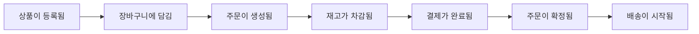
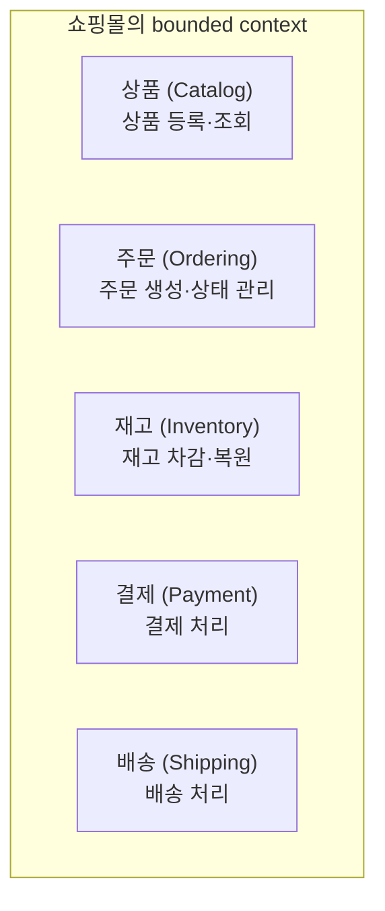
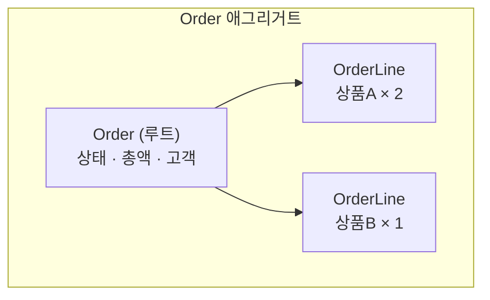
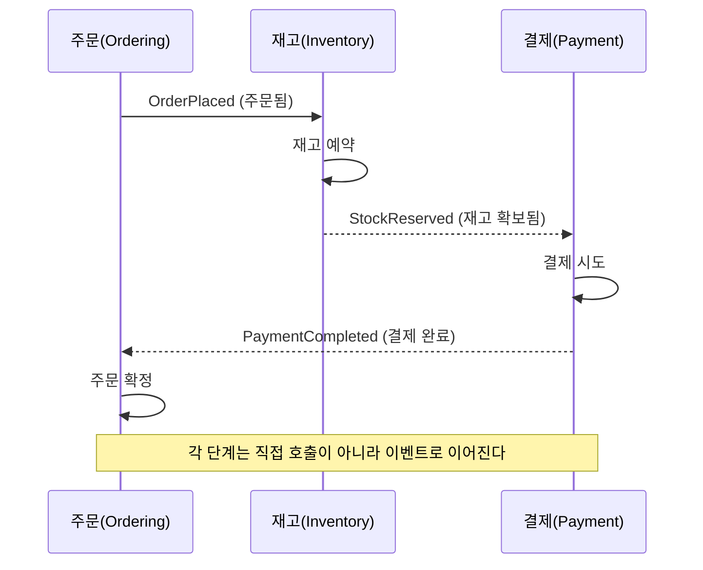
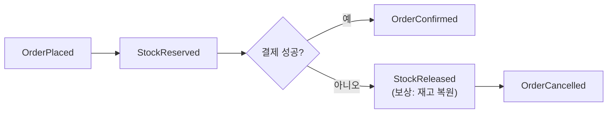

이번 글부터 새 시리즈가 시작됩니다. 지금까지의 이론 글들이 "이게 어떻게 동작하는가"였다면, 이제부터는 **직접 만들며** 배웁니다. 주제는 **이벤트 기반 쇼핑몰을 Go로 짓고 쿠버네티스에 배포하기** 입니다. 쇼핑몰은 도메인 주도 설계(DDD)와 이벤트 기반 설계(EDD)를 배우기에 더없이 좋은 예제입니다 — 상품·주문·재고·결제·배송이 자연스럽게 경계로 갈리고, "주문됨 → 재고 차감 → 결제" 같은 흐름이 이벤트로 선명하게 이어지기 때문입니다.

> 💻 이 시리즈의 코드는 [github.com/kahnco/go-ddd-shop](https://github.com/kahnco/go-ddd-shop) 에 함께 올라갑니다. 각 편이 끝난 시점에 `part-N` 태그를 찍어두니, `git checkout part-1` 로 그 시점의 코드를 바로 볼 수 있습니다.

그리고 첫 편은 **코드가 거의 없습니다.** DDD의 핵심 정신이 바로 여기 있습니다 — 코드를 짜기 전에, 도메인을 먼저 이해하고 그린다. 오늘은 그 "그리는" 일을 합니다.

## 왜 코드보다 설계가 먼저인가

[MSA 회고 글](/splitting-the-monolith-retrospective)에서 가장 비싸게 배운 교훈이 "경계를 잘못 그으면 분산 모놀리스가 된다"였습니다. 서비스를 기술 레이어로 나눴다가, 기능 하나를 고치려면 여러 서비스를 동시에 건드려야 하는 지옥을 겪었죠. 그 교훈의 뿌리가 바로 DDD입니다.

**도메인 주도 설계(DDD)** 는 "소프트웨어의 구조는 그것이 다루는 **비즈니스 도메인의 구조**를 따라야 한다"는 발상입니다. 데이터베이스 테이블이나 프레임워크가 아니라, **주문·재고·결제 같은 도메인의 언어와 규칙** 이 코드의 뼈대가 돼야 한다는 거죠. 이렇게 하면 경계가 도메인을 따라 자연스럽게 그어지고, 변경이 한 곳에서 끝납니다.

그래서 DDD는 코드가 아니라 **도메인을 이해하는 것** 에서 출발합니다. 잘못 그린 설계 위에 아무리 좋은 Go 코드를 얹어도 소용없으니까요. 이번 편이 코드가 없는 이유입니다.

## 1. 이벤트 스토밍 — 도메인을 탐색하기

도메인을 탐색하는 좋은 방법이 **이벤트 스토밍(event storming)** 입니다. 방법은 단순합니다. **도메인에서 "일어나는 일들"을 과거형(도메인 이벤트)으로, 시간 순서대로 늘어놓는** 겁니다. "무엇을 만들까"가 아니라 "무슨 일이 벌어지는가"에서 시작하는 거죠.

쇼핑몰에서 손님이 물건을 사는 여정을 이벤트로 늘어놓으면 이렇습니다. (도메인 이벤트는 관례적으로 과거형으로 씁니다 — 이미 일어난 사실이니까요.)

여기에 "행복한 경로"만 있는 게 아닙니다. 실패도 도메인의 일부입니다.

- 주문했는데 **재고가 부족함**
- 결제가 **실패함**
- 주문이 **취소됨**

이 이벤트들을 늘어놓는 것만으로, 우리는 이미 도메인의 뼈대를 손에 쥐게 됩니다. 각 이벤트가 "무엇이 그걸 일으켰고, 무엇에 영향을 주는지"를 보면 도메인의 구조가 드러납니다.

## 2. 유비쿼터스 언어 — 용어를 하나로

이벤트를 늘어놓다 보면 자연스럽게 **용어** 가 정리됩니다. DDD에서 이걸 **유비쿼터스 언어(ubiquitous language)** 라 부릅니다. 기획자·개발자·코드가 **모두 같은 단어를 같은 뜻으로** 쓰자는 원칙입니다.

우리 쇼핑몰의 핵심 용어를 못 박아둡니다.

| 용어 | 뜻 |
|---|---|
| **상품(Product)** | 팔 수 있는 물건. 이름·가격을 가짐 |
| **주문(Order)** | 고객이 상품을 사겠다는 요청. 여러 주문 항목으로 구성 |
| **주문 항목(OrderLine)** | 주문 안의 "어떤 상품 몇 개" |
| **재고(Stock)** | 각 상품의 남은 수량 |
| **결제(Payment)** | 주문 금액을 지불하는 행위 |
| **배송(Shipment)** | 확정된 주문을 고객에게 보내는 것 |

사소해 보이지만 중요합니다. 코드에서도 이 단어를 그대로 씁니다 — 클래스 이름이 `Order`, `OrderLine`, `Stock`이 되는 거죠. "DB row"나 "DTO"가 아니라 도메인 언어가 코드에 그대로 살아있게 하는 것, 그게 유비쿼터스 언어의 실천입니다.

## 3. Bounded Context — 경계 나누기

이제 가장 중요한 결정입니다. 늘어놓은 이벤트들을 **군집(cluster)** 으로 묶으면, 자연스럽게 **경계(bounded context)** 가 보입니다. 서로 밀접한 이벤트들이 하나의 컨텍스트가 됩니다.

각 컨텍스트는 **자기 도메인 안에서 완결적** 입니다. 재고 컨텍스트는 "수량을 차감하고 복원하는" 자기 규칙에만 집중하고, 주문이 어떻게 생기는지는 몰라도 됩니다. [MSA 글](/splitting-the-monolith-retrospective)에서 "경계는 비즈니스 능력으로 긋는다"고 했는데, bounded context가 바로 그 비즈니스 능력의 경계입니다. 그리고 이 경계가 나중에 **서비스의 경계**(4편에서 이벤트로 잇는)가 됩니다.

여기서 DDD의 미묘한 통찰 하나. **같은 단어라도 컨텍스트마다 의미가 다를 수 있습니다.** "상품"이 상품 컨텍스트에선 "이름·설명·가격을 가진 판매 대상"이지만, 재고 컨텍스트에선 그저 "수량을 세는 대상(SKU)"일 뿐입니다. 각 컨텍스트가 자기에게 필요한 만큼의 개념만 갖는 것 — 이게 경계를 나누는 힘입니다. 하나의 거대한 "상품" 모델로 모든 걸 표현하려 들면, 그게 바로 모놀리스의 함정입니다.

## 4. 애그리거트 — 일관성의 경계

컨텍스트 안으로 한 단계 더 들어가면 **애그리거트(aggregate)** 가 있습니다. 애그리거트는 **함께 변경돼야 하고, 하나의 일관성 규칙(불변식)으로 묶이는 객체들의 덩어리** 입니다. 그리고 그 덩어리는 하나의 대표(애그리거트 루트)를 통해서만 바깥과 소통합니다.

주문(Order) 애그리거트를 예로 봅시다.

Order 루트는 여러 OrderLine을 품고, 다음과 같은 **불변식(invariant)** 을 지킵니다. 이 규칙들은 언제나 참이어야 합니다.

- 주문에는 **최소 하나의 주문 항목** 이 있어야 한다.
- 주문 **총액은 항목들의 합** 과 항상 일치한다.
- 주문 상태는 **정해진 순서로만** 전이된다: `생성됨 → 결제완료 → 확정 → 배송중`. (거꾸로 가거나 건너뛸 수 없다.)

왜 이렇게 묶을까요? **일관성을 지킬 단위를 명확히 하기 위해서** 입니다. OrderLine을 바깥에서 마음대로 바꿀 수 있으면 "총액 = 항목 합" 불변식이 깨질 수 있습니다. 그래서 OrderLine은 반드시 Order 루트를 통해서만 조작되고, Order가 그 규칙을 책임집니다. 애그리거트는 "여기까지가 한 번에 일관성을 보장하는 범위다"라는 선을 긋는 것입니다.

이 개념은 뒤에서 매우 실용적으로 쓰입니다. **애그리거트 하나가 하나의 트랜잭션 단위** 가 되고, **애그리거트 사이는 이벤트로 느슨하게 연결** 됩니다. [MSA 글](/splitting-the-monolith-retrospective)의 "한 트랜잭션으로 묶을 수 없는 것은 saga로"가 여기서 다시 등장합니다.

## 5. 도메인 이벤트와 흐름 — EDD의 시작

이제 컨텍스트들을 어떻게 잇느냐입니다. 답은 **도메인 이벤트** 입니다. 한 컨텍스트에서 의미 있는 일이 벌어지면 이벤트를 발행하고, 관심 있는 다른 컨텍스트가 그걸 구독해 반응합니다. 컨텍스트끼리 직접 호출하는 대신, **이벤트로 간접적으로 협력** 하는 거죠. 이것이 이벤트 기반 설계(EDD)의 핵심입니다.

주문이 흐르는 과정을 이벤트로 그리면 이렇습니다.

여기서 [MSA 글](/splitting-the-monolith-retrospective)에서 다룬 두 가지가 그대로 살아납니다.

- **결과적 일관성** — "주문됨"과 "결제 완료" 사이에는 아주 짧지만 "주문은 됐는데 결제는 아직"인 순간이 존재합니다. 이 결과적 일관성을 받아들이고, 그 구간에도 시스템이 올바르게 동작하도록 설계해야 합니다.
- **사가와 보상** — 만약 재고는 확보됐는데 **결제가 실패** 하면? 앞서 확보한 재고를 **되돌려야** 합니다(StockReleased). 이 보상 트랜잭션은 부가 기능이 아니라 설계의 절반입니다. 실패 경로를 처음부터 함께 그려야 합니다.

이 흐름이 우리 쇼핑몰의 뼈대입니다. 각 컨텍스트는 자기 애그리거트의 일관성만 책임지고, 컨텍스트 사이의 큰 흐름은 이벤트와 사가로 엮입니다.

## 6. 이 설계가 코드로 어떻게 이어지나

다음 편부터 이 설계를 Go로 옮깁니다. 미리 큰 그림만 그려두면, 각 개념이 코드의 어디로 가는지 이렇게 됩니다.

- **애그리거트·값 객체·도메인 이벤트** → 도메인 계층 (순수 Go, 프레임워크·DB에 무관)
- **유스케이스(주문하기 등)** → 애플리케이션 계층
- **DB·메시지 브로커 연동** → 인프라 계층
- **bounded context** → (처음엔 패키지로, 4편에서) 독립 서비스

이 계층 구조(도메인이 가장 안쪽, 인프라가 바깥)가 **헥사고날 아키텍처** 의 핵심이고, 2편에서 Go로 직접 짜봅니다. 도메인 코드가 DB나 웹 프레임워크를 모르게 하는 것 — 그래서 도메인 규칙을 순수하게 테스트할 수 있게 하는 것 — 이 목표입니다.

## 정리

- DDD는 코드보다 **도메인 이해**가 먼저입니다. 잘못된 경계는 분산 모놀리스를 부릅니다.
- **이벤트 스토밍** 으로 "무슨 일이 벌어지는가"를 과거형 이벤트로 늘어놓아 도메인을 탐색했습니다.
- **유비쿼터스 언어** 로 용어를 통일하고, 이벤트를 군집화해 **bounded context**(상품·주문·재고·결제·배송)를 나눴습니다.
- **애그리거트**(Order)는 불변식으로 묶인 일관성의 단위이고, **하나의 트랜잭션 범위** 입니다.
- 컨텍스트는 **도메인 이벤트** 로 느슨하게 협력하며, 실패는 **사가와 보상**으로 다룹니다(결과적 일관성).

오늘은 코드 한 줄 없이 도메인을 그렸지만, 이 그림이 앞으로 모든 코드의 뼈대가 됩니다. 좋은 설계 위에서는 구현이 자연스럽게 따라오고, 나쁜 설계 위에서는 아무리 좋은 코드도 무너집니다. 다음 편에서는 이 설계를 **Go로 도메인 모델링** 하며, 첫 애그리거트를 실제로 짜봅니다.

> 이번 편의 산출물(도메인 설계 문서)은 리포의 `docs/` 에 있고, `part-1` 태그로 찍어뒀습니다. 다음 편부터 여기에 Go 코드가 쌓입니다.
