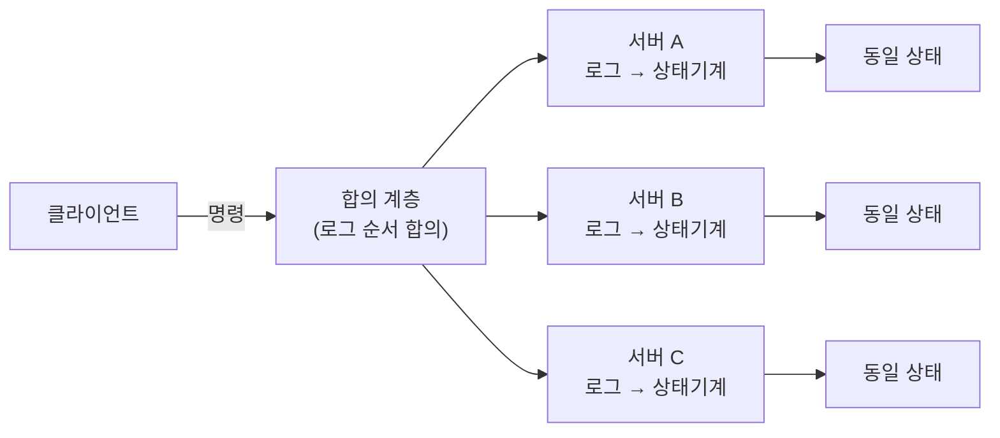
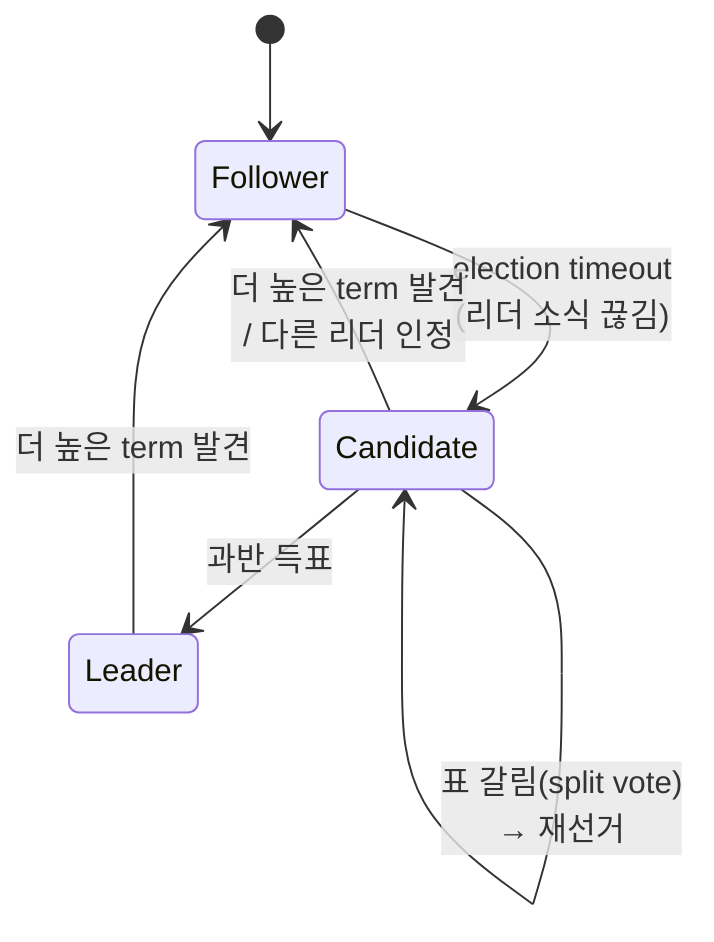
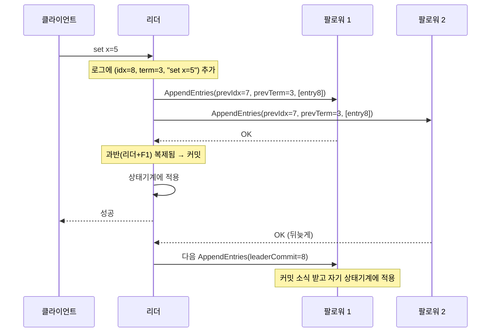

지금까지 이 블로그에서 다룬 도구들 — 쿠버네티스, ArgoCD, 그 아래의 etcd — 은 겉으로는 서로 달라 보이지만, 바닥에는 같은 문제 하나가 깔려 있습니다. **여러 대의 기계가, 그중 일부가 죽거나 네트워크가 끊기는 와중에도, 하나의 값(또는 값들의 순서)에 어떻게 모두가 동의하는가.** 이것이 분산 합의(distributed consensus)입니다.

이 글은 실무 팁 모음이 아니라, 합의라는 문제를 **바닥부터 쌓아 올리는** 긴 글입니다. 왜 합의가 필요한지, 왜 그렇게까지 어려운지(FLP 불가능성), 왜 하필 과반수인지, 그리고 그 위에서 Raft가 리더 선출·로그 복제·안전성을 어떻게 엮어내는지를 — 증명의 직관까지 — 파고듭니다. 끝에서는 멤버십 변경·스냅샷·선형화 가능한 읽기 같은 실전 확장과, etcd와 쿠버네티스가 이 모든 걸 어떻게 활용하는지까지 이어집니다. 길지만, 한 번 제대로 이해해두면 분산 시스템을 보는 눈이 바뀌는 주제입니다.

## 1. 무엇을 풀려는 것인가 — 복제 상태 기계

합의가 왜 필요한지 이해하려면, 먼저 우리가 무엇을 만들려는지부터 명확히 해야 합니다. 목표는 대개 이렇습니다. **한 대의 서버처럼 동작하지만, 실제로는 여러 대로 복제되어 그중 몇 대가 죽어도 멈추지 않는 시스템.** 예를 들어 "이 키의 값은 5입니다" 같은 상태를 저장하는 데이터 저장소를, 한 대가 꺼져도 데이터를 잃지 않게 만들고 싶은 겁니다.

이걸 이루는 표준적인 틀이 **복제 상태 기계(Replicated State Machine, RSM)** 모델입니다. 핵심 아이디어는 단순합니다.

- 각 서버는 동일한 **상태 기계**(예: 키-값 맵)를 가집니다.
- 각 서버는 동일한 **명령의 로그**(예: `set x=5`, `set y=3`, `del x` …)를 가집니다.
- **모든 서버가 똑같은 명령을, 똑같은 순서로** 자기 상태 기계에 적용하면, 결정적(deterministic)인 상태 기계라면 반드시 **똑같은 상태**에 도달합니다.



그러면 문제가 하나로 압축됩니다. **어떻게 모든 서버가 "로그의 내용과 순서"에 동의하게 만들 것인가.** 상태 기계 자체(맵에 값을 넣는 일)는 각자 로컬에서 하면 되고, 어려운 부분은 오직 **"로그를 똑같이 만드는 합의"** 하나로 좁혀집니다. Raft를 포함한 합의 알고리즘이 실제로 푸는 것이 바로 이 로그 복제 문제입니다.

### 합의가 만족해야 하는 성질

"동의한다"를 형식적으로 못 박아두면 나중에 알고리즘의 정당성을 따질 때 기준이 됩니다. 합의 프로토콜은 보통 아래 성질들을 요구합니다.

- **동의(Agreement)** — 어떤 두 서버도 같은 로그 위치에 서로 다른 값을 확정하지 않는다.
- **유효성(Validity)** — 확정되는 값은 누군가 실제로 제안한 값이어야 한다. (허공에서 만들어낸 값을 합의하면 안 됩니다.)
- **무결성(Integrity)** — 한 번 확정한 값은 번복되지 않는다.
- **종료성(Termination)** — 정상적인 서버들은 결국 값을 확정한다. (이것이 뒤에서 볼 가장 까다로운 성질입니다.)

앞의 세 가지를 묶어 **안전성(safety)** — "나쁜 일은 절대 일어나지 않는다" — 이라 하고, 마지막 종료성을 **활성성(liveness)** — "좋은 일은 언젠가 일어난다" — 이라 합니다. 이 둘의 구분은 이 글 전체를 관통하는 축입니다. Raft의 설계 철학을 한마디로 요약하면 "**안전성은 어떤 상황에서도 절대 포기하지 않고, 활성성은 네트워크가 협조할 때만 보장한다**"이기 때문입니다.

## 2. 왜 이렇게까지 어려운가 — 장애 모델과 FLP

합의가 왜 어려운지는 우리가 어떤 세상을 가정하느냐에 달려 있습니다. 두 가지 축을 봐야 합니다.

**첫째, 장애 모델.** 서버가 어떻게 고장 나는가입니다.

- **크래시 장애(crash-stop)** — 서버가 그냥 멈춥니다. 거짓말은 하지 않습니다. Raft·Paxos·etcd가 다루는 모델입니다.
- **비잔틴 장애(Byzantine)** — 서버가 임의로 잘못된, 심지어 악의적인 메시지를 보낼 수 있습니다. 블록체인이 다루는 훨씬 어려운 모델입니다. 이 글의 범위는 크래시 장애입니다.

**둘째, 타이밍 모델.** 네트워크와 처리 속도에 대한 가정입니다.

- **동기(synchronous)** — 메시지 지연과 처리 시간에 알려진 상한이 있습니다. "1초 안에 응답이 없으면 확실히 죽은 것"이라 단정할 수 있습니다.
- **비동기(asynchronous)** — 지연에 상한이 없습니다. 응답이 없는 게 죽어서인지, 그냥 느려서인지 **구분할 수 없습니다.** 현실의 네트워크가 여기에 가깝습니다.

현실이 비동기에 가깝다는 점이 문제의 핵심입니다. "느린 서버"와 "죽은 서버"를 구분할 수 없다는 이 단순한 사실이, 합의를 근본적으로 어렵게 만듭니다.

### FLP 불가능성

이 어려움에는 이름이 붙어 있습니다. 1985년 Fischer, Lynch, Paterson이 증명한 **FLP 불가능성 정리**입니다. 내용을 직관적으로 옮기면 이렇습니다.

> **완전한 비동기 시스템에서, 단 하나의 서버라도 크래시할 수 있다면, 항상 종료하는 결정적(deterministic) 합의 알고리즘은 존재하지 않는다.**

즉 안전성과 종료성을 **동시에, 항상** 보장하는 알고리즘은 원리적으로 불가능합니다. 처음 들으면 절망적입니다. 그런데도 etcd는 매일 멀쩡히 돌아갑니다. 어떻게 된 걸까요?

핵심은 FLP가 말하는 게 **"결코 합의할 수 없다"가 아니라 "합의가 끝난다고 보장할 수 없는 시나리오가 이론적으로 존재한다"라는** 점입니다. 그 최악의 시나리오는 네트워크가 무한히 절묘하게 심술을 부리는, 현실에서는 사실상 일어나지 않는 경우입니다. 그래서 실제 알고리즘들은 이 정리를 **우회**합니다.

우회의 열쇠는 **타임아웃과 랜덤성**입니다. Raft는 완전한 비동기를 가정하지 않고, "네트워크가 언젠가는 한동안 정상적으로 동작하는 구간이 온다"는 **부분 동기**(partial synchrony)를 가정합니다. 그 협조 구간이 오면 합의가 진행되고, 협조하지 않는 동안에는 **안전성은 지키되 진행을 잠시 멈춥니다.** FLP를 정면으로 반박하는 게 아니라, 종료성을 항상이 아니라 조건부로만 약속함으로써 빠져나가는 것입니다. 이 타협이 바로 앞서 말한 "안전성은 절대, 활성성은 조건부"의 이론적 근거입니다.

### CAP 정리와의 관계

같은 이야기를 다른 각도에서 말한 것이 CAP 정리입니다. 네트워크 분단(Partition)이 발생하면, 일관성(Consistency)과 가용성(Availability) 둘 다는 못 가진다는 것입니다. Raft 같은 합의 시스템은 명확히 **CP를 택합니다.** 분단이 나면 과반을 확보하지 못한 쪽(소수파)은 **일부러 응답을 거부합니다.** 낡은 값을 내주느니 차라리 멈추는 쪽을 택하는 겁니다. 이 "소수파는 멈춘다"가 왜 안전한지, 그리고 왜 하필 과반인지는 다음 장에서 풉니다.

## 3. 정족수 — 왜 하필 과반수인가

합의의 심장에는 아주 우아한 산수 하나가 있습니다. **정족수(quorum)**, 그중에서도 과반수 정족수입니다.

N대의 서버가 있을 때, 어떤 결정을 내리려면 **과반(⌊N/2⌋+1)의 동의**를 받아야 한다고 규칙을 정합니다. 왜 과반일까요? 이유는 하나의 성질로 압축됩니다.

> **임의의 두 과반 집합은 반드시 최소 한 대에서 겹친다.**

간단한 비둘기집 원리입니다. N=5라면 과반은 3입니다. 어떤 3대 집합과 또 다른 3대 집합을 고르면, 3+3=6>5 이므로 둘은 반드시 최소 한 대를 공유합니다. 이 겹침이 안전성의 원천입니다.

이게 왜 중요한지 봅시다. 어떤 값이 과반 Q1의 동의로 확정됐다고 합시다. 나중에 리더가 바뀌어 새 과반 Q2가 무언가를 결정하려 할 때, Q1과 Q2는 반드시 겹치므로, **그 겹치는 서버가 이전에 확정된 값을 기억하고 있어** 새 결정이 과거를 덮어쓰지 못하게 막습니다. 두 과반이 겹친다는 사실 하나가, "한 번 확정된 것은 뒤집히지 않는다"는 무결성을 물리적으로 보장하는 셈입니다.

이 원리는 곧바로 두 가지 결론으로 이어집니다.

- **f대의 장애를 견디려면 2f+1대가 필요합니다.** 5대(2×2+1)면 2대가 죽어도 남은 3대가 과반이라 진행할 수 있습니다. 그래서 etcd 클러스터를 3대, 5대, 7대처럼 **홀수**로 구성하는 겁니다. 4대는 3대와 똑같이 1대까지만 감내하면서 비용만 늘어나므로, 짝수는 손해입니다.
- **소수파는 진행할 수 없습니다.** 네트워크가 2대와 3대로 갈라지면, 2대 쪽은 영원히 과반을 못 만들어 아무것도 확정하지 못합니다. 이것이 CAP에서 가용성을 포기하는 지점이자, **스플릿 브레인(split brain)** — 두 쪽이 각자 리더를 세워 서로 다른 결정을 내리는 참사 — 을 원천 봉쇄하는 장치입니다. 과반은 한 번에 한 쪽에만 존재할 수 있으니까요.

## 4. Paxos는 왜 어렵고, Raft는 왜 등장했나

과반 정족수라는 원리 위에 실제 알고리즘을 세운 최초의 성공작이 Leslie Lamport의 **Paxos**(1998)입니다. Paxos는 수십 년간 분산 합의의 사실상 표준이었고, 이론적으로 옳다는 것도 증명돼 있습니다.

문제는 **이해하기가 악명 높게 어렵다**는 것이었습니다. Lamport 본인도 농담처럼 어렵게 썼고, 무엇보다 "단일 값에 대한 합의(single-decree Paxos)"에서 "연속된 로그에 대한 합의(Multi-Paxos)"로 넘어가는 실전 구현 부분이 논문에 명확히 정리돼 있지 않아, 세상의 Paxos 구현들이 저마다 다르고 검증하기 어려웠습니다.

2014년 Diego Ongaro와 John Ousterhout가 발표한 Raft는 정면으로 다른 목표를 내걸었습니다. **이해 가능성(understandability)을 1순위 설계 기준으로 삼는다**는 것이었습니다. 성능이 아니라 "사람이 이해하고 올바르게 구현할 수 있는가"를 최우선에 둔 겁니다. 그 결과 Raft는 문제를 **세 개의 비교적 독립적인 하위 문제**로 쪼갰습니다.

1. **리더 선출** — 누가 로그를 주도할지 하나를 뽑는다.
2. **로그 복제** — 리더가 자기 로그를 팔로워들에게 강제로 복제한다.
3. **안전성** — 잘못된 서버가 리더가 되어 확정된 기록을 훼손하지 못하게 막는다.

Raft의 핵심 통찰은 "**강한 리더(strong leader)**"입니다. 모든 것이 리더를 통해서만 흐릅니다. 클라이언트 쓰기도 리더로, 로그도 리더에서 팔로워 방향으로만 흐릅니다. 이 단방향성이 Paxos 대비 이해를 극적으로 쉽게 만듭니다. 이제 세 부분을 차례로 파고듭니다.

## 5. 리더 선출 — 임기와 랜덤 타임아웃

Raft에서 모든 서버는 세 상태 중 하나입니다. **팔로워(follower)**, **후보(candidate)**, **리더(leader)**.



### 임기(term) — 분산 시스템의 논리적 시계

Raft의 시간은 **임기**(term)로 흐릅니다. term은 1, 2, 3…으로 단조 증가하는 정수이고, 각 term은 **한 번의 선거로 시작**합니다. 여기에 강한 규칙이 하나 붙습니다. **한 term에는 리더가 최대 한 명만 존재할 수 있습니다.** (아무도 못 뽑혀 리더 없이 끝나는 term도 있습니다.)

term은 물리적 시계가 아니라 **논리적 시계** 역할을 합니다. 모든 RPC에 현재 term이 실려 다니고, 서버들은 딱 하나의 규칙으로 낡음을 판별합니다.

- 자기 term보다 **큰** term을 보면, 즉시 자기 term을 그 값으로 올리고 **팔로워로 물러납니다.**
- 자기 term보다 **작은** term의 요청은 **거부**합니다. (보낸 쪽이 낡았다는 신호)

이 한 규칙이, 네트워크 분단에서 뒤늦게 복귀한 낡은 리더가 최신 클러스터를 어지럽히지 못하게 하는 핵심 장치입니다. 낡은 리더는 자기가 리더인 줄 알고 명령을 보내지만, 더 높은 term을 가진 팔로워에게 거부당하고 그 높은 term을 보는 순간 스스로 팔로워로 내려옵니다.

### 선거의 진행

리더는 주기적으로 **하트비트**(내용 없는 AppendEntries)를 팔로워에게 보냅니다. 팔로워가 일정 시간(**election timeout**) 동안 리더의 소식을 못 받으면, 리더가 죽었다고 판단하고 선거를 시작합니다.

1. 팔로워가 자기 term을 1 올리고 **후보**가 됩니다.
2. 자기 자신에게 한 표를 던지고, 나머지 모두에게 `RequestVote` RPC를 보냅니다.
3. 결과는 셋 중 하나입니다.
   - **과반 득표** → 리더가 됩니다. 즉시 하트비트를 뿌려 자기 권위를 알립니다.
   - **다른 리더 등장** → 유효한 리더(같거나 높은 term)의 AppendEntries를 받으면 팔로워로 돌아갑니다.
   - **표 갈림** → 아무도 과반을 못 얻으면 timeout 후 term을 또 올려 재선거합니다.

여기서 Raft의 작지만 결정적인 묘수가 **랜덤화된 election timeout**입니다. 모든 팔로워가 똑같은 시간에 timeout되면, 다 같이 후보가 되어 표가 고르게 갈리고(split vote), 이게 반복되면 영영 리더를 못 뽑을 수 있습니다. Raft는 timeout을 예컨대 150~300ms 사이에서 **매번 무작위로** 뽑습니다. 그러면 대개 한 서버가 남들보다 먼저 timeout돼 혼자 후보가 되고, 다른 서버들이 미처 나서기 전에 표를 쓸어 담습니다. 랜덤성이 split vote 확률을 확 낮춰 선거가 빠르게 수렴하게 만듭니다. 이것이 FLP를 우회한다고 했던 그 "랜덤성"의 실체입니다.

의사코드로 보면 투표 판단은 이렇게 생겼습니다.

```text
# RequestVote 를 받은 서버(투표자)의 판단
on RequestVote(term, candidateId, lastLogIndex, lastLogTerm):
    if term < currentTerm:
        return (currentTerm, voteGranted=false)      # 낡은 후보는 거부

    if term > currentTerm:
        currentTerm = term
        votedFor = null
        state = Follower

    # 이 term 에 아직 투표 안 했고(또는 이미 이 후보에게 했고),
    # 후보의 로그가 내 로그만큼 최신이어야 표를 준다
    upToDate = (lastLogTerm > myLastLogTerm) or
               (lastLogTerm == myLastLogTerm and lastLogIndex >= myLastLogIndex)

    if (votedFor in {null, candidateId}) and upToDate:
        votedFor = candidateId
        return (currentTerm, voteGranted=true)
    else:
        return (currentTerm, voteGranted=false)
```

마지막 `upToDate` 조건 — "후보의 로그가 내 로그만큼 최신이어야 표를 준다" — 을 눈여겨봐 두시기 바랍니다. 이것이 6장의 안전성 전체를 떠받치는 **선거 제약**(election restriction)입니다. 지금은 넘어가고, 로그를 먼저 이해한 뒤 다시 돌아오겠습니다.

## 6. 로그 복제 — 리더가 진실을 밀어붙인다

리더가 뽑히면, 이제 클라이언트의 명령을 로그에 담아 팔로워들에게 복제할 차례입니다.

각 로그 엔트리는 세 가지를 담습니다. **인덱스**(로그에서의 위치), **term**(그 엔트리를 만든 리더의 임기), 그리고 **명령**(상태 기계에 적용할 내용). 인덱스와 term의 조합이 뒤에서 엔트리의 "신원"처럼 쓰입니다.

복제의 흐름은 이렇습니다.



핵심 규칙을 하나씩 뜯어봅니다.

### 커밋 조건 — 과반 복제

리더는 새 엔트리를 자기 로그에 추가한 뒤, `AppendEntries`로 팔로워들에게 보냅니다. 그 엔트리가 **과반의 서버에 저장되면**, 리더는 그것을 **커밋**(commit)된 것으로 표시하고 자기 상태 기계에 적용한 뒤 클라이언트에게 성공을 응답합니다. 커밋이란 곧 "이 엔트리는 이제 영구적이며 절대 사라지지 않는다"는 선언입니다. 커밋 지점(commit index)은 리더가 후속 `AppendEntries`의 `leaderCommit` 필드에 실어 보내고, 팔로워들은 그걸 보고 자기도 그 지점까지 상태 기계에 적용합니다.

### 로그 일치 속성(Log Matching)

Raft가 유지하는 강력한 불변식이 **로그 일치 속성**입니다. 두 부분으로 됩니다.

- 서로 다른 두 로그가 **같은 인덱스에 같은 term**의 엔트리를 가지면, 그 두 엔트리는 **같은 명령**을 담고 있다.
- 나아가, 그 지점까지의 **모든 이전 엔트리가 완전히 동일**하다.

첫째는 "한 term에 리더는 하나뿐이고, 리더는 주어진 인덱스에 엔트리를 한 번만 만든다"에서 나옵니다. 둘째는 `AppendEntries`의 **일관성 검사** 덕분에 유지됩니다. 리더는 새 엔트리를 보낼 때, 바로 앞 엔트리의 인덱스와 term(`prevLogIndex`, `prevLogTerm`)을 함께 보냅니다. 팔로워는 자기 로그의 그 자리에 정확히 같은 term의 엔트리가 있을 때만 새 엔트리를 받아들이고, 아니면 **거부**합니다.

이 검사는 귀납적으로 작동합니다. 처음 로그가 비었을 때 일치 속성은 자명하게 성립하고, 그 뒤로는 "직전까지 일치할 때만 다음을 받아들인다"를 강제하니, 매 추가마다 속성이 보존됩니다. 결과적으로 `AppendEntries`가 성공했다는 것은 "팔로워의 로그가 그 지점까지 리더와 완전히 똑같아졌다"를 의미합니다.

### 불일치를 강제로 맞추기

리더가 바뀌는 과정에서 팔로워의 로그가 리더와 어긋나 있을 수 있습니다. 어떤 팔로워는 엔트리가 모자라고, 어떤 팔로워는 (과거의 낡은 리더가 남긴) 여분의 커밋 안 된 엔트리를 갖고 있을 수도 있습니다. Raft의 처리 방식은 단호합니다. **리더의 로그가 유일한 진실이고, 팔로워는 리더에 맞춰 강제로 덮어써진다.**

리더는 각 팔로워에 대해 "다음에 보낼 인덱스"(`nextIndex`)를 추적합니다. `AppendEntries`가 일관성 검사에서 거부되면, 리더는 그 팔로워의 `nextIndex`를 하나 줄여(실전에서는 더 똑똑하게 건너뛰어) 다시 시도합니다. 이 과정을 반복하면 결국 두 로그가 일치하는 지점까지 거슬러 올라가고, 그 지점부터 리더의 엔트리로 팔로워의 어긋난 뒷부분을 **덮어씁니다.** 여기서 중요한 건, **덮어써지는 것은 오직 커밋되지 않은 엔트리뿐**이라는 점입니다. 커밋된 엔트리는 다음 장의 안전성 보장 덕분에 애초에 리더의 로그에도 반드시 존재하므로, 덮어써질 일이 없습니다.

## 7. 안전성 — 여기가 진짜 핵심이다

지금까지의 규칙만으로는 아직 구멍이 있습니다. **로그가 뒤처진 서버가 리더로 뽑히면 어떻게 될까요?** 그 서버는 자기에게 없는(하지만 이미 커밋된) 엔트리를 모른 채, 자기 로그를 진실이라며 밀어붙여 커밋된 기록을 덮어쓸 수 있습니다. 이건 무결성 위반, 즉 최악의 사고입니다. Raft는 이걸 두 개의 제약으로 막습니다.

### 선거 제약 — 최신 로그만 리더가 된다

5장에서 눈여겨봐 두라 했던 그 조건입니다. 투표자는 **후보의 로그가 자기 로그만큼 최신일 때만** 표를 줍니다. "최신"의 정의는 명확합니다.

- 마지막 엔트리의 **term이 더 높은** 로그가 더 최신이다.
- term이 같다면, **더 긴**(엔트리가 더 많은) 로그가 더 최신이다.

이 제약과 과반 정족수를 결합하면 강력한 결론이 나옵니다. **어떤 엔트리가 커밋되려면 과반에 저장돼 있어야 하고, 새 리더가 되려면 과반의 표를 받아야 한다.** 두 과반은 반드시 겹치므로(3장의 그 산수!), 겹치는 그 서버는 커밋된 엔트리를 갖고 있습니다. 그런데 선거 제약 때문에, 그 서버는 자기보다 로그가 뒤처진 후보에게는 표를 주지 않습니다. 따라서 **커밋된 엔트리를 빠뜨린 후보는 결코 과반을 얻지 못하고, 리더가 될 수 없습니다.** 이것이 **리더 완전성(Leader Completeness)** — 한 term에서 커밋된 엔트리는 그보다 높은 모든 term의 리더 로그에 반드시 존재한다 — 이라는 성질입니다.

### 이전 term의 엔트리는 직접 커밋하지 않는다 (Figure 8)

여기가 Raft에서 가장 미묘하고, 처음 읽으면 반드시 한 번 막히는 지점입니다. Raft 논문의 그 유명한 "Figure 8"이 다루는 문제입니다.

직관적으로는 "어떤 엔트리가 과반에 복제됐으면 커밋된 것"이라 생각하기 쉽습니다. 그런데 **이전 term에 만들어진 엔트리**에 대해서는 이게 성립하지 않습니다. 시나리오를 그려보면 이렇습니다.

- term 2에서 리더가 엔트리 X를 만들어 일부 서버에 복제했지만, 커밋을 확정하기 전에 죽습니다.
- 새 리더가 term 3, 4를 거치며 등장하고, 어쩌다 X가 과반에 퍼진 상태가 됩니다.
- 만약 이때 리더가 "X는 과반에 있으니 커밋됐다"고 선언한다면 — 그 직후 리더가 죽고, X를 못 받은 다른 서버가 (선거 제약을 통과해) 새 리더가 되어 X를 **덮어쓰는** 상황이 만들어질 수 있습니다. 커밋했다고 선언한 엔트리가 사라지는, 무결성 붕괴입니다.

Raft의 해법은 규칙 하나로 이 함정을 봉쇄합니다. **리더는 오직 자기 현재 term의 엔트리가 과반에 복제됐을 때만 커밋을 확정한다.** 이전 term의 엔트리는 "과반에 있다"는 이유만으로는 절대 커밋된 것으로 치지 않습니다. 대신, 리더가 자기 term의 새 엔트리를 커밋하면, 로그 일치 속성에 의해 **그 앞의 이전 term 엔트리들도 함께, 그리고 안전하게** 커밋됩니다. 현재 term 엔트리의 커밋이 "과반이 이 리더의 로그 전체를 인정했다"는 확정 도장 역할을 하기 때문입니다.

이 규칙은 사소해 보이지만, 이것이 빠지면 Raft의 안전성 증명 전체가 무너집니다. "과반에 복제 = 커밋"이라는 자연스러운 직관이 이전 term에 대해서는 틀리다는 것 — 이 한 지점이 분산 합의의 미묘함을 압축해 보여줍니다.

### 세 성질로 정리

지금까지의 논의를 Raft가 보장하는 안전성 성질로 묶으면 이렇습니다. 각각은 앞의 것에 기대어 성립합니다.

- **로그 일치(Log Matching)** — 같은 인덱스·term이면 그 이전까지 로그가 동일하다.
- **리더 완전성(Leader Completeness)** — 커밋된 엔트리는 이후 모든 리더의 로그에 존재한다. (선거 제약 + 과반 겹침)
- **상태 기계 안전성(State Machine Safety)** — 어떤 서버가 특정 인덱스에 어떤 명령을 적용했다면, 다른 어떤 서버도 그 인덱스에 다른 명령을 적용하지 않는다.

마지막 상태 기계 안전성이 우리가 애초에 원했던 것 — "모든 복제본이 같은 상태에 도달한다" — 그 자체입니다. 나머지 규칙들은 결국 이 하나를 떠받치기 위한 사다리였던 셈입니다.

## 8. 이론에서 현실로 — 실전을 위한 확장

여기까지가 Raft의 뼈대입니다. 그런데 실제로 쓰려면 논문의 나머지 절반, 즉 현실의 요구를 다루는 확장들이 필요합니다.

### 멤버십 변경 — 클러스터 구성을 바꾸기

운영 중에 서버를 추가하거나 교체해야 합니다. 그런데 구성(누가 과반인지)을 바꾸는 일은 위험합니다. 모든 서버가 동시에 새 구성으로 갈아타지 못하므로, **잠깐이라도 옛 구성의 과반과 새 구성의 과반이 서로 겹치지 않는 순간**이 생기면 두 개의 리더가 동시에 뽑히는 스플릿 브레인이 가능해집니다.

Raft는 두 가지 방법을 제시합니다.

- **공동 합의(joint consensus)** — 옛 구성과 새 구성을 잠시 함께 요구하는 중간 단계(C_old,new)를 거칩니다. 이 과도기에는 옛 과반과 새 과반 **양쪽 모두**의 동의가 있어야 결정이 나므로, 겹치지 않는 두 과반이 생길 수 없습니다.
- **한 번에 한 대씩(single-server change)** — 서버를 한 대만 더하거나 뺍니다. 한 대 차이로는 옛 과반과 새 과반이 반드시 겹치므로 안전하며, 구현이 단순해 실전에서 널리 쓰입니다.

### 로그 압축과 스냅샷

로그는 무한히 자랄 수 없습니다. `set x=5` 다음에 `set x=6`이 오면 앞의 것은 사실상 무의미해집니다. Raft는 주기적으로 **스냅샷**을 찍습니다. 현재 상태 기계 전체를 저장하고, 그 지점까지의 로그를 버리는 겁니다. 각 서버가 독립적으로 자기 스냅샷을 찍습니다. 다만 너무 뒤처진 팔로워에게는 보낼 로그가 이미 스냅샷으로 지워졌을 수 있어서, 이때는 로그 대신 스냅샷 자체를 보내는 `InstallSnapshot` RPC를 씁니다.

### 선형화 가능한 읽기 — 의외의 함정

쓰기는 로그를 거치니 안전한데, **읽기는 의외로 까다롭습니다.** "리더에게 물어보면 최신 값이겠지"라고 생각하기 쉽지만, 함정이 있습니다. 네트워크 분단으로 이미 리더 자격을 잃었는데 **본인만 그 사실을 모르는 낡은 리더**가 있을 수 있습니다. 그가 읽기에 응답하면, 이미 새 리더가 갱신한 최신 값이 아닌 **낡은 값**을 내주게 됩니다. 이는 선형화 가능성(linearizability)을 깨뜨립니다.

해법은 두 가지입니다.

- **ReadIndex** — 리더가 읽기에 답하기 전에, 하트비트 한 라운드를 돌려 **과반이 아직 자기를 리더로 인정하는지 확인**합니다. 확인되면 자기가 진짜 최신 리더임이 보장되니 안전하게 읽습니다.
- **리더 리스(lease)** — 시간 기반으로, "다음 election timeout 전까지는 새 리더가 나올 수 없다"는 성질을 이용해 하트비트 왕복 없이 읽습니다. 더 빠르지만 시계 가정에 의존합니다.

읽기 하나조차 이렇게 신경 써야 한다는 사실이, "강한 일관성은 공짜가 아니다"라는 이 글의 주제를 다시 한번 보여줍니다.

## 9. etcd, 그리고 쿠버네티스 — 이 모든 게 실제로 도는 곳

지금까지의 이론이 매일 돌아가는 대표적인 곳이 **etcd**입니다. etcd는 Raft 위에 세워진 분산 키-값 저장소이고, **쿠버네티스의 모든 상태 — 파드, 서비스, 시크릿, ConfigMap, 배포 스펙 전부 — 가 저장되는 단 하나의 진실**입니다. 우리가 이전 글들에서 다룬 것들이 여기서 만납니다.

- API server가 `kubectl apply`를 받으면, 그 상태를 etcd에 씁니다. 이 쓰기는 Raft 로그를 거쳐 과반에 복제된 뒤에야 확정됩니다.
- [GitOps 글](/gitops-with-argocd)에서 ArgoCD가 "클러스터의 현재 상태"를 읽어 Git과 비교한다고 했는데, 그 현재 상태의 출처가 결국 etcd입니다.
- [멀티테넌시 글](/kubernetes-multitenancy-isolation)에서 다룬 RBAC·쿼터·NetworkPolicy 같은 모든 정책 오브젝트도 etcd에 Raft로 안전하게 보관됩니다.

이제 왜 etcd 클러스터를 **3대나 5대의 홀수**로 구성하라고 하는지가 완전히 이해됩니다. 3장의 과반 산수 그대로입니다. 3대면 1대 장애를, 5대면 2대 장애를 견딥니다. 그리고 왜 etcd에 분단이 나면 **소수파 쪽 API server가 쓰기를 거부하며 멈추는지**도 분명합니다. CAP에서 C를 택한 합의 시스템의 당연한 귀결입니다. 낡은 값을 내주느니 멈추는 것 — 쿠버네티스가 "선언한 상태"를 신뢰할 수 있는 근본 이유가 바로 이 etcd의 Raft에 있습니다.

한 가지 실무적 함의도 있습니다. etcd는 쓰기마다 과반의 디스크 fsync와 네트워크 왕복을 요구하므로, **디스크와 네트워크 지연에 민감**합니다. 대규모 클러스터에서 etcd가 느려지면 그게 곧 컨트롤 플레인 전체의 지연으로 번지는데, 이제 우리는 그 이유를 압니다 — 모든 쓰기가 Raft의 과반 복제라는 관문을 통과해야 하기 때문입니다.

## 10. 정리 — 합의가 우리에게 가르쳐 준 것

긴 길을 걸었습니다. 마지막으로 전체를 한 줄기로 꿰어봅니다.

- 우리가 원한 것은 **복제 상태 기계** — 여러 대가 같은 명령을 같은 순서로 적용해 같은 상태에 이르는 것 — 였고, 그러려면 **로그 순서에 대한 합의**가 필요했습니다.
- 합의는 근본적으로 어렵습니다. **FLP 불가능성**은 비동기 세계에서 안전성과 종료성을 동시에 항상 보장할 수 없다고 말합니다. 그래서 실전 알고리즘은 **부분 동기와 랜덤성**으로 이를 우회해, 안전성은 절대적으로, 활성성은 조건부로 보장합니다.
- 그 모든 안전성의 산술적 뿌리는 **과반 정족수** — 두 과반은 반드시 겹친다 — 하나였습니다.
- **Raft**는 이 원리 위에서 문제를 리더 선출·로그 복제·안전성으로 쪼개고, **강한 리더**와 **임기(term)**, **랜덤 election timeout**, **로그 일치 속성**, **선거 제약**, 그리고 "**현재 term의 엔트리만 직접 커밋한다**"는 미묘한 규칙으로 상태 기계 안전성을 완성했습니다.
- 이 이론은 **etcd**를 통해 쿠버네티스의 심장에서 매일 돌아가고 있습니다.

분산 합의를 이해한다는 건, 결국 "**믿을 수 없는 부품들로 믿을 수 있는 전체를 만드는 법**"을 이해하는 일입니다. 개별 서버는 언제든 죽고 네트워크는 언제든 끊기지만, 과반이라는 겹침 하나에 기대어 그 위에 절대 뒤집히지 않는 진실을 쌓아 올릴 수 있다는 것 — 이것이 Raft가, 그리고 그 위의 수많은 시스템이 우리에게 보여주는 우아함입니다.

> 더 깊이 파고들고 싶다면, Diego Ongaro의 박사 논문 *"Consensus: Bridging Theory and Practice"*와 Raft 원논문 *"In Search of an Understandable Consensus Algorithm"*이 가장 좋은 출발점입니다. 이 글이 그 원전을 읽어나갈 지도가 되었으면 합니다.
