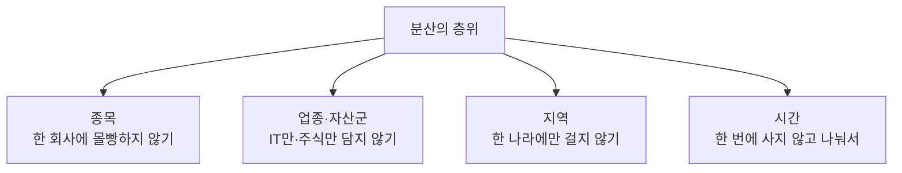

[지난 편](/valuing-growth-stocks) 끝에서 "전부를 성장주에 걸기보다 이해하는 만큼만 담으라"고 했습니다. 사실 이건 성장주에만 해당하는 이야기가 아닙니다. 투자에서 오래 살아남는 사람들이 거의 예외 없이 지키는 원칙, **분산**의 이야기입니다.

"계란을 한 바구니에 담지 마라"는 말은 너무 많이 들어서 오히려 진부하게 느껴집니다. 그런데 이 말 뒤에는 꽤 정교한 원리가 있고, 그걸 제대로 이해하면 "그냥 여러 개 사라"는 수준을 넘어서게 됩니다. 이번 편은 그 원리와, 실제로 무엇을 어떻게 나누는지에 대한 이야기입니다.

> ⚠️ 이 글은 개인적으로 공부한 내용을 정리한 것이며, 투자 권유나 자문이 아닙니다. 특정 종목에 대한 이야기도 없습니다.

## 분산은 왜 "공짜 점심"이라 불리나

경제학에는 "세상에 공짜 점심은 없다"는 격언이 있습니다. 그런데 분산투자는 예외적으로 "**유일한 공짜 점심**"이라고 불립니다. 무슨 뜻일까요?

핵심은 **상관관계**(correlation)에 있습니다. 서로 다르게 움직이는 자산을 섞으면, 하나가 빠질 때 다른 하나가 버텨주면서 전체의 출렁임이 줄어듭니다. 놀라운 건, 이렇게 **위험(변동성)은 줄이면서도 기대수익은 크게 손해 보지 않는다**는 점입니다. 보통 위험을 줄이면 수익도 줄어드는 게 세상 이치인데, 분산은 그 맞바꿈 없이 위험만 깎아줍니다. 그래서 "공짜 점심"입니다.

간단한 직관으로 봅시다. 아이스크림 가게와 우산 가게에 나눠 투자하면, 맑은 날엔 아이스크림이, 비 오는 날엔 우산이 벌어줍니다. 둘을 합친 수입은 날씨와 무관하게 훨씬 평탄해집니다. 반대로 아이스크림 가게 두 곳에 몰아넣으면, 장마철엔 둘 다 함께 무너집니다. **핵심은 개수가 아니라, 서로 다르게 움직이느냐**입니다.

## 무엇을 분산하나 — 분산의 층위

분산이라고 하면 흔히 "종목을 여러 개 산다"만 떠올리는데, 실제로는 여러 층위가 있습니다.

- **종목 분산** — 한 회사에 전 재산을 걸지 않습니다. 그 회사에 무슨 일이 생겨도 전체가 무너지지 않게요. 가장 기본입니다.
- **업종·자산군 분산** — 종목을 여럿 사도 전부 IT라면, IT가 무너질 때 함께 무너집니다. 서로 다른 업종, 나아가 주식·채권·현금·원자재처럼 다른 **자산군**으로도 나눕니다. 특히 주식과 채권은 종종 반대로 움직여 서로를 받쳐줍니다.
- **지역 분산** — 한 나라 경제에만 걸면 그 나라가 흔들릴 때 방법이 없습니다. 글로벌하게 나누면 특정 국가의 위기를 다른 지역이 상쇄해줍니다.
- **시간 분산** — 한 번에 목돈을 넣으면 하필 고점에 사는 위험이 있습니다. 여러 시점에 나눠 사면(적립식·분할매수) 매수 가격이 평균값으로 수렴합니다. 이걸 **달러 코스트 애버리징**이라 부르는데, "언제 살까"라는 맞히기 어려운 문제를 아예 우회하는 방법입니다.

## 상관관계가 전부다 (그리고 그 함정)

앞서 강조했듯, 분산의 효과는 개수가 아니라 **얼마나 다르게 움직이느냐**에서 나옵니다. 아무리 많은 종목을 담아도 다 같은 방향으로 움직이면 분산 효과는 없습니다.

그런데 여기에 뼈아픈 함정이 하나 있습니다. **위기가 오면 상관관계가 1로 수렴하는 경향**입니다. 평소엔 따로 놀던 자산들이, 진짜 공포가 시장을 덮치면 **다 같이 떨어집니다.** 사람들이 현금을 확보하려고 가리지 않고 팔아치우기 때문입니다. 분산이 가장 필요한 순간에 분산 효과가 약해지는 셈입니다. 그래서 진짜 분산을 위해서는, 위기 때도 성격이 다른 자산(예: 안전자산으로 여겨지는 것들)을 함께 두는 것이 중요합니다.

## 얼마나 나눠야 하나 — 과분산의 함정

"많이 나눌수록 좋다"도 틀립니다. **과분산**(over-diversification)이라는 반대편 함정이 있습니다.

- 종목을 수십, 수백 개로 늘리면 어느 순간부터 분산 효과는 거의 안 늘고, 대신 **관리가 불가능**해집니다. 내가 뭘 가졌는지도 모르게 됩니다.
- 너무 많이 담으면 결국 **시장 평균과 똑같아집니다.** 그럴 거라면 차라리 다음 편에서 다룰 시장 전체를 사는 방법(인덱스)이 더 싸고 효율적입니다.
- 잘 아는 좋은 기회에 집중하지 못하고 어중간하게 흩뿌리는 것을, 피터 린치는 "디워시피케이션(diworsification)" — 분산을 가장한 악화 — 이라 꼬집었습니다.

그래서 "몇 개가 정답"이라기보다, **내가 각각을 이해하고 관리할 수 있는 범위** 안에서 서로 다르게 움직이도록 나누는 게 핵심입니다.

## 자산배분과 리밸런싱

분산을 실제로 굴리는 두 개의 축이 자산배분과 리밸런싱입니다.

**자산배분**(asset allocation)은 "무엇에 얼마씩" 담을지 비중을 정하는 일입니다. 흔히 위험 감내도와 투자 기간으로 정합니다. 젊고 오래 묻어둘 수 있으면 주식 비중을 높이고, 안정이 중요하면 채권·현금 비중을 높이는 식입니다. 여러 연구에서 **장기 수익의 상당 부분이 개별 종목 선택이 아니라 이 자산배분에서 결정된다**고 이야기합니다. 무엇을 사느냐만큼 어떤 비율로 담느냐가 중요하다는 뜻입니다.

**리밸런싱**(rebalancing)은 시간이 지나며 틀어진 비중을 원래대로 되돌리는 일입니다. 주식이 많이 오르면 포트폴리오에서 주식 비중이 목표보다 커지는데, 이때 **오른 주식을 일부 팔고 덜 오른 자산을 사서** 비중을 맞춥니다. 눈치채셨겠지만, 이건 "오른 걸 팔고 내린 걸 사는" — [첫 편](/stocks-before-you-start)에서 이야기한 사람의 본능과 정반대되는 행동입니다. 그래서 리밸런싱은 감정이 아니라 규칙(예: 반기마다, 또는 비중이 일정 이상 틀어지면)으로 기계적으로 하는 게 좋습니다. 감정을 배제하는 장치인 셈입니다.

## 나에게 맞는 배분은?

정답 배분은 없습니다. 같은 포트폴리오라도 20대와 은퇴를 앞둔 분에게는 완전히 다른 의미입니다. 다만 배분을 정할 때 스스로에게 던져야 할 질문은 대체로 같습니다.

- **얼마나 오래** 묻어둘 수 있는가 (투자 기간)
- 30% 하락을 **견딜 수 있는가** (위험 감내도) — 견디지 못하면 가장 나쁜 시점에 팔게 됩니다
- 이 돈은 **잃어도 되는 돈인가** ([첫 편](/stocks-before-you-start)의 그 원칙)

이 답에 맞춰 비중을 정하고, 규칙으로 리밸런싱하며 유지하는 것 — 그게 분산의 실천입니다.

## 정리

- 분산은 **상관관계**가 낮은 자산을 섞어, 수익은 지키며 위험만 줄이는 "공짜 점심"입니다.
- 나누는 층위는 여럿입니다 — **종목·업종/자산군·지역·시간.** 핵심은 개수가 아니라 서로 다르게 움직이느냐입니다.
- 위기 땐 상관관계가 1로 수렴하니, 성격이 다른 자산을 함께 두세요. 반대로 **과분산**은 시장 평균화와 관리 불능을 부릅니다.
- **자산배분**으로 비중을 정하고 **리밸런싱**으로 유지하되, 리밸런싱은 감정이 아니라 규칙으로 하세요.

분산은 화려하진 않아도, 시장에서 오래 버티게 해주는 가장 든든한 안전벨트입니다. 그런데 이 모든 분산을 **개인이 일일이 하기는 번거롭습니다.** 다음 편에서는 이 분산을 손쉽고 저렴하게 이루는 도구 — ETF와 인덱스 투자 — 를 다루겠습니다.

> 다시 한번, 이 글은 투자 권유가 아니며 모든 판단과 책임은 본인에게 있습니다.
