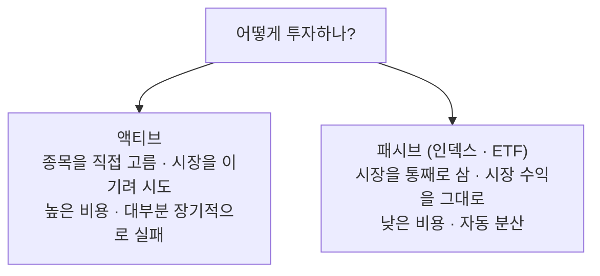

[지난 편](/diversification-and-portfolio) 끝에서, 분산은 중요하지만 **개인이 종목·업종·지역·시간을 일일이 나눠 담기는 번거롭다**고 했습니다. 종목 수십 개를 직접 사고, 비중을 맞추고, 리밸런싱까지 하려면 시간도 지식도 만만치 않습니다. 오늘 이야기할 인덱스·ETF 투자는 바로 그 번거로움을 **거의 자동으로** 해결해주는 도구입니다. "시장을 통째로 사는" 접근이죠.

> ⚠️ 이 글은 개인적으로 공부한 내용을 정리한 것이며, 투자 권유나 자문이 아닙니다. 특정 종목·상품에 대한 이야기도 없습니다.

## 인덱스란 무엇인가 — 시장을 대표하는 바구니

먼저 **인덱스(지수)** 부터 짚겠습니다. 인덱스는 시장 전체(또는 그 일부)를 대표하도록 여러 종목을 묶어 만든 바구니입니다. 미국의 S&P 500은 미국 대표 기업 500곳을, 한국의 KOSPI 200은 한국 대표 기업 200곳을 담습니다. 이 지수의 값이 오르내리는 건, 그 안에 담긴 기업들의 값이 전반적으로 오르내린다는 뜻입니다.

그래서 "인덱스에 투자한다"는 건 **개별 기업이 아니라 시장 전체를 산다**는 의미입니다. 어느 한 회사를 고르는 게 아니라, "이 시장 전체가 장기적으로 성장할 것"에 베팅하는 거죠. 첫 편에서 이야기한 "장기엔 가치에 수렴한다"를 개별 종목이 아니라 시장 전체에 적용하는 셈입니다.

## 액티브와 패시브 — 시장을 이기려는가, 함께 가는가

투자 방식은 크게 둘로 나뉩니다.

- **액티브(active)** — 종목을 직접 골라 **시장보다 높은 수익**을 노립니다. 펀드매니저가 열심히 분석해 "이건 오를 것, 저건 팔 것"을 정합니다.
- **패시브(passive)** — 종목을 고르지 않고 **시장(인덱스)을 통째로** 따라갑니다. 시장을 이기려 하지 않고, 시장 수익을 그대로 얻는 걸 목표로 합니다.

여기서 투자 역사에서 가장 유명하고 반직관적인 사실 하나가 나옵니다. **장기적으로 대부분의 액티브 펀드는 시장(인덱스)을 이기지 못합니다.** 수많은 데이터가 이걸 반복해서 보여줍니다. 똑똑한 전문가들이 밤낮으로 분석하는데 왜 시장 평균을 못 이길까요?

- **비용** — 액티브 펀드는 운용에 손이 많이 가 **수수료(보수)가 높습니다.** 시장과 비슷한 수익을 내도, 높은 수수료를 떼고 나면 시장보다 뒤처집니다. 이 차이가 복리로 쌓이면 장기적으로 격차가 큽니다.
- **시장의 효율성** — 이미 수많은 참여자가 정보를 반영해놓은 시장에서, 남들보다 꾸준히 앞서는 건 지극히 어렵습니다. 어느 해 이긴 펀드가 다음 해에도 이길 거라는 보장도 없습니다.
- **평균의 산수** — 모든 투자자의 수익을 합치면 결국 시장 평균입니다. 누군가 시장을 이기면 누군가는 진다는 뜻이고, 거기서 비용까지 빼면 평균적으로는 시장에 뒤처지는 게 자연스럽습니다.

이것이 첫 편에서 "대부분의 개인은 시장을 이기지 못한다"고 했던 이야기의 근거입니다. 그렇다면 **"이기려 애쓰는 대신 시장과 함께 가자"** 는 결론이 자연스럽고, 그 실천 도구가 인덱스·ETF입니다.

## ETF란 무엇인가

**ETF(Exchange Traded Fund, 상장지수펀드)** 는 인덱스를 추종하는 펀드를 **주식처럼 거래소에서 사고팔 수 있게** 만든 상품입니다. 이름을 풀면 그대로입니다 — 거래소(Exchange)에서 거래되는(Traded) 펀드(Fund).

전통적인 인덱스 펀드도 있지만, ETF는 몇 가지 편의를 더합니다.

- **실시간 거래** — 일반 펀드는 하루 한 번 정해진 가격에 사고팔지만, ETF는 장중에 주식처럼 실시간 가격으로 거래됩니다.
- **낮은 비용** — 대체로 액티브 펀드보다, 때로는 일반 인덱스 펀드보다도 보수가 낮습니다.
- **접근성** — 증권 계좌만 있으면 주식 한 주 사듯 ETF 한 주를 살 수 있습니다.

그래서 ETF 한 주를 사는 것만으로 그 지수에 담긴 수백 개 기업에 **한 번에 분산 투자**가 됩니다. 4편에서 이야기한 종목·업종 분산이 ETF 한 주로 저절로 이뤄지는 거죠.

## ETF를 고를 때 봐야 할 것

ETF라고 다 같지 않습니다. 같은 지수를 추종하는 ETF도 여럿이라, 고를 때 봐야 할 것들이 있습니다.

- **운용보수(expense ratio)** — ETF를 굴리는 데 드는 연간 비용입니다. **낮을수록 좋습니다.** 얼핏 연 0.1%와 0.5%가 별 차이 없어 보여도, 수십 년 복리로 쌓이면 최종 수익에서 꽤 큰 차이를 냅니다. 넓은 시장 지수 ETF는 보수가 매우 낮은 편입니다.
- **추적오차(tracking error)** — ETF가 목표 지수를 **얼마나 잘 따라가는지**입니다. 지수는 5% 올랐는데 ETF는 4.5%만 올랐다면 그만큼 새는 겁니다. 오차가 작을수록 좋습니다.
- **규모와 유동성(AUM·거래량)** — 운용 규모가 너무 작거나 거래량이 적은 ETF는 위험합니다. 사고팔 때 원하는 가격에 체결이 안 되거나(호가 스프레드가 큼), 최악의 경우 **상장폐지**될 수도 있습니다. 규모가 크고 거래가 활발한 것이 안전합니다.
- **기초지수와 분배금** — 무엇을 추종하는지(어느 시장·어떤 방식), 그리고 배당을 어떻게 처리하는지(현금으로 분배하는지, 자동 재투자하는지)를 확인합니다.

## ETF의 종류 — 넓은 것부터 위험한 것까지

ETF는 종류가 무척 다양합니다. 대략 위험도 순으로 늘어놓으면 이렇습니다.

- **광범위 시장 지수 ETF** — S&P 500, 전 세계 주식처럼 시장 전체를 담습니다. 가장 넓게 분산돼 있어, 인덱스 투자의 기본이 됩니다.
- **섹터·테마 ETF** — 특정 산업(반도체·바이오 등)이나 테마를 담습니다. 분산은 좁아지고 변동성은 커집니다. 유행하는 테마 ETF는 고점에서 사기 쉬우니 특히 조심해야 합니다.
- **채권·원자재 ETF** — 주식이 아닌 자산군에 분산할 때 씁니다. 4편의 자산군 분산을 ETF로 손쉽게 하는 방법입니다.
- **레버리지·인버스 ETF** — **초보라면 손대지 마세요.** 레버리지 ETF는 지수 움직임의 2~3배로 움직이고, 인버스 ETF는 지수와 반대로 움직입니다. 그런데 이들은 대개 "하루 단위"로 설계돼 있어, **여러 날 보유하면 복리 효과가 어긋나 예상과 전혀 다르게** 움직입니다. 장기 보유하면 지수가 제자리로 돌아와도 손실이 남는 구조라, 단기 트레이딩용 도구이지 투자 도구가 아닙니다.

## 왜 초보에게 유리한가

인덱스·ETF가 특히 초보에게 권해지는 이유를 정리하면, 지금까지 시리즈에서 이야기한 것들이 여기서 만납니다.

- **분산이 저절로** — ETF 한 주로 수백 종목에 분산됩니다(4편).
- **비용이 낮음** — 액티브의 높은 수수료를 피합니다. 복리로 쌓이는 비용 격차가 없습니다.
- **함정 회피** — 종목을 고르지 않으니 뇌동매매·타이밍 맞추기 같은 [첫 편](/stocks-before-you-start)의 함정에 빠질 일이 줄어듭니다.
- **적립식과 궁합** — 매달 같은 금액으로 시장 전체를 꾸준히 사는 방식(적립식·달러 코스트 애버리징)이 인덱스 투자와 특히 잘 맞습니다. "언제 살까"를 고민할 필요가 없어집니다.

화려하진 않습니다. "이 종목으로 대박"의 짜릿함은 없죠. 하지만 조용히, 낮은 비용으로, 시장의 장기 성장을 따라가는 이 방식이 대다수의 개인에게 가장 현실적인 출발점이라는 게 오랜 데이터의 결론입니다.

## 그래도 주의할 점

만능은 아닙니다. 몇 가지는 분명히 해둬야 합니다.

- **ETF도 시장 따라 떨어집니다.** 분산은 개별 종목의 위험을 줄여줄 뿐, 시장 전체가 하락하는 국면에서는 ETF도 함께 빠집니다. "인덱스는 안전하다"가 아니라 "인덱스는 넓게 분산돼 있다"가 맞는 표현입니다.
- **테마·레버리지에 휩쓸리지 마세요.** "시장을 통째로"라는 인덱스의 장점은 광범위 지수에서 나옵니다. 유행 테마나 레버리지 ETF로 옮겨가는 순간, 인덱스 투자의 장점(분산·저비용·저위험)을 스스로 버리는 셈입니다.
- **해외 ETF는 환율도 봅니다.** 해외 시장 ETF에 투자하면 그 시장의 수익뿐 아니라 **환율 변동**도 함께 얹힙니다. 환헤지 여부에 따라 결과가 달라지니 확인이 필요합니다.

## 정리

- **인덱스**는 시장을 대표하는 바구니이고, 인덱스 투자는 개별 종목이 아니라 **시장 전체**를 사는 것입니다.
- 장기적으로 **대부분의 액티브는 시장을 못 이깁니다** — 비용과 시장 효율성 때문입니다. 그래서 "이기려 애쓰기보다 함께 가는" 패시브가 합리적입니다.
- **ETF**는 인덱스를 주식처럼 사고파는 도구이고, 고를 땐 **운용보수·추적오차·규모**를 봅니다.
- **레버리지·인버스는 초보 금지**, 테마 ETF는 신중하게. 인덱스의 장점은 넓은 분산에서 나옵니다.
- 저절로 되는 분산, 낮은 비용, 함정 회피, 적립식 궁합 — 초보에게 가장 현실적인 출발점입니다.

이제 무엇을(넓은 인덱스), 어떻게(저비용 ETF, 적립식) 담을지의 그림이 잡혔습니다. 다음 마지막 편에서는 이 모든 걸 실제로 **사고파는 규율** — 언제 사고, 언제 팔고, 흔들리는 시장에서 어떻게 감정을 다스릴지 — 를 다루며 시리즈를 마무리하겠습니다.

> 다시 한번, 이 글은 투자 권유가 아니며 모든 판단과 책임은 본인에게 있습니다.
