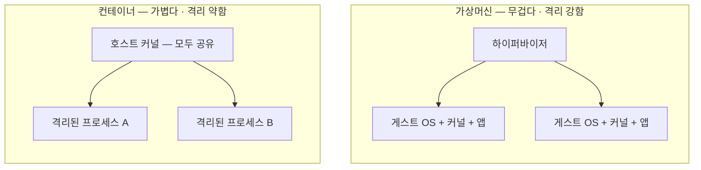
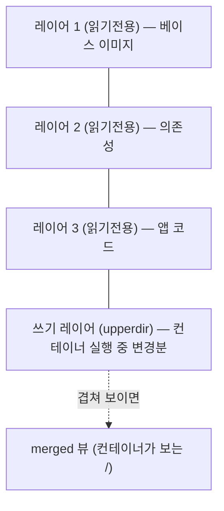
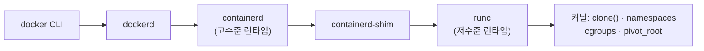

쿠버네티스도, 도커도, 그 아래에는 "컨테이너"라는 단위가 있습니다. 우리는 매일 컨테이너를 띄우면서도, 정작 `docker run` 한 줄을 쳤을 때 **커널 안에서 무슨 일이 벌어지는지**는 흐릿하게 알고 넘어가곤 합니다. 이 글은 그 안을 밑바닥까지 열어봅니다. 컨테이너가 사실 무엇인지, 격리는 어떻게 이뤄지는지, 이미지는 어떤 구조인지, 그리고 왜 "컨테이너는 VM보다 격리가 약하다"는 말이 나오는지를, 리눅스 커널 기능 단위로 파고듭니다.

## 1. 흔한 오해 — 컨테이너는 가벼운 VM이 아니다

가장 먼저 깨야 할 오해가 있습니다. **컨테이너는 "가벼운 가상머신"이 아닙니다.**

가상머신(VM)은 하이퍼바이저 위에서 **자기만의 게스트 운영체제(커널 포함)** 를 통째로 돌립니다. 그래서 무겁고 부팅이 느리지만, 게스트 커널이 호스트와 완전히 분리돼 있어 격리가 강합니다.

컨테이너는 다릅니다. **자기 커널이 없습니다.** 컨테이너 안의 프로세스는 그냥 **호스트의 리눅스 커널 위에서 도는 평범한 프로세스**입니다. 다만 리눅스 커널의 몇 가지 기능으로 "자기가 독립된 시스템 안에 있는 것처럼 착각하게" 만들어졌을 뿐입니다. 컨테이너 안에서 `ps`를 치면 자기 프로세스만 보이고, `ls /`를 하면 자기 파일시스템만 보이지만, 그건 호스트 커널이 **그 프로세스에게만 그렇게 보여주고 있는** 것뿐입니다.



이 그림의 차이가 컨테이너의 모든 것을 설명합니다. 커널을 공유하기 때문에 **가볍고 빠릅니다** — 게스트 OS를 부팅할 필요 없이 프로세스 하나 띄우는 속도로 시작됩니다. 하지만 같은 이유로 **격리가 VM보다 약합니다** — 모두가 같은 커널을 공유하니, 그 커널에 구멍이 나면 격리가 뚫립니다. [쿠버네티스 멀티테넌시 글](/kubernetes-multitenancy-isolation)에서 "같은 노드의 파드는 커널을 공유한다"며 커널 경계를 강조했는데, 그 커널 경계의 실체가 바로 이것입니다.

## 2. "컨테이너"라는 것은 없다 — 세 가지 기능의 조합

더 놀라운 사실이 있습니다. **리눅스 커널에는 "컨테이너"라는 개념 자체가 없습니다.** `struct container` 같은 커널 객체는 존재하지 않습니다. 우리가 컨테이너라고 부르는 것은, 사실 **세 가지(정확히는 그 이상의) 독립적인 리눅스 커널 기능을 조합**해 만들어낸 착시입니다.

- **namespaces(네임스페이스)** — 프로세스가 **무엇을 볼 수 있는가**를 격리합니다. "너는 이 프로세스들만, 이 파일시스템만, 이 네트워크만 볼 수 있어."
- **cgroups(컨트롤 그룹)** — 프로세스가 **자원을 얼마나 쓸 수 있는가**를 제한합니다. "너는 CPU 0.5개, 메모리 512MB까지만 써."
- **union 파일시스템** — 이미지를 **레이어로 쌓아** 효율적으로 파일시스템을 구성합니다.

도커나 컨테이너 런타임이 하는 일은, 이 커널 기능들을 적절히 호출해 "격리되고, 제한되고, 자기 파일시스템을 가진 프로세스"를 만드는 것입니다. 즉 컨테이너는 **커널 기능의 우아한 조합**이지, 하나의 마법 상자가 아닙니다. 이제 이 세 축을 하나씩 뜯어봅니다.

## 3. Namespaces — "무엇을 보는가"를 격리한다

namespace는 커널이 관리하는 특정 종류의 자원을 **프로세스별로 다른 뷰**로 보여주는 기능입니다. 핵심은 "격리"라기보다 **"시야 제한"** 에 가깝습니다. 같은 커널 안에 다 존재하지만, 각 프로세스에게 자기 namespace 안의 것만 보여주는 거죠.

리눅스에는 여러 종류의 namespace가 있고, 컨테이너는 이들을 조합해 씁니다.

- **PID namespace** — 프로세스 ID를 격리합니다. 컨테이너 안의 첫 프로세스는 자기가 **PID 1**이라고 믿습니다. 호스트에서 보면 그건 그냥 PID 3만 몇 번짜리 프로세스일 뿐인데도요. 컨테이너 안에서 `ps`를 치면 자기 namespace의 프로세스만 보이는 이유입니다.
- **mount namespace** — 마운트 지점, 즉 파일시스템 트리를 격리합니다. 컨테이너가 자기만의 `/`를 갖는 근거입니다. 뒤에서 볼 이미지 파일시스템이 여기에 마운트됩니다.
- **network namespace** — 네트워크 스택(인터페이스, IP, 라우팅 테이블, 포트)을 통째로 격리합니다. 컨테이너는 자기만의 `eth0`와 IP를 갖습니다. 쿠버네티스에서 한 파드 안의 컨테이너들이 네트워크를 공유하는 건, 이 network namespace를 함께 쓰기 때문입니다.
- **UTS namespace** — 호스트명(hostname)을 격리합니다. 컨테이너가 자기 호스트명을 가질 수 있는 이유입니다.
- **IPC namespace** — 프로세스 간 통신(공유 메모리 등)을 격리합니다.
- **user namespace** — UID/GID를 매핑해 격리합니다. 이게 보안적으로 매우 중요합니다. **컨테이너 안의 root(UID 0)를 호스트의 비특권 사용자로 매핑**할 수 있어서, 컨테이너 안에선 root처럼 보여도 호스트에서는 아무 권한 없는 사용자가 되게 만들 수 있습니다.
- **cgroup namespace** — cgroup 계층 구조의 뷰를 격리합니다.

이 namespace들은 마법이 아니라 그냥 **시스템 콜**로 만듭니다. `clone()`으로 새 프로세스를 만들 때 어떤 namespace를 새로 팔지 플래그로 지정하거나, `unshare()`로 현재 프로세스를 새 namespace로 분리하거나, `setns()`로 기존 namespace에 합류합니다.

직접 확인해볼 수도 있습니다. 도커 없이 명령 하나로 PID·mount namespace를 만들어보는 겁니다.

```text
# 새 PID + mount namespace 를 만들고 그 안에서 셸 실행
$ sudo unshare --pid --fork --mount-proc /bin/bash

# 이 셸 안에서 ps 를 치면?
# ps -ef  →  PID 1 은 방금 띄운 bash. 호스트의 수많은 프로세스는 안 보인다.
```

이 한 줄이 도커가 하는 일의 축소판입니다. 도커는 여기에 network·user·UTS·IPC namespace를 더 얹고, 파일시스템을 바꾸고, cgroup으로 자원을 묶어 "컨테이너"를 완성할 뿐입니다.

## 4. Cgroups — "얼마나 쓰는가"를 제한한다

namespace가 "무엇을 보는가"를 격리한다면, **cgroups(control groups)** 는 "자원을 얼마나 쓰는가"를 제한합니다. 이 둘은 완전히 다른 기능이고, 컨테이너는 둘 다 필요합니다. namespace만 있으면 격리는 되지만 한 컨테이너가 호스트의 CPU·메모리를 다 빨아들여 다른 컨테이너를 굶길 수 있습니다. cgroups가 그걸 막습니다.

cgroups는 프로세스들을 그룹으로 묶고, 그 그룹에 자원 상한을 겁니다.

- **cpu** — CPU 시간의 몫과 상한. "이 그룹은 CPU 0.5개만큼만"처럼요.
- **memory** — 메모리 사용 상한. 이 상한을 넘으면 그 유명한 **OOM Killer**가 그룹 안의 프로세스를 죽입니다. [오토스케일링 글](/kubernetes-autoscaling-resource-tuning)에서 "메모리는 압축 불가라 limit을 넘으면 OOMKilled"라고 한 그 동작이 바로 memory cgroup에서 일어납니다.
- **io** — 디스크 입출력 대역폭.
- **pids** — 만들 수 있는 프로세스 수(fork 폭탄 방지).

cgroups에는 v1과 v2가 있습니다. v1은 자원별로 계층이 따로 놀아 복잡했는데, v2는 **하나의 통합된 계층 트리**로 정리해 일관성을 높였고 지금은 v2가 표준입니다. cgroup은 특수 파일시스템(`/sys/fs/cgroup`)으로 노출돼서, 파일에 값을 쓰는 것만으로 제한을 걸 수 있습니다.

```text
# 예: 어떤 그룹의 메모리를 512MB 로 제한 (cgroup v2)
$ echo $((512*1024*1024)) > /sys/fs/cgroup/mygroup/memory.max

# 이 프로세스를 그 그룹에 넣기
$ echo <PID> > /sys/fs/cgroup/mygroup/cgroup.procs
```

쿠버네티스에서 파드에 `resources.limits.memory: 512Mi`를 걸면, 결국 그 파드 컨테이너의 cgroup `memory.max`에 이 값이 써지는 것입니다. 우리가 YAML로 선언한 리밋이 이렇게 커널의 cgroup 파일까지 내려가 강제됩니다.

## 5. 파일시스템 — 이미지는 레이어의 스택이다

컨테이너의 세 번째 축은 파일시스템입니다. 컨테이너는 자기만의 `/`(루트 파일시스템)를 갖는데, 이걸 매번 통째로 복사하면 느리고 낭비입니다. 그래서 **union 파일시스템**(주로 **OverlayFS**)과 **레이어(layer)** 개념이 등장합니다.

**이미지는 레이어들의 스택입니다.** Dockerfile의 각 명령(`RUN`, `COPY` 등)이 하나의 레이어를 만들고, 이 레이어들이 아래에서 위로 쌓입니다. 각 레이어는 "이전 상태에서 무엇이 바뀌었는가(파일 추가·수정·삭제)"만 담습니다.

OverlayFS는 이 레이어들을 겹쳐 하나의 파일시스템으로 보여줍니다.



- **lowerdir** — 읽기 전용 레이어들(베이스 이미지 + 각 빌드 단계). 여러 컨테이너가 **공유**합니다.
- **upperdir** — 쓰기 가능한 얇은 레이어. 컨테이너가 실행 중 파일을 바꾸면 여기에만 씁니다.
- **merged** — 이 둘을 겹쳐 보여주는 최종 뷰. 컨테이너는 이걸 자기 `/`로 봅니다.

핵심 메커니즘이 **쓰기 시 복사(Copy-on-Write, CoW)** 입니다. 컨테이너가 읽기 전용 레이어의 파일을 수정하려 하면, 그 파일을 upperdir로 **복사한 뒤** 거기서 수정합니다. 원본 레이어는 그대로 남죠. 덕분에 **여러 컨테이너가 같은 읽기 전용 레이어를 공유하면서도, 각자 독립적으로 파일을 바꿀 수 있습니다.**

이 구조가 주는 이점은 큽니다. 같은 베이스 이미지를 쓰는 컨테이너 100개를 띄워도 베이스 레이어는 **디스크에 한 벌**만 있으면 됩니다. 이미지를 pull할 때도 이미 가진 레이어는 다시 안 받습니다. Dockerfile에서 자주 바뀌는 명령을 아래(뒤)에 두라는 조언도 여기서 나옵니다 — 위쪽 레이어가 그대로면 캐시가 재사용되니까요. 그리고 **컨테이너 = 이미지(읽기전용 레이어들) + 쓰기 레이어 하나**라는 공식이 성립합니다. 컨테이너를 지워도 이미지는 남는 이유입니다.

## 6. OCI — 이미지와 런타임의 표준

초기엔 도커가 이미지 형식과 실행 방식을 사실상 독점했지만, 생태계가 커지면서 표준이 필요해졌습니다. 그래서 만들어진 것이 **OCI(Open Container Initiative)** 이고, 두 개의 명세로 나뉩니다.

**OCI 이미지 명세** 는 이미지가 어떻게 생겼는지를 정의합니다.

- **레이어** — 각각 tar 아카이브로 저장됩니다.
- **config** — 환경변수, 시작 명령(entrypoint), 아키텍처 등 이미지 메타데이터.
- **manifest** — 이 이미지가 어떤 레이어들과 어떤 config로 이뤄졌는지 목록.

여기서 중요한 개념이 **콘텐츠 주소 지정(content-addressable)** 입니다. 각 레이어와 config는 그 내용의 **해시(digest)** 로 식별됩니다. `sha256:abc...` 같은 것이죠. 내용이 같으면 해시가 같으니 중복 저장·전송을 피할 수 있고, 내용이 바뀌면 해시가 바뀌니 무결성이 보장됩니다. 이미지 태그(`nginx:1.25`)는 사람이 읽는 별명일 뿐, 진짜 정체성은 이 digest입니다.

**OCI 런타임 명세** 는 "이 파일시스템과 이 설정으로 컨테이너를 실행하라"를 정의합니다. 핵심은 **`config.json`** 이라는 파일인데, 여기에 어떤 namespace를 만들지, 어떤 cgroup 제한을 걸지, 어떤 capability를 줄지, 루트 파일시스템은 어디인지가 전부 담깁니다.

```text
// config.json 발췌 — 런타임에게 "이렇게 격리하라"고 지시
{
  "process": { "args": ["/bin/sh"], "cwd": "/" },
  "root": { "path": "rootfs", "readonly": true },
  "linux": {
    "namespaces": [
      { "type": "pid" }, { "type": "mount" },
      { "type": "network" }, { "type": "uts" }, { "type": "ipc" }
    ],
    "resources": { "memory": { "limit": 536870912 } }
  }
}
```

즉 우리가 지금까지 본 namespace·cgroup·rootfs가 이 한 파일에 선언적으로 모입니다. 런타임은 이걸 읽어 커널 기능을 호출할 뿐입니다.

## 7. 런타임 — docker에서 커널까지

`docker run`을 치면 실제로는 여러 계층을 거칩니다. 이 사슬을 알면 "도커 없이도 컨테이너가 돈다"는 말이 이해됩니다.



- **runc** — **저수준 런타임**입니다. OCI 런타임 명세의 참조 구현으로, 하는 일은 딱 하나입니다. `config.json`을 읽어 namespace를 만들고, cgroup을 걸고, 루트 파일시스템을 바꾸고(`pivot_root`), 프로세스를 실행하는 것. 컨테이너를 실제로 "창조"하는 마지막 손입니다.
- **containerd** — **고수준 런타임**입니다. 이미지 pull, 저장소 관리, 네트워크 설정, 여러 컨테이너의 생명주기 관리 같은 큰 그림을 담당하고, 실제 컨테이너 생성은 runc에 위임합니다.
- **shim** — containerd와 컨테이너 사이에 남아 컨테이너의 부모 역할을 하며, runc가 자기 일(컨테이너 생성)을 끝내고 빠져도 컨테이너가 계속 살아있게 합니다.

여기서 쿠버네티스와의 접점도 보입니다. 쿠버네티스는 도커 데몬에 직접 의존하지 않고, **CRI(Container Runtime Interface)** 라는 표준 인터페이스로 containerd 같은 런타임과 대화합니다. 그래서 쿠버네티스가 "도커 지원을 뗀다"고 했을 때도 실제로는 아무 문제가 없었습니다 — 그 아래 containerd와 runc는 그대로였으니까요. 도커는 사람이 쓰는 편의 도구였을 뿐, 컨테이너를 실제로 만드는 건 처음부터 이 저수준 계층이었습니다.

## 8. 보안 — 공유 커널이라는 근본 한계

이제 1장에서 예고한 "컨테이너는 격리가 약하다"로 돌아옵니다. 컨테이너의 모든 격리(namespace)와 제한(cgroup)은 **같은 커널 안에서** 이뤄집니다. 그 말은, **커널 자체에 취약점이 있으면 격리가 뚫린다**는 뜻입니다. 컨테이너 안의 프로세스가 커널 버그를 악용해 자기 namespace를 탈출하면, 호스트와 다른 컨테이너 전체가 노출됩니다. 이것이 **컨테이너 탈출(container escape)** 이고, VM에는 없는 컨테이너 특유의 위험입니다.

그래서 커널을 공유하는 채로 격리를 **강화**하는 여러 장치가 있습니다.

- **capabilities 최소화** — 리눅스는 root의 전능한 권한을 잘게 쪼갠 capability로 나눠뒀습니다(네트워크 관리, 파일 소유권 변경 등). 컨테이너에는 꼭 필요한 것만 남기고 나머지는 **떨궈야(drop)** 합니다. 대부분의 컨테이너는 사실 극소수의 capability만 필요합니다.
- **seccomp** — 컨테이너가 호출할 수 있는 **시스템 콜을 필터링**합니다. 위험한 시스템 콜을 아예 막으면 커널 공격 표면이 크게 줄어듭니다.
- **AppArmor / SELinux** — 강제 접근 제어로 컨테이너가 접근할 수 있는 파일·자원을 한 번 더 제한합니다.
- **user namespace** — 앞서 본, 컨테이너 root를 호스트 비특권 사용자로 매핑하는 것. 탈출하더라도 호스트에서 권한이 없게 만듭니다.
- **읽기 전용 루트, no-new-privileges** — 루트 파일시스템을 읽기 전용으로 두고, 권한 상승을 원천 차단합니다.

한 발 더 나아가 **rootless 컨테이너** — 아예 비특권 사용자 권한만으로 컨테이너를 돌리는 방식 — 도 자리를 잡았습니다. 데몬을 root로 띄우던 전통적 도커의 공격 표면을 줄이는 흐름입니다.

그럼에도 커널 공유라는 근본 한계가 걸리는 워크로드 — 서로 믿을 수 없는 테넌트를 한 노드에 태우는 경우 — 라면, [멀티테넌시 글](/kubernetes-multitenancy-isolation)에서 언급한 더 강한 격리로 올라가야 합니다.

- **gVisor** — 사용자 공간에서 도는 **경량 커널**을 컨테이너 앞에 두어, 컨테이너의 시스템 콜을 호스트 커널 대신 이 사용자 공간 커널이 받아냅니다. 호스트 커널로 가는 공격 표면을 극적으로 줄입니다.
- **Kata Containers** — 각 컨테이너를 아주 가벼운 **VM 안에** 넣습니다. 컨테이너의 편의와 VM의 강한 격리(자기 커널)를 절충하는 방식입니다.

이 대목이 컨테이너 보안의 핵심을 요약합니다. **컨테이너의 가벼움과 강한 격리는 근본적으로 상충**하고(둘 다 커널 공유에서 오니까요), 그래서 위협 모델에 따라 "얼마나 강한 격리를 얼마의 비용으로 살 것인가"를 고르는 문제가 됩니다. 멀티테넌시 글의 "격리 수준은 위협 모델이 정한다"가, 컨테이너 내부까지 내려와도 그대로 성립합니다.

## 9. 정리 — 마법이 아니라 조합

컨테이너를 밑바닥까지 열어본 결과를 한 줄기로 꿰면 이렇습니다.

- 컨테이너는 **가벼운 VM이 아니라, 호스트 커널을 공유하는 격리된 프로세스**입니다. 그래서 가볍고 빠르지만 격리가 상대적으로 약합니다.
- 커널에는 "컨테이너"가 없습니다. 컨테이너는 **namespaces(무엇을 보는가) + cgroups(얼마나 쓰는가) + union 파일시스템(이미지 레이어)** 의 조합입니다.
- **namespaces** 는 PID·mount·network·user 등 자원의 뷰를 프로세스별로 격리하고, `clone`/`unshare`/`setns` 시스템 콜로 만들어집니다.
- **cgroups** 는 CPU·메모리·IO 사용을 제한하며, 쿠버네티스의 리밋이 결국 여기로 내려갑니다.
- **이미지** 는 콘텐츠 해시로 식별되는 레이어의 스택이고, OverlayFS의 CoW 덕에 효율적으로 공유됩니다. **컨테이너 = 이미지 + 쓰기 레이어** 입니다.
- **OCI** 가 이미지·런타임을 표준화했고, `docker → containerd → runc → 커널`로 이어지는 사슬의 끝에서 runc가 실제 격리를 만듭니다.
- **공유 커널** 이라는 근본 한계 때문에 컨테이너 탈출 위험이 있고, capabilities·seccomp·user namespace로 강화하되, 더 강한 격리가 필요하면 gVisor·Kata로 올라갑니다.

컨테이너가 처음 등장했을 때의 마법 같은 느낌은, 알고 보면 **리눅스 커널이 오랫동안 갖춰온 기능들을 절묘하게 엮은** 데서 옵니다. 도커의 진짜 혁신은 새 커널 기능을 만든 게 아니라, 흩어져 있던 이 기능들을 **누구나 한 줄로 쓸 수 있게 묶어낸 경험**이었습니다. 그 안을 이해하고 나면, 쿠버네티스가 파드를 어떻게 격리하고 리밋을 어떻게 강제하는지가 — 그리고 그 격리가 어디서 끝나는지가 — 훨씬 또렷하게 보입니다.
