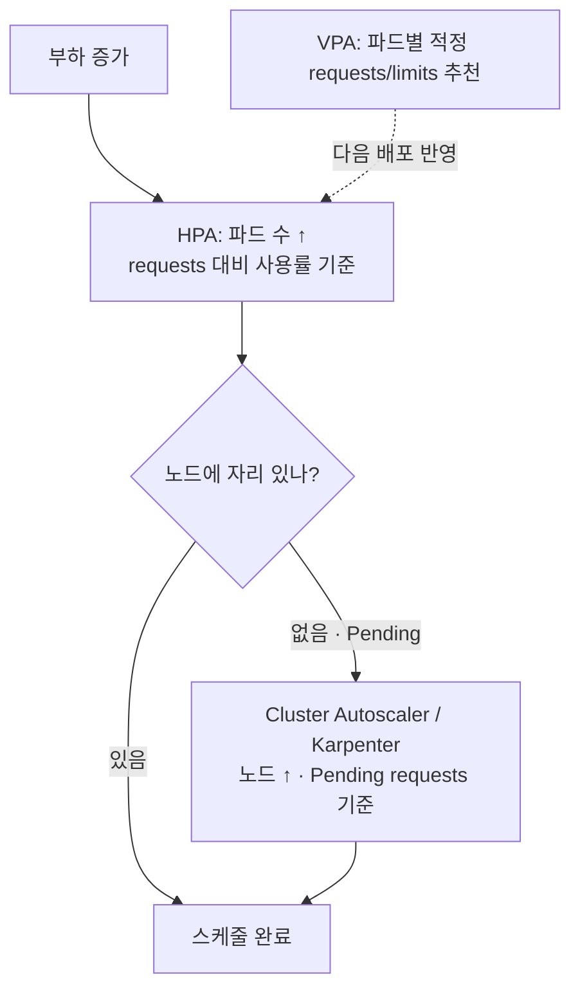

오토스케일링을 켰는데도 트래픽이 몰리면 파드가 죽거나, 한가한 새벽에도 노드가 잔뜩 떠 있어 비용이 새는 경험, 한 번쯤 해보셨을 겁니다. 대부분의 원인은 오토스케일러 자체가 아니라 그 **아래에 깔린 requests/limits가 부정확**한 데 있습니다.

쿠버네티스의 오토스케일링은 세 층위(파드 수, 파드 크기, 노드 수)로 나뉘고, 이 셋이 전부 **requests 값을 기준점**으로 삼습니다. 그래서 requests가 실제와 동떨어져 있으면 오토스케일러는 잘못된 기준으로 판단하고, 결과는 낭비 아니면 불안정으로 나타납니다.

이 글에서는 requests/limits의 의미를 다시 짚고, HPA·VPA·Cluster Autoscaler가 어떻게 맞물리는지, 그리고 실전에서 어떻게 튜닝하는지를 정리해보려 합니다. [쿠버네티스 멀티테넌시 글](/kubernetes-multitenancy-isolation)에서 다룬 ResourceQuota·LimitRange 이야기의 자연스러운 다음 단계이기도 합니다.

## 먼저: requests와 limits는 다른 일을 합니다

둘을 같은 것으로 뭉뚱그리면 튜닝이 어긋납니다. 역할이 다릅니다.

- **requests** — 스케줄러가 "이 파드를 어느 노드에 올릴지" 정할 때 쓰는 **예약량**입니다. 노드의 남은 requests 합으로 배치를 결정합니다. **오토스케일링의 기준점**이 바로 이 값입니다.
- **limits** — 실행 중 파드가 쓸 수 있는 **상한**입니다. 넘으면 제재가 들어갑니다.

그리고 CPU와 메모리는 제재 방식이 **완전히 다릅니다.**

- **CPU**는 압축 가능(compressible)합니다. limit을 넘으면 죽지 않고 **스로틀링**(throttling)됩니다 — 느려질 뿐입니다.
- **메모리**는 압축 불가(incompressible)합니다. limit을 넘으면 **OOMKilled**로 파드가 죽습니다.

이 차이가 뒤에 나올 튜닝 원칙의 근거가 됩니다.

### QoS 클래스 — requests/limits 조합이 만드는 등급

requests와 limits를 어떻게 주느냐에 따라 파드의 **QoS 등급**이 정해지고, 이 등급이 노드가 자원 압박을 받을 때 **누구를 먼저 쫓아낼지(eviction)** 를 결정합니다.

| QoS | 조건 | 우선순위 |
|---|---|---|
| **Guaranteed** | 모든 컨테이너에 requests=limits | 가장 나중에 축출 |
| **Burstable** | requests < limits (일부만 설정) | 중간 |
| **BestEffort** | requests·limits 둘 다 없음 | 가장 먼저 축출 |

중요한 서비스를 BestEffort로 두면, 노드가 메모리 압박을 받는 순간 **가장 먼저 죽습니다.** 최소한 requests는 반드시 주는 게 좋습니다.

```yaml
resources:
  requests:
    cpu: 200m
    memory: 256Mi
  limits:
    cpu: 500m       # CPU는 여유를 둠(버스트 허용)
    memory: 256Mi   # 메모리는 limit=request 권장 (뒤에서 설명)
```

## 1. HPA — 파드 수를 늘리고 줄입니다 (수평)

HorizontalPodAutoscaler(HPA)는 메트릭에 따라 **레플리카 수**를 조절합니다. 가장 흔한 건 CPU 사용률 기반입니다.

```yaml
apiVersion: autoscaling/v2
kind: HorizontalPodAutoscaler
metadata:
  name: orders-api
spec:
  scaleTargetRef:
    apiVersion: apps/v1
    kind: Deployment
    name: orders-api
  minReplicas: 3
  maxReplicas: 20
  metrics:
    - type: Resource
      resource:
        name: cpu
        target:
          type: Utilization
          averageUtilization: 60   # requests 대비 평균 60%를 목표로
  behavior:
    scaleDown:
      stabilizationWindowSeconds: 300   # 축소는 5분 안정화 후 (플래핑 방지)
```

여기서 꼭 짚어야 할 점이 있습니다. **`averageUtilization: 60`은 노드 전체가 아니라 파드의 `requests` 대비 60%라는 뜻입니다.** 즉 CPU requests를 `1000m`으로 잡았으면 600m을 쓸 때 확장이 시작됩니다. requests를 실제보다 너무 크게 잡으면 사용률이 영원히 낮게 나와 **확장이 안 일어나고**, 너무 작게 잡으면 늘 100%로 보여 **불필요하게 계속 확장**됩니다. HPA의 정확도는 requests의 정확도에 직접 묶여 있습니다.

CPU만으로 부족하면 **커스텀·외부 메트릭**(초당 요청 수, 큐 길이 등)으로 확장하는 게 더 정확할 때가 많습니다. 웹 서버라면 CPU보다 "초당 요청 수"가 부하를 더 잘 대변하기 때문입니다. 이런 외부 메트릭을 HPA로 연결하는 걸 가장 쉽게 해주는 도구가 **KEDA**입니다. Kafka 컨슈머 랙, SQS 큐 길이, Prometheus 쿼리 같은 신호를 그대로 확장 기준으로 쓸 수 있고, 무엇보다 **0개까지 축소(scale to zero)** 를 지원합니다. 이벤트가 없을 땐 파드를 0으로 내렸다가 메시지가 들어오면 깨우는 식이라, 간헐적으로 도는 워커에 특히 잘 맞습니다.

확장과 축소의 속도도 `behavior`로 따로 조절할 수 있습니다. 위 예시는 축소에만 5분 안정화를 걸었는데, 트래픽이 급격히 튀는 서비스라면 **확장은 공격적으로(짧은 윈도·큰 보폭), 축소는 보수적으로** 비대칭하게 잡는 게 정석입니다. 확장이 늦으면 그 사이 요청이 밀려 곧장 장애가 되지만, 축소가 조금 늦는 건 약간의 비용일 뿐이기 때문입니다.

## 2. VPA — 파드 크기를 조정합니다 (수직)

VerticalPodAutoscaler(VPA)는 레플리카 수가 아니라 **각 파드의 requests/limits 자체**를 실측 기반으로 추천하거나 자동 조정합니다. requests를 손으로 정하는 게 어려울 때 특히 유용합니다.

```yaml
apiVersion: autoscaling.k8s.io/v1
kind: VerticalPodAutoscaler
metadata:
  name: orders-api
spec:
  targetRef:
    apiVersion: apps/v1
    kind: Deployment
    name: orders-api
  updatePolicy:
    updateMode: "Off"   # 추천만 받고 자동 적용은 안 함
```

실무에서는 `updateMode: "Off"`(추천 모드)로 먼저 쓰는 걸 권합니다. VPA가 산출한 권장 requests를 보고, 사람이 검토해서 매니페스트에 반영하는 방식입니다. 자동 적용(`Auto`)은 파드를 재시작시키기 때문에 신중해야 합니다.

> ⚠️ **HPA와 VPA를 같은 CPU 메트릭으로 동시에 돌리면 충돌합니다.** HPA는 "사용률이 높으니 파드를 늘리자", VPA는 "사용률이 높으니 파드를 키우자"며 같은 신호에 다르게 반응해 서로를 방해합니다. 보통 **HPA는 CPU/요청 수로, VPA는 메모리 추천 용도로** 역할을 나누거나, VPA를 추천 모드로만 씁니다.

## 3. Cluster Autoscaler — 노드 수를 조정합니다

HPA가 파드를 늘렸는데 올릴 노드가 없으면, 그 파드는 `Pending` 상태로 멈춥니다. **Cluster Autoscaler**(또는 Karpenter)는 바로 이때 **노드를 추가**합니다. 그리고 노드가 한가해지면 파드를 다른 노드로 모으고 빈 노드를 줄입니다.

여기서도 기준은 **requests**입니다. Cluster Autoscaler는 "Pending 파드의 requests를 수용할 노드가 있는가"로 판단하지, 실제 사용량을 보지 않습니다. 그래서 requests가 부풀려져 있으면 **실제로는 한가한데도 노드를 계속 늘리는** 낭비가 생깁니다.

최근에는 Karpenter처럼 노드 그룹에 얽매이지 않고 **딱 맞는 인스턴스 타입을 즉석에서 골라 띄우는** 방식도 많이 씁니다. 빈 노드 정리와 적합한 인스턴스 선택이 빨라 비용 효율이 좋습니다.

노드 확장에는 **시간이 걸린다**는 점도 반드시 염두에 둬야 합니다. 새 노드는 프로비저닝부터 이미지 풀, kubelet 등록까지 보통 수십 초에서 분 단위가 걸립니다. 트래픽이 급증하는 바로 그 순간, 이 지연이 그대로 장애로 이어질 수 있습니다. 그래서 흔히 쓰는 기법이 **오버프로비저닝**입니다 — 우선순위가 가장 낮은 "pause 파드"로 노드의 여유 공간을 미리 잡아두는 겁니다. 진짜 워크로드가 확장되면 이 pause 파드가 밀려나며 즉시 자리를 내주고, 동시에 밀려난 pause 파드가 Pending이 되어 노드 추가를 미리 당겨옵니다. 약간의 상시 비용으로 "확장 지연"을 사두는 셈입니다.

## 세 층위가 맞물리는 그림

정리하면 오토스케일링은 이렇게 연결됩니다.



세 가지가 모두 **requests를 진실의 기준으로 삼는다**는 점이 핵심입니다. 그래서 오토스케일링 튜닝의 8할은 "requests를 실제에 맞게 잡는 일"입니다.

## 실전 튜닝 원칙

### requests는 실측(p95~p99) 기반으로

추측으로 잡지 말고, 실제 부하에서의 사용량 분포를 보고 정하는 게 좋습니다. 평균이 아니라 **p95~p99**를 기준으로 잡아야 피크에서 스로틀링·축출을 피할 수 있습니다. VPA 추천값이나 메트릭 서버 데이터가 좋은 출발점입니다.

### 메모리는 limit = request 로

메모리는 압축 불가라 limit을 넘으면 바로 OOMKilled입니다. requests보다 limit을 크게 잡으면 "평소엔 괜찮은데 가끔 죽는" 재현 어려운 장애가 생깁니다. **메모리는 requests=limits로 맞춰 Guaranteed에 가깝게** 두는 편이 예측 가능성이 높습니다.

### CPU limit은 신중하게 — 빼는 것도 선택지

CPU limit을 빡빡하게 걸면, 여유 CPU가 남아도는 상황에서도 파드가 **스로틀링되어** 응답이 느려집니다. 그래서 "CPU는 requests만 정확히 잡고 limit은 설정하지 않는다"는 운영 방식도 널리 쓰입니다. 다만 limit이 없으면 한 파드가 노드 CPU를 과도하게 점유할 수 있으니, 멀티테넌트 환경이라면 [LimitRange](/kubernetes-multitenancy-isolation)로 안전망을 두는 게 좋습니다. 정답은 환경에 따라 다르고, **이건 한 번쯤 의식적으로 결정할 문제**입니다.

### PodDisruptionBudget으로 축소 중 가용성 지키기

오토스케일러가 노드를 줄이거나 파드를 옮길 때, 한꺼번에 너무 많은 파드가 내려가면 순간적으로 서비스가 비는 수 있습니다. **PodDisruptionBudget(PDB)** 으로 "최소 몇 개는 항상 살아 있어야 한다"를 선언해두면 안전합니다.

```yaml
apiVersion: policy/v1
kind: PodDisruptionBudget
metadata:
  name: orders-api
spec:
  minAvailable: 2
  selector:
    matchLabels:
      app: orders-api
```

### 확장은 빠르게, 축소는 천천히

확장이 늦으면 장애가 되고, 축소가 급하면 플래핑(늘렸다 줄였다 반복)이 됩니다. HPA의 `behavior`로 **축소에 안정화 윈도(예: 5분)** 를 둬서, 잠깐의 트래픽 출렁임에 노드·파드가 요동치지 않게 하는 게 좋습니다.

## 정리

쿠버네티스 오토스케일링을 한 문장으로 압축하면 이렇습니다. **세 층위(HPA·VPA·Cluster Autoscaler)가 모두 requests를 기준으로 움직이므로, requests를 실제에 맞게 잡는 것이 전부의 출발점입니다.**

- **requests**: 모든 오토스케일링의 기준점. 실측 p95~p99로.
- **HPA**: 파드 수(수평). requests 대비 사용률 기준이라 requests 정확도가 곧 HPA 정확도.
- **VPA**: 파드 크기(수직). 추천 모드로 먼저, HPA와 같은 메트릭 충돌 주의.
- **Cluster Autoscaler / Karpenter**: 노드 수. Pending 파드의 requests로 판단.
- 메모리는 **limit=request**, CPU limit은 **의식적으로 결정**, 가용성은 **PDB**로.

오토스케일링은 "켜면 알아서 되는" 기능이 아니라, **정확한 requests라는 토대 위에서만 제대로 동작하는** 시스템입니다. 그 토대를 다지는 순간 비용과 안정성이 함께 좋아집니다.
