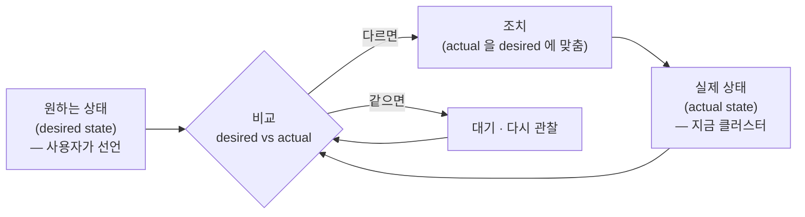
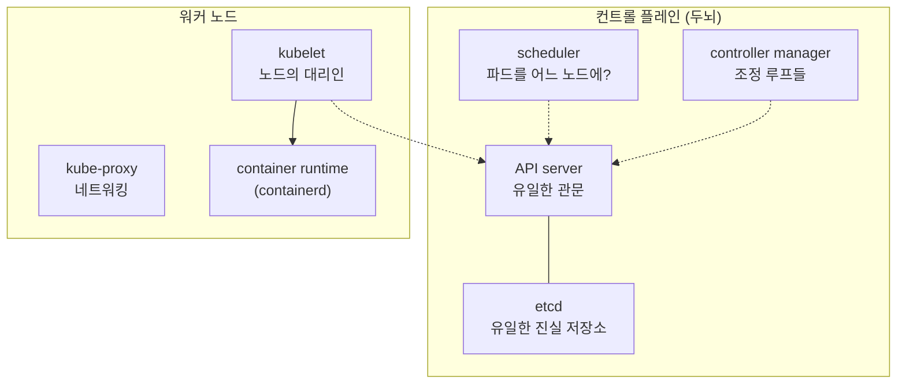
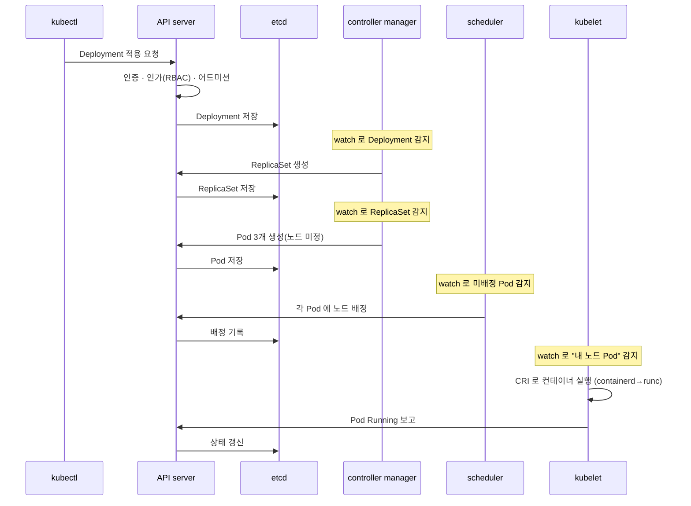

이 블로그에서 [분산 합의와 Raft](/distributed-consensus-and-raft)로 etcd 밑바닥을, [컨테이너 내부 원리](/how-containers-work)로 파드 밑바닥을 팠습니다. 그 사이에 남은 층 — **쿠버네티스 자체** — 를 이제 엽니다. `kubectl apply -f deploy.yaml` 한 줄을 쳤을 때, 그 뒤에서 여러 컴포넌트가 어떻게 협력해 파드를 띄우는지, 그 흐름을 end-to-end로 따라가 보겠습니다.

쿠버네티스는 처음 보면 컴포넌트가 많고 복잡해 보이지만, 그 밑에는 놀랍도록 일관된 **하나의 철학**이 흐릅니다. 그 철학을 먼저 이해하면, 흩어진 컴포넌트들이 왜 그렇게 생겼는지가 한 번에 꿰집니다.

## 1. 핵심 철학 — 선언적 API와 조정 루프

쿠버네티스의 모든 것은 두 가지 아이디어 위에 서 있습니다. **선언적 API** 와 **조정 루프(reconciliation loop)** 입니다.

**선언적(declarative)** 이란, 우리가 "무엇을 하라(how)"가 아니라 **"어떤 상태이길 원하는가(what)"** 를 선언한다는 뜻입니다. "파드를 만들어라, 죽으면 다시 만들어라, 3개를 유지해라"라고 절차를 일일이 명령하는 게 아니라, 그저 **"이 앱의 복제본은 3개다"** 라고 원하는 상태(desired state)를 선언합니다. 그러면 쿠버네티스가 알아서 그 상태로 만들고, 유지합니다.

이걸 실현하는 메커니즘이 **조정 루프** 입니다. 쿠버네티스의 컴포넌트들은 대부분 같은 패턴을 무한히 반복합니다.

"원하는 상태와 실제 상태를 끊임없이 비교하고, 다르면 실제를 원하는 쪽으로 밀어붙인다." 이 단순한 루프가 쿠버네티스의 심장입니다. 파드가 죽으면 실제 복제본이 2개가 되고, 루프가 "원하는 건 3개인데 실제는 2개"임을 감지해 하나를 더 띄웁니다. 노드가 통째로 죽어도 마찬가지입니다. 아무도 "파드를 다시 만들어라"라고 명령하지 않았는데도, 루프가 스스로 수렴시킵니다. 이것이 쿠버네티스의 **자가 치유(self-healing)** 의 정체입니다.

눈치채셨겠지만, 이건 [GitOps 글](/gitops-with-argocd)에서 ArgoCD가 하던 일과 정확히 같은 원리입니다. ArgoCD는 이 조정 루프를 **클러스터 밖(Git)까지 확장**한 것뿐입니다. 쿠버네티스 자체가 이미 조정 루프로 만들어졌기에, 그 위에 같은 패턴을 한 겹 더 얹는 게 자연스러웠던 겁니다.

## 2. 아키텍처 지도 — 컨트롤 플레인과 노드

이제 컴포넌트를 봅시다. 쿠버네티스는 크게 **컨트롤 플레인(control plane)** 과 **워커 노드(worker node)** 로 나뉩니다. 컨트롤 플레인은 "무엇을 원하는지 관리하는 두뇌"이고, 노드는 "실제로 컨테이너를 돌리는 손발"입니다.

핵심 컴포넌트를 한 줄씩 요약하면 이렇습니다.

- **etcd** — 클러스터의 **모든 상태**를 저장하는 유일한 진실. (Raft 기반 분산 키-값 저장소)
- **API server** — 모든 요청이 통과하는 **유일한 관문**. etcd와 대화할 수 있는 유일한 컴포넌트.
- **scheduler** — 새 파드를 **어느 노드에** 놓을지 결정.
- **controller manager** — 여러 **조정 루프**의 집합. 상태를 원하는 대로 수렴시킴.
- **kubelet** — 각 노드에서 자기에게 할당된 파드를 **실제로 실행**하는 대리인.
- **kube-proxy** — Service 추상화를 위한 **네트워킹**을 담당.

이제 결정적으로 중요한 관찰 하나를 해두겠습니다. **이 컴포넌트들은 서로 직접 명령하지 않습니다.** scheduler가 kubelet에게 "이 파드 띄워"라고 직접 전화하지 않습니다. 모두가 오직 **API server를 통해 etcd의 상태를 읽고 쓰며, 그 상태 변화에 반응**할 뿐입니다. 이 느슨한 결합이 쿠버네티스 설계의 핵심인데, 각 컴포넌트를 하나씩 보면 그 의미가 드러납니다.

## 3. etcd — 유일한 진실

가장 밑바닥에 [etcd](/distributed-consensus-and-raft)가 있습니다. 쿠버네티스의 **모든 상태** — 파드, 서비스, 시크릿, ConfigMap, 배포 스펙, 노드 정보 전부 — 가 여기 저장됩니다. 클러스터에서 "지금 어떤 상태인가"에 대한 답은 언제나 etcd입니다.

etcd가 Raft 기반이라는 사실이 여기서 중요해집니다. Raft 글에서 봤듯, etcd는 과반 합의로 상태를 저장하기에 일부 노드가 죽어도 데이터를 잃지 않고, 대신 분단 시 소수파는 멈춥니다(CP). 그래서 쿠버네티스 컨트롤 플레인의 가용성·일관성은 근본적으로 etcd의 Raft에 뿌리를 둡니다. etcd 클러스터를 3대·5대 홀수로 구성하라는 조언, etcd가 느려지면 컨트롤 플레인 전체가 느려지는 현상 — 전부 Raft 글에서 이미 그 이유를 봤습니다.

여기서 설계 원칙 하나. **오직 API server만 etcd와 직접 대화합니다.** 스케줄러도, 컨트롤러도, kubelet도 etcd를 직접 건드리지 않습니다. 모두 API server를 거칩니다. 이 단일 관문 구조가 다음 컴포넌트의 존재 이유입니다.

## 4. API server — 유일한 관문

**API server** 는 쿠버네티스의 **정문이자 유일한 관문** 입니다. `kubectl`도, 컨트롤러도, kubelet도, 심지어 다른 컨트롤 플레인 컴포넌트도 — 무언가를 읽거나 쓰려면 반드시 API server를 통합니다. 그래서 API server가 하는 일이 곧 쿠버네티스의 보안·정합성의 관문입니다. 요청 하나가 들어오면 API server는 여러 단계를 거칩니다.

1. **인증(Authentication)** — 누구인가. 인증서, 토큰, OIDC 등으로 신원을 확인합니다.
2. **인가(Authorization)** — 이걸 할 권한이 있는가. 주로 [RBAC](/kubernetes-multitenancy-isolation)로, "이 사용자가 이 네임스페이스의 이 리소스에 이 동작을 할 수 있는가"를 판단합니다. 멀티테넌시 글에서 다룬 RBAC가 바로 여기서 작동합니다.
3. **어드미션 제어(Admission Control)** — 통과시키기 전에 손보거나 막습니다. 여기가 특히 강력합니다.
   - **뮤테이팅(mutating)** 어드미션은 요청을 **수정**합니다. 예: 사이드카를 자동 주입하거나 기본값을 채웁니다.
   - **밸리데이팅(validating)** 어드미션은 요청을 **검증하고 거부**합니다. [멀티테넌시 글](/kubernetes-multitenancy-isolation)에서 본 Kyverno·OPA Gatekeeper가 여기 끼어들어 "필수 라벨 없으면 거부", "public 버킷 금지" 같은 정책을 강제합니다.
4. **검증·저장** — 최종적으로 스키마를 검증하고 etcd에 씁니다.

API server의 또 하나 결정적인 기능이 **watch** 입니다. 다른 컴포넌트들은 API server에게 "이 리소스에 변화가 생기면 알려줘"라고 **구독**해둡니다. 그러면 etcd에 변화가 생길 때마다 API server가 구독자들에게 이벤트를 밀어줍니다. 폴링으로 계속 물어보는 게 아니라, 변화가 있을 때 알림을 받는 구조죠. 이 watch 메커니즘이 **모든 조정 루프가 돌아가는 동력**입니다. 컨트롤러와 kubelet은 이 watch로 "원하는 상태가 바뀌었다"를 즉시 알아채고 반응합니다.

정리하면 API server는 단순한 REST 서버가 아니라, **인증·인가·정책·검증의 관문이자, 상태 변화를 전파하는 이벤트 허브**입니다. 모든 것이 여기를 통하기에, 나머지 컴포넌트들은 서로를 몰라도 됩니다.

## 5. 스케줄러 — 파드를 어느 노드에

새 파드가 생기면(정확히는 "노드가 아직 안 정해진 파드"가 etcd에 생기면), **스케줄러** 가 나섭니다. 스케줄러의 일은 딱 하나입니다. **이 파드를 어느 노드에 놓을지 결정하는 것.** 흥미롭게도, 스케줄러는 파드를 직접 띄우지 않습니다. 그저 "이 파드는 노드 X에 놓기로 했다"를 API server를 통해 **etcd에 기록**할 뿐입니다. 실제 실행은 그 노드의 kubelet 몫입니다. 여기서도 "직접 명령하지 않고 상태만 바꾼다"는 원칙이 지켜집니다.

노드 결정은 두 단계입니다.

- **필터링(filtering)** — 이 파드를 **올릴 수 있는** 노드를 걸러냅니다. 자원이 충분한가(파드의 requests를 수용할 수 있는가), taint/toleration이 맞는가, nodeSelector·affinity 조건을 만족하는가 등을 봅니다. [멀티테넌시 글](/kubernetes-multitenancy-isolation)의 taint·전용 노드풀, [오토스케일링 글](/kubernetes-autoscaling-resource-tuning)의 requests가 전부 이 필터링에서 작동합니다.
- **스코어링(scoring)** — 통과한 노드들 중 **가장 좋은** 노드를 점수로 고릅니다. 자원이 골고루 분산되도록, 또는 반대로 촘촘히 채워지도록(bin packing) 같은 전략에 따라 점수를 매깁니다.

여기서 [오토스케일링 글](/kubernetes-autoscaling-resource-tuning)·[FinOps 글](/cloud-cost-finops)의 이야기가 다시 만납니다. 스케줄러는 **실제 사용량이 아니라 requests** 로 자원을 판단합니다. requests가 부풀려져 있으면 스케줄러는 노드가 꽉 찼다고 여겨 파드를 Pending으로 두고, 그러면 노드가 늘어납니다. requests 정확도가 스케줄링과 비용을 좌우한다는 그 이야기의 뿌리가 바로 이 스케줄러의 동작입니다.

## 6. 컨트롤러 매니저 — 조정 루프들의 집

**컨트롤러 매니저** 는 이름 그대로 수많은 **컨트롤러(controller)** 를 담고 있고, 각 컨트롤러는 1장에서 본 조정 루프 하나씩입니다. 각자 특정 리소스를 watch하며 "원하는 상태 vs 실제 상태"를 좁힙니다.

가장 대표적인 예로 Deployment를 만들면 어떤 일이 벌어지는지 봅시다. 여기엔 여러 컨트롤러가 계단식으로 얽힙니다.

- **Deployment 컨트롤러** — Deployment를 watch하다가, 그에 맞는 **ReplicaSet** 을 만듭니다. (롤링 업데이트 시 새 ReplicaSet을 만들고 옛것을 줄이는 것도 이 컨트롤러의 일)
- **ReplicaSet 컨트롤러** — ReplicaSet을 watch하다가, "복제본 3개"라는 원하는 상태를 위해 실제 파드 수를 세고, 모자라면 **Pod** 를 만들고 남으면 지웁니다.
- 그렇게 만들어진 Pod(노드 미정 상태)를 이제 **스케줄러**가 집어 노드를 배정합니다(5장).

각 단계에서 컨트롤러는 서로를 직접 호출하지 않습니다. Deployment 컨트롤러는 ReplicaSet을 **만들어 etcd에 기록**할 뿐이고, ReplicaSet 컨트롤러는 그 변화를 **watch로 감지**해 반응합니다. 컴포넌트들이 오직 상태를 통해 간접적으로 협력하는 이 구조가, 각 컨트롤러를 독립적이고 단순하게 유지시킵니다. 하나가 잠깐 죽었다 살아나도, watch를 다시 걸고 현재 상태를 조정하면 그만입니다.

## 7. kubelet — 노드의 대리인

지금까지는 컨트롤 플레인, 즉 "무엇을 원하는지"를 정하는 두뇌였습니다. 이제 실제로 컨테이너를 띄우는 손, **kubelet** 입니다. kubelet은 각 워커 노드에서 도는 에이전트로, API server를 watch하며 **"나에게 할당된 파드"** 를 찾습니다(스케줄러가 노드를 배정해둔 그 파드들).

자기 파드를 발견하면, kubelet은 이제 [컨테이너 글](/how-containers-work)의 세계로 내려갑니다. **CRI(Container Runtime Interface)** 를 통해 containerd 같은 런타임에게 "이 이미지로, 이 설정으로 컨테이너를 만들어라"라고 지시합니다. 그러면 containerd가 runc를 부르고, runc가 namespace·cgroup을 만들어 실제 컨테이너를 창조합니다. 컨테이너 글에서 본 `docker → containerd → runc → 커널` 사슬의 맨 위에, 쿠버네티스에서는 kubelet이 있는 셈입니다.

kubelet의 일은 띄우고 끝이 아닙니다. 계속해서 **파드의 실제 상태를 API server에 보고**하고(그래서 우리가 파드 상태를 볼 수 있습니다), **헬스 체크(probe)** 를 돌립니다.

- **liveness probe** — 실패하면 컨테이너가 죽었다고 보고 재시작합니다.
- **readiness probe** — 실패하면 아직 트래픽 받을 준비가 안 됐다고 보고 서비스에서 제외합니다.

이 보고 덕분에 조정 루프가 완성됩니다. kubelet이 "이 파드가 죽었다"를 API server에 보고하면 → 실제 상태가 바뀌고 → ReplicaSet 컨트롤러가 watch로 그걸 보고 → "복제본이 모자라다"며 새 파드를 만들고 → 스케줄러가 노드를 배정하고 → 다른 kubelet이 그걸 실행합니다. 두뇌와 손발이 오직 상태를 통해 맞물려 도는, 자가 치유의 전체 회로가 여기서 닫힙니다.

## 8. kube-proxy와 서비스 네트워킹

마지막 조각은 네트워킹입니다. 파드는 언제든 죽고 새로 뜨며 IP가 바뀝니다. 그런데 다른 서비스가 매번 바뀌는 파드 IP를 쫓아다닐 순 없습니다. 그래서 **Service** 라는 안정적인 가상 주소(ClusterIP)를 두고, 그 뒤의 실제 파드들로 트래픽을 분배합니다.

이걸 각 노드에서 실현하는 게 **kube-proxy** 입니다. kube-proxy는 Service와 그 뒤 파드(엔드포인트) 정보를 watch하며, 노드의 트래픽 규칙을 갱신합니다. 전통적으로는 iptables 규칙으로, 규모가 커지면 IPVS로, 최근에는 [멀티테넌시 글](/kubernetes-multitenancy-isolation)에서 언급한 Cilium 같은 **eBPF** 기반으로 이 라우팅을 처리합니다. "Service의 ClusterIP로 온 트래픽을 살아있는 파드 중 하나로 보내는" 그 마법의 실체가 이 규칙들입니다. (쿠버네티스 네트워킹은 그 자체로 한 편이 필요한 깊은 주제라, 여기서는 지도만 그려둡니다.)

## 9. 종합 — kubectl apply의 end-to-end 여정

이제 조각을 모아, 맨 처음 질문으로 돌아갑니다. `kubectl apply -f deploy.yaml`(복제본 3개짜리 Deployment)을 쳤을 때 무슨 일이 벌어질까요?

한 줄로 요약하면 이렇습니다. **kubectl이 API server를 통해 "원하는 상태"를 etcd에 기록하면, 그다음부터는 아무도 명령하지 않아도 각 컴포넌트가 watch로 변화를 감지하고, 자기 몫의 조정을 하며, 그 결과를 다시 상태로 남기는 연쇄가 자동으로 흐릅니다.**

여기서 다시 강조할 것은, **이 흐름에 "명령"이 없다**는 점입니다. kubectl은 kubelet에게 파드를 띄우라고 명령하지 않았습니다. 그저 원하는 상태를 선언했을 뿐이고, 나머지는 전부 "상태를 보고 반응하는" 조정 루프의 연쇄입니다. 그래서 중간에 어떤 컴포넌트가 잠깐 멈췄다 살아나도, 어떤 파드가 죽어도, 시스템은 현재 상태를 다시 보고 원하는 상태로 수렴할 뿐입니다.

## 10. 왜 이 설계인가 — 느슨한 결합과 레벨 트리거

이 아키텍처가 왜 이렇게 생겼는지, 그 이점을 정리하면 쿠버네티스의 강점이 보입니다.

- **느슨한 결합(loose coupling)** — 컴포넌트들이 서로를 직접 호출하지 않고 오직 API server의 상태를 통해 간접 협력합니다. 그래서 각 컴포넌트를 독립적으로 개발·교체·재시작할 수 있고, 하나가 죽어도 나머지가 무너지지 않습니다.
- **자가 치유** — 조정 루프가 끊임없이 desired와 actual을 맞추므로, 사람이 개입하지 않아도 시스템이 스스로 원하는 상태를 회복합니다.
- **레벨 트리거(level-triggered)** — 이게 미묘하지만 중요합니다. 쿠버네티스의 컨트롤러는 "이벤트가 왔을 때만 반응(edge-triggered)"하는 게 아니라, "현재 상태(level)를 보고 원하는 상태와 맞추는" 방식입니다. 그래서 **이벤트를 놓쳐도 괜찮습니다.** watch 알림이 유실되거나 컨트롤러가 잠깐 죽어서 몇몇 변화를 놓쳐도, 다시 깨어나 현재 상태를 보고 조정하면 됩니다. 이 "상태 기반"이 시스템을 매우 견고하게 만듭니다. 에지 트리거였다면 놓친 이벤트 하나가 영구적 불일치로 남았을 텐데, 레벨 트리거는 그냥 다음 조정에서 회복합니다.

이 세 가지가 맞물려, 쿠버네티스는 "믿을 수 없는 부품들(언제든 죽는 노드·파드·컴포넌트)로 믿을 수 있는 전체를 만드는" 시스템이 됩니다. Raft 글의 마지막 문장과 똑같은 정신이, 컨트롤 플레인 층에서도 흐르고 있는 셈입니다.

## 11. 확장 — CRD와 오퍼레이터 패턴

이 설계의 가장 우아한 결과가 **확장성** 입니다. 지금까지 본 Deployment·ReplicaSet·Pod는 쿠버네티스가 기본 제공하는 리소스입니다. 그런데 쿠버네티스는 **API 자체를 확장**할 수 있게 열어뒀습니다.

- **CRD(Custom Resource Definition)** — 나만의 새 리소스 종류를 정의합니다. 예를 들어 `Database`, `KafkaCluster`, `Certificate` 같은 리소스를 쿠버네티스 API에 추가할 수 있습니다. 그러면 이 커스텀 리소스도 기본 리소스처럼 `kubectl apply`로 다루고 etcd에 저장됩니다.
- **커스텀 컨트롤러(오퍼레이터)** — 그 커스텀 리소스를 watch하며 조정 루프를 도는 컨트롤러를 직접 만듭니다. 이 조합 — 커스텀 리소스 + 커스텀 컨트롤러 — 을 **오퍼레이터(operator) 패턴** 이라 부릅니다.

오퍼레이터의 위력은, **운영 지식을 코드로 담은 조정 루프**를 만들 수 있다는 데 있습니다. "`Database` 리소스가 생기면 스테이트풀셋·서비스·백업 크론을 만들고, 장애가 나면 페일오버하고, 스펙이 바뀌면 롤링 업데이트한다" 같은 운영 절차를, 사람이 아니라 컨트롤러가 조정 루프로 수행합니다. 우리가 앞에서 본 [ArgoCD](/gitops-with-argocd)도, cert-manager도, 수많은 데이터베이스 오퍼레이터도 전부 이 패턴입니다.

여기서 지금까지의 모든 이야기가 하나로 모입니다. 쿠버네티스가 "선언적 API + 조정 루프"라는 단순하고 일관된 뼈대로 만들어졌기 때문에, **그 뼈대를 그대로 빌려 무엇이든 확장할 수 있습니다.** 쿠버네티스는 컨테이너 오케스트레이터를 넘어, "원하는 상태를 선언하면 그리로 수렴시키는 범용 조정 플랫폼"이 된 것입니다.

## 12. 정리

쿠버네티스 내부를 밑바닥까지 열어본 결과를 한 줄기로 꿰면 이렇습니다.

- 쿠버네티스의 심장은 **선언적 API와 조정 루프** 입니다 — 원하는 상태를 선언하면, 시스템이 실제 상태를 끊임없이 그리로 수렴시킵니다.
- **etcd** 가 유일한 진실을 담고([Raft](/distributed-consensus-and-raft) 기반), **API server** 가 유일한 관문으로 인증·인가·어드미션·watch를 담당합니다.
- **scheduler** 는 requests 기반으로 파드의 노드를 정하고, **controller manager** 의 조정 루프들이 Deployment→ReplicaSet→Pod를 계단식으로 수렴시키며, **kubelet** 이 [CRI로 컨테이너를 실제로 띄웁니다](/how-containers-work).
- 이 모든 컴포넌트는 **서로 명령하지 않고 오직 상태를 통해 협력**합니다. 그 느슨한 결합과 **레벨 트리거**가 자가 치유와 견고함의 근원입니다.
- 같은 뼈대를 확장하는 **CRD·오퍼레이터 패턴** 덕에, 쿠버네티스는 범용 조정 플랫폼이 됐습니다.

[Raft](/distributed-consensus-and-raft)로 etcd의 밑을, [컨테이너](/how-containers-work)로 파드의 밑을, 그리고 이 글로 그 사이 쿠버네티스 자체를 봤습니다. 이 세 층을 관통하는 정신은 놀랍도록 같습니다 — **믿을 수 없는 부품들 위에, 상태에 대한 합의와 끊임없는 조정으로, 믿을 수 있는 전체를 쌓아 올리는 것.** 매일 쓰는 `kubectl apply` 한 줄 뒤에 이 우아한 기계가 돌고 있다는 걸 알고 나면, 쿠버네티스가 왜 그렇게 설계됐는지가 비로소 손에 잡힙니다.
