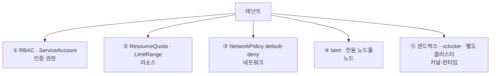

"테넌트를 어떻게 격리하나요?"라는 질문에 "네임스페이스로 나눕니다"라고 답한다면, 절반은 맞고 절반은 아쉽습니다. 네임스페이스는 멀티테넌시의 **시작점**이지 **해답**은 아니기 때문입니다.

멀티테넌시 설계가 까다로운 이유는 "격리한다/안 한다"의 이분법이 아니라 **스펙트럼**이라는 데 있습니다. 한쪽 끝엔 모든 테넌트가 파드 하나까지 공유하는 완전 공유가 있고, 반대쪽 끝엔 테넌트마다 별도 클러스터가 있습니다. 그 사이 어디에 점을 찍을지는 기술이 아니라 **위협 모델**이 정합니다. 사내 팀끼리 나누는 것과, 서로를 신뢰할 수 없는 외부 고객을 한 클러스터에 태우는 것은 완전히 다른 문제입니다.

이 글에서는 네임스페이스가 실제로 격리해주는 것과 **격리해주지 않는 것**을 다섯 개 축으로 나눠 살펴보고, 위협 모델에 맞는 격리 수준을 고르는 법, 그리고 테넌트 라이프사이클을 자동화하는 법까지 정리해보려 합니다.

## 먼저: soft vs hard 멀티테넌시

용어부터 맞춰보겠습니다. 격리 수준은 크게 둘로 갈립니다.

- **Soft multi-tenancy**: 테넌트가 서로 *악의적이지 않다*고 가정합니다. 사내 팀, 환경(dev/staging), 신뢰할 수 있는 파트너가 여기 해당합니다. 실수로 인한 간섭을 막는 게 목표입니다.
- **Hard multi-tenancy**: 테넌트가 서로 *적대적일 수 있다*고 가정합니다. 서로 모르는 외부 고객이 대표적입니다. 한 테넌트가 다른 테넌트의 데이터에 접근하거나 노드를 장악하는 시나리오까지 막아야 합니다.

기억해두면 좋은 명제가 하나 있습니다. **네임스페이스는 soft multi-tenancy의 도구입니다.** 네임스페이스 경계는 커널을 공유하는 같은 노드 위에서 그어지는 *논리적* 선이지, 보안 경계가 아닙니다. hard multi-tenancy를 네임스페이스만으로 달성하려고 하면 거의 항상 어딘가에서 새기 마련입니다.

## 격리의 다섯 축

네임스페이스로 나눴다고 끝이 아닙니다. 진짜 격리는 아래 다섯 축을 각각 채워야 완성됩니다.

| 축 | 도구 | 네임스페이스 기본 제공? |
|---|---|---|
| 인증·권한 | RBAC, ServiceAccount | ❌ (직접 걸어야 함) |
| 리소스 | ResourceQuota, LimitRange | ❌ |
| 네트워크 | NetworkPolicy | ❌ (기본은 all-allow) |
| 노드/스케줄링 | taint·toleration, node pool | ❌ |
| 커널·런타임 | gVisor, Kata, vcluster, 별도 클러스터 | ❌ (공유 커널) |

네임스페이스가 기본으로 주는 건 **이름 충돌 방지와 오브젝트 그룹화**뿐입니다. 나머지는 전부 명시적으로 채워야 합니다. 한 테넌트를 둘러싼 다섯 축을 그림으로 보면 이렇습니다.



하나씩 보겠습니다.

### 1. 인증·권한 — RBAC와 ServiceAccount

테넌트 A의 사용자가 테넌트 B의 네임스페이스를 못 보게 하는 건 RBAC의 일입니다. `Role`(네임스페이스 범위)과 `RoleBinding`으로 권한을 그 네임스페이스 안에 가둡니다.

```yaml
apiVersion: rbac.authorization.k8s.io/v1
kind: RoleBinding
metadata:
  name: tenant-a-admin
  namespace: tenant-a
subjects:
  - kind: Group
    name: tenant-a-team        # OIDC 그룹 클레임과 매핑
    apiGroup: rbac.authorization.k8s.io
roleRef:
  kind: ClusterRole
  name: admin                  # 내장 admin 롤을 네임스페이스에 한정
  apiGroup: rbac.authorization.k8s.io
```

여기서 한 가지 조심할 점이 있습니다. 편하다고 `ClusterRoleBinding`을 쓰면 권한이 **클러스터 전역**에 부여됩니다. 테넌트별 격리에는 **네임스페이스 범위의 `RoleBinding`** 을 쓰는 게 맞습니다. 그리고 워크로드가 쓰는 ServiceAccount도 테넌트별로 분리해두면, 파드가 탈취되더라도 권한이 그 네임스페이스를 넘지 못합니다.

권한을 건 다음에는 **실제로 막혔는지 검증**하는 습관이 중요합니다. `kubectl auth can-i`에 `--as` 옵션을 주면 특정 사용자가 무엇을 할 수 있는지 시뮬레이션할 수 있습니다.

```bash
# 테넌트 A 사용자가 테넌트 B 의 시크릿을 볼 수 있는지 확인
kubectl auth can-i get secrets -n tenant-b --as=tenant-a-user
# → no 가 나와야 정상입니다
```

그리고 RBAC는 "한 번 잘 짜두면 끝"이 아닙니다. 시간이 지나며 "이번만 편하게"라는 이유로 권한이 슬금슬금 넓어지는 *RBAC 드리프트*가 생기기 쉽습니다. 주기적으로 `ClusterRoleBinding` 목록을 점검해 의도치 않게 전역 권한이 붙은 주체가 없는지 살펴보는 게 좋습니다. 격리는 만드는 것보다 **유지하는 것**이 더 어렵습니다.

### 2. 리소스 — noisy neighbor 막기

격리되지 않은 가장 흔한 사고는 보안이 아니라 **자원** 쪽입니다. 테넌트 하나가 메모리를 폭주시키면 같은 노드의 다른 테넌트 파드가 OOM으로 죽을 수 있습니다. 이게 noisy neighbor 문제입니다.

두 가지를 함께 걸어두면 좋습니다. `ResourceQuota`는 네임스페이스 *총량*의 상한이고, `LimitRange`는 개별 파드의 기본값·상한입니다.

```yaml
apiVersion: v1
kind: ResourceQuota
metadata:
  name: tenant-a-quota
  namespace: tenant-a
spec:
  hard:
    requests.cpu: "20"
    requests.memory: 40Gi
    limits.cpu: "40"
    limits.memory: 80Gi
    pods: "100"
---
apiVersion: v1
kind: LimitRange
metadata:
  name: tenant-a-limits
  namespace: tenant-a
spec:
  limits:
    - type: Container
      default:              # limit 미지정 시 자동 적용
        cpu: 500m
        memory: 512Mi
      defaultRequest:
        cpu: 100m
        memory: 128Mi
      max:
        cpu: "4"
        memory: 8Gi
```

`LimitRange`가 없으면 request를 안 적은 파드가 노드를 통째로 점유할 수 있습니다. ResourceQuota만 걸고 LimitRange를 빠뜨리는 게 의외로 자주 생기는 구멍입니다.

여기엔 더 중요한 부작용이 하나 숨어 있습니다. **CPU/메모리 쿼터를 건 네임스페이스에서는, 모든 파드가 반드시 requests와 limits를 명시해야** 합니다 — 안 그러면 파드 생성 자체가 거부됩니다. 그래서 어느 날 갑자기 ResourceQuota만 추가하면, requests를 안 적던 기존 워크로드들이 줄줄이 배포에 실패하는 사고가 납니다. LimitRange가 기본값을 채워주는 역할을 하기 때문에 둘은 거의 항상 짝으로 가야 합니다. 참고로 GPU 같은 확장 리소스도 `requests.nvidia.com/gpu` 형태로 같은 방식의 테넌트별 상한을 둘 수 있습니다.

### 3. 네트워크 — 기본이 all-allow라는 함정

이 부분이 가장 많이 놓치는 지점입니다. **쿠버네티스의 기본 네트워크 정책은 "모두 허용"입니다.** 즉 NetworkPolicy를 하나도 안 걸면, 테넌트 A의 파드가 테넌트 B의 파드 IP로 직접 통신할 수 있습니다. 네임스페이스로 나눠도 네트워크는 평평하게 뚫려 있는 셈입니다.

그래서 **테넌트마다 default-deny를 깔고, 필요한 통신만 명시적으로 여는 방식**을 권합니다.

```yaml
# 1) 이 네임스페이스로 들어오는 모든 인그레스를 기본 차단
apiVersion: networking.k8s.io/v1
kind: NetworkPolicy
metadata:
  name: default-deny-ingress
  namespace: tenant-a
spec:
  podSelector: {}            # 네임스페이스의 모든 파드
  policyTypes: [Ingress]
---
# 2) 같은 테넌트 내부 통신만 허용
apiVersion: networking.k8s.io/v1
kind: NetworkPolicy
metadata:
  name: allow-same-namespace
  namespace: tenant-a
spec:
  podSelector: {}
  policyTypes: [Ingress]
  ingress:
    - from:
        - namespaceSelector:
            matchLabels:
              tenant: tenant-a   # 네임스페이스에 tenant 라벨이 있다고 가정
```

인그레스(들어오는 트래픽)만 막고 끝내기 쉬운데, **이그레스(나가는 트래픽)도 함께** 봐야 합니다. default-deny를 이그레스까지 걸면 한 테넌트의 파드가 다른 테넌트나 외부로 임의로 연결하는 것을 막을 수 있습니다. 다만 이그레스를 막을 때 거의 모두가 한 번씩 빠지는 함정이 **DNS**입니다. `kube-system`의 CoreDNS(UDP/TCP 53번)로 가는 길을 명시적으로 열어주지 않으면, 파드가 이름 해석을 못 해 "연결이 안 되는데 원인을 모르겠는" 상황에 빠집니다. 모니터링·로깅 수집기나 공용 데이터베이스처럼 공유 서비스로 가는 길도 마찬가지로 따로 허용해줘야 합니다.

또 한 가지 주의할 점은, NetworkPolicy가 **CNI의 지원에 의존**한다는 것입니다. Calico·Cilium 등은 강제해주지만, 일부 환경의 기본 CNI는 NetworkPolicy 오브젝트를 만들어도 무시합니다. "정책을 만들었으니 막혔겠지"가 가장 위험한 가정입니다. 다른 네임스페이스의 파드에서 실제로 차단되는지 `kubectl exec`로 직접 연결을 시도해보며 확인하는 게 좋습니다.

### 4. 노드·스케줄링 — 물리적으로 떼어놓기

리소스 쿼터는 "총량"은 막아줘도 "같은 노드에 섞이는 것"까지 막진 못합니다. 민감한 테넌트를 다른 테넌트와 물리적으로 다른 노드에 격리하려면 taint와 toleration을 씁니다.

```yaml
# 노드에 taint: 이 toleration 이 없는 파드는 여기 못 옴
# kubectl taint nodes pool-tenant-a dedicated=tenant-a:NoSchedule

# 테넌트 A 파드만 그 노드에 스케줄
spec:
  tolerations:
    - key: dedicated
      operator: Equal
      value: tenant-a
      effect: NoSchedule
  nodeSelector:
    pool: tenant-a
```

전용 노드풀은 가장 확실하지만 **가장 비싼** 격리이기도 합니다. 테넌트마다 노드를 따로 띄우면 그만큼의 여유 용량(빈자리)도 테넌트 수만큼 생기기 때문입니다. 그래서 보통은 "모든 테넌트"가 아니라 "규제 대상이거나 프리미엄인 일부 테넌트"에만 선별적으로 적용합니다. 그리고 분명히 해둘 점이 하나 있습니다. taint로 노드를 나눠도 **같은 노드 안의 파드들은 여전히 커널을 공유**합니다. 노드 격리는 "다른 테넌트와 안 섞이게" 해줄 뿐, 그 자체로 커널 수준의 경계를 만들어주지는 않습니다. 그 경계는 바로 다음 축의 몫입니다.

taint(다른 파드 밀어내기)와 nodeSelector(내 파드 끌어오기)는 **한 쌍으로** 쓰는 게 좋습니다. taint만 걸면 테넌트 A 파드가 *다른* 노드로도 갈 수 있기 때문입니다. 전용 노드풀은 비용이 들긴 하지만, 프리미엄 테넌트나 규제 대상 워크로드를 격리하는 가장 단순하고 확실한 방법입니다.

### 5. 커널·런타임 — 네임스페이스가 끝나는 곳

여기가 핵심입니다. 위 네 축을 완벽히 채워도, **모든 테넌트의 파드는 여전히 같은 리눅스 커널을 공유합니다.** 컨테이너 탈출(container escape) 취약점 하나면 노드 위 모든 테넌트가 노출됩니다. 이 경계는 네임스페이스가 *원리적으로* 넘지 못합니다.

위협 모델이 hard multi-tenancy로 넘어가는 순간, 선택지는 셋 정도입니다.

- **샌드박스 런타임** — gVisor, Kata Containers. 커널을 가상화·격리해 탈출 표면을 줄여줍니다. 약간의 성능 비용으로 커널 경계를 강화하는 방식입니다.
- **가상 컨트롤플레인** — vcluster. 테넌트마다 가상 클러스터를 띄워 API 서버·CRD까지 분리하되, 노드는 공유합니다. 클러스터 수준 격리에 가까운 경험을 더 저렴하게 얻을 수 있습니다.
- **별도 클러스터** — 가장 강한 격리입니다. 비용·운영 부담이 가장 크지만, 규제(금융·의료)나 적대적 테넌트라면 이게 정답일 때가 많습니다.

여기서 한 가지 원칙을 짚고 싶습니다. **격리 수준은 가장 약한 고리가 결정합니다.** RBAC·네트워크·리소스를 아무리 촘촘히 짜도, 커널 경계가 필요한 위협 모델에 네임스페이스만 쓰고 있다면 그 시스템의 실제 격리 수준은 "네임스페이스"에 머뭅니다. 과한 격리는 비용 낭비고, 부족한 격리는 사고로 이어집니다. 위협 모델을 먼저 그려두고 거기에 맞추는 게 순서입니다.

## 테넌트를 제품처럼 — 라이프사이클 자동화

격리 설계를 끝냈다면, 다음 문제는 **반복**입니다. 테넌트 하나를 온보딩할 때마다 네임스페이스·RBAC·쿼터·NetworkPolicy를 손으로 만들면 빠뜨리는 게 생기기 쉽고, 그 빠진 하나가 격리 구멍이 됩니다.

핵심은 **"테넌트"를 하나의 단위로 선언하고, 그 선언으로부터 모든 격리 리소스가 파생되게** 만드는 것입니다. 몇 가지 접근을 소개합니다.

- **GitOps 기반 네임스페이스-as-product** — 테넌트 정의(이름·쿼터·플랜)를 Git에 두고, ArgoCD/Flux가 네임스페이스+RBAC+쿼터+NetworkPolicy를 한 묶음으로 동기화합니다. 온보딩은 PR 하나, 아웃보딩은 디렉터리 삭제 하나로 끝납니다. 감사 로그가 Git 히스토리로 남는 건 덤입니다.
- **정책 엔진 강제** — OPA Gatekeeper / Kyverno로 "모든 테넌트 네임스페이스는 ResourceQuota와 default-deny NetworkPolicy를 *반드시* 가진다"를 admission 단계에서 강제합니다. 자동화가 빠뜨리더라도 클러스터가 거부해줍니다.
- **테넌트 오퍼레이터 / 전용 도구** — Capsule, HNC(Hierarchical Namespaces) 같은 도구는 "Tenant"를 CRD로 만들어, 테넌트 한 줄 선언에서 격리 리소스 전체를 생성·회수합니다.

여기서 자주 간과되는 게 **아웃보딩(off-boarding)** 입니다. 온보딩 자동화는 다들 신경 쓰지만, 테넌트가 떠날 때 네임스페이스·IAM·스토리지·DNS·시크릿이 깔끔히 회수되지 않으면 유령 리소스가 비용과 보안 부채로 남습니다. 온보딩과 아웃보딩은 **같은 선언의 양방향**으로 설계하는 게 좋습니다. 만드는 경로와 지우는 경로가 대칭이어야 빠진 자원 없이 정리됩니다.

## 정리 — 격리 수준은 위협 모델이 정합니다

쿠버네티스 멀티테넌시를 한 문장으로 압축하면 이렇게 말할 수 있습니다. **네임스페이스는 격리의 출발선이고, 진짜 격리는 다섯 축을 각각 채워야 완성되며, 어디까지 채울지는 위협 모델이 정합니다.**

- 네임스페이스는 **이름 충돌 방지**만 줍니다. RBAC·리소스·네트워크·노드·커널은 전부 따로 채워야 합니다.
- 네트워크 기본값은 **all-allow** 입니다. default-deny부터 까는 걸 권합니다.
- 네임스페이스는 **커널을 공유합니다.** 적대적 테넌트라면 샌드박스 런타임·vcluster·별도 클러스터로 올라가야 합니다.
- 테넌트는 **제품처럼** 다루면 좋습니다. 선언 하나에서 격리 리소스가 파생되고, 온보딩과 아웃보딩이 대칭이 되도록 말입니다.

격리는 많을수록 좋은 게 아니라 **위협에 맞을수록** 좋습니다. 사내 dev/staging에 별도 클러스터를 띄우는 건 낭비고, 적대적 외부 고객을 네임스페이스로만 나누는 건 위험합니다. 먼저 위협 모델을 그리고, 그 모델이 요구하는 가장 강한 고리에 맞춰 나머지를 정렬하는 것 — 그게 멀티테넌시 설계의 출발점이라고 생각합니다.
