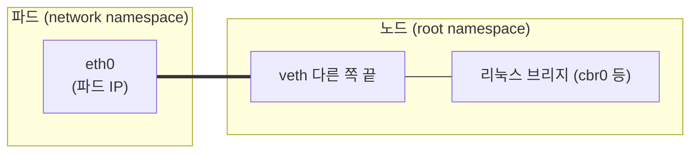

[쿠버네티스 내부 아키텍처 글](/kubernetes-internals)에서 kube-proxy와 Service를 다루며 "네트워킹은 그 자체로 한 편이 필요한 깊은 주제"라며 지도만 그려두고 넘어갔습니다. 이제 그 약속을 지킵니다. 이 글의 목표는 단 하나의 질문에 밑바닥까지 답하는 것입니다. **파드 A가 다른 노드의 파드 B에게 패킷을 보낼 때, 그 패킷은 실제로 어떤 길을 거쳐 도착하는가?**

쿠버네티스 네트워킹은 처음 보면 마법 같습니다. 파드가 죽고 살아나며 IP가 바뀌는데도 통신이 이어지고, 다른 노드에 있는 파드끼리도 마치 같은 네트워크에 있는 것처럼 대화합니다. 그런데 이 마법의 정체는 [컨테이너 글](/how-containers-work)에서 본 리눅스 네트워크 기능들과, 그 위에 얹힌 규칙의 조합일 뿐입니다. 하나씩 열어보겠습니다.

## 1. 쿠버네티스 네트워킹 모델 — flat, NAT 없는 세계

구현을 보기 전에, 쿠버네티스가 **무엇을 약속하는지** 부터 알아야 합니다. 쿠버네티스는 네트워킹에 대해 몇 가지 강한 요구사항을 정의하고, 그걸 만족하는 한 구현은 자유입니다. 그 모델은 이렇습니다.

- **모든 파드는 고유한 IP를 가진다.** 컨테이너가 아니라 파드 단위입니다.
- **모든 파드는 NAT 없이 서로 직접 통신할 수 있다.** 어느 노드에 있든, 파드 A는 파드 B의 IP로 그냥 패킷을 보내면 됩니다.
- **노드도 파드와 NAT 없이 통신할 수 있다.**
- **파드가 보는 자기 IP와, 남이 보는 그 파드의 IP가 같다.**

이 모델의 핵심은 **"flat network"** — 모든 파드가 하나의 평평한 네트워크에 있는 것처럼 보인다 — 와 **"NAT 없음"** 입니다. 왜 이게 중요할까요? 개발자가 **네트워크 위치를 신경 쓰지 않아도 되게** 만들기 때문입니다. "이 파드가 어느 노드에 있고, 그 사이에 어떤 NAT가 있고" 같은 걸 몰라도, 그냥 상대 파드의 IP로 보내면 됩니다. 마치 모두가 같은 랜에 꽂혀 있는 것처럼요.

이 약속을 실제 물리적으로 흩어진 노드들 위에서 구현하는 것 — 그것이 쿠버네티스 네트워킹의 전부입니다. 그리고 그 구현은 아래에서 위로 층층이 쌓입니다.

## 2. 파드 내부 — 공유되는 network namespace

가장 안쪽부터 봅시다. [컨테이너 글](/how-containers-work)에서 **network namespace** 를 배웠습니다. 각 프로세스가 자기만의 네트워크 스택(인터페이스·IP·라우팅 테이블)을 갖게 격리하는 리눅스 기능이죠. 그런데 쿠버네티스의 단위는 컨테이너가 아니라 **파드** 입니다. 그 차이가 여기서 드러납니다.

**한 파드 안의 컨테이너들은 network namespace를 공유합니다.** 즉 같은 파드의 컨테이너들은 **같은 IP를 쓰고, localhost로 서로 통신하며, 포트 공간을 공유**합니다. 웹 서버 컨테이너와 사이드카 컨테이너가 한 파드에 있으면, 사이드카는 `localhost:8080`으로 웹 서버에 접근할 수 있습니다. 마치 한 대의 머신에 두 프로세스가 도는 것과 같습니다.

이걸 가능하게 하는 게 **pause 컨테이너** 입니다. 파드가 뜰 때 쿠버네티스는 아무 일도 안 하는 작은 pause 컨테이너를 먼저 띄워 **network namespace를 만들고 붙잡아둡니다.** 그다음 실제 컨테이너들은 자기 network namespace를 새로 만드는 대신 pause 컨테이너의 것에 **합류**합니다. 그래서 앱 컨테이너가 재시작돼도 네트워크(IP)는 pause가 유지하고 있어 그대로입니다. 파드의 IP가 컨테이너보다 오래 사는 이유죠.

## 3. 파드를 노드에 잇기 — veth pair

이제 파드(자기 network namespace)를 노드의 네트워크에 연결해야 합니다. 여기 쓰이는 게 **veth pair(가상 이더넷 쌍)** 입니다.

veth pair는 이름 그대로 **양 끝이 연결된 가상 랜케이블** 같은 겁니다. 한쪽 끝에 들어간 패킷이 다른 쪽 끝으로 그대로 나옵니다. 쿠버네티스는 파드를 만들 때 veth pair를 하나 만들어, **한쪽 끝은 파드의 network namespace 안**(파드가 보는 `eth0`)에, **다른 쪽 끝은 노드의 root namespace**에 둡니다.

그러면 파드에서 나온 패킷은 파드의 `eth0` → veth를 타고 → 노드의 root namespace로 나옵니다. 노드에서는 이 veth들을 **리눅스 브리지(가상 스위치)** 에 연결하거나 라우팅으로 처리합니다. 이 veth pair가 "격리된 파드"와 "노드 네트워크"를 잇는 다리인 셈입니다. 컨테이너 글에서 본 network namespace 격리가, 여기서 veth라는 통로로 바깥과 연결됩니다.

## 4. 같은 노드의 파드끼리 — 브리지를 건너

같은 노드에 있는 파드 A와 파드 B가 통신하는 건 비교적 단순합니다.

파드 A의 패킷은 A의 `eth0` → veth → 노드의 **리눅스 브리지** 로 갑니다. 브리지는 가상 스위치라, 목적지 IP(파드 B)에 해당하는 veth로 패킷을 넘깁니다. 그러면 그 veth의 다른 쪽 끝, 즉 파드 B의 `eth0`로 패킷이 도착합니다. 물리 스위치에 두 컴퓨터가 꽂혀 통신하는 것과 똑같은 구조를, 가상으로 노드 안에서 재현한 겁니다. 여기엔 NAT도 캡슐화도 없습니다 — 브리지가 L2에서 그냥 넘겨줄 뿐입니다.

## 5. 다른 노드의 파드끼리 — 진짜 문제는 여기서

어려운 건 **노드 경계를 넘는** 통신입니다. 파드 A(노드 1)가 파드 B(노드 2)에게 보낼 때, 패킷은 노드 1을 떠나 물리 네트워크를 건너 노드 2에 도착한 뒤, 그 안의 파드 B까지 가야 합니다. 문제는 **물리 네트워크는 파드 IP를 모른다**는 것입니다. 물리 네트워크(스위치·라우터)는 노드의 IP만 알지, 그 안에서 CNI가 파드에 나눠준 IP는 처음 봅니다. 이 간극을 메우는 두 가지 큰 접근이 있습니다.

- **오버레이(overlay) 방식** — 파드 패킷을 **노드 IP 패킷 안에 통째로 감쌉니다(캡슐화, encapsulation).** 대표적으로 **VXLAN** 이 쓰입니다. 노드 1은 "파드 A→파드 B" 패킷을 "노드 1→노드 2" 패킷 안에 넣어 보냅니다. 물리 네트워크는 겉의 노드 IP만 보고 노드 2로 전달하고, 노드 2가 껍질을 벗겨 안의 파드 패킷을 꺼내 파드 B로 넘깁니다. Flannel의 VXLAN 모드가 이 방식입니다. **장점은 물리 네트워크가 파드 IP를 전혀 몰라도 된다**는 것(어디서나 동작), **단점은 캡슐화·역캡슐화의 오버헤드와 헤더만큼의 대역폭 손실**입니다.
- **라우팅(routing) 방식** — 캡슐화 없이, 각 노드가 **"이 파드 CIDR 대역은 저 노드로 보내라"는 라우팅 규칙**을 갖습니다. 이 라우팅 정보를 노드끼리 **BGP** 같은 프로토콜로 주고받습니다. Calico의 BGP 모드가 대표적입니다. **장점은 캡슐화가 없어 빠르고 효율적**이라는 것, **단점은 물리 네트워크(또는 클라우드 VPC 라우팅)가 파드 CIDR 라우팅을 지원해야** 한다는 것입니다.

이 선택 — 오버레이의 범용성이냐, 라우팅의 성능이냐 — 이 CNI 플러그인을 고르는 핵심 갈림길 중 하나입니다.

## 6. CNI — 이 모든 걸 표준화하다

지금까지 본 IP 할당·veth 설정·라우팅·캡슐화를, 쿠버네티스 본체가 직접 하지는 않습니다. 대신 **CNI(Container Network Interface)** 라는 표준 인터페이스로 **플러그인에 위임** 합니다.

[내부 아키텍처 글](/kubernetes-internals)에서 kubelet이 파드를 만들 때 CRI로 컨테이너 런타임을 부른다고 했는데, 네트워크 설정도 이때 함께 일어납니다. 파드가 뜨면 kubelet(정확히는 런타임)이 **CNI 플러그인을 호출**하고, 플러그인이 이 파드를 위해 할 일을 합니다.

1. **IPAM(IP Address Management)** — 이 파드에 IP를 하나 할당합니다.
2. **veth pair 생성** — 파드 namespace와 노드를 잇습니다(3장).
3. **라우팅·캡슐화 설정** — 5장의 오버레이 또는 라우팅을 구성합니다.

**Flannel·Calico·Cilium** 같은 것들이 바로 이 CNI 플러그인입니다. 쿠버네티스는 "이런 네트워킹 모델을 만족시켜라"만 정의하고, 그걸 어떻게 이룰지는 플러그인이 정합니다. 그래서 같은 쿠버네티스라도 어떤 CNI를 쓰느냐에 따라 네트워크 성능·기능(오버레이/라우팅, NetworkPolicy 지원 여부, eBPF 사용 등)이 달라집니다. 이 플러그형 구조가 쿠버네티스 네트워킹의 유연성의 원천입니다.

### IP는 유한하다 — 파드 IP 고갈

IPAM에는 실전에서 발목을 잡는 함정이 하나 있습니다. **파드 IP는 무한하지 않습니다.** 보통 클러스터 전체에 하나의 큰 대역(cluster CIDR)을 정하고, 각 노드에 그 일부(예: 노드당 /24, 254개)를 떼어줍니다. 그런데 파드 밀도가 높거나 노드가 많아지면 이 IP가 **고갈**됩니다. 특히 AWS의 VPC CNI처럼 **파드에 VPC의 실제 IP를 직접 부여**하는 방식(오버레이 없이 라우팅으로 성능을 얻는 대신)에서는, VPC 서브넷의 IP를 파드가 그대로 소비해 서브넷이 금방 바닥나는 사고가 흔합니다.

그래서 클러스터를 설계할 때 **CIDR 크기를 처음에 넉넉히 잡는 것** 이 중요합니다. 파드 IP 대역은 나중에 늘리기가 매우 까다롭기 때문입니다. "IP가 모자라 파드가 Pending에 걸리는데 자원은 남아도는" 상황은 대규모 클러스터에서 대표적인 성장통이고, 그 뿌리가 바로 이 IPAM 설계입니다. 오버레이(사설 파드 IP, IP 여유롭지만 캡슐화 비용)와 라우팅(실제 IP, 빠르지만 IP 소비 큼)의 선택이 성능뿐 아니라 **IP 예산**의 문제이기도 한 것입니다.

## 7. Service — 바뀌는 파드 IP를 안정된 주소로

지금까지는 "파드 IP로 직접 통신"이었습니다. 그런데 여기 근본적인 문제가 있습니다. **파드는 언제든 죽고 새로 뜨며, 그때마다 IP가 바뀝니다.** [오토스케일링](/kubernetes-autoscaling-resource-tuning)으로 개수가 늘었다 줄고, 배포로 교체되면서요. 다른 서비스가 매번 바뀌는 파드 IP를 쫓아다닐 순 없습니다.

그래서 **Service** 가 등장합니다. Service는 **안정적인 가상 IP(ClusterIP)** 를 하나 갖고, 그 뒤의 실제 파드들(엔드포인트)로 트래픽을 분배합니다. 클라이언트는 파드 IP가 아니라 Service의 ClusterIP(또는 이름)로만 통신하면 되고, 뒤에서 파드가 아무리 바뀌어도 신경 쓸 필요가 없습니다.

여기서 반드시 알아야 할 반전이 있습니다. **ClusterIP는 실제로 존재하는 네트워크 인터페이스가 아닙니다.** 어느 파드도, 어느 노드도 그 IP를 가진 카드가 없습니다. **ClusterIP는 순전히 "규칙"으로만 존재하는 가상 주소** 입니다. 그럼 그 규칙은 누가, 어디에 만들까요? 바로 kube-proxy입니다.

## 8. kube-proxy — ClusterIP를 실제 파드로 바꾸는 규칙

[내부 아키텍처 글](/kubernetes-internals)에서 본 **kube-proxy** 가 각 노드에서 하는 일이 이것입니다. kube-proxy는 API server를 watch하며 "어떤 Service의 ClusterIP가 어떤 파드들로 연결되는지"를 알아내, 그 노드의 **트래픽 규칙** 을 갱신합니다. 그러면 ClusterIP로 온 패킷이 실제 파드 IP로 **변환(DNAT)** 되어 전달됩니다. 이 규칙을 구현하는 방식이 kube-proxy의 모드입니다.

- **iptables 모드** — 리눅스의 iptables 규칙으로 ClusterIP를 파드 IP로 DNAT합니다. 오래되고 널리 쓰이지만, Service·엔드포인트가 많아지면 **규칙이 선형(O(n))으로 늘어** 패킷마다 규칙을 훑는 비용이 커집니다. 규모가 큰 클러스터에서 성능 문제의 원인이 되곤 합니다.
- **IPVS 모드** — 리눅스 커널의 **로드밸런서(IPVS)** 를 씁니다. 해시 테이블 기반이라 Service가 많아도 **O(1)** 에 가깝게 처리하고, 여러 로드밸런싱 알고리즘도 제공합니다. 대규모 클러스터에서 iptables 대신 선택합니다.
- **eBPF 모드** — Cilium 같은 CNI는 **kube-proxy 자체를 없애고**, [멀티테넌시 글](/kubernetes-multitenancy-isolation)에서 언급한 eBPF로 커널에서 직접 이 라우팅을 처리합니다. iptables의 규칙 폭발 문제를 근본적으로 우회하는 최신 방식입니다.

Service에는 노출 범위에 따라 종류도 있습니다. **ClusterIP**(클러스터 내부 전용), **NodePort**(각 노드의 특정 포트로 외부 노출), **LoadBalancer**(클라우드 로드밸런서를 붙여 외부 노출). 어느 것이든 그 밑바닥에는 이 kube-proxy 규칙이 깔려 있습니다.

### 조금 더 깊이 — 엔드포인트, 세션, 돌아오는 길

kube-proxy가 "Service 뒤에 어떤 파드들이 있는지"를 아는 건 **엔드포인트** 라는 리소스 덕분입니다. Service의 라벨 셀렉터에 맞는 파드가 뜨고 지고 준비 상태가 바뀔 때마다, 그 목록이 갱신되어 kube-proxy에 전달됩니다. 그런데 파드가 수천 개인 대규모 서비스에서는 이 엔드포인트 목록의 변경이 폭주해 컨트롤 플레인에 부담을 줍니다. 그래서 이를 잘게 나눈 **EndpointSlice** 가 도입돼, 변경의 영향 범위를 줄였습니다. 대규모 클러스터의 네트워크 확장성을 떠받치는 조각입니다.

몇 가지 더 알아두면 좋은 것이 있습니다. 기본적으로 kube-proxy는 요청을 엔드포인트에 **무작위로 분배**하지만, 같은 클라이언트를 같은 파드로 보내고 싶으면 **세션 어피니티(session affinity)** 로 IP 기반 고정을 걸 수 있습니다. 그리고 파드 IP를 아예 감추지 않고 직접 노출하고 싶을 땐 **헤드리스 서비스(headless service)** 를 쓰는데, 이건 ClusterIP를 만들지 않고 DNS가 곧바로 개별 파드 IP들을 반환합니다(스테이트풀셋처럼 각 파드를 개별적으로 지목해야 할 때).

마지막으로 자주 잊는 것이 **돌아오는 길** 입니다. 8장에서 ClusterIP를 파드 IP로 바꾸는 DNAT를 봤는데, 응답 패킷은 그 변환을 정확히 되돌려야 클라이언트가 "내가 보낸 그 ClusterIP에서 답이 왔다"고 인식합니다. 이 왕복 변환의 짝을 맞추는 게 리눅스 커널의 **연결 추적(conntrack)** 입니다. conntrack 테이블이 가득 차면(대량 연결 시) 새 연결이 끊기는 장애가 나기도 하는데, 이 역시 kube-proxy 기반 네트워킹의 알아둘 한계입니다. eBPF 방식이 각광받는 이유 중 하나가 이런 iptables·conntrack의 부담을 덜어준다는 데 있습니다.

## 9. DNS — 이름으로 부르기

ClusterIP도 결국 숫자라, 사람이 코드에 박기엔 불편합니다. 그래서 **클러스터 내부 DNS** 가 있습니다. 대개 **CoreDNS** 가 이 역할을 합니다.

Service를 만들면 `my-service.my-namespace.svc.cluster.local` 같은 DNS 이름이 자동으로 생기고, 이 이름은 그 Service의 ClusterIP로 해석됩니다. 그래서 파드 안 애플리케이션은 IP가 아니라 **서비스 이름**으로 다른 서비스를 부를 수 있습니다. `http://orders-api`로 호출하면, CoreDNS가 이를 ClusterIP로 바꾸고, kube-proxy 규칙이 그걸 실제 파드로 보내는 거죠.

[멀티테넌시 글](/kubernetes-multitenancy-isolation)에서 "이그레스를 막을 때 DNS(CoreDNS)로 가는 길을 안 열면 파드가 이름 해석을 못 해 먹통이 된다"고 한 함정이 바로 이 DNS를 두고 한 이야기였습니다. 이제 그게 왜 그렇게 치명적인지 보일 겁니다 — 이름 해석이 안 되면 파드는 어떤 서비스에도 이름으로 접근할 수 없으니까요.

## 10. Ingress — 바깥에서 안으로, L7 라우팅

지금까지가 클러스터 **내부** 통신이었다면, 바깥 사용자의 HTTP 요청을 안의 서비스로 들여보내는 게 **Ingress** 입니다. Service의 LoadBalancer가 서비스 하나당 로드밸런서 하나를 붙이는 L4 노출이라면, Ingress는 **하나의 진입점에서 경로·호스트 기반(L7)으로** 여러 서비스에 나눠 보냅니다. "`/api`는 이 서비스로, `/web`은 저 서비스로", "`a.example.com`은 이쪽, `b.example.com`은 저쪽"처럼요.

Ingress는 규칙(선언)일 뿐이고, 그걸 실제로 수행하는 건 **Ingress 컨트롤러**(NGINX·Traefik 등)입니다. [내부 아키텍처 글](/kubernetes-internals)의 조정 루프 패턴 그대로 — Ingress 리소스를 watch하며 로드밸런서/프록시 설정을 그 선언에 맞게 수렴시킵니다.

## 11. NetworkPolicy — flat 네트워크에 벽 세우기

1장에서 쿠버네티스 네트워크는 기본이 **flat, 모두가 서로 통신 가능** 이라고 했습니다. 이건 편리하지만, [멀티테넌시 글](/kubernetes-multitenancy-isolation)에서 강조했듯 **보안상 위험** 합니다 — 기본값이 all-allow라, 아무 파드나 다른 파드에 접근할 수 있으니까요.

**NetworkPolicy** 가 이 평평한 네트워크에 벽을 세웁니다. "이 파드는 이 라벨을 가진 파드에서 오는 트래픽만 받는다" 같은 규칙을 선언하면, 그 외의 통신이 차단됩니다. 여기서 중요한 건 **NetworkPolicy는 선언일 뿐, 실제 차단은 CNI가 한다**는 것입니다. Calico·Cilium 같은 CNI가 이 정책을 읽어 iptables 규칙이나 eBPF 프로그램으로 **실제 패킷을 막습니다.** 그래서 멀티테넌시 글에서 경고했듯, **CNI가 NetworkPolicy를 지원하지 않으면 정책을 만들어도 무시됩니다.** 정책은 벽의 설계도이고, 그 벽을 실제로 쌓는 건 CNI인 셈입니다.

## 12. 정리 — 패킷의 전체 여정

이제 맨 처음 질문에 완전히 답할 수 있습니다. 파드 A(노드 1)가 서비스 이름으로 파드 B(노드 2)를 부를 때, 패킷의 여정은 이렇습니다.

1. 파드 A가 `orders-api`로 요청 → **CoreDNS** 가 이름을 Service의 **ClusterIP** 로 해석.
2. ClusterIP로 나간 패킷이 노드 1의 **kube-proxy 규칙**(iptables/IPVS/eBPF)을 만나, 실제 엔드포인트 중 하나인 **파드 B의 IP로 DNAT**.
3. 패킷이 파드 A의 `eth0` → **veth** → 노드 1의 root namespace로.
4. 목적지가 다른 노드이므로, **CNI**가 구성한 대로 **오버레이(캡슐화)** 또는 **라우팅** 으로 노드 2까지 전달.
5. 노드 2에서 (오버레이면 껍질을 벗기고) → 브리지/라우팅 → 파드 B의 **veth** → 파드 B의 `eth0` 도착.
6. 그 사이 **NetworkPolicy** 가 있었다면, CNI가 이 통신을 허용하는지 검사해 통과/차단.

한 줄로 요약하면 이렇습니다. **쿠버네티스 네트워킹은 리눅스의 network namespace·veth·브리지·라우팅·iptables/eBPF 같은 기본 기능들을, CNI라는 표준 아래 조합해, "모든 파드가 하나의 flat 네트워크에 있는 듯한" 착시를 만들어내는 것**입니다.

[컨테이너 글](/how-containers-work)에서 컨테이너가 "리눅스 커널 기능의 조합"이라 했듯, 쿠버네티스 네트워킹도 결국 오래된 리눅스 네트워크 기능들의 우아한 조합입니다. 파드가 죽고 살아나도 이어지는 통신, 노드를 넘나드는 flat한 연결, 이름으로 부르는 서비스 — 그 마법의 뒤에는 veth 한 쌍과 몇 개의 커널 규칙이 조용히 돌고 있습니다. [Raft](/distributed-consensus-and-raft)·[컨테이너](/how-containers-work)·[컨트롤 플레인](/kubernetes-internals)에 이어, 이제 네트워크라는 마지막 층까지 열어봤으니, `kubectl apply` 한 줄이 만들어내는 세계가 한결 더 또렷하게 보일 겁니다.
