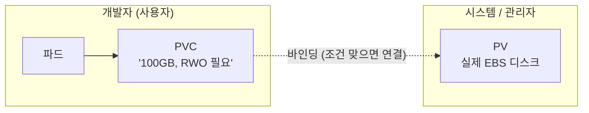
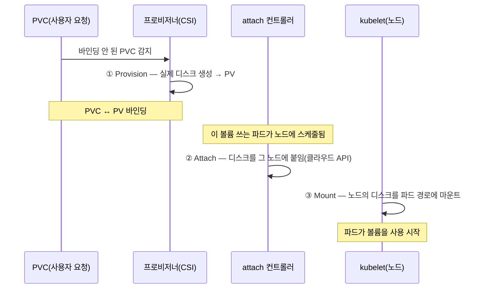
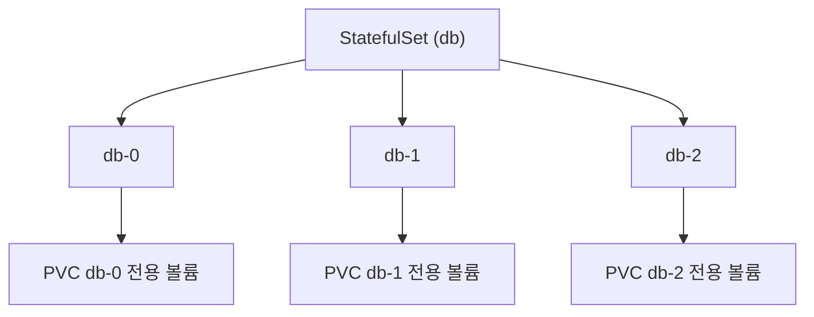

밑바닥 시리즈가 여기까지 왔습니다. [컨테이너](/how-containers-work)로 컴퓨트를, [컨트롤 플레인](/kubernetes-internals)으로 두뇌를, [네트워킹](/kubernetes-networking)으로 연결을 봤습니다. 이제 마지막 기둥, **스토리지** 입니다. 쿠버네티스가 다루는 자원을 컴퓨트·네트워크·스토리지로 나눈다면, 스토리지가 가장 까다로운 영역입니다. 왜냐하면 스토리지에는 **상태(state)** 가 있기 때문입니다.

문제는 이렇게 시작됩니다. [컨테이너 글](/how-containers-work)에서 봤듯, 컨테이너의 파일시스템은 **쓰기 레이어 하나가 얹힌 임시 저장소**입니다. 컨테이너가 죽으면 그 쓰기 레이어는 사라집니다. 웹 서버 같은 상태 없는(stateless) 워크로드라면 상관없지만, 데이터베이스처럼 **데이터를 지켜야 하는** 워크로드에는 재앙입니다. 파드가 재시작될 때마다 데이터가 날아가면 DB로 쓸 수 없으니까요. 이 "사라지는 컨테이너"와 "지켜야 하는 데이터" 사이의 간극을 메우는 것 — 그것이 쿠버네티스 스토리지의 전부입니다.

## 1. 볼륨 — 파드에 저장소를 붙이기

첫 번째 개념은 **볼륨(Volume)** 입니다. 볼륨은 파드(정확히는 그 안의 컨테이너)에 마운트되는 저장소로, 컨테이너의 임시 파일시스템과 별개로 존재합니다. 핵심은 **수명(lifetime)** 입니다. 볼륨마다 "언제까지 사는가"가 다릅니다.

- **emptyDir** — **파드의 수명** 과 함께합니다. 파드가 살아있는 동안만 존재하고, 파드가 사라지면 같이 사라집니다. 컨테이너가 재시작돼도 파드가 살아있으면 유지되므로, 같은 파드 안 컨테이너끼리 데이터를 공유하거나 임시 스크래치 공간으로 씁니다. 하지만 파드가 재스케줄되면 사라지니, 영속 저장은 아닙니다.
- **hostPath** — **노드의 디스크** 를 파드에 마운트합니다. 노드에 데이터가 남지만, 파드가 다른 노드로 옮겨가면 그 데이터에 접근할 수 없습니다. 게다가 노드 파일시스템을 직접 건드리는 거라 보안·이식성 문제가 있어, 특수한 경우 외에는 권장되지 않습니다.
- **진짜 영속 볼륨** — 파드·노드와 **독립적으로 존재하는 외부 스토리지**(클라우드 블록 스토리지, 네트워크 파일시스템 등)를 붙입니다. 파드가 죽든 다른 노드로 옮기든, 데이터는 그 외부 스토리지에 안전하게 남습니다. 이게 우리가 진짜 원하는 것이고, 이 글의 나머지는 대부분 이 이야기입니다.

## 2. 왜 스토리지는 유독 어려운가

본격적으로 들어가기 전에, 스토리지가 왜 네트워크·컴퓨트보다 까다로운지 짚어두면 뒤의 설계가 이해됩니다.

컴퓨트(파드)는 어디서든 똑같이 돕니다. 이 노드에서 죽으면 저 노드에서 새로 띄우면 그만입니다. 네트워크도 [앞 글](/kubernetes-networking)에서 봤듯 flat하게 추상화돼, 파드가 어디 있든 통신이 됩니다. 그런데 **스토리지는 데이터가 물리적으로 어딘가에 존재**합니다. 그 데이터는 복제되거나 이동하기 전엔 특정 디스크, 특정 가용영역(AZ)에 묶여 있습니다.

그래서 스토리지에는 컴퓨트에 없는 제약이 따라옵니다.

- **데이터는 이동이 비쌉니다.** 파드는 즉시 옮기지만, 그 파드가 쓰던 100GB 디스크는 즉시 못 옮깁니다.
- **위치에 묶입니다.** 클라우드 블록 스토리지는 대개 특정 AZ에 있어, 그걸 쓰는 파드도 그 AZ에 스케줄돼야 합니다.
- **동시 접근이 제한됩니다.** 대부분의 블록 스토리지는 한 번에 한 노드만 붙일 수 있습니다(뒤의 접근 모드).

[컨테이너 글](/how-containers-work)의 stateless와 stateful 구분, [MSA 글](/splitting-the-monolith-retrospective)에서 "데이터 분리가 가장 어려웠다"고 한 것 — 전부 이 "상태는 다루기 어렵다"의 다른 표현입니다. 쿠버네티스 스토리지 설계는 이 어려움을 정면으로 다루는 장치들입니다.

## 3. PV와 PVC — 관심사의 분리

영속 스토리지를 다루는 쿠버네티스의 핵심 추상화가 **PersistentVolume(PV)** 과 **PersistentVolumeClaim(PVC)** 입니다. 이 둘로 나눈 이유가 설계의 정수입니다.

- **PV(PersistentVolume)** — **실제 스토리지 조각** 입니다. "AWS EBS의 이 100GB 디스크", "이 NFS 경로" 같은 구체적인 저장소를 나타냅니다. 주로 관리자나 시스템(동적 프로비저닝)이 제공합니다.
- **PVC(PersistentVolumeClaim)** — **사용자의 요청** 입니다. "나는 100GB의, ReadWriteOnce인 스토리지가 필요해"라고 **필요한 스펙만** 선언합니다. 그게 EBS인지 NFS인지, 어느 디스크인지는 몰라도 됩니다.



이 분리가 왜 중요할까요? **관심사의 분리** 때문입니다. 개발자는 "저장소가 이만큼 필요하다"만 선언하면 되고(PVC), "그 저장소를 실제로 어떻게 마련하는가"(PV)는 신경 쓸 필요가 없습니다. 마치 [네트워킹 글](/kubernetes-networking)의 Service가 "뒤의 파드가 뭐든 ClusterIP로만 부르면 된다"고 추상화했듯, PVC는 "뒤의 스토리지가 뭐든 요청 스펙으로만 다루면 된다"고 추상화합니다. 파드는 PVC를 참조하고, PVC가 조건에 맞는 PV에 **바인딩(binding)** 되면, 그 실제 스토리지가 파드에 연결됩니다.

## 4. StorageClass와 동적 프로비저닝

PV를 누가 만들까요? 두 가지 방식이 있습니다.

**정적 프로비저닝(static)** 은 관리자가 **미리 PV들을 만들어둡니다.** PVC가 오면 그중 조건에 맞는 걸 골라 바인딩합니다. 단순하지만, 관리자가 일일이 디스크를 만들어둬야 하고 남거나 모자라기 쉽습니다.

**동적 프로비저닝(dynamic)** 이 훨씬 강력하고 요즘 표준입니다. PVC가 오면 **그 순간 실시간으로 실제 스토리지를 만들어** PV로 붙입니다. 이걸 가능하게 하는 게 **StorageClass** 입니다.

StorageClass는 **"이 종류의 스토리지를 이렇게 만들어라"는 템플릿** 입니다. 어떤 프로비저너(어느 CSI 드라이버)를 쓸지, 어떤 디스크 타입(SSD/HDD)인지, 어떤 파라미터로 만들지를 담습니다.

```text
# StorageClass 예시 — "fast" 라는 이름의 SSD 스토리지 템플릿
apiVersion: storage.k8s.io/v1
kind: StorageClass
metadata:
  name: fast
provisioner: ebs.csi.aws.com        # 이 CSI 드라이버가 만든다
parameters:
  type: gp3                          # SSD
reclaimPolicy: Delete                # PVC 지우면 실제 디스크도 삭제
volumeBindingMode: WaitForFirstConsumer
```

이제 흐름이 이렇게 됩니다. 개발자가 `storageClassName: fast`를 지정한 PVC를 만들면 → StorageClass가 지정한 CSI 드라이버가 → 실제로 gp3 SSD 디스크를 클라우드에 생성하고 → 그걸 PV로 만들어 → PVC에 바인딩합니다. 관리자가 미리 아무것도 안 해둬도, 필요할 때 필요한 만큼 스토리지가 태어나는 겁니다. [컨트롤 플레인 글](/kubernetes-internals)의 조정 루프가 여기서도 돕니다 — 컨트롤러가 "바인딩 안 된 PVC"를 watch하다가 프로비저닝을 유발합니다.

위 예시의 `volumeBindingMode: WaitForFirstConsumer`도 중요한데, 이건 "PVC가 생기자마자 디스크를 만들지 말고, **그 볼륨을 쓸 파드가 어느 노드/AZ에 스케줄되는지 정해진 뒤에** 그 위치에 맞춰 만들라"는 뜻입니다. 2장에서 말한 "스토리지는 위치에 묶인다"는 제약을 다루는 장치입니다. 이게 없으면 디스크는 A존에 생겼는데 파드는 B존에 스케줄돼 서로 못 붙는 사고가 납니다.

## 5. CSI — 스토리지를 표준화하다

[네트워킹 글](/kubernetes-networking)에서 CNI가 네트워크를 플러그인으로 표준화했다고 했습니다. 스토리지에도 똑같은 이야기가 있습니다. **CSI(Container Storage Interface)** 입니다.

예전에는 각 스토리지(AWS EBS, GCE PD, NFS…) 드라이버가 **쿠버네티스 코어 코드 안에(in-tree)** 박혀 있었습니다. 새 스토리지를 지원하려면 쿠버네티스 본체를 고쳐야 했고, 스토리지 벤더가 쿠버네티스 릴리스에 종속됐습니다. CSI는 이걸 **외부 플러그인 표준** 으로 빼냈습니다. 스토리지 벤더는 CSI 스펙만 구현하면 되고, 쿠버네티스 코어는 스토리지의 구체를 몰라도 됩니다.

CSI 드라이버가 구현하는 핵심 동작은 세 가지로 요약됩니다.

- **Provision/Delete** — 실제 스토리지를 만들고 지웁니다(동적 프로비저닝의 실체).
- **Attach/Detach** — 만들어진 스토리지를 특정 노드에 붙이고 뗍니다(클라우드라면 "이 EBS를 이 EC2에 attach").
- **Mount/Unmount** — 노드에 붙은 스토리지를 파드의 파일시스템에 마운트합니다.

CNI가 "쿠버네티스는 네트워킹 모델만 정의하고 구현은 플러그인"이었듯, CSI는 "쿠버네티스는 스토리지 인터페이스만 정의하고 구현은 드라이버"입니다. 이 플러그형 구조 덕에 어떤 스토리지든 같은 PV/PVC 추상화로 다룰 수 있습니다.

### CSI 드라이버는 어떻게 배포되나

CSI 드라이버가 하는 일이 두 종류(스토리지를 만들고 붙이는 "컨트롤 수준"과, 노드에서 마운트하는 "노드 수준")로 나뉘기 때문에, 배포도 두 부분으로 나뉩니다.

- **컨트롤러 플러그인** — 클러스터에 (보통 Deployment로) 소수만 뜹니다. Provision/Attach 같은, 클라우드 API를 호출하는 일을 담당합니다.
- **노드 플러그인** — **모든 노드에 DaemonSet으로** 뜹니다. 실제 Mount/Unmount는 디스크가 붙은 그 노드에서 일어나야 하니까요.

여기서 흥미로운 게, 쿠버네티스가 CSI 드라이버 옆에 붙여주는 **사이드카 컨트롤러들** 입니다. `external-provisioner`(바인딩 안 된 PVC를 보고 드라이버에 생성 요청), `external-attacher`(attach를 유발), `node-driver-registrar`(노드에 드라이버 등록), 리사이저·스냅샷터 등이 그것입니다. 이들이 [컨트롤 플레인 글](/kubernetes-internals)의 조정 루프로 쿠버네티스 상태(PVC·파드)를 watch하며, "이제 provision할 때다, attach할 때다"를 판단해 드라이버의 실제 동작을 호출합니다. 즉 **쿠버네티스가 표준 조정 로직(사이드카)을 제공하고, 벤더는 실제 스토리지 조작(드라이버)만 구현**하면 되는 구조입니다. 벤더의 부담을 최소화하는 이 설계 덕에 CSI 생태계가 폭발적으로 커졌습니다.

## 6. 볼륨이 파드에 붙기까지의 여정

이제 조각을 모아, PVC 하나가 실제로 파드에서 쓰이기까지의 전 과정을 따라가 봅시다. 세 단계를 거칩니다.



1. **Provision(생성)** — 바인딩 안 된 PVC를 external-provisioner 컨트롤러가 감지해, CSI 드라이버로 실제 디스크를 만들고 PV로 등록해 바인딩합니다.
2. **Attach(연결)** — 그 볼륨을 쓰는 파드가 특정 노드에 스케줄되면, attach 컨트롤러가 클라우드 API를 호출해 그 디스크를 **그 노드에 붙입니다**(EBS를 EC2에 attach하듯).
3. **Mount(마운트)** — 노드에 디스크가 붙으면, 그 노드의 **kubelet** 이 디스크를 포맷·마운트해 파드의 컨테이너 경로에 연결합니다. 이제 파드가 그 경로에 쓰는 데이터가 실제 디스크로 갑니다.

여기서 다시 [컨트롤 플레인 글](/kubernetes-internals)의 원리가 보입니다. 아무도 "이 볼륨을 붙여라"라고 직접 명령하지 않습니다. 컨트롤러들이 상태(바인딩 안 된 PVC, 볼륨을 요구하는 파드)를 watch하며 각자 자기 몫(provision·attach)을 조정하고, 노드의 kubelet이 마지막 mount를 담당합니다. 스토리지 역시 조정 루프의 세계입니다.

## 7. 접근 모드 — 누가 동시에 쓸 수 있나

스토리지에는 컴퓨트에 없는 제약이 하나 더 있습니다. **접근 모드(access mode)** 입니다.

- **ReadWriteOnce(RWO)** — **한 노드** 에서만 읽기·쓰기가 가능합니다. 대부분의 클라우드 블록 스토리지(EBS 등)가 여기 해당합니다. 물리적으로 한 번에 한 서버에만 붙기 때문입니다.
- **ReadOnlyMany(ROX)** — 여러 노드에서 읽기 전용으로.
- **ReadWriteMany(RWX)** — **여러 노드** 에서 동시에 읽기·쓰기. NFS 같은 **파일 스토리지** 만 지원합니다.

이 제약이 실전 설계에 큰 영향을 미칩니다. 블록 스토리지는 대개 RWO라, **여러 파드가 같은 블록 볼륨을 동시에 공유할 수 없습니다.** 그래서 "여러 복제본이 같은 디스크를 공유"하는 구조는 블록 스토리지로는 안 되고, 각 복제본이 자기 볼륨을 갖거나(뒤의 StatefulSet), RWX 파일 스토리지를 써야 합니다. RWO 볼륨을 쓰는 파드가 다른 노드로 옮겨갈 때도, 먼저 원래 노드에서 **detach하고 새 노드에 attach** 해야 해서 시간이 걸립니다 — 이게 상태 있는 워크로드의 페일오버가 느린 이유 중 하나입니다.

## 8. StatefulSet — 상태 있는 워크로드를 위한 것

여기서 자연스러운 질문. "그냥 [Deployment](/kubernetes-internals)에 볼륨 붙이면 안 되나?" 안 됩니다. Deployment는 파드들을 **서로 구별하지 않고 똑같이** 다룹니다. 이름도 랜덤이고, 어느 파드가 죽든 상관없이 개수만 맞추죠. 그런데 데이터베이스 클러스터처럼 **각 파드가 고유한 정체성과 자기만의 데이터**를 가져야 하는 워크로드에는 이게 안 맞습니다.

그래서 **StatefulSet** 이 있습니다. StatefulSet은 상태 있는 워크로드를 위해 세 가지를 보장합니다.

- **안정적인 네트워크 정체성** — 파드에 `db-0`, `db-1`, `db-2`처럼 **순서 있는 고정 이름** 을 주고, [네트워킹 글](/kubernetes-networking)의 **헤드리스 서비스** 로 각 파드를 개별 DNS 이름으로 지목할 수 있게 합니다. `db-0`은 죽었다 살아나도 여전히 `db-0`입니다.
- **안정적인 스토리지** — `volumeClaimTemplates`로 **각 파드마다 자기 전용 PVC** 를 만듭니다. `db-0`은 자기 볼륨, `db-1`은 또 자기 볼륨. 그리고 `db-0`이 재스케줄돼도 **원래 자기 볼륨을 다시 붙입니다.** 정체성과 데이터가 파드에 딱 붙어 다니는 거죠.
- **순서 보장** — 생성·삭제·업데이트를 순서대로(0, 1, 2…) 합니다. 클러스터형 DB에서 순서가 중요할 때 필요합니다.



이 그림이 StatefulSet의 핵심입니다. 파드와 볼륨이 **1:1로, 이름으로 묶여** 있고, 파드가 어디로 재스케줄되든 자기 볼륨을 따라갑니다. Deployment가 "교체 가능한 익명의 일꾼들"이라면, StatefulSet은 "각자 자기 자리와 자기 서랍을 가진 지정석"인 셈입니다.

## 9. 스토리지의 어려운 현실

마지막으로, 실전에서 부딪히는 스토리지의 까다로운 지점들을 정리합니다. 대부분 2장의 "상태는 위치에 묶인다"에서 파생됩니다.

- **볼륨 노드 어피니티** — 클라우드 블록 볼륨은 특정 AZ에 있으므로, 그 볼륨을 쓰는 파드는 반드시 그 AZ의 노드에 스케줄돼야 합니다. 스케줄러가 이 제약을 지켜야 하고(그래서 4장의 `WaitForFirstConsumer`가 필요), AZ 하나가 죽으면 그 볼륨을 쓰던 파드는 다른 AZ에서 못 뜹니다. 스토리지가 가용성의 발목을 잡는 지점입니다.
- **리사이징** — 볼륨을 키우는 건(대개) 되지만 줄이는 건 안 됩니다. 처음 크기를 신중히 잡아야 합니다.
- **스냅샷과 백업** — CSI는 볼륨 스냅샷 표준도 제공하지만, 스냅샷이 곧 백업은 아닙니다. 애플리케이션 수준의 정합성 있는 백업은 별도 전략이 필요합니다.
- **데이터는 결국 어렵다** — 쿠버네티스가 스토리지를 아무리 잘 추상화해도, "상태를 안전하게, 정합성 있게, 고가용으로 다루는" 근본 문제는 사라지지 않습니다. 그래서 많은 팀이 DB만큼은 관리형 서비스([FinOps 글](/cloud-cost-finops)의 관리형 서비스 트레이드오프)에 맡기고, 클러스터 안에서는 상태 없는 워크로드에 집중하기도 합니다.

## 10. 정리 — 밑바닥 4기둥의 완성

- 컨테이너 파일시스템은 임시라, 영속 데이터는 **파드·노드와 독립된 외부 스토리지**를 볼륨으로 붙여 다룹니다.
- **PV(실제 스토리지)** 와 **PVC(사용자 요청)** 의 분리로, 개발자는 "얼마나 필요한지"만 선언하고 구현은 몰라도 됩니다.
- **StorageClass + 동적 프로비저닝** 으로 필요할 때 실시간으로 스토리지가 태어나고, **CSI** 가 그 구현을 플러그인으로 표준화합니다.
- 볼륨은 **provision → attach → mount** 의 여정을 조정 루프로 거쳐 파드에 붙습니다.
- **접근 모드**(대부분 RWO)와 **볼륨의 위치 종속성** 이 상태 있는 워크로드 설계를 제약하고, **StatefulSet** 이 안정적 정체성·전용 볼륨·순서로 이를 다룹니다.

이로써 밑바닥 시리즈가 완성됐습니다. [컨테이너](/how-containers-work)(컴퓨트) · [컨트롤 플레인](/kubernetes-internals)(제어) · [네트워킹](/kubernetes-networking)(연결) · **스토리지**(상태) — 쿠버네티스가 다루는 네 가지 자원을 모두 밑바닥까지 열어봤습니다. 그리고 이 네 층을 관통하는 정신은 한결같았습니다. **리눅스의 오래된 기능들(namespace·cgroup·veth·마운트) 위에, 선언적 API와 조정 루프라는 일관된 뼈대로, "원하는 상태를 선언하면 그리로 수렴하는" 시스템을 쌓아 올린 것.** 매일 치는 `kubectl apply` 한 줄 뒤에서 이 네 기둥이 함께 돌고 있다는 걸 알고 나면, 쿠버네티스가 왜 그렇게 강력하면서도 그렇게 복잡한지가 온전히 이해됩니다.

이제 이론은 충분히 다졌습니다. 다음부터는 이 지식을 손으로 직접 확인하는 **실전 따라하기** 로 넘어가 보겠습니다.
