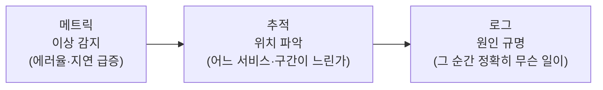

지금까지 이 블로그에서 인프라를 코드로 정의하고([CDK](/taming-aws-cdk-in-production)), 배포를 자동화하고([GitOps](/gitops-with-argocd)), 부하에 따라 확장하는([오토스케일링](/kubernetes-autoscaling-resource-tuning)) 이야기를 했습니다. 그런데 이 모든 걸 갖춰도 한 가지가 빠지면 반쪽입니다. **"지금 시스템이 잘 돌고 있는가, 느려졌다면 왜인가"를 밖에서 알아내는 능력** — 바로 관찰성(observability)입니다.

특히 [모놀리식을 MSA로 쪼갠](/splitting-the-monolith-retrospective) 뒤라면 이건 선택이 아닙니다. 하나의 요청이 대여섯 서비스를 거치는 시스템에서, 관찰성 없이 장애를 쫓는 건 눈을 감고 미로를 헤매는 것과 같습니다. 이번 글은 그 관찰성을 이루는 세 기둥과, 이를 벤더 독립적으로 다루는 표준 OpenTelemetry를 정리합니다.

## 모니터링과 관찰성은 다르다

먼저 자주 뒤섞이는 두 단어를 구분하겠습니다.

- **모니터링(monitoring)** 은 **미리 정해둔 지표를 감시**하는 것입니다. "CPU가 80%를 넘으면 알림", "에러율이 1%를 넘으면 호출" 같은 식이죠. 무엇이 문제가 될지 **이미 알고 있는** 것들을 지켜봅니다.
- **관찰성(observability)** 은 **예상하지 못한 문제를 사후에 파고들 수 있는 능력**입니다. 미리 알람을 걸어두지 않은, 처음 겪는 이상 현상이 터졌을 때 "왜 이런 일이 벌어졌는지"를 데이터로 되짚어갈 수 있느냐입니다.

이 차이는 "알려진 문제(known unknowns)"와 "모르던 문제(unknown unknowns)"의 차이입니다. 단순한 모놀리식에서는 모니터링만으로도 그럭저럭 버팁니다. 하지만 시스템이 복잡해지고 서비스가 얽힐수록, 미리 예상하지 못한 방식으로 고장 나기 시작합니다. 관찰성은 바로 그 **처음 보는 고장을 이해할 수 있게** 해줍니다. 모니터링이 "무엇이 잘못됐나"에 답한다면, 관찰성은 "왜 잘못됐나"에 답합니다.

## 세 기둥 — 메트릭, 로그, 추적

관찰성은 흔히 세 종류의 데이터(three pillars) 위에 세워집니다. 각자 잘하는 일이 다르고, 셋이 협력할 때 진가가 나옵니다.

### 메트릭 — 무슨 일이 일어나는가

**메트릭(metrics)** 은 시간에 따라 변하는 숫자입니다. 초당 요청 수, 응답 지연, 에러율, CPU 사용률 같은 것들이죠. 값을 일정 간격으로 집계하기 때문에 **가볍고, 저장이 싸고, 알람·대시보드에 강합니다.** "지금 에러율이 평소보다 높다"를 가장 빠르게 알려주는 게 메트릭입니다. Prometheus가 대표적인 도구입니다.

다만 메트릭은 **"무슨 일이 일어나는지"는 알려줘도 "왜"는 못 알려줍니다.** 에러율이 올랐다는 건 알아도, 어떤 요청이 왜 실패했는지는 메트릭만으로 알 수 없습니다. 그리고 뒤에서 이야기할 **카디널리티** 함정이 있어, 아무 정보나 라벨로 붙이면 안 됩니다.

### 로그 — 그 순간 정확히 무엇이

**로그(logs)** 는 개별 이벤트의 상세한 기록입니다. "언제 이 사용자가 이 요청을 보냈고 이런 에러가 났다" 같은 구체적인 사실이 담깁니다. 정보가 풍부해 **원인을 깊이 파고들 때** 강력합니다. 대신 양이 많아 저장·검색 비용이 크고, 방대한 로그에서 원하는 걸 찾는 게 일입니다.

여기서 중요한 실전 포인트가 **구조화 로그(structured logging)** 입니다. 사람이 읽는 문장으로 남기는 대신, JSON처럼 기계가 파싱할 수 있는 형태로 남기는 것입니다. `요청 실패: user=123, path=/orders, status=500` 같은 문장보다, `{"level":"error","user":"123","path":"/orders","status":500}` 형태가 검색·집계·필터링에 비교할 수 없이 유리합니다.

### 추적 — 요청의 여정을 따라

**분산 추적(distributed tracing)** 은 하나의 요청이 여러 서비스를 거치는 **전체 여정**을 이어 보여줍니다. [MSA 회고 글](/splitting-the-monolith-retrospective)에서 "추적 ID를 모든 서비스에 전파해 흩어진 로그를 하나로 묶었다"고 했는데, 그걸 체계화한 게 분산 추적입니다.

요청이 처음 들어오면 하나의 **trace**가 시작되고, 각 서비스에서의 작업이 **span**으로 기록되어 부모-자식 관계로 이어집니다. 그러면 "이 요청이 API 게이트웨이에서 3ms, 주문 서비스에서 12ms, 결제 서비스에서 갑자기 800ms가 걸렸다"를 한눈에 볼 수 있습니다. MSA에서 "어느 서비스가 병목인가"를 찾는 데 이만한 도구가 없습니다.

### 셋은 함께 쓸 때 강하다

세 기둥은 경쟁하는 게 아니라 **역할을 나눠 협력**합니다. 실제 장애 대응은 대개 이렇게 흐릅니다.

메트릭이 "뭔가 이상하다"고 경보를 울리고, 추적이 "결제 서비스의 이 구간"이라고 위치를 좁히고, 로그가 "그때 이 쿼리가 타임아웃됐다"고 원인을 확정하는 식입니다. 하나만으로는 반쪽이고, 셋을 오갈 수 있을 때 비로소 "왜"에 도달합니다.

## OpenTelemetry — 벤더 종속을 끊는 표준

세 기둥을 실제로 수집하려면 코드에 **계측(instrumentation)** 을 심어야 합니다. 문제는 예전엔 이게 도구마다 제각각이었다는 점입니다. Datadog을 쓰다 다른 도구로 갈아타려면 계측을 전부 다시 해야 했습니다. 벤더에 발이 묶이는 겁니다.

**OpenTelemetry(OTel)** 는 이 계측을 **표준화**한 오픈소스 프로젝트입니다. 메트릭·로그·추적을 수집하고 내보내는 방식을 통일해서, **한 번 계측해두면 뒤단(백엔드)은 자유롭게 갈아끼울 수 있게** 합니다. 애플리케이션은 OTel 표준으로 데이터를 뱉고, 그걸 Prometheus든 Jaeger든 상용 도구든 원하는 곳으로 보내면 됩니다. 요즘 관찰성 이야기에서 OpenTelemetry가 사실상 기본으로 언급되는 이유입니다. 계측이라는 가장 손이 많이 가는 작업을, 특정 회사가 아니라 표준에 투자하게 해주니까요.

## 실전에서 신경 써야 할 것들

관찰성을 도입할 때 반복해서 마주치는 함정과 원칙들을 정리하겠습니다.

- **카디널리티 폭발을 조심하세요.** 메트릭에 라벨(태그)을 붙일 때, 값의 종류가 무한히 많은 것(사용자 ID, 요청 ID 등)을 라벨로 넣으면 시계열이 폭발적으로 늘어 저장소가 감당하지 못합니다. 그런 고유값은 로그나 추적에 넣고, 메트릭 라벨은 값의 가짓수가 제한적인 것(상태 코드, 엔드포인트 등)으로 유지해야 합니다.
- **추적은 샘플링합니다.** 모든 요청의 추적을 100% 저장하면 비용이 감당이 안 됩니다. 대개 일부만 샘플링하되, 에러가 난 요청은 우선 저장하는 식으로 조절합니다.
- **무엇을 볼지 먼저 정하세요 — 골든 시그널.** 데이터가 많다고 다 보는 게 아닙니다. 구글 SRE가 제시한 네 가지 **골든 시그널** — 지연(latency), 트래픽(traffic), 에러(errors), 포화(saturation) — 부터 챙기면 대부분의 문제를 잡습니다. 나아가 SLI/SLO로 "우리가 지켜야 할 수준"을 숫자로 정해두면, 알람이 소음이 아니라 신호가 됩니다.
- **관찰성 데이터는 비쌉니다.** 로그·추적은 양이 많아 저장·전송 비용이 상당합니다. "다 저장한다"가 아니라, 무엇을 얼마나 오래 남길지 의식적으로 정하는 게 운영의 일부입니다.

## 정리

- **모니터링**은 알던 문제를 감시하고, **관찰성**은 처음 보는 문제를 사후에 파고드는 능력입니다. MSA로 갈수록 후자가 필수입니다.
- 세 기둥이 협력합니다 — **메트릭**으로 이상을 감지하고, **추적**으로 위치를 좁히고, **로그**로 원인을 확정합니다.
- **OpenTelemetry**로 계측을 표준화하면, 한 번 계측하고 백엔드는 자유롭게 바꿀 수 있습니다.
- 실전에서는 **카디널리티·샘플링·골든 시그널·비용**을 함께 챙기세요.

인프라를 코드로 정의하고 자동으로 배포·확장하는 것이 "시스템을 만드는 일"이라면, 관찰성은 그 시스템을 **눈을 뜨고 운영하는 일**입니다. 잘 만든 시스템도 안이 보이지 않으면 결국 감으로 운영하게 됩니다. 관찰성은 그 감을 데이터로 바꿔주는, 운영의 마지막 퍼즐 조각입니다.
