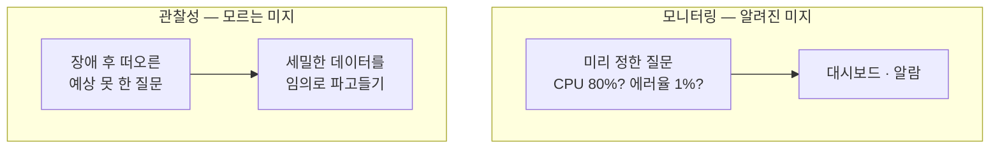
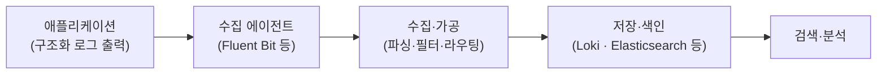
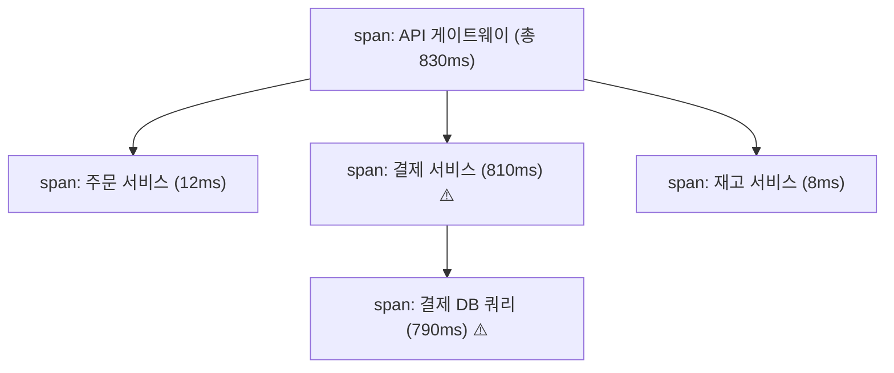
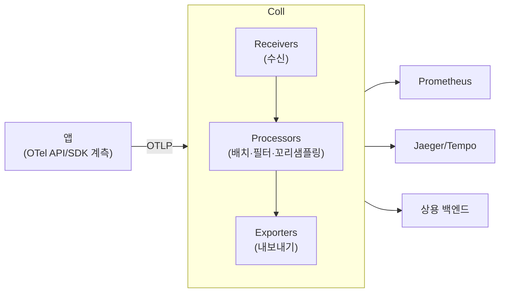
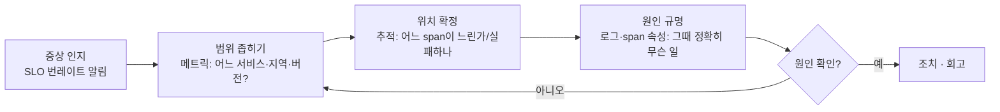

관찰성은 "로그·메트릭·추적 세 가지가 있다"로 요약되곤 하지만, 그 요약으로는 이 주제의 진짜 무게를 담을 수 없습니다. 관찰성은 그보다 훨씬 깊고, 그 깊이를 이해해야 비로소 실전에서 흔들리지 않습니다. 이 글은 관찰성을 **밑바닥부터** 쌓아 올립니다. 어원이 된 제어이론에서 출발해, 세 종류 데이터의 내부 동작, 그 모든 걸 관통하는 카디널리티라는 개념, "세 기둥" 모델의 한계와 그 너머, OpenTelemetry의 실제 구조, SLO와 에러 예산에 기반한 알림, 그리고 이 모든 걸 지탱해야 하는 비용의 경제학까지 다룹니다. 길지만, 한 번 제대로 이해하면 "관찰성을 도입한다"는 말이 완전히 다르게 들리는 주제입니다.

## 1. 관찰성이란 무엇인가 — 제어이론에서 온 개념

"관찰성(observability)"이라는 단어는 소프트웨어가 만든 말이 아닙니다. 1960년 제어이론(control theory)에서 루돌프 칼만(Rudolf Kálmán)이 도입한 개념으로, 정의는 이렇습니다.

> **시스템의 외부 출력만으로 그 내부 상태를 얼마나 잘 추론할 수 있는가.**

이 정의가 핵심을 정확히 찌릅니다. 우리는 돌아가는 서버 프로세스의 내부를 직접 열어볼 수 없습니다. 우리가 볼 수 있는 건 그 시스템이 밖으로 뱉는 신호 — 로그 한 줄, 메트릭 수치, 추적 데이터 — 뿐입니다. 관찰성이 높다는 건, **이 외부 신호만으로 "내부에서 지금 무슨 일이 벌어지는지"를 정확히 재구성할 수 있다**는 뜻입니다.

그래서 관찰성은 도구의 이름이 아니라 **시스템의 속성(property)** 입니다. "Datadog을 붙였으니 관찰성이 생겼다"는 말은 절반만 맞습니다. 진짜 질문은 "이 시스템은 밖으로 충분한 신호를 내보내고 있는가, 그리고 그 신호로 임의의 질문에 답할 수 있는가"입니다. 관찰성은 사후에 붙이는 대시보드가 아니라, **처음부터 시스템을 어떻게 계측(instrument)하느냐**의 문제입니다.

이 관점을 붙잡고 있으면 뒤의 모든 이야기가 하나로 꿰집니다. 메트릭·로그·추적은 결국 "외부 출력을 어떤 형태로 내보낼 것인가"의 서로 다른 답이고, 카디널리티는 "그 출력으로 얼마나 세밀한 질문까지 답할 수 있는가"의 척도이며, 비용은 "그 세밀함을 어디까지 감당할 것인가"의 문제입니다.

## 2. 모니터링과 관찰성 — 무엇이 정말 다른가

이 둘은 자주 섞여 쓰이지만, 사고방식이 근본적으로 다릅니다.

**모니터링(monitoring)** 은 **미리 정한 질문에 대한 답을 지속적으로 확인**하는 것입니다. "CPU가 80%를 넘는가?", "에러율이 1%를 넘는가?" 같은 질문을 대시보드와 알람으로 박아둡니다. 이 질문들의 공통점은 **문제가 터지기 전에 이미 무엇을 봐야 할지 알고 있었다**는 것입니다. 이것이 "알려진 미지(known unknowns)" — 무엇을 모르는지는 아는 상태 — 입니다.

**관찰성(observability)** 은 **미리 정해두지 않은 질문을 사후에 던질 수 있는 능력**입니다. "왜 하필 한국 지역의, 안드로이드 앱을 쓰는, 특정 API 버전 사용자만 결제가 느린가?" 같은, 장애가 터지기 전엔 상상도 못 했던 질문 말입니다. 이것이 "모르는 미지(unknown unknowns)" — 무엇을 모르는지조차 몰랐던 상태 — 입니다.

이 차이를 다르게 표현하면 **"질문의 카디널리티"** 입니다. 모니터링은 소수의 정해진 질문에 답합니다. 관찰성은 사실상 무한한, 예측하지 못한 질문에 답해야 합니다. 그래서 관찰성은 필연적으로 **더 세밀하고 고차원적인 데이터**를 요구하고, 그것이 뒤에서 다룰 카디널리티·비용 문제로 직결됩니다.



구체적인 예를 들어보겠습니다. 어느 날 결제 전환율이 미묘하게 떨어졌습니다. 모든 대시보드는 초록불입니다 — 에러율 정상, 지연 정상, CPU 정상. 모니터링은 아무 문제도 못 잡습니다. 애초에 "이런 문제가 생길 것"이라고 예상하고 알람을 걸어둔 적이 없으니까요. 그런데 데이터를 이리저리 쪼개보다가, "특정 결제사 + 특정 카드 BIN + iOS 최신 버전" 조합에서만 결제창이 뜨는 데 3초가 더 걸린다는 걸 발견합니다. 이건 누구도 사전에 알람으로 만들어둘 수 없었던, 발견되기 전엔 존재조차 몰랐던 문제입니다. **이렇게 예상 못 한 조합을 사후에 파고들 수 있느냐**가 관찰성이고, 그러려면 그 조합을 이루는 세밀한 차원들이 데이터에 살아 있어야 합니다.

왜 이 구분이 지금 중요해졌을까요. 단일 모놀리식에서는 고장 나는 방식이 뻔했습니다. 미리 몇 개 알람만 걸어둬도 대부분 잡혔습니다. 그런데 [모놀리식을 MSA로 쪼개고](/splitting-the-monolith-retrospective) 나면, 시스템이 **조합적으로 복잡**해집니다. 서비스 A가 B를 부르고 B가 C를 부르는 그물망에서는, 아무도 예상하지 못한 방식으로 고장이 전파됩니다. 미리 알람을 걸어둘 수 있는 실패의 가짓수가 실제 실패의 가짓수를 따라잡지 못합니다. 관찰성은 바로 이 간극을 메웁니다.

## 3. 첫 번째 기둥, 메트릭 — 그 내부를 뜯어보기

메트릭(metrics)은 시간에 따라 변하는 수치를 일정 간격으로 집계한 데이터입니다. 가볍고 저렴해서 대시보드와 알람의 기반이 됩니다. 그런데 "수치를 모은다"는 겉모습 아래에는 알아야 할 구조가 꽤 있습니다.

### 메트릭의 네 가지 타입

메트릭은 아무 숫자나 던지는 게 아니라, 성격에 따라 타입이 나뉩니다. 이 구분을 모르면 잘못된 계산을 하게 됩니다.

- **카운터(counter)** — 오직 증가만 하는 누적값입니다. "지금까지 처리한 총 요청 수" 같은 것이죠. 카운터의 절대값 자체는 별 의미가 없습니다. 중요한 건 **변화율**입니다. 그래서 카운터는 항상 `rate()` 같은 함수로 "초당 증가량"으로 바꿔 씁니다. 프로세스가 재시작되면 0으로 리셋되는데, 좋은 시스템은 이 리셋을 감지해 보정합니다.
- **게이지(gauge)** — 오르내리는 현재값입니다. 현재 메모리 사용량, 큐에 쌓인 작업 수, 현재 활성 연결 수 같은 것입니다. 지금 이 순간의 스냅샷이라 그대로 읽으면 됩니다.
- **히스토그램(histogram)** — 값의 **분포**를 담습니다. 응답 지연처럼 "평균이 아니라 분포가 중요한" 값에 씁니다. 뒤에서 자세히 봅니다.
- **서머리(summary)** — 히스토그램과 비슷하게 분위수를 담지만, 클라이언트에서 미리 계산합니다. 대신 **여러 인스턴스의 값을 합산(aggregate)할 수 없다**는 치명적 한계가 있어, 요즘은 대체로 히스토그램을 선호합니다.

### 왜 평균은 거짓말을 하는가 — 히스토그램과 분위수

관찰성에서 가장 중요한 실전 교훈 하나를 꼽으라면, **"평균 지연을 믿지 마라"** 입니다.

응답 지연의 평균이 100ms라고 합시다. 안심되나요? 그런데 이 평균은 "요청의 99%는 50ms인데, 나머지 1%가 5초씩 걸리는" 상황도 똑같이 100ms 근처로 보여줄 수 있습니다. 그 1%가 바로 당신의 가장 중요한 고객일 수 있는데도요. **평균은 꼬리(tail)를 숨깁니다.**

그래서 우리는 **분위수(percentile)** 를 봅니다. p50(중앙값), p95, p99, p99.9 같은 것들이죠. "p99가 800ms"라는 건 "요청의 99%는 800ms 안에 처리되지만 1%는 그보다 느리다"는 뜻입니다. 이 **꼬리 지연(tail latency)** 이야말로 사용자 경험을 실제로 좌우합니다. 특히 한 요청이 여러 서비스를 부르는 MSA에서는, 각 서비스의 꼬리가 곱해져 전체 꼬리가 급격히 나빠집니다(tail latency amplification).

분위수를 구하려면 값의 분포가 필요한데, 모든 개별 값을 저장하면 너무 비쌉니다. 그래서 히스토그램은 값을 **버킷(bucket)** 으로 나눠 셉니다. "0~10ms에 몇 개, 10~50ms에 몇 개, 50~100ms에 몇 개…" 이런 식으로요. 이렇게 미리 정한 경계에 카운트만 쌓아두면, 분위수를 근사적으로 계산할 수 있습니다.

```text
# Prometheus 히스토그램은 버킷별 누적 카운터로 저장된다
http_request_duration_seconds_bucket{le="0.1"}   8000   # 0.1초 이하 8000건
http_request_duration_seconds_bucket{le="0.5"}   9800   # 0.5초 이하 9800건
http_request_duration_seconds_bucket{le="1.0"}   9950
http_request_duration_seconds_bucket{le="+Inf"}  10000  # 전체 10000건
http_request_duration_seconds_sum                 720    # 지연 총합
http_request_duration_seconds_count               10000  # 요청 총 개수
```

여기서 p95를 구하려면, 누적 카운트가 전체의 95%(9500번째)에 도달하는 버킷을 찾아 그 안에서 선형 보간합니다. PromQL로는 이렇게 씁니다.

```text
histogram_quantile(0.95, rate(http_request_duration_seconds_bucket[5m]))
```

여기서 중요한 성질은 **히스토그램은 합산이 된다**는 점입니다. 여러 서버의 버킷 카운트를 더하면 전체 분포가 되고, 거기서 전역 p99를 계산할 수 있습니다. 반면 서머리는 각 서버가 미리 계산한 p99를 갖고 있을 뿐이라, "여러 서버의 p99를 평균낸 값"은 수학적으로 의미가 없습니다(분위수는 평균낼 수 없습니다). 이것이 히스토그램을 선호하는 결정적 이유입니다.

### Prometheus의 데이터 모델과 pull

메트릭 세계의 사실상 표준인 Prometheus를 통해 데이터 모델을 봅시다. Prometheus에서 하나의 **시계열(time series)** 은 **메트릭 이름 + 라벨(label) 집합**으로 유일하게 식별됩니다.

```text
http_requests_total{method="GET", status="200", handler="/orders"}
```

이건 `http_requests_total`이라는 메트릭의, `method=GET`이고 `status=200`이고 `handler=/orders`인 하나의 시계열입니다. 라벨 조합이 하나라도 다르면 **완전히 별개의 시계열**이 됩니다. 이 사실이 뒤에서 다룰 카디널리티 문제의 씨앗입니다.

Prometheus는 **pull 방식**입니다. 각 애플리케이션이 `/metrics` 엔드포인트로 현재 값을 노출하면, Prometheus 서버가 주기적으로 그걸 긁어(scrape)갑니다. push가 아니라 pull인 이유는 여러 가지인데, 대표적으로 "어떤 대상을 수집 중인지 서버가 명확히 안다", "대상이 살아있는지 자체가 신호가 된다(scrape 실패=다운)", "애플리케이션이 수집 서버 주소를 몰라도 된다" 같은 장점 때문입니다. 반면 짧게 살다 죽는 배치 작업 같은 건 pull로 잡기 어려워, 이런 건 Pushgateway 같은 중간 완충을 씁니다.

### PromQL — 시계열에 질문하기

수집한 시계열은 **PromQL** 이라는 질의 언어로 다룹니다. 몇 가지 핵심만 짚어도 감이 옵니다.

```text
# 초당 요청 수 (카운터를 rate 로 변환, 최근 5분 평균 기울기)
rate(http_requests_total[5m])

# 서비스별 에러율 = 5xx 비율
sum by (service) (rate(http_requests_total{status=~"5.."}[5m]))
  / sum by (service) (rate(http_requests_total[5m]))

# 전역 p99 지연 (히스토그램 버킷을 합산 후 분위수)
histogram_quantile(0.99, sum by (le) (rate(http_request_duration_seconds_bucket[5m])))
```

여기서 알아둘 두 가지가 있습니다. 첫째, 카운터에는 `rate()`(구간 평균 기울기)와 `irate()`(마지막 두 점 기준 순간 기울기)가 있는데, 알람·대시보드에는 노이즈가 적은 `rate()`가 일반적입니다. 둘째, `sum by (le)`처럼 **먼저 합치고 나서 분위수를 계산**해야 전역 분위수가 맞습니다. 각 서버의 분위수를 평균내면 안 된다는 3장의 원칙이 쿼리에서도 그대로 적용됩니다.

무거운 쿼리를 매번 계산하면 대시보드가 느려지므로, 자주 쓰는 식은 **레코딩 룰(recording rule)** 로 미리 계산해 새 시계열로 저장해둡니다. 알람 규칙도 같은 방식으로 PromQL 위에 얹습니다.

### Prometheus는 어떻게 저장하고, 어떻게 커지나

Prometheus의 저장 엔진(TSDB)은 시계열을 시간순 **청크(chunk)** 로 압축해 담고, 유실 방지를 위해 먼저 WAL(Write-Ahead Log)에 씁니다. 시계열 데이터는 "대부분 값이 조금씩만 변한다"는 성질이 있어 압축률이 매우 높습니다. 그럼에도 한계는 분명합니다. **단일 Prometheus는 한 서버의 메모리·디스크에 갇혀 있고, 시계열 개수(카디널리티)에 민감**합니다.

그래서 규모가 커지면 확장이 필요합니다.

- **페더레이션(federation)** — 상위 Prometheus가 하위 Prometheus들의 집계값만 긁어와 전역 뷰를 만듭니다. 간단하지만 세밀함을 잃습니다.
- **원격 쓰기(remote write) + 장기 저장** — Prometheus가 수집한 데이터를 **Thanos·Cortex·Mimir·VictoriaMetrics** 같은 시스템으로 흘려보내, 오브젝트 스토리지에 장기 보관하고 여러 클러스터를 아우르는 전역·무제한 보존 뷰를 만듭니다. 대규모 조직의 사실상 표준 경로입니다.

최근에는 **네이티브 히스토그램(native histogram)** 도 주목받습니다. 앞서 본 고정 버킷 방식은 버킷을 미리 잘 잡아야 하고 버킷 수만큼 시계열이 늘어나는데, 네이티브 히스토그램은 지수적으로 자동 조정되는 버킷을 하나의 시계열에 담아 **훨씬 적은 비용으로 더 높은 해상도**의 분포를 제공합니다. 카디널리티와 해상도를 동시에 개선하려는 시도입니다.

### 무엇을 메트릭으로 남길까

그래서 실제로 뭘 남겨야 할까요. 서비스라면 최소한 **요청 수(카운터)·에러 수(카운터)·지연 분포(히스토그램)** 세 가지 — 즉 9장의 RED — 는 반드시 있어야 합니다. 여기에 각각 `handler`(엔드포인트), `status`, `method` 정도의 **저카디널리티** 라벨만 붙이면, 이 몇 개의 메트릭으로 "어느 엔드포인트가, 어떤 상태로, 얼마나 느린가"를 전부 답할 수 있습니다. 라벨을 신중히 고른 소수의 메트릭이, 라벨을 남발한 수백 개 메트릭보다 훨씬 유용합니다.

이름도 규약을 따르는 게 좋습니다. 카운터는 누적을 뜻하는 `_total` 접미사(`http_requests_total`), 시간은 초 단위 `_seconds`, 바이트는 `_bytes` 처럼요. 이런 규약이 지켜지면 도구가 단위를 이해하고, 팀이 바뀌어도 메트릭이 자명해집니다. 사소해 보이지만, 관찰성은 결국 **일관성**이 쌓여 만들어집니다 — 모두가 같은 이름·같은 라벨·같은 trace_id 규약을 지킬 때, 흩어진 데이터가 비로소 하나로 연결됩니다.

## 4. 두 번째 기둥, 로그 — 풍부하지만 비싼 진실

로그(logs)는 개별 이벤트의 상세한 기록입니다. "언제, 누가, 무엇을, 어떤 결과로" 했는지가 담깁니다. 메트릭이 "숲"을 본다면 로그는 "나무 하나하나"를 봅니다. 원인을 깊이 파고들 때 가장 강력하지만, 그만큼 양이 많고 비쌉니다.

### 구조화 로그 — 기계가 읽을 수 있게

로그에서 가장 중요한 실전 전환은 **구조화 로그(structured logging)** 입니다. 사람이 읽는 자유 문장 대신, 기계가 파싱할 수 있는 키-값 형태(주로 JSON)로 남기는 것입니다.

```text
# 나쁜 예: 자유 문장 — 파싱·검색·집계가 지옥
[2026-06-08 14:23:01] ERROR 주문 처리 실패 user 123 path /orders 걸린시간 800ms

# 좋은 예: 구조화 — 필드로 검색·필터·집계 가능
{"ts":"2026-06-08T14:23:01Z","level":"error","msg":"order failed",
 "user_id":"123","path":"/orders","duration_ms":800,"trace_id":"a1b2c3..."}
```

구조화 로그의 위력은 **질의**에 있습니다. "duration_ms가 500 이상이고 path가 /orders인 에러 로그"를 즉시 필터링하고, "user_id별 에러 개수"를 집계할 수 있습니다. 자유 문장이었다면 정규식과 씨름해야 할 일들이죠. 그리고 결정적으로, 위 예시의 `trace_id` 필드를 주목하세요. 이 하나가 로그를 뒤에서 볼 분산 추적과 연결하는 다리가 됩니다.

### 로그 파이프라인과 그 비용

로그는 대개 이런 파이프라인을 거칩니다.



여기서 반드시 알아야 할 게 **비용 구조**입니다. 로그는 세 지점에서 비쌉니다.

- **저장** — 양이 방대합니다. 트래픽이 많은 서비스는 하루에 테라바이트씩 로그를 쏟아냅니다.
- **색인(indexing)** — 빠른 검색을 위해 색인을 만드는데, 이 색인이 원본만큼 커지기도 합니다. Elasticsearch 계열이 강력하지만 비싼 이유이고, Loki 같은 도구가 "라벨만 색인하고 본문은 색인 안 하는" 절충으로 비용을 낮추는 이유입니다.
- **카디널리티** — 로그에도 카디널리티 문제가 있습니다. 라벨로 고유값(user_id 등)을 색인하면 색인이 폭발합니다.

그래서 실전에서는 **보존 계층(retention tier)** 을 둡니다. 최근 로그는 빠른(비싼) 저장소에, 오래된 로그는 느린(싼) 저장소나 객체 스토리지로 내리고, 아주 오래된 건 삭제합니다. "모든 로그를 영원히"는 환상입니다.

### 로그 레벨, 정규 로그 라인, 그리고 개인정보

로그 **레벨**(DEBUG/INFO/WARN/ERROR)은 단순해 보여도 실전에선 골칫거리입니다. 프로덕션에서 DEBUG를 켜두면 비용이 폭발하고, 꺼두면 정작 문제가 생겼을 때 정보가 없습니다. 그래서 성숙한 시스템은 **동적 로그 레벨** — 평소엔 INFO로 두다가, 특정 서비스·특정 사용자에 한해 런타임에 DEBUG로 올리는 — 을 갖춥니다. "문제가 재현되는 그 요청만 자세히" 보는 거죠.

한 걸음 더 나아간 접근이 **정규 로그 라인(canonical log line)** 입니다. 한 요청이 처리되는 동안 여기저기서 로그를 흩뿌리는 대신, 요청이 끝날 때 **그 요청에 대한 모든 맥락을 담은 넓은 로그 한 줄**을 남기는 방식입니다(스트라이프가 널리 알린 패턴). `{user, path, status, duration, db_calls, cache_hit, provider, ...}` 처럼요. 이렇게 하면 "요청 1건 = 로그 1줄"이라 검색·집계가 쉽고, 6장에서 이야기한 **넓은 구조화 이벤트**와 자연스럽게 이어집니다. 사실상 로그와 이벤트의 경계가 흐려지는 지점입니다.

마지막으로 반드시 짚어야 할 게 **개인정보(PII)** 입니다. 로그는 무심코 이메일·전화번호·토큰·카드번호를 삼키기 쉽습니다. 그런데 로그는 여러 시스템으로 복제되고 오래 보존되므로, 한번 새면 회수가 사실상 불가능합니다. 그래서 **수집 단계에서 민감정보를 마스킹·제거(redaction)** 하고, 규제(GDPR 등)에 맞춰 보존 기간을 정하는 것이 관찰성의 필수 책무입니다. 관찰 데이터 자체가 유출 시 공격 표면이 된다는 점을 잊으면 안 됩니다.

## 5. 세 번째 기둥, 분산 추적 — 요청의 일생을 따라

분산 추적(distributed tracing)은 하나의 요청이 여러 서비스를 거치는 **전체 여정**을 재구성합니다. MSA 디버깅의 핵심 도구입니다.

### trace와 span의 구조

용어부터 잡겠습니다. 사용자의 한 요청이 만들어내는 전체 흐름이 하나의 **trace**입니다. 그 안에서 각 작업 단위(한 서비스에서의 처리, 한 번의 DB 쿼리, 한 번의 외부 호출)가 **span**입니다. span들은 부모-자식 관계로 이어져 트리를 이룹니다.



각 span은 시작·종료 시각, 이름, 그리고 **속성(attribute)** — `http.method=POST`, `db.statement=...`, `error=true` 같은 키-값 — 을 담습니다. 위 그림처럼 시각화하면, "전체 830ms 중 790ms가 결제 DB 쿼리에서 소모됐다"가 한눈에 보입니다. 로그를 아무리 뒤져도 알기 어려운 걸, 추적은 즉시 보여줍니다.

### 컨텍스트 전파 — 추적의 심장이자 함정

추적이 성립하려면, 요청이 서비스 A에서 B로 넘어갈 때 **"우리는 같은 trace의 일부다"라는 정보가 함께 전달**돼야 합니다. 이것이 **컨텍스트 전파(context propagation)** 이고, 추적에서 가장 까다로운 부분입니다.

표준은 W3C **Trace Context** 입니다. HTTP 요청에 `traceparent` 헤더를 실어 나릅니다.

```text
traceparent: 00-4bf92f3577b34da6a3ce929d0e0e4736-00f067aa0ba902b7-01
             │  │                                │                │
             │  trace-id (전체 요청 식별)        parent span-id   flags(샘플 여부)
             version
```

서비스 A는 이 헤더를 B로 보내고, B는 이걸 읽어 자기 span을 같은 trace-id 아래, 받은 span-id를 부모로 삼아 만듭니다. 이렇게 헤더가 서비스들을 타고 흐르며 trace가 이어집니다.

함정은 **이 전파가 자동으로 되지 않는 곳**들입니다.

- **비동기·메시지 큐** — HTTP 호출은 라이브러리가 헤더를 자동으로 실어주지만, Kafka·SQS 같은 메시지 큐를 거치면 컨텍스트가 끊기기 쉽습니다. 메시지 메타데이터에 traceparent를 직접 넣고 빼야 합니다.
- **스레드·비동기 경계** — 한 프로세스 안에서도 다른 스레드나 콜백으로 넘어가면 컨텍스트가 사라질 수 있어, 언어별로 컨텍스트를 이어주는 처리가 필요합니다.

컨텍스트 전파가 한 곳에서라도 끊기면, 그 지점부터 trace가 조각나 "여기서 뭔가 일어났는데 그 뒤가 안 보이는" 상태가 됩니다. 그래서 추적 도입에서 가장 손이 많이 가는 게 바로 이 전파를 빠짐없이 잇는 일입니다.

### 샘플링 — 모두 저장할 수는 없다

추적 데이터는 양이 엄청납니다. 모든 요청의 모든 span을 저장하면 비용이 감당되지 않습니다. 그래서 **샘플링(sampling)** 으로 일부만 저장합니다. 여기엔 두 갈래가 있고, 그 차이가 중요합니다.

- **헤드 기반 샘플링(head-based)** — 요청이 **시작될 때** 이 trace를 저장할지 말지 정합니다(예: 1%만). 구현이 간단하고 부담이 적습니다. 하지만 치명적 약점이 있습니다. **시작 시점엔 이 요청이 에러가 날지, 느릴지 모릅니다.** 그래서 정작 중요한 "실패한 요청"이 샘플링에서 버려질 수 있습니다.
- **꼬리 기반 샘플링(tail-based)** — trace가 **끝난 뒤** 저장 여부를 정합니다. "에러가 났거나, 유난히 느렸던 trace는 반드시 저장"할 수 있습니다. 우리가 진짜 보고 싶은 문제 있는 요청을 골라 남기는 거죠. 대신 대가가 큽니다. trace가 끝날 때까지 모든 span을 **어딘가에 버퍼링**하고 있어야 판단할 수 있어서, 수집 계층(뒤의 OpenTelemetry Collector)에 상당한 메모리·처리 부담을 지웁니다.

"평소엔 확률적으로 얕게, 에러·지연은 반드시 깊게"의 균형을 어떻게 잡느냐가 추적 운영의 핵심 설계 결정입니다.

### 샘플링의 통계학 — 1%로도 충분한 이유

"1%만 저장하면 나머지 99%의 문제는 못 보는 것 아닌가?"는 자연스러운 걱정입니다. 답은 목적에 따라 다릅니다. **개별 사건을 잡는 게 목적이면** 1% 샘플링은 위험합니다(그래서 에러는 꼬리 기반으로 반드시 잡습니다). 하지만 **경향을 파악하는 게 목적이면** 놀랍게도 소량 샘플로 충분합니다. 초당 수만 건이 흐르는 시스템이라면 1%만 해도 초당 수백 건의 표본이 쌓이고, 이는 분포·병목을 통계적으로 신뢰성 있게 드러내기에 충분합니다. 핵심은 **"모든 걸 다 봐야 한다"가 아니라 "무엇을 위해 보느냐에 맞는 샘플 전략을 쓴다"** 입니다. 그래서 실전에서는 두 전략을 겹칩니다 — 확률적 샘플링으로 전반적 경향을, 꼬리 기반 규칙으로 에러·이상치를 반드시.

### span의 종류, 그리고 추적에서 메트릭을 뽑기

span에도 종류(span kind)가 있습니다. 서버로서 요청을 받은 `SERVER`, 클라이언트로서 호출한 `CLIENT`, 메시지를 발행/소비한 `PRODUCER`/`CONSUMER`, 내부 작업 `INTERNAL`. 이 종류 덕분에 도구가 "누가 누구를 불렀는지"를 이해해 **서비스 의존성 맵**을 자동으로 그립니다. 각 span은 순간 이벤트(span event)나 다른 trace와의 연결(link)도 담을 수 있어, 비동기·팬아웃 같은 복잡한 흐름도 표현합니다.

흥미로운 발전은 **추적에서 메트릭을 파생**시키는 것입니다. span들을 집계하면 서비스별 요청 수·에러율·지연 분포(즉 9장에서 볼 RED)를 그대로 얻을 수 있습니다. 이렇게 만든 "span metrics"는 추적과 메트릭을 하나의 원천에서 뽑아, 6장에서 이야기한 사일로를 자연스럽게 줄여줍니다. 계측을 한 번 잘 해두면 여러 신호가 함께 따라오는 셈입니다.

### 셋 중 무엇에 손을 뻗나

세 기둥을 다 봤으니, 실전에서 어떤 상황에 무엇을 먼저 잡는지 정리하면 감이 섭니다.

- **"뭔가 이상한가?"** → **메트릭.** 전체 상태를 싸게, 넓게, 빠르게 봅니다. 알람과 대시보드의 자리입니다.
- **"어디가, 얼마나 이상한가?"** → **추적.** 요청의 여정에서 어느 서비스·어느 구간이 병목·실패인지를 좁힙니다.
- **"정확히 무슨 일이 있었나?"** → **로그.** 그 순간의 구체적 사실(에러 메시지, 파라미터, 스택)을 확인합니다.
- **"그 서비스의 어느 코드가?"** → **프로파일.** 함수·라인 단위까지 내려갑니다.

이 순서 — 넓고 싼 것에서 좁고 비싼 것으로 — 가 12장의 분석 루프의 뼈대입니다. 메트릭으로 넓게 시작해 로그·프로파일로 좁게 파고드는 이 흐름을 몸에 익히면, 장애 앞에서 어디부터 봐야 할지 막막해지는 일이 줄어듭니다.

## 6. "세 기둥"을 넘어서 — 이 모델의 한계

여기까지 오면 "메트릭·로그·추적 세 기둥"이라는 익숙한 그림이 완성됩니다. 그런데 이 모델 자체가 최근 비판받고 있고, 그 비판을 이해하는 것이 관찰성을 한 단계 깊게 보는 길입니다.

문제는 세 기둥이 **서로 단절된 사일로(silo)** 로 존재하기 쉽다는 점입니다. 메트릭 도구에서 이상을 발견하고, 창을 바꿔 추적 도구를 열고, 또 창을 바꿔 로그 도구에서 검색합니다. 세 데이터가 따로 저장되고 따로 질의되면, 그 사이를 오가며 **연결(correlation)** 하는 건 사람의 몫이 됩니다. 장애 상황에서 이 창 갈아타기는 뼈아픈 지연입니다.

더 근본적인 비판은 이렇습니다. 세 기둥은 **같은 사건을 세 번 다른 형태로 저장**하는, 어찌 보면 낭비적인 구조라는 것입니다. 이에 대한 대안으로 제시되는 것이 **넓은 구조화 이벤트(wide structured events)** 입니다. 하나의 요청에 대해, 그 요청의 모든 맥락(사용자·지역·버전·지연·에러·다운스트림 호출 결과 등)을 담은 **아주 넓은(수십~수백 개 필드) 이벤트 하나**를 남기자는 발상입니다. 그러면 메트릭적 질문(집계)도, 로그적 질문(개별 조회)도, 추적적 질문(연결)도 **같은 데이터 위에서** 답할 수 있습니다. 허니컴(Honeycomb)의 채리티 메이저스가 강하게 주장해온 관점입니다.

현실적으로는 세 기둥을 잇는 다리도 발전하고 있습니다. 대표적인 게 **exemplar** 입니다. 히스토그램 버킷 하나에 "이 버킷에 속한 대표 요청의 trace-id"를 붙여두는 것입니다. 그러면 "p99가 튀었다"는 메트릭 그래프에서 그 느린 요청의 추적으로 **한 번에 점프**할 수 있습니다. 메트릭 → 추적의 사일로를 데이터 레벨에서 잇는 거죠.

### 네 번째 신호? — 지속적 프로파일링

최근 "네 번째 기둥"으로 자주 거론되는 것이 **지속적 프로파일링(continuous profiling)** 입니다. 추적이 "요청이 **어느 서비스**에서 느렸나"를 답한다면, 프로파일링은 그 안으로 한 단계 더 들어가 **"그 서비스의 어느 함수·어느 코드 줄이 CPU와 메모리를 먹었나"** 를 답합니다.

전통적으로 프로파일링은 문제가 터진 뒤 개발자가 수동으로 떠보는 일이었습니다. 지속적 프로파일링은 이걸 **상시로, 프로덕션에서, 아주 낮은 부담으로** 돌립니다. 주기적으로 스택을 샘플링해 "지금 실행 중인 함수"의 분포를 쌓고, 이를 **플레임 그래프(flame graph)** 로 시각화합니다. 가로 폭이 넓은 함수가 시간을 많이 먹는 함수죠. Go의 `pprof`가 고전적 예이고, 요즘은 eBPF로 **언어를 가리지 않고 코드 수정 없이** 전체 노드를 프로파일링하는 방식(Parca·Pyroscope 등)이 확산되고 있습니다.

이 흐름이 시사하는 바가 있습니다. 관찰성의 해상도가 "서비스 간"(추적)에서 "함수 안"(프로파일)으로, 점점 더 깊이 내려가고 있다는 것입니다. exemplar가 메트릭→추적을 이었듯, 추적의 span에서 그 순간의 프로파일로 점프하는 연결도 만들어지고 있습니다. "세 기둥"이라는 고정된 틀보다, **필요한 해상도까지 매끄럽게 파고드는 연속체**로 관찰성을 보는 게 현대적 관점입니다.

이 논쟁의 결론이 무엇이든, 여기서 얻을 교훈은 하나입니다. **관찰성의 본질은 "세 종류의 데이터를 모으는 것"이 아니라 "임의의 질문에 답할 수 있도록 충분히 풍부하고 연결된 데이터를 남기는 것"입니다.** 세 기둥은 그걸 이루는 흔한 방법일 뿐, 목적 자체가 아닙니다.

## 7. 카디널리티 — 관찰성의 심장이자 비용의 근원

이제 이 글 전체를 관통하는 개념, **카디널리티(cardinality)** 를 정면으로 다룹니다. 이걸 이해하면 관찰성의 거의 모든 설계 결정이 왜 그렇게 내려지는지 보입니다.

카디널리티란 **어떤 차원이 가질 수 있는 고유값의 개수**입니다. `http.status`는 200, 404, 500 등 수십 개 정도로 카디널리티가 낮습니다. 반면 `user_id`는 사용자 수만큼, `request_id`는 요청 수만큼 고유하니 카디널리티가 폭발적으로 높습니다.

메트릭에서 이게 왜 무서운지 봅시다. 3장에서 시계열은 "메트릭 이름 + 라벨 조합"으로 식별된다고 했습니다. 그런데 **시계열의 개수는 라벨 값 카디널리티의 곱**으로 늘어납니다.

```text
http_requests_total{method, status, handler}
= (method 5종) × (status 10종) × (handler 20종)
= 1,000 개의 시계열   ← 감당 가능

여기에 user_id 라벨을 추가하면?
= 1,000 × (user_id 100만 명)
= 10억 개의 시계열   ← 저장소 폭발, 시스템 붕괴
```

이것이 악명 높은 **카디널리티 폭발(cardinality explosion)** 입니다. 메트릭 라벨에 고유값을 넣는 순간 시계열이 곱셈으로 터지고, 시계열 데이터베이스가 무릎을 꿇습니다. 그래서 **메트릭 라벨에는 절대 user_id·request_id·IP 같은 고유값을 넣으면 안 됩니다.** 그런 고차원 정보는 로그나 추적에 담아야 합니다.

여기에 관찰성의 **근본적 긴장**이 있습니다. 앞서 관찰성이란 "예상 못 한 질문에 답하는 능력"이라 했는데, "한국의, 안드로이드의, 특정 버전 사용자"를 골라내려면 바로 그 고카디널리티 차원이 필요합니다. **즉 관찰성의 힘은 고카디널리티에서 나오는데, 고카디널리티는 곧 비용의 근원입니다.** 이 긴장을 어떻게 다루느냐가 관찰성 설계의 핵심입니다.

- 메트릭은 저카디널리티로 유지하고(집계·알람 담당),
- 고카디널리티 질문은 로그·추적·넓은 이벤트에 맡기되 샘플링·보존으로 비용을 조절하고,
- 이 둘을 exemplar 같은 다리로 잇는다.

카디널리티라는 렌즈로 보면, "라벨을 뭘 넣지?", "샘플링을 얼마나 하지?", "무엇을 얼마나 보존하지?"가 전부 **같은 질문의 다른 얼굴**임을 알 수 있습니다.

한 가지 오해를 바로잡자면, **고카디널리티 자체가 악은 아닙니다.** 악은 "통제되지 않은" 카디널리티입니다. 관찰성의 힘이 고카디널리티에서 나온다고 했으니, 무조건 줄이는 게 답일 수 없습니다. 대신 **어느 데이터에 고카디널리티를 허용할지**를 의식적으로 나눕니다 — 시계열이 곱셈으로 터지는 메트릭에서는 엄격히 낮게, 개별 이벤트를 저장하는 로그·추적·넓은 이벤트에서는 넉넉히. 도구들도 이 싸움을 돕습니다. 메트릭 시스템은 라벨 카디널리티에 **상한을 걸어** 폭발 전에 막거나, 위험한 라벨을 자동으로 떨궈냅니다. 이벤트 기반 시스템(허니컴류)은 애초에 고카디널리티를 전제로 설계돼, 시계열이 아니라 원본 이벤트를 열별로 저장해 곱셈 폭발을 피합니다. 결국 "카디널리티를 없애는 것"이 아니라 **"카디널리티를 알맞은 곳에 두는 것"** 이 설계의 요체입니다.

## 8. OpenTelemetry — 파편화를 끝낸 표준

세 기둥을 실제로 수집하려면 코드를 **계측(instrument)** 해야 합니다. 예전엔 이게 도구마다 제각각이었습니다. Datadog 계측, New Relic 계측, Jaeger 계측이 다 달라서, 도구를 바꾸면 계측을 처음부터 다시 해야 했습니다. 벤더에 발이 묶이는 겁니다. **OpenTelemetry(OTel)** 는 이 파편화를 끝낸 표준이자, 지금 관찰성 이야기에서 사실상 기본 전제가 된 프로젝트입니다.

### OTel의 구조 — API, SDK, Collector

OpenTelemetry는 크게 세 부분으로 나뉘고, 이 분리가 핵심입니다.

- **API** — 애플리케이션 코드가 호출하는 계측 인터페이스입니다. "여기서 span을 시작한다", "이 값을 메트릭으로 기록한다"를 표현하는 표준 문법이죠. 코드는 오직 이 API에만 의존합니다.
- **SDK** — API의 실제 구현입니다. 샘플링·배치·내보내기 같은 실제 동작을 담당합니다. API와 SDK가 분리돼 있어서, 라이브러리 저자는 API로만 계측해두고 최종 애플리케이션이 SDK 설정을 정하는 구조가 가능합니다.
- **Collector** — 애플리케이션이 내보낸 데이터를 받아 **가공하고 원하는 백엔드로 라우팅**하는 독립 프로세스입니다. 여기가 OTel의 진짜 강력한 부분입니다.



Collector는 **receivers → processors → exporters** 파이프라인으로 동작합니다. 여러 형식의 데이터를 받아(receivers), 배치·필터링·꼬리 기반 샘플링 등으로 가공하고(processors), 여러 백엔드로 동시에 내보냅니다(exporters). 이 구조 덕분에 **애플리케이션은 계측을 한 번만 하고(OTel 표준), 백엔드는 Collector 설정만 바꿔 자유롭게 교체**할 수 있습니다. Prometheus를 쓰다 다른 도구로 옮겨도 앱 코드는 그대로입니다. 이것이 벤더 종속을 끊는다는 말의 실체입니다.

앱과 Collector 사이의 전송 프로토콜이 **OTLP(OpenTelemetry Protocol)** 이고, 메트릭·로그·추적을 하나의 표준 형식으로 실어 나릅니다.

### 계측하는 법 — 자동, 수동, 그리고 eBPF

- **자동 계측(auto-instrumentation)** — 인기 있는 웹 프레임워크·HTTP 클라이언트·DB 드라이버 등은 OTel이 라이브러리 차원에서 자동으로 계측해줍니다. 코드를 거의 안 건드리고도 기본 추적·메트릭이 나옵니다.
- **수동 계측(manual)** — 비즈니스적으로 의미 있는 구간(예: "쿠폰 검증", "재고 확인")은 직접 span을 만들고 속성을 붙여야 진짜 유용한 추적이 됩니다. 자동 계측이 뼈대라면 수동 계측이 살입니다.
- **시맨틱 컨벤션(semantic conventions)** — 속성 이름을 표준화한 규약입니다. `http.method`, `db.system` 처럼 모두가 같은 이름을 쓰기로 약속하면, 도구가 데이터를 이해하고 서비스 맵 같은 걸 자동으로 그릴 수 있습니다.
- **eBPF 기반 계측** — 최근엔 리눅스 커널의 eBPF로 **애플리케이션 코드를 전혀 안 건드리고** 네트워크·시스템 콜 수준에서 관찰 데이터를 뽑는 방식도 뜨고 있습니다. 계측의 부담을 커널로 내리는, 흥미로운 흐름입니다.

### OTLP와 리소스 — 신호를 하나로 묶는 모델

OTel이 단순한 "계측 라이브러리 모음"을 넘어서는 지점이 데이터 모델입니다. 모든 신호(메트릭·로그·추적)에는 **리소스(resource)** 라는 공통 꼬리표가 붙습니다. `service.name`, `service.version`, `k8s.pod.name`, `cloud.region` 같은, "이 데이터가 어디서 나왔는가"를 표준 속성으로 담는 것입니다. 이 리소스가 세 신호에 똑같이 붙기 때문에, "결제 서비스 v2.3, 서울 리전"이라는 하나의 좌표로 메트릭·로그·추적을 **동시에** 필터링할 수 있습니다. 6장에서 이야기한 "연결"이 프로토콜 차원에서부터 설계돼 있는 셈입니다.

그리고 이 모든 게 **OTLP** 라는 단일 프로토콜로 흐릅니다. 예전엔 메트릭은 Prometheus 형식, 추적은 Jaeger 형식, 로그는 또 다른 형식으로 제각각 전송됐는데, OTLP는 셋을 하나의 표준 전송으로 통일했습니다. 애플리케이션은 OTLP로 뱉기만 하면, 그 뒤는 Collector가 어느 백엔드로든 번역해 보냅니다. "한 번 계측, 어디로든 전송"이 실제로 작동하는 이유가 이 프로토콜과 리소스 모델의 표준화에 있습니다.

### 대규모에서의 Collector 배치 — 에이전트와 게이트웨이

Collector는 하나만 덜렁 띄우는 게 아니라, 규모에 맞춰 **두 계층**으로 배치하는 게 정석입니다.

- **에이전트(agent) 계층** — 각 노드(또는 파드 사이드카)에 가벼운 Collector를 둡니다. 애플리케이션 바로 옆에서 데이터를 받아 **로컬에서 빠르게 배치·1차 가공**한 뒤 다음 계층으로 넘깁니다. 앱은 바로 옆(로컬)으로만 보내면 되니 지연·부담이 적습니다.
- **게이트웨이(gateway) 계층** — 여러 에이전트의 데이터를 모으는 중앙 Collector 풀입니다. 여기서 **꼬리 기반 샘플링, 속성 정제, 백엔드 라우팅** 같은 무거운 작업을 합니다. 특히 5장의 꼬리 기반 샘플링은 "한 trace의 모든 span을 한곳에 모아야" 판단할 수 있는데, 게이트웨이가 그 집결지 역할을 합니다.

이 구조에서 반드시 신경 써야 하는 게 **백프레셔(backpressure)** 입니다. 관찰 데이터가 백엔드가 감당할 수 있는 속도보다 빨리 밀려들면, Collector의 큐가 차오르다 결국 데이터를 버리거나 애플리케이션으로 압력이 역류합니다. **관찰성 시스템이 관찰 대상보다 먼저 무너지는** 상황은 실제로 흔한 사고입니다. 그래서 큐 한도·재시도·드롭 정책을 명시적으로 정하고, 무엇보다 **"관찰성 데이터가 애플리케이션의 지연을 유발하지 않도록"** 비동기·베스트에포트로 처리하는 게 원칙입니다. 관찰하려다 관찰 대상을 망치면 안 되니까요.

### 도구 지형 — 무엇으로 구축하나

계측을 OTel로 표준화했다면, 그 데이터를 저장·시각화·질의하는 **백엔드**는 자유롭게 고를 수 있습니다. 크게 두 갈래입니다.

오픈소스 조합으로는, 메트릭은 **Prometheus**, 시각화는 **Grafana**, 로그는 **Loki**, 추적은 **Tempo**(또는 **Jaeger**)를 엮는 구성이 흔합니다. Grafana 진영이 이 넷을 묶어 "LGTM"(Loki·Grafana·Tempo·Mimir) 스택으로 부르기도 합니다. 직접 운영해야 하지만 비용을 통제할 수 있고 벤더에 안 묶입니다.

상용으로는 **Datadog·New Relic·Honeycomb·Grafana Cloud** 같은 관리형 서비스가 있습니다. 운영 부담이 없고 신호 간 연결·분석 기능이 강력하지만, 앞서 본 것처럼 **비용이 규모에 따라 매섭게** 올라갑니다. 특히 고카디널리티·대용량에서는 요금이 급증합니다.

그래서 이건 전형적인 **구축 대 구매(build vs buy)** 결정입니다. 작은 팀이라면 상용으로 빠르게 시작해 운영 부담을 던지는 게 합리적이고, 규모가 커져 관찰성 비용이 감당 안 될 지경이 되면 오픈소스로 일부를 내재화하는 경로를 밟곤 합니다. 어느 쪽이든 **OTel로 계측해두면 이 선택을 나중에 바꿀 수 있다** — 이것이 8장 서두에서 강조한 표준화의 실질적 가치입니다. 계측이 특정 벤더에 묶여 있지 않으면, 백엔드는 언제든 갈아탈 수 있는 결정으로 남습니다.

## 9. 무엇을 볼 것인가 — 골든 시그널, RED, USE

데이터를 모을 줄 알게 됐다면, 다음 질문은 **"이 많은 것 중 무엇을 봐야 하는가"** 입니다. 아무리 데이터가 많아도 무엇을 볼지 모르면 소음일 뿐입니다. 여기엔 잘 정리된 방법론들이 있습니다.

**네 가지 골든 시그널(Four Golden Signals)** — 구글 SRE 책이 제시한, "이것부터 보라"는 네 가지입니다.

- **지연(Latency)** — 요청 처리에 걸리는 시간. 반드시 분위수로, 그리고 성공/실패를 나눠서 봅니다(실패가 빨라서 지연이 좋아 보이는 착시를 피하려고요).
- **트래픽(Traffic)** — 시스템에 걸리는 수요(초당 요청 수 등).
- **에러(Errors)** — 실패한 요청의 비율.
- **포화(Saturation)** — 시스템이 얼마나 꽉 찼는가(자원 사용률, 큐 길이). 앞의 [오토스케일링 글](/kubernetes-autoscaling-resource-tuning)에서 다룬 요청 대비 사용률이 바로 이 포화의 한 형태입니다.

**RED 방법** — 서비스(요청 처리형) 관점에 맞춘 세 가지입니다. **R**ate(초당 요청), **E**rrors(에러율), **D**uration(지연 분포). 마이크로서비스마다 이 셋만 잘 봐도 대부분의 문제가 드러납니다.

**USE 방법** — 반대로 자원(CPU·디스크·네트워크 등) 관점입니다. **U**tilization(사용률), **S**aturation(포화), **E**rrors(에러). RED가 "서비스가 사용자에게 어떤가"라면 USE는 "자원이 얼마나 쪼들리나"입니다. 둘은 상호보완적이라, 서비스는 RED로 자원은 USE로 보는 조합이 흔합니다.

이 방법론들의 공통 정신은 **"증상부터 본다"** 입니다. CPU 그래프 100개를 노려보는 대신, 사용자가 실제로 느끼는 지연·에러부터 보고, 거기서 원인으로 파고드는 것입니다.

### 안에서 보기와 밖에서 보기 — 화이트박스·블랙박스·RUM

지금까지 이야기한 계측은 대부분 **화이트박스(whitebox)** — 시스템 내부에서 스스로 신호를 내보내는 방식 — 입니다. 그런데 내부만 봐서는 놓치는 게 있습니다. **"정작 밖에서 사용자에게 도달은 되는가"** 입니다. 내부 지표는 다 초록불인데 DNS나 로드밸런서, 인증서 문제로 사용자는 접속조차 못 하는 상황이 있을 수 있습니다.

그래서 밖에서 보는 관점도 필요합니다.

- **블랙박스 모니터링(blackbox)** — 내부를 모른 채 밖에서 찔러봅니다. "이 URL이 200을 응답하나", "TLS 인증서가 곧 만료되나" 같은 것을요.
- **합성 모니터링(synthetic monitoring)** — 실제 사용자를 흉내 낸 스크립트를 여러 지역에서 주기적으로 돌려, "로그인 → 상품 검색 → 결제"가 실제로 되는지를 사용자보다 먼저 확인합니다. 트래픽이 없는 새벽에도 문제를 감지할 수 있습니다.
- **실사용자 모니터링(RUM, Real User Monitoring)** — 반대로 진짜 사용자의 브라우저·앱에서 실제 체감 성능(페이지 로딩, 렌더링, 프런트엔드 에러)을 수집합니다. 백엔드가 아무리 빨라도 프런트엔드가 느리면 사용자는 느리다고 느끼니까요. 백엔드 관찰성만으로는 절대 안 보이는 영역입니다.

정리하면, **화이트박스로 "왜"를 파고들고, 블랙박스·합성·RUM으로 "사용자에게 실제로 어떤가"를 지킵니다.** 둘 중 하나만으로는 반쪽입니다.

## 10. SLI·SLO·에러 예산 — 관찰성을 의사결정으로

관찰성의 데이터가 대시보드에 예쁘게 떠 있는 것만으로는 부족합니다. 그것이 **의사결정**으로 이어져야 합니다. 그 다리가 SLI·SLO·에러 예산입니다.

- **SLI(Service Level Indicator)** — 서비스 품질을 나타내는 **측정값**입니다. 예: "성공한 요청의 비율", "200ms 안에 처리된 요청의 비율".
- **SLO(Service Level Objective)** — 그 SLI에 대한 **목표**입니다. 예: "가용성 SLI를 30일간 99.9% 이상 유지한다".
- **SLA(Service Level Agreement)** — SLO를 고객과의 **계약**으로 못 박고 위반 시 배상을 거는 것. SLA는 비즈니스, SLO는 그 안쪽의 엔지니어링 목표입니다.

### 좋은 SLI를 고르는 법

SLO는 결국 어떤 SLI 위에 세우느냐에 달려 있습니다. 좋은 SLI는 대개 **"좋은 이벤트 ÷ 유효한 이벤트"** 라는 비율 형태입니다. 예를 들어 가용성은 "성공한 요청 ÷ 전체 유효 요청", 지연 SLI는 "200ms 안에 처리된 요청 ÷ 전체 요청"처럼요. 이 비율 형태가 좋은 이유는, 0~100%로 정규화돼 있어 목표와 에러 예산을 계산하기 딱 좋기 때문입니다.

SLI를 고를 때 원칙 몇 가지가 있습니다.

- **사용자 관점에서 고릅니다.** CPU 사용률은 SLI가 아닙니다. "사용자가 성공적으로, 빠르게 응답받았는가"가 SLI입니다. 내부 자원은 원인이지 사용자 경험이 아닙니다.
- **가장 중요한 여정 몇 개에 집중합니다.** 모든 엔드포인트에 SLO를 걸 필요는 없습니다. "로그인", "결제"처럼 무너지면 안 되는 핵심 여정 몇 개면 충분합니다.
- **100%를 목표로 삼지 않습니다.** 이게 반직관적인데, SLO 100%는 거의 항상 잘못된 목표입니다. 100%를 노리면 에러 예산이 0이 되어 어떤 변화도 못 하게 되고, 마지막 몇 자리 9를 올리는 비용은 기하급수적으로 커집니다. 게다가 **사용자는 대개 99.9%와 100%를 구분하지 못합니다** — 사용자의 네트워크가 이미 그보다 자주 끊기니까요. "충분히 좋은" 수준을 정하고 나머지는 속도에 쓰는 게 합리적입니다.

SLI에도 종류가 있습니다. 요청-응답형 서비스는 가용성·지연이 자연스럽지만, 데이터 파이프라인이라면 **신선도(freshness, 데이터가 얼마나 최신인가)** 나 **정확성(correctness)** 이 더 맞는 SLI입니다. "무엇이 이 시스템의 사용자에게 품질인가"에서 SLI가 나와야지, 재기 쉬운 걸 SLI로 삼으면 엉뚱한 걸 지키게 됩니다.

여기서 강력한 개념이 **에러 예산(error budget)** 입니다. SLO가 99.9%라면, 나머지 **0.1%는 "실패해도 되는 예산"** 입니다. 30일 기준 약 43분이죠. 이 발상의 전환이 큽니다. "장애는 무조건 0이어야 한다"가 아니라, **"정해진 예산 안에서는 실패해도 된다"** 는 겁니다. 그러면 이 예산으로 의사결정을 할 수 있습니다.

- 예산이 넉넉히 남았다 → 배포를 공격적으로, 새 기능을 과감하게. 안정성에 여유가 있으니까요.
- 예산을 거의 다 썼다 → 새 기능을 멈추고 안정화에 집중. 더 실패하면 SLO를 깨니까요.

이렇게 에러 예산은 "안정성 vs 속도"라는 영원한 긴장을 **감정 싸움이 아니라 숫자로** 중재합니다. 개발팀과 운영팀이 "얼마나 조심할까"를 두고 다투는 대신, 남은 예산을 보고 정하는 거죠.

### 번레이트 알림 — 알림을 신호로 만들기

에러 예산은 알림 방식도 바꿉니다. "에러율 1% 초과 시 알림" 같은 단순 임계값 알림은 두 가지로 실패합니다. 잠깐 튀어도 울려서 **소음**이 되거나, 반대로 느리게 예산을 갉아먹는 문제를 **놓칩니다**.

**번레이트(burn rate) 알림** 은 "지금 속도로 예산을 태우면 언제 SLO를 깨는가"를 봅니다. 그리고 **여러 시간창을 조합**합니다(multi-window, multi-burn-rate).

- **빠른 창(예: 5분·1시간) + 높은 번레이트** → "지금 예산이 급격히 타고 있다" → 즉시 호출(page). 진짜 급한 장애.
- **느린 창(예: 6시간·3일) + 낮은 번레이트** → "천천히 새고 있다" → 티켓 생성. 급하진 않지만 봐야 할 문제.

이렇게 하면 **잠깐의 스파이크엔 안 울리고, 진짜 위험한 소진에만 울리는** 알림이 됩니다. 알림이 소음이 아니라 신호가 되는 거죠. "무엇에 알림을 걸 것인가"의 답도 여기서 분명해집니다 — **자원 지표(CPU 등)가 아니라 사용자 경험(SLO 소진)에 알림을 겁니다.** CPU가 90%여도 사용자가 멀쩡하면 그건 새벽에 사람을 깨울 일이 아닙니다.

### 알림은 액셔너블해야 한다 — 온콜과 런북

기술만큼 중요한 게 **알림의 문화**입니다. 핵심 원칙 하나로 요약됩니다. **모든 알림(page)은 사람이 지금 무언가 해야 하는, 액셔너블(actionable)한 것이어야 합니다.** 받아도 딱히 할 게 없는 알림, "알아두면 좋은" 정보성 알림을 호출로 보내면, 사람은 곧 알림에 무뎌집니다. 이것이 **알림 피로(alert fatigue)** 이고, 그 끝은 진짜 중요한 알림마저 무시되는 참사입니다. 그래서 "이 알림을 받으면 무엇을 할 것인가?"에 답할 수 없다면, 그건 호출이 아니라 대시보드나 티켓으로 강등해야 합니다.

여기서 앞서 강조한 **증상 기반 알림**이 다시 빛납니다. "디스크가 80%"는 원인일 뿐 사용자가 아픈지 모릅니다. "결제 성공률 SLO가 빠르게 소진 중"은 사용자가 실제로 아프다는 증상입니다. 원인 하나하나에 알림을 걸면 알림이 수십 개로 늘고 대부분 오탐이지만, 증상 몇 개에 걸면 알림이 적고 대부분 진짜입니다.

알림이 울렸을 때를 위한 것이 **런북(runbook)** 입니다. "이 알림이 오면 먼저 이 대시보드를 보고, 이 쿼리를 돌리고, 이렇게 조치한다"를 미리 적어둔 문서죠. 새벽에 잠결에 호출받은 사람이 처음부터 추론하지 않아도 되게 해주는 안전장치입니다. 좋은 알림은 항상 런북 링크를 달고 옵니다. 그리고 장애가 끝나면 **비난 없는 회고(blameless postmortem)** 로 "무엇이 이걸 놓치게 했나, 어떤 관찰성이 있었다면 더 빨랐을까"를 되짚어, 다음번엔 같은 곳에서 헤매지 않도록 관찰성 자체를 개선합니다. 관찰성은 한 번 세팅하고 끝이 아니라, 장애를 겪을 때마다 자라는 유기체입니다.

## 11. 비용의 경제학 — 관찰성의 불편한 진실

관찰성 글에서 자주 생략되지만 실무에서 가장 아픈 주제가 **비용** 입니다. 관찰성 데이터는 **놀랄 만큼 비쌉니다.** 트래픽이 큰 조직에서는 관찰성 비용이 인프라 비용의 상당 부분, 때로는 서비스 자체보다 더 들기도 합니다. "다 저장하고 다 본다"는 재정적으로 불가능합니다.

그래서 관찰성 설계는 곧 **비용 설계** 입니다. 앞에서 흩어져 나온 조절 장치들이 사실 전부 비용 통제 수단이었습니다.

- **카디널리티 예산** — 메트릭 라벨을 저카디널리티로 묶는 것 자체가 가장 큰 비용 통제입니다(7장).
- **샘플링** — 추적을 100% 저장하지 않고, 꼬리 기반으로 "중요한 것만" 남깁니다(5장).
- **집계(aggregation)** — 원본 이벤트를 그대로 두는 대신, 미리 집계한 메트릭으로 압축합니다. 대신 세밀함을 잃습니다.
- **보존 계층(retention tiering)** — 최근 데이터는 비싼 빠른 저장소에, 오래된 데이터는 싼 콜드 스토리지로 내리거나 삭제합니다(4장).

핵심은 이 모든 게 **트레이드오프** 라는 점입니다. 카디널리티를 줄이면 질문의 세밀함을 잃고, 샘플링하면 놓치는 요청이 생기고, 집계하면 개별 사건이 사라지고, 보존을 줄이면 과거를 못 봅니다. **완벽한 관찰성은 비용이 무한대이고, 현실의 관찰성은 늘 "무엇을 포기할 것인가"의 선택입니다.** 좋은 관찰성 팀은 이 포기를 무의식적으로 하지 않고 **의식적으로** 합니다. 그리고 무엇을 포기했는지 기록해둡니다 — 나중에 "왜 이 데이터가 없지?"에 답할 수 있도록요.

### 계측 자체도 비용이다 — 관찰이 관찰 대상을 흔들 때

지금까지의 비용은 저장·전송 비용이었습니다. 그런데 더 미묘한 비용이 하나 더 있습니다. **계측 자체가 애플리케이션의 성능을 갉아먹을 수 있다**는 것입니다. 모든 함수에 span을 만들고, 모든 요청에 두꺼운 로그를 남기고, 동기적으로 관찰 데이터를 내보내면, 그 계측 코드가 실제 처리에 지연을 더합니다. 관찰하려는 행위가 관찰 대상을 바꿔버리는, 일종의 관측자 효과입니다.

그래서 원칙이 있습니다. **관찰성은 언제나 애플리케이션의 주 경로에 최소한으로만 얹혀야 하고, 실제 전송·저장 같은 무거운 일은 비동기·베스트에포트로 뒤로 미뤄야 합니다.** 8장의 Collector 구조(로컬 에이전트로 빠르게 넘기고 무거운 일은 게이트웨이가)도, 5장의 샘플링도, 결국 이 오버헤드를 낮추려는 장치이기도 합니다. "다 남기면 안전하다"는 착각인데, 다 남기려다 정작 서비스가 느려지면 본말이 전도됩니다.

비용을 실감하려면 대략의 감이 도움이 됩니다. 초당 1만 요청을 처리하는 서비스가 요청당 넉넉한 구조화 로그 한 줄(수 KB)을 남기면 하루에 수백 GB~TB가 쌓이고, 추적을 100% 저장하면 그보다 더 커집니다. 이걸 상용 관찰성 백엔드에 그대로 다 넣으면 월 비용이 인프라 요금과 맞먹거나 넘어서는 일이 흔합니다. 그래서 "무엇을 샘플링하고, 무엇을 얼마나 보존하고, 어떤 라벨을 떨굴지"가 취향이 아니라 **예산 회의의 안건**이 됩니다.

## 12. 실전 — 장애를 쫓는 코어 분석 루프

지금까지의 조각을 하나의 흐름으로 꿰어봅시다. 실제 장애 대응은 대개 이런 **반복 루프**를 돕니다.



- **증상 인지** — 자원 알람이 아니라 SLO 소진(번레이트) 알림이 시작점입니다. "사용자가 아프다"에서 출발합니다.
- **범위 좁히기** — 메트릭을 여러 차원으로 쪼개(저카디널리티 라벨로) "어느 서비스·어느 지역·어느 버전에서 나빠졌나"를 좁힙니다.
- **위치 확정** — 그 좁혀진 구간의 느린/실패한 추적을 열어(exemplar로 점프하면 빠릅니다) "어느 span이 범인인가"를 봅니다.
- **원인 규명** — 그 span의 속성과 같은 trace-id의 로그로 "정확히 그 순간 무슨 일이었나"를 확정합니다.
- 원인이 안 나오면 다시 범위 좁히기로 돌아갑니다.

이 루프가 매끄럽게 돌려면 세 데이터가 **연결**돼 있어야 합니다. 메트릭에서 추적으로(exemplar), 추적에서 로그로(trace-id) 한 번에 점프할 수 있어야 루프가 초 단위로 돌고, 사일로로 끊겨 있으면 창을 갈아타며 분 단위로 헤맵니다. 6장에서 "연결"을 강조한 이유가 여기서 실감 납니다. 관찰성의 실전 가치는 데이터의 양이 아니라 **데이터 사이를 얼마나 빠르게 오갈 수 있느냐**에서 나옵니다.

### 사례로 보기 — 결제가 느려졌다

추상적이니 구체적인 시나리오로 한 바퀴 돌려봅시다.

1. **증상** — 새벽 2시, "결제 성공률 SLO 번레이트, 빠른 창(1시간) 14배" 알림이 온콜을 깨웁니다. 지금 속도면 한 시간 안에 30일치 에러 예산을 다 태웁니다. 진짜입니다.
2. **범위 좁히기** — 결제 성공률 메트릭을 차원별로 쪼갭니다. `region`으로 나눠보니 전 지역이 나쁩니다(특정 지역 문제 아님). `payment_provider`로 나눠보니 — A사 결제는 멀쩡한데 **B사 결제만** 성공률이 곤두박질쳤습니다. 범위가 "B사 결제 경로"로 좁혀집니다.
3. **위치 확정** — 그 지연 히스토그램의 exemplar를 눌러, 느렸던 실제 요청의 추적을 엽니다. span 트리를 보니 결제 서비스 자체는 5ms, 그런데 **B사 API를 호출하는 CLIENT span이 9,800ms** 에서 타임아웃으로 끝나 있습니다. 범인은 우리 코드가 아니라 외부 의존성입니다.
4. **원인 규명** — 그 span의 trace-id로 로그를 걸어보니, `{"error":"connection reset","provider":"B","retry":3}` 이 무더기로 찍혀 있습니다. B사 쪽이 커넥션을 끊고 있고, 우리는 재시도를 3번씩 하며 스레드를 붙잡고 있습니다.
5. **조치·회고** — 즉시 B사 결제에 **회로 차단기**([MSA 글](/splitting-the-monolith-retrospective)에서 다룬 그것)를 열어 빠르게 실패시키고 A사로 우회합니다. SLO 소진이 멈춥니다. 다음 날 회고에서 "B사 장애를 더 빨리 감지할 합성 모니터링이 없었다"를 발견해, B사 API 헬스 체크를 합성 모니터링에 추가합니다.

이 다섯 걸음이 **몇 분 안에** 돌 수 있었던 건, 메트릭→추적→로그가 exemplar와 trace-id로 이어져 있었기 때문입니다. 만약 세 도구가 사일로로 끊겨 있었다면, 각 단계마다 창을 갈아타고 시각을 눈으로 맞추며 훨씬 오래 헤맸을 겁니다. 관찰성 투자의 값어치는 정확히 이 지점 — **장애의 길이** — 에서 회수됩니다.

### 두 번째 사례 — 알람은 안 울리는데 조금씩 새는 문제

모든 장애가 요란하게 터지진 않습니다. 두 번째 사례는 조용히 새는 유형입니다. 어느 날 인프라 비용 알림이 아니라 **관찰성 백엔드 비용**이 갑자기 두 배로 뛰었다는 재무팀의 문의가 옵니다. 서비스는 멀쩡합니다. SLO도 초록불입니다. 즉 이건 "사용자가 아픈" 문제가 아니라 "우리가 새는" 문제입니다.

메트릭 시스템의 **시계열 개수**를 시간축으로 그려보니, 이틀 전부터 계단식으로 급증했습니다. 어떤 메트릭이 범인인지 시계열을 메트릭 이름별로 쪼개보니, `http_requests_total` 하나가 전체의 대부분을 차지합니다. 그 라벨을 뜯어보니 — 누군가 최근 배포에서 디버깅 편의를 위해 `user_id`를 라벨로 추가했습니다. 7장에서 경고한 바로 그 **카디널리티 폭발**입니다. 사용자 수만큼 시계열이 생겨 저장소를 잠식하고 있었습니다.

조치는 그 라벨을 즉시 제거하는 것이고, 근본 대책은 **CI에서 메트릭 카디널리티를 검사**해 위험한 라벨이 병합되기 전에 막는 것입니다. 이 사례가 보여주는 건, 관찰성이 "장애를 쫓는" 것만이 아니라 **관찰성 시스템 자신의 건강**도 관찰 대상이라는 점입니다. 시계열 증가율, 수집 지연, 드롭된 데이터 비율 — 이런 "메타 관찰성" 지표를 함께 봐야, 관찰하려다 관찰 시스템이 먼저 무너지는 일을 막을 수 있습니다.

## 13. 관찰성 도입 로드맵 — 무엇부터 시작하나

이론을 알아도 "그래서 우리 팀은 뭐부터?"가 막막합니다. 이미 돌고 있는 시스템(브라운필드)에 관찰성을 얹는 현실적 순서를 제안합니다. 핵심은 **한 번에 다 하려 하지 않는 것** 입니다.

1. **골든 시그널과 SLO부터** — 계측 대공사를 벌이기 전에, 사용자 관점의 지연·에러부터 봅니다. 서비스마다 RED 세 개, 그리고 가장 중요한 여정 한두 개에 SLO를 겁니다. 여기서부터 "무엇이 아픈가"가 보이기 시작합니다.
2. **구조화 로그로 전환** — 자유 문장 로그를 JSON으로 바꾸고, 모든 로그에 **trace_id·요청 맥락**을 실습니다. 이 하나가 나중에 모든 연결의 기반이 됩니다. 가장 비용 대비 효과가 큰 단계입니다.
3. **경계부터 추적** — 추적은 전부를 한 번에 계측하려 하면 지칩니다. **서비스의 경계**(들어오는 요청, 나가는 호출, DB 접근)부터 자동 계측으로 덮으면 골격이 잡히고, 이후 비즈니스적으로 중요한 구간을 수동 계측으로 살 붙입니다.
4. **연결과 표준화** — exemplar로 메트릭↔추적을, trace_id로 추적↔로그를 잇습니다. 그리고 이 모든 계측을 **OpenTelemetry로 표준화**해두면, 나중에 백엔드를 바꿔도 계측이 살아남습니다.
5. **알림을 증상 기반으로 재정비** — 마지막으로, 원인에 걸린 잡다한 알림을 걷어내고 SLO 번레이트 중심으로 재편합니다.

여기서 관통하는 원칙이 **"경계를 먼저 계측하라(instrument the boundaries first)"** 입니다. 시스템의 안쪽 구석구석보다, 서비스와 서비스가 만나는 경계에서 대부분의 문제가 드러나기 때문입니다. 그리고 새로 만드는 시스템(그린필드)이라면, 관찰성을 나중에 붙이는 대신 **처음부터 계측을 코드의 일부로** 짓는 게 압도적으로 쌉니다. 1장에서 "관찰성은 사후 대시보드가 아니라 처음부터의 계측"이라 한 이유가 여기서 실전으로 돌아옵니다.

## 14. 흔한 안티패턴

관찰성 도입에서 반복되는 실패 패턴들을 모아봤습니다. 대부분 한 번씩은 겪는 것들입니다.

- **아무도 안 보는 대시보드** — 그래프 100개짜리 대시보드는 "다 보고 있다"는 착각만 줍니다. 정작 장애 때는 무엇을 볼지 몰라 헤맵니다. 대시보드는 **답해야 할 질문**에서 출발해야지, "일단 다 그려두자"에서 출발하면 소음이 됩니다.
- **원인에 거는 알림** — CPU·메모리·디스크 하나하나에 알림을 걸면 새벽마다 울리는데 대부분 사용자와 무관합니다. 알림은 증상(SLO)에.
- **프로덕션에서 DEBUG 로그 남발** — "혹시 몰라서" 다 남기면 비용이 폭발하고, 정작 중요한 로그가 소음에 파묻힙니다.
- **연결 없는 세 기둥** — 메트릭·로그·추적을 각각 도입했지만 trace_id도 exemplar도 없어 서로 오갈 수 없다면, 셋을 가졌어도 사일로 셋을 가진 것뿐입니다.
- **허영 지표(vanity metrics)** — 보기엔 그럴듯하지만 어떤 결정에도 쓰이지 않는 지표. "우리 초당 요청 수!" 같은 숫자가 대시보드 맨 위를 차지하지만 아무도 그걸로 행동하지 않습니다.
- **카디널리티 사고** — 메트릭 라벨에 user_id를 넣었다가 시계열이 터져 관찰성 시스템 자체가 다운되는, 관찰하려다 관찰 대상을 죽이는 사고.
- **계측을 나중으로 미루기** — "일단 만들고 관찰성은 나중에"는 거의 항상 "장애 때 아무것도 안 보이는" 것으로 끝납니다.

이 목록의 공통 교훈은 **"많이 모으는 것"이 목표가 아니라 "질문에 답하는 것"이 목표** 라는 점입니다. 데이터의 양이 아니라 쓸모가 관찰성을 만듭니다.

## 15. 조직과 문화 — 관찰성은 플랫폼이자 습관

마지막으로, 관찰성은 순수한 기술 문제가 아니라 **조직의 문제**이기도 합니다.

한쪽에는 **플랫폼**의 측면이 있습니다. 관찰성 파이프라인(수집·저장·질의·대시보드)을 팀마다 각자 만들면 중복과 파편화가 심합니다. 그래서 성숙한 조직은 관찰성을 **중앙 플랫폼 팀이 셀프서비스로 제공**합니다. 개발팀은 표준(OpenTelemetry)으로 계측만 하면, 저장·시각화·알림은 플랫폼이 알아서 해주는 식이죠. "계측은 각 팀이, 인프라는 플랫폼이"의 분업입니다.

다른 한쪽에는 **습관**의 측면이 있습니다. "You build it, you run it" — 만든 사람이 운영한다 — 문화에서는, 개발자가 자기 코드의 관찰성에 직접 책임을 집니다. 그러면 계측이 "귀찮은 추가 작업"이 아니라 "내가 새벽에 안 깨려고 하는 일"이 됩니다. 나아가 **관찰성 주도 개발(observability-driven development)** 은 기능을 만들 때 "이게 프로덕션에서 어떻게 보일까"를 함께 설계합니다. 테스트를 먼저 생각하듯, 계측을 먼저 생각하는 거죠.

### 프로덕션이 유일한 진실 — 관찰성과 카오스

관찰성이 문화가 되면, 개발의 사고방식 자체가 바뀝니다. 복잡한 분산 시스템은 **테스트 환경에서 재현되지 않는 방식으로 고장 납니다.** 실제 트래픽, 실제 데이터 분포, 실제 네트워크 지연, 실제 동시성 — 이 조합은 스테이징에서 흉내 낼 수 없습니다. 그래서 성숙한 팀은 인정합니다. **"프로덕션이 유일한 진실이다."** 테스트로 모든 걸 잡을 수 있다는 환상을 버리고, 대신 프로덕션에서 무슨 일이 벌어지는지를 **관찰할 수 있게** 만드는 데 투자합니다.

이 사고가 극단으로 가면 **카오스 엔지니어링** 이 됩니다. 일부러 프로덕션(또는 그에 가까운 환경)에 장애를 주입하고 — 서비스를 죽이고, 지연을 넣고, 네트워크를 끊고 — 시스템이 어떻게 반응하는지 관찰합니다. 여기서 관찰성은 전제 조건입니다. 관찰할 수 없으면 카오스 실험은 그냥 사고일 뿐이니까요. 잘 관찰되는 시스템에서만, 일부러 부수는 실험이 **학습**이 됩니다.

핵심 전환은 이것입니다. 관찰성이 약한 팀은 "장애가 안 나게 하는 것"에 매달리다 결국 예상 못 한 장애에 무너집니다. 관찰성이 강한 팀은 "장애는 난다"를 받아들이고 **"장애가 났을 때 얼마나 빨리 이해하고 회복하느냐"** 에 집중합니다. 완벽한 예방이 아니라 빠른 회복 — 이 관점의 차이를 만드는 게 결국 관찰성입니다.

결국 관찰성의 성숙도는 도구의 개수가 아니라 **"우리 시스템에 대해 얼마나 자신 있게 질문하고 답할 수 있는가"** 로 측정됩니다. 그리고 그 자신감은 좋은 도구와 좋은 문화가 함께 있을 때만 자랍니다.

## 16. 최근 흐름과 앞으로

관찰성 분야는 지금도 빠르게 움직이고 있습니다. 큰 흐름 몇 가지를 짚어두면 방향 감각이 생깁니다.

- **OpenTelemetry로의 수렴** — 몇 년 전만 해도 계측은 벤더마다 파편화돼 있었지만, 이제 OTel이 사실상 업계 표준으로 자리 잡았습니다. "무엇으로 계측할까"의 논쟁이 대체로 끝나고, 이제 초점은 "무엇을, 얼마나, 어떻게 연결해서 볼까"로 옮겨가고 있습니다.
- **eBPF의 부상** — 코드를 안 건드리고 커널에서 관찰 데이터를 뽑는 eBPF가 계측·프로파일링·네트워크 관찰 전반으로 퍼지고 있습니다. "제로 코드 계측"이 점점 현실이 됩니다.
- **세 기둥에서 넓은 이벤트로** — 6장에서 본, 신호를 따로 저장하지 말고 고카디널리티 넓은 이벤트 하나로 통합하자는 관점이 점점 힘을 얻고 있습니다. 도구들도 신호 간 경계를 허무는 방향으로 진화합니다.
- **AI 보조** — 이상 탐지, 근본 원인 추정, 자연어로 관찰 데이터에 질문하기 같은 AI 보조가 등장하고 있습니다. 다만 여기엔 분명한 전제가 있습니다. **AI가 답을 잘 하려면 애초에 데이터가 풍부하고 연결돼 있어야** 합니다. 계측이 부실한 시스템에 AI를 얹는다고 없던 관찰성이 생기진 않습니다. 좋은 계측은 AI 시대에 오히려 더 중요해집니다.

이 흐름들의 공통 방향은 하나입니다. **계측의 부담은 줄이고(표준화·자동화·eBPF), 신호 사이의 벽은 허물고(넓은 이벤트·연결), 사람의 분석은 돕는(AI)** 쪽입니다. 그러나 그 어떤 흐름도 이 글이 다룬 기본 — 무엇을 왜 계측하고, 카디널리티와 비용을 어떻게 다루고, 무엇에 알림을 걸 것인가 — 를 대체하지는 않습니다. 도구는 바뀌어도 원리는 남습니다.

## 17. 정리 — 관찰성을 한 줄기로

긴 길을 걸었습니다. 전체를 하나로 꿰면 이렇습니다.

- 관찰성은 도구가 아니라 **시스템의 속성**입니다 — 외부 출력만으로 내부 상태를 추론하는 능력(제어이론).
- **모니터링**은 알던 질문을, **관찰성**은 예상 못 한 질문을 다룹니다. MSA로 갈수록 후자가 필수입니다.
- **메트릭**은 집계·알람에 강하되 저카디널리티여야 하고(히스토그램으로 분위수를, 평균은 믿지 않기), **로그**는 풍부하되 비싸며(구조화가 필수), **추적**은 요청의 여정을 잇되 컨텍스트 전파와 샘플링이 관건입니다.
- 세 기둥은 목적이 아니라 방법입니다. 본질은 **풍부하고 연결된 데이터로 임의의 질문에 답하는 것**이고, 그 사이를 잇는 게(exemplar·trace-id) 실전 속도를 좌우합니다.
- 모든 설계의 중심에는 **카디널리티**가 있습니다 — 관찰성의 힘이자 비용의 근원.
- **OpenTelemetry**가 계측을 표준화해 벤더 종속을 끊었고, Collector가 그 유연성의 핵심입니다.
- 무엇을 볼지는 **골든 시그널·RED·USE**로, 그것을 의사결정으로 바꾸는 건 **SLO·에러 예산·번레이트 알림**으로.
- 그리고 이 모든 것은 결국 **비용과의 타협**이며, 좋은 팀은 그 포기를 의식적으로 합니다.

인프라를 코드로 정의하고([CDK](/taming-aws-cdk-in-production)), 배포를 자동화하고([GitOps](/gitops-with-argocd)), 부하에 맞춰 확장하는([오토스케일링](/kubernetes-autoscaling-resource-tuning)) 일이 "시스템을 짓는 일"이라면, 관찰성은 그 시스템을 **눈을 뜬 채 운영하는 일**입니다. 그리고 그 "눈"은 대시보드 몇 개가 아니라, 카디널리티·샘플링·연결·비용에 대한 수많은 의식적 선택으로 만들어집니다. 관찰성을 깊이 이해한다는 건, 결국 **"내 시스템에게 어떤 질문을, 얼마의 비용으로, 얼마나 빠르게 던질 수 있게 할 것인가"** 를 설계하는 일입니다.

> 더 깊이 파고들고 싶다면, 구글 SRE 시리즈(*Site Reliability Engineering*, *The SRE Workbook*), OpenTelemetry 공식 문서, 그리고 카디널리티와 넓은 이벤트에 관한 허니컴의 글들이 좋은 다음 걸음입니다.
