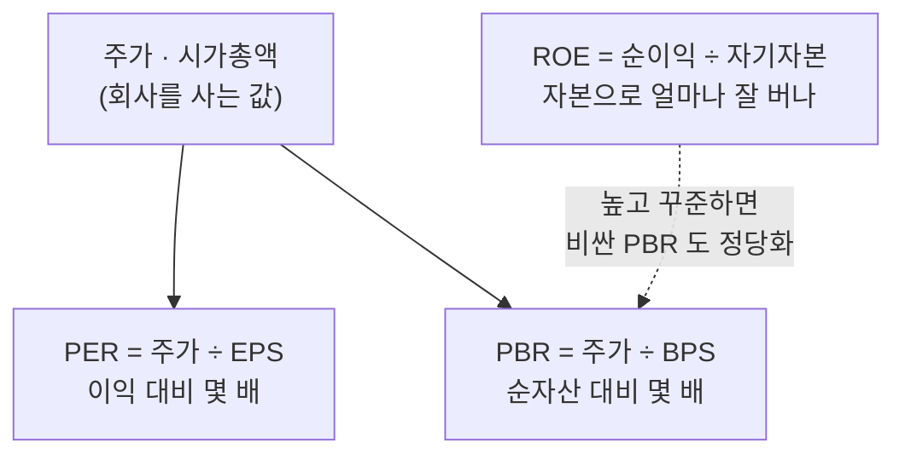

[지난 투자 글](/stocks-before-you-start)에서 "가격은 단기엔 심리, 장기엔 가치에 수렴한다"고 했습니다. 그러면 자연스럽게 다음 질문이 따라옵니다. **그 "가치"라는 걸 대체 어떻게 재나요?** 오늘은 그 첫걸음으로, 가장 많이 쓰이는 세 가지 기본 지표 — PER, PBR, ROE — 를 읽는 법을 정리해보겠습니다.

미리 말씀드리면, 이 지표들은 **회사를 빠르게 훑어보는 도구**이지 정답을 내주는 마법 공식이 아닙니다. 지표만 보고 사고파는 건 위험하고, 각 지표에는 반드시 알아야 할 함정이 있습니다. 그 함정까지 함께 짚는 게 이 글의 목적입니다.

> ⚠️ 이 글은 개인적으로 공부한 내용을 정리한 것이며, 투자 권유나 자문이 아닙니다. 특정 종목에 대한 이야기도 없습니다.

## 먼저: 주가 숫자 자체는 아무것도 말해주지 않는다

가장 흔한 착각부터 깨고 시작하겠습니다. "A주식은 5천 원이고 B주식은 50만 원이니, A가 훨씬 싸다"— 틀렸습니다.

주가는 회사의 가치를 **총 주식 수로 나눈 값**일 뿐입니다. 같은 가치의 회사라도 주식을 잘게 쪼개면 주당 가격은 싸 보이고, 크게 묶으면 비싸 보입니다. 그래서 주당 가격끼리 비교하는 건 의미가 없습니다.

의미 있는 비교는 **"이 회사 전체를 사는 값(시가총액)"을 "이 회사가 만들어내는 무언가"와 견주는 것**입니다. 그 "무언가"가 이익이면 PER, 순자산이면 PBR이 됩니다. 세 지표를 하나씩 보겠습니다.



## PER — 이익 대비 몇 배에 거래되나

**PER(주가수익비율)** 은 가장 널리 쓰이는 지표입니다. 계산은 간단합니다.

```text
EPS(주당순이익) = 순이익 ÷ 총 주식 수
PER = 주가 ÷ EPS
```

예를 들어 주가가 1만 원이고 EPS가 1,000원이면 PER은 10입니다. 이 숫자를 직관적으로 해석하면 이렇습니다. **"지금 이익이 그대로 유지된다면, 이 회사를 산 값을 이익으로 회수하는 데 약 10년이 걸린다."** PER 10은 10년, PER 30은 30년인 셈입니다. 그래서 PER이 낮을수록 "이익에 비해 싸게 거래된다"고 볼 수 있습니다.

여기까지만 보면 "PER 낮은 걸 사면 되겠네"싶지만, 함정이 많습니다.

- **낮은 PER에는 이유가 있을 수 있습니다.** 시장이 그 회사의 이익이 곧 줄어들 거라 예상하면 주가를 미리 낮춰, PER이 낮아 보입니다. 싸 보여서 샀는데 실적이 계속 나빠지는 이른바 **가치 함정(value trap)** 입니다.
- **높은 PER이 꼭 비싼 건 아닙니다.** 앞으로 이익이 빠르게 성장할 회사라면, 사람들이 미래 이익을 기대해 지금 높은 값을 매깁니다. 성장주의 PER이 높은 건 그래서입니다.
- **업종마다 기준이 다릅니다.** 성숙한 제조업의 PER 10과 고성장 IT의 PER 30을 같은 잣대로 비교할 수 없습니다. PER은 **같은 업종 안에서, 또는 그 회사의 과거와** 비교해야 의미가 생깁니다.
- **적자 기업에는 무의미합니다.** 순이익이 마이너스면 PER은 계산 자체가 성립하지 않습니다.

## PBR — 순자산 대비 몇 배에 거래되나

**PBR(주가순자산비율)** 은 이익이 아니라 **자산**을 기준으로 봅니다.

```text
BPS(주당순자산) = 순자산(자본총계) ÷ 총 주식 수
PBR = 주가 ÷ BPS
```

여기서 순자산이란 회사의 전체 자산에서 갚아야 할 빚을 뺀, 이론상 "지금 회사를 청산하면 주주에게 남는 몫"입니다. PBR이 1이면 주가가 딱 그 장부상 순자산만큼, 0.8이면 순자산보다 싸게, 2면 두 배 값에 거래된다는 뜻입니다.

그래서 **PBR이 1보다 낮으면 "청산가치보다도 싸다"** 고 볼 수도 있는데, 이 역시 그대로 믿으면 안 됩니다.

- **자산의 질이 다릅니다.** 장부에 적힌 자산이 실제로 그 값을 받고 팔 수 있는지는 별개입니다. 낡은 공장·재고가 장부값만큼 안 나갈 수 있습니다.
- **업종에 따라 애초에 자산이 적습니다.** 소프트웨어·플랫폼 기업은 공장 같은 유형자산이 거의 없어 순자산이 작고, 그래서 PBR이 구조적으로 높게 나옵니다. 이런 회사에 PBR 잣대를 들이대는 건 잘 안 맞습니다.
- **꾸준히 PBR이 낮은 데는 이유가 있습니다.** "싼데 안 오르는" 상태가 몇 년째면, 시장이 그 자산을 그만큼 신뢰하지 않는다는 신호일 수 있습니다.

## ROE — 자본으로 얼마나 잘 버나

앞의 둘이 "싼가 비싼가"를 봤다면, **ROE(자기자본이익률)** 는 **"이 회사가 애초에 좋은 회사인가"** 를 봅니다.

```text
ROE = 순이익 ÷ 자기자본(순자산) × 100(%)
```

주주가 맡긴 돈(자기자본)으로 한 해에 얼마를 벌었는지를 백분율로 나타낸 것입니다. ROE가 15%라면, 주주 자본 100을 굴려 한 해 15를 벌었다는 뜻입니다. 워런 버핏이 기업의 수익성을 볼 때 가장 중시한 지표로도 유명합니다. **높은 ROE가 여러 해 꾸준히 유지되는 회사**는, 자본을 효율적으로 굴려 계속 가치를 키우는 좋은 사업일 가능성이 높습니다.

흥미롭게도 세 지표는 서로 연결돼 있습니다. 대략 **PBR ≈ PER × ROE** 의 관계가 성립하는데, 풀어 말하면 "ROE가 높은(잘 버는) 회사는 순자산 대비 비싼 값(높은 PBR)을 받는 게 정당하다"는 이야기가 됩니다. PBR이 높다고 무조건 비싼 게 아니라, 그만큼 잘 버는 회사라면 납득이 된다는 뜻입니다.

물론 ROE에도 함정이 있습니다. **빚으로 부풀릴 수 있다**는 점입니다. 자기자본을 줄이고 부채를 늘리면 분모가 작아져 ROE가 높아 보입니다. 그래서 ROE는 반드시 **부채 수준(부채비율)과 함께** 봐야 하고, 빚 없이도 높은 ROE를 내는 회사가 진짜 강한 회사입니다.

## 지표는 반드시 "함께, 상대적으로" 봐야 한다

여기까지 오면 핵심이 보입니다. **어느 지표도 하나만으로는 답을 주지 않습니다.**

- PER만 낮은 걸 좇으면 가치 함정에 빠지고,
- PBR만 낮은 걸 좇으면 죽어가는 자산을 사며,
- ROE만 높은 걸 좇으면 빚으로 부풀린 회사를 삽니다.

그래서 실제로는 세 지표를 **엮어서**, 그리고 **상대적으로** 봅니다. "이익 대비 싸고(PER), 자산 대비도 무리가 없고(PBR), 그런데 자본을 잘 굴려 잘 벌기까지 하는(ROE)" 회사인지를 종합해서 보는 거죠. 그리고 그 숫자들은 늘 **같은 업종의 다른 회사, 그리고 그 회사 자신의 과거**와 비교할 때만 의미가 생깁니다. PER 12가 싼지 비싼지는, 경쟁사가 20이고 과거 평균이 15였는지를 알아야 판단할 수 있습니다.

## 지표의 근본적인 한계

마지막으로, 이 지표들이 공통으로 가진 한계를 분명히 해두고 싶습니다.

- **대부분 과거를 봅니다.** PER·PBR·ROE는 이미 발표된 실적과 자산에 기반한 **후행 지표**입니다. 주가는 미래를 보고 움직이는데, 지표는 과거를 말합니다. 이 시차가 착시를 만듭니다.
- **회계 숫자를 믿는다는 전제가 깔려 있습니다.** 이익도 자산도 회계 기준에 따라 부풀리거나 줄일 여지가 있습니다. 숫자 자체를 한 번은 의심해야 합니다.
- **사업의 질을 담지 못합니다.** 브랜드, 경영진, 시장 지위 같은 정성적 강점은 어떤 지표에도 안 잡힙니다.

그래서 지표는 **결론이 아니라 출발점**입니다. "이 회사 한번 자세히 들여다볼까?"를 정하는 1차 필터일 뿐, 그다음엔 회사가 무슨 사업을 어떻게 하는지를 직접 이해하는 과정이 반드시 따라와야 합니다.

## 정리

- 주가 숫자 자체는 싼지 비싼지 말해주지 않습니다. **버는 것·가진 것 대비**로 봐야 합니다.
- **PER** = 이익 대비 몇 배 — 낮으면 싸 보이지만 가치 함정과 성장 기대를 함께 보세요.
- **PBR** = 순자산 대비 몇 배 — 1 미만이 무조건 싼 건 아니고, 자산의 질과 업종을 보세요.
- **ROE** = 자본으로 얼마나 잘 버나 — 높고 꾸준하면 좋은 회사, 단 빚으로 부풀렸는지 확인하세요.
- 어느 하나도 단독으로는 답이 아닙니다. **함께, 같은 업종·과거와 상대적으로** 보고, 지표는 출발점으로만 쓰세요.

첫 글에서 말한 "장기엔 가치"를 이제 조금은 손에 잡히게 잴 수 있게 됐습니다. 다음 투자 글에서는 이 지표들이 잘 안 통하는 성장주를 어떻게 봐야 하는지, 혹은 개별 종목의 부담을 더는 ETF·인덱스 투자를 다뤄볼까 합니다.

> 다시 한번, 이 글은 투자 권유가 아니며 모든 판단과 책임은 본인에게 있습니다.
