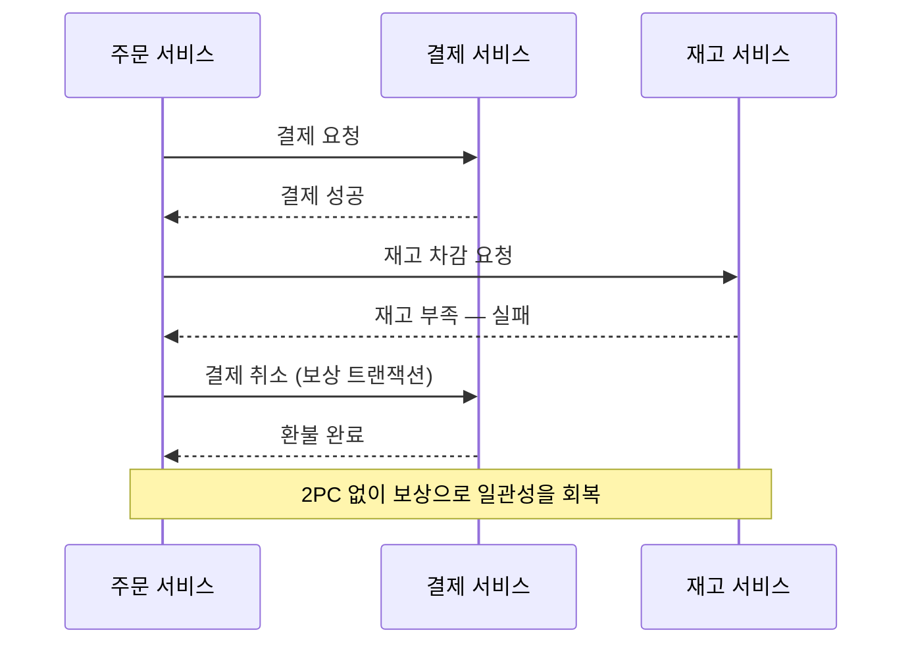

마이크로서비스 글은 대개 "이렇게 하면 됩니다"로 끝납니다. 그런데 막상 모놀리식을 쪼개보면, 정작 어려운 건 다이어그램에 그려지지 않는 부분이었습니다. 이 글은 잘 정리된 모범 답안이 아니라, **실제로 모놀리식을 분리하며 데었던 자리**들을 솔직하게 적은 회고입니다.

먼저 분명히 해두고 싶은 게 있습니다. 우리가 쪼개기로 한 건 "마이크로서비스가 멋져서"가 아니었습니다. 그렇게 시작한 전환은 대부분 후회로 끝납니다. 우리에게는 구체적인 고통이 있었습니다 — 배포 한 번에 전체가 멈췄고, 작은 기능 하나를 고치려 해도 거대한 코드베이스 전체를 이해해야 했으며, 한 팀의 변경이 다른 팀의 기능을 깨뜨리는 일이 반복됐습니다. **"왜 쪼개는가"에 대한 답이 명확했기 때문에** 시작할 수 있었고, 돌아보면 그 답이 분명했던 것 자체가 가장 중요한 출발 조건이었습니다.

## 첫 번째 교훈 — 경계를 잘못 그으면 "분산 모놀리스"가 된다

가장 먼저, 그리고 가장 비싸게 배운 교훈입니다. 처음 우리는 서비스를 **기술 레이어로** 나눴습니다. "API 서비스", "DB 서비스", "배치 서비스" 같은 식으로요. 그럴듯해 보였지만 결과는 최악이었습니다. 기능 하나를 추가하려면 세 서비스를 동시에 고치고 동시에 배포해야 했습니다. 네트워크로 쪼개놓고는 여전히 한 몸처럼 움직이는, 이른바 **분산 모놀리스(distributed monolith)** — 모놀리식의 단점에 분산 시스템의 복잡성까지 얹은 최악의 조합이었습니다.

다시 그은 경계는 **비즈니스 능력(business capability)** 기준이었습니다. "주문", "결제", "재고", "정산"처럼 한 가지 일을 끝까지 책임지는 단위로 나누니, 비로소 한 기능의 변경이 한 서비스 안에서 끝나기 시작했습니다. 판단 기준은 단순했습니다. **"이 변경이 서비스 하나 안에서 끝나는가, 아니면 늘 여러 서비스를 함께 고쳐야 하는가."** 후자가 반복된다면 경계가 잘못 그어진 것입니다.

여기서 얻은 또 하나의 교훈은 **"처음부터 완벽한 경계는 못 긋는다"는 것**이었습니다. 도메인에 대한 이해가 깊어질수록 경계는 바뀝니다. 그래서 경계가 의심스러운 두 영역은 차라리 **한 서비스 안에 같이 두고**, 정말로 갈라야 할 이유가 분명해졌을 때 쪼개는 편이 안전했습니다. 잘못 합친 건 나중에 나눌 수 있지만, 잘못 나눈 건 되돌리기가 훨씬 어렵기 때문입니다.

## 가장 어려웠던 것 — 데이터를 나누는 일

코드를 나누는 건 사실 쉬운 편이었습니다. 진짜 난관은 **데이터**였습니다.

모놀리식에서는 하나의 데이터베이스 안에서 테이블을 자유롭게 조인했습니다. 주문 테이블과 회원 테이블을 한 번의 쿼리로 묶는 게 당연했죠. 그런데 서비스를 나누면 그 조인이 **사라집니다.** 회원 서비스의 DB와 주문 서비스의 DB가 분리되면, 더 이상 `JOIN`으로 둘을 엮을 수 없습니다. "서비스마다 자기 데이터는 자기가 소유한다"는 원칙을 지키려면, 다른 서비스의 DB를 직접 들여다보는 길을 막아야 했습니다.

이 지점에서 두 가지 현실적인 어려움이 있었습니다.

- **외래키가 사라진다** — DB가 보장해주던 참조 무결성을 이제 애플리케이션이 책임져야 합니다. 존재하지 않는 회원의 주문이 생기지 않도록, 정합성을 코드와 이벤트로 지켜야 했습니다.
- **조인이 필요한 화면** — "회원 정보와 주문 내역을 한 화면에" 보여줘야 하는데 데이터가 두 서비스에 흩어져 있습니다. 매번 서비스를 호출해 합치자니 느리고, 그래서 자주 함께 조회되는 데이터는 **읽기 전용으로 복제**(데이터 비정규화)해두는 방식을 택했습니다. 단일 진실은 한 서비스가 갖되, 다른 서비스가 읽기용 사본을 이벤트로 동기화하는 식입니다.

데이터 분리는 "한 번에 깔끔하게" 되지 않았습니다. 한동안은 **두 서비스가 같은 DB를 보면서도 테이블만 나눠 쓰는** 어정쩡한 중간 단계를 거쳤고, 트래픽과 정합성 검증을 충분히 쌓은 뒤에야 물리적으로 DB를 갈랐습니다. 데이터 분리는 전환에서 가장 천천히, 가장 신중하게 진행해야 하는 부분이었습니다.

## 분산 트랜잭션 — 2PC를 버리고 saga로

데이터가 나뉘자 곧바로 다음 문제가 따라왔습니다. "**주문을 받으면 결제하고 재고를 차감한다**"처럼 여러 서비스에 걸친 작업의 일관성을 어떻게 지키느냐였습니다. 모놀리식이라면 트랜잭션 하나로 묶으면 끝이었지만, 서비스가 나뉜 지금은 그게 불가능했습니다.

전통적인 해법인 2단계 커밋(2PC)은 일찌감치 접었습니다. 서비스 하나가 멈추면 전체가 잠기는 데다, 확장성과 가용성을 심하게 해쳤기 때문입니다. 대신 **saga 패턴**을 택했습니다. 하나의 큰 트랜잭션을 **여러 개의 로컬 트랜잭션으로 쪼개고, 중간에 실패하면 앞서 성공한 단계를 되돌리는 보상 트랜잭션**(compensating transaction)으로 일관성을 회복하는 방식입니다.

saga를 도입하며 받아들여야 했던 가장 큰 변화는 **"즉각적인 일관성을 포기한다"는 것**이었습니다. 결제와 재고 차감 사이에는 아주 짧지만 분명히 "결제는 됐는데 재고는 아직"인 순간이 존재합니다. 이 **결과적 일관성**(eventual consistency)을 받아들이고, 그 짧은 불일치 구간에도 시스템이 올바르게 동작하도록 설계해야 했습니다.

여기서 실수도 했습니다. 보상 트랜잭션을 **나중에 끼워 넣으려** 했던 겁니다. "일단 정상 흐름부터 만들고 실패 처리는 나중에"라는 생각이었는데, 이건 틀렸습니다. saga에서 보상 로직은 부가 기능이 아니라 **설계의 절반**입니다. 처음부터 "이 단계가 실패하면 무엇을 어떻게 되돌릴 것인가"를 함께 설계하지 않으면, 나중에 끼워 넣은 보상 로직은 반드시 구멍이 생깁니다.

## 장애가 전파된다 — 동기 호출의 함정

쪼개고 나서 가장 당황스러웠던 건, **한 서비스의 장애가 멀쩡한 서비스까지 끌고 내려가는** 현상이었습니다.

서비스 A가 B를 동기로 호출하고, B가 C를 호출하는 구조에서 C가 느려지면, B의 스레드가 C의 응답을 기다리며 묶이고, 그 사이 A의 요청도 B에서 쌓입니다. 결국 C 하나의 지연이 A·B·C 전체의 장애로 번집니다. 모놀리식에서는 없던, 분산 시스템 특유의 연쇄 실패(cascading failure)였습니다.

여기서 우리가 적용한 대비책은 세 가지였습니다.

- **deadline과 타임아웃** — 모든 서비스 간 호출에 명시적인 deadline을 걸었습니다. gRPC를 쓰고 있었기에 deadline이 호출 체인을 따라 전파되도록 해서, "이미 늦어버린 요청"에 더는 자원을 쓰지 않게 했습니다. 타임아웃 없는 호출은 분산 시스템에서 시한폭탄입니다.
- **재시도, 그러나 신중하게** — 일시적 실패는 재시도로 넘기되, 멱등성이 보장되지 않는 호출을 무턱대고 재시도하면 결제가 두 번 되는 사고가 납니다. 재시도에는 멱등키와 백오프가 반드시 함께 가야 했습니다.
- **회로 차단기(circuit breaker)** — 특정 서비스가 계속 실패하면, 한동안 아예 호출을 끊고 빠르게 실패시켜 호출하는 쪽을 보호했습니다. 죽어가는 서비스를 계속 두드리는 것보다, 잠시 포기하는 게 전체에는 이득이었습니다.

그리고 더 근본적으로는, **꼭 동기일 필요가 없는 호출은 비동기 이벤트로 바꿨습니다.** "주문이 생기면 알림을 보낸다" 같은 흐름은 주문 서비스가 알림 서비스를 직접 호출할 이유가 없습니다. 주문 서비스는 "주문 생성됨" 이벤트만 발행하고, 알림 서비스가 그걸 구독해 처리하면, 알림 서비스가 잠시 죽어 있어도 주문은 멀쩡히 처리됩니다. **동기 호출을 줄이는 것이 곧 장애 격리**라는 걸, 데이고 나서야 제대로 이해했습니다.

## 디버깅이 지옥이 된다 — 관찰성의 재발견

모놀리식에서 버그를 쫓는 건 로그 하나를 따라가면 됐습니다. MSA에서는 **하나의 요청이 대여섯 개 서비스를 거치며**, 각 서비스의 로그가 따로 흩어집니다. "주문이 왜 실패했지?"를 추적하려면 여러 서비스의 로그를 시간순으로 맞춰가며 퍼즐을 맞춰야 했습니다.

이걸 견딜 만하게 만들어준 게 **분산 추적**이었습니다. 요청이 처음 들어올 때 추적 ID(correlation ID)를 부여하고, 그게 모든 서비스 호출을 따라 전파되게 했습니다. 그러면 흩어진 로그를 추적 ID 하나로 묶어, "이 요청이 어느 서비스에서 몇 ms 걸렸고 어디서 실패했는지"를 한 줄로 따라갈 수 있게 됩니다. **MSA로 가기로 했다면, 분산 추적은 선택이 아니라 전제 조건**입니다. 이걸 나중에 붙이려 하면 이미 디버깅으로 너무 많은 시간을 태운 뒤일 겁니다.

## 보이지 않는 비용 — 조직과 운영

기술 이야기를 많이 했지만, 사실 가장 과소평가했던 비용은 **운영과 조직** 쪽이었습니다.

서비스가 열 개가 되면, 파이프라인도 열 개, 모니터링 대시보드도 열 개, 온콜로 깨어날 컴포넌트도 열 개가 됩니다. 모놀리식 하나를 운영하던 부담이 서비스 수만큼 곱해집니다. 그래서 MSA는 **그 운영 부담을 감당할 자동화(CI/CD·IaC·관찰성)가 먼저 갖춰져 있을 때** 비로소 이득이 됩니다. 우리가 전환 초기에 파이프라인 표준화와 배포 자동화에 공을 들인 건, 돌아보면 가장 잘한 결정 중 하나였습니다.

그리고 콘웨이의 법칙을 실감했습니다. **서비스 경계는 결국 팀 경계를 따라간다**는 것입니다. 한 서비스를 두 팀이 나눠 소유하면 그 서비스는 늘 조율 비용에 시달렸고, 반대로 한 팀이 너무 많은 서비스를 가지면 그 팀이 병목이 됐습니다. 서비스를 나누는 일은 사실 **팀을 나누는 일**이기도 했습니다.

## 다시 한다면 — 한꺼번에 쪼개지 않는다

전환을 끝내고 가장 많이 든 생각은 "처음부터 이렇게 했다면"이었습니다. 다시 한다면 이렇게 하겠습니다.

- **모듈러 모놀리스부터** — 처음부터 네트워크로 쪼개는 대신, 한 코드베이스 안에서 모듈 경계를 또렷이 나눠봅니다. 경계가 맞는지 코드 안에서 먼저 검증하고, 정말로 독립 배포·독립 확장이 필요한 모듈만 떼어냅니다. 네트워크 경계는 되돌리기 비싸지만, 모듈 경계는 싸게 옮길 수 있습니다.
- **가장 아픈 곳 하나만** — "다 쪼갠다"가 아니라, 독립 배포가 가장 절실한 한 부분만 먼저 떼어냅니다. 트래픽이 폭증해 따로 확장해야 하는 모듈, 배포 주기가 유독 다른 모듈처럼요. 첫 분리에서 배운 것으로 다음 분리를 합니다.
- **데이터 분리를 가장 마지막에, 가장 신중하게** — 앞서 적었듯 데이터가 가장 어렵습니다. 코드와 배포를 먼저 나누고, 데이터는 정합성을 충분히 검증한 뒤에 가릅니다.

## 정리 — MSA는 목표가 아니라 트레이드오프

모놀리식 분리 경험을 한 문장으로 압축하면 이렇습니다. **마이크로서비스는 도달해야 할 목표가 아니라, 구체적인 고통을 해결하기 위해 더 큰 복잡성을 감수하는 트레이드오프입니다.**

- 경계는 **비즈니스 능력**으로 긋고, 잘못 그으면 분산 모놀리스가 됩니다.
- **데이터 분리**가 가장 어렵습니다 — 조인이 사라지고, 정합성을 코드가 책임집니다.
- 분산 트랜잭션은 2PC가 아니라 **saga와 결과적 일관성**으로, 보상 로직은 처음부터 설계합니다.
- **장애는 전파됩니다** — deadline·재시도·회로 차단기, 그리고 동기 호출을 줄이는 것으로 격리합니다.
- **분산 추적은 전제 조건**이고, **운영·조직 비용**은 거의 항상 과소평가됩니다.

그래서 누군가 "우리도 마이크로서비스로 가야 할까요?"라고 물으면, 저는 되묻습니다. **"지금 무엇이 그렇게 아픈가요?"** 그 답이 분명하지 않다면, 아직은 모놀리식을 더 잘 가꾸는 편이 낫습니다. MSA는 그 고통이 자동화로 감당할 만한 복잡성보다 커졌을 때, 비로소 제값을 하는 선택입니다.
