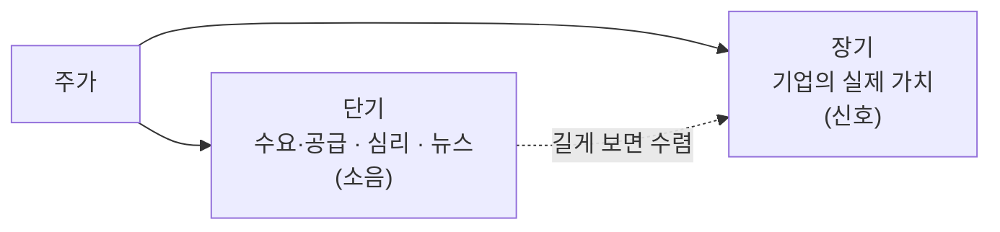

요즘 부쩍 주식 이야기가 많이 들립니다. 뉴스에도, 유튜브에도, 심지어 오랜만에 만난 친구 입에서도 종목 이름이 튀어나옵니다. 저도 개발만 하다가 어느 순간 "이거 나도 좀 알아야 하나" 싶어 기웃거리기 시작했는데, 막상 발을 들이니 정보는 넘치는데 **정작 뭘 먼저 알아야 하는지**를 짚어주는 이야기는 드물더군요.

그래서 이 글은 종목 추천 글이 아닙니다. "이걸 사세요" 같은 말은 한 마디도 없습니다. 대신 처음 관심이 생겼을 때 **사기 전에 한 번쯤 정리해두면 좋은 것들** — 가격은 왜 움직이는지, 투자와 투기는 무엇이 다른지, 초보가 자주 빠지는 함정은 무엇인지 — 를 담았습니다. 결국 투자에서 오래 살아남는 건 "무엇을 사느냐"보다 "어떻게 생각하느냐"에 달려 있다고 믿기 때문입니다.

> ⚠️ 이 글은 개인적인 생각을 정리한 것이며, 투자 권유나 자문이 아닙니다. 모든 투자의 판단과 책임은 본인에게 있습니다.

## 주식을 산다는 건 무슨 뜻인가

가장 기본부터 짚고 싶습니다. 주식을 산다는 건 **어떤 회사의 아주 작은 조각(지분)을 소유하는 것**입니다. 삼성전자 주식을 한 주 사면, 비율은 미미하지만 나는 삼성전자라는 회사의 일부를 가진 주주가 됩니다.

이 정의가 사소해 보여도 중요합니다. 여기서 곧바로 **투자와 투기의 차이**가 갈리기 때문입니다.

- **투자**는 "이 회사가 앞으로 더 많은 가치를 만들어낼 것"이라고 판단해 그 지분을 사는 것입니다. 근거는 회사의 사업, 실적, 미래입니다.
- **투기**는 회사가 무엇을 하는지와 무관하게, "이 가격이 곧 오를 것 같으니 사서 비싸게 팔겠다"는 것입니다. 근거는 오직 가격의 움직임입니다.

둘 다 돈을 벌 수는 있지만, 성격이 완전히 다릅니다. 문제는 많은 초보가 **투자라고 생각하면서 실제로는 투기를 하고 있다**는 점입니다. "왜 이 회사를 샀나요?"라는 질문에 "오를 것 같아서요" 말고는 답이 없다면, 그건 투자가 아니라 투기입니다. 나쁘다는 게 아니라, 적어도 **내가 지금 무엇을 하고 있는지는 알고 있어야** 한다는 뜻입니다.

## 가격은 왜 오르내리는가

주가만큼 사람 마음을 들었다 놨다 하는 것도 없습니다. 그런데 이 움직임을 두 개의 시간대로 나눠 보면 훨씬 차분해집니다.

**단기적으로**, 가격은 결국 그 순간의 **수요와 공급**으로 정해집니다. 사려는 사람이 팔려는 사람보다 많으면 오르고, 반대면 내립니다. 그리고 그 수요·공급은 실적 같은 냉정한 숫자보다 **기대와 심리, 뉴스, 분위기**에 훨씬 크게 흔들립니다. 그래서 좋은 회사인데도 주가가 빠지고, 별것 아닌데도 급등하는 일이 매일 벌어집니다. 하루하루의 가격은 상당 부분 **소음**입니다.

**장기적으로는** 이야기가 다릅니다. 시간이 충분히 길어지면, 가격은 결국 **그 회사가 실제로 벌어들이는 가치**에 수렴하는 경향이 있습니다. 워런 버핏의 스승 벤저민 그레이엄이 남긴 유명한 비유가 이걸 잘 압축합니다.

> 단기적으로 시장은 투표기(voting machine)이지만, 장기적으로는 저울(weighing machine)이다.

투표기는 인기 투표라 그날그날의 기분에 휘둘리고, 저울은 결국 무게(진짜 가치)를 정직하게 잽니다. 초보일수록 매일의 투표 결과(호가창)에 마음을 뺏기기 쉬운데, 정작 중요한 건 저울 위의 무게입니다.

## 초보가 빠지기 쉬운 함정들

제가 기웃거리며, 또 주변을 보며 반복해서 목격한 함정들이 있습니다. 대부분 지식의 문제가 아니라 **감정의 문제**였습니다.

- **몰빵** — 한 종목에 전 재산을 겁니다. 맞으면 크게 벌지만, 틀리면 회복 불가능한 타격을 입습니다. 투자에서 가장 중요한 건 "크게 버는 것"이 아니라 "**게임에서 퇴출당하지 않는 것**"입니다.
- **뇌동매매(FOMO)** — 남들이 다 벌었다는 소식에 뒤늦게 뛰어듭니다. 대개 그 소식이 들릴 때쯤이면 이미 많이 오른 뒤이고, 고점에서 사서 물리기 딱 좋습니다.
- **타이밍 맞추기** — "바닥에 사서 꼭대기에 판다." 말은 쉽지만, 시장의 바닥과 꼭대기를 꾸준히 맞히는 사람은 사실상 없습니다. 전설적인 투자자들조차 못 합니다.
- **손실을 못 견디기** — 오른 주식은 조금 벌고 얼른 팔아 이익을 확정하고, 내린 주식은 "언젠간 오르겠지"하며 끌어안습니다. 이익은 짧게 자르고 손실은 길게 키우는, 정확히 반대로 하는 습관입니다.

이 함정들의 공통점은, 머리로는 다 알면서도 **막상 내 돈이 걸리면 감정이 이성을 이긴다**는 것입니다. 그래서 투자는 종목 분석 실력보다 **자기 감정을 다루는 규율**의 싸움에 가깝습니다.

## 그럼 무엇을 붙잡아야 할까

함정을 이야기했으니, 그 반대편의 원칙들도 정리해보겠습니다. 화려하지 않고 지루하지만, 오래 살아남은 사람들이 대체로 공유하는 것들입니다.

- **분산투자** — 계란을 한 바구니에 담지 않습니다. 여러 종목, 여러 자산에 나눠 담으면 하나가 무너져도 전체가 흔들리지 않습니다. 몰빵의 정반대입니다.
- **장기와 복리** — 투자의 진짜 힘은 **복리**에서 나옵니다. 수익이 다시 수익을 낳는 눈덩이 효과는 시간이 길수록 극적으로 커집니다. 그래서 "얼마나 높은 수익률이냐"보다 "얼마나 오래, 꾸준히 시장에 남아 있느냐"가 더 중요할 때가 많습니다.
- **내가 이해하는 것에 투자** — 무슨 일을 해서 돈을 버는지 설명할 수 없는 회사라면, 그 주가의 등락도 이해할 수 없습니다. 이해하지 못하는 것에 걸면 조금만 흔들려도 버티지 못합니다.
- **잃어도 되는 돈으로** — 당장 몇 달 뒤 필요한 전세금이나 생활비를 주식에 넣으면, 하락장에서 가장 나쁜 시점에 팔 수밖에 없게 됩니다. 시간을 견딜 수 있는 돈이라야 시장의 변동을 견딜 수 있습니다.

많은 사람에게 현실적인 출발점으로 자주 언급되는 것이 **인덱스 투자**입니다. 개별 종목을 고르는 대신 시장 전체(예: 지수)를 통째로 사는 방식인데, "대부분의 개인은 시장을 이기지 못한다"는 오랜 데이터 위에서 나온 접근입니다. 화려하진 않지만, 초보가 앞의 함정 대부분을 자연스럽게 피하게 해줍니다. (물론 이것도 정답이라기보다 하나의 선택지입니다.)

## 개발자의 눈으로 덧붙이자면

개발을 하다 투자를 보니, 묘하게 닮은 지점이 있었습니다.

백테스트라는 게 있습니다. 과거 데이터에 어떤 매매 규칙을 대입해 "이렇게 했으면 벌었다"를 확인하는 건데, 여기엔 **과적합**(overfitting)이라는 함정이 있습니다. 과거에 완벽히 들어맞도록 규칙을 깎다 보면, 정작 미래에는 전혀 안 맞는 규칙이 만들어집니다. 코드에서 테스트 데이터에만 맞춘 모델이 실전에서 무너지는 것과 똑같습니다. "과거에 이 패턴으로 벌었다"는 이야기를 들을 때 한 번쯤 의심해봐야 하는 이유입니다.

또 하나, 개발에서 배운 "**측정할 수 없으면 관리할 수 없다**"도 그대로 통합니다. 내가 왜 이 종목을 샀고, 어떤 근거가 깨지면 팔 것인지를 미리 적어두는 것 — 일종의 투자 일지 — 은, 감정이 끼어드는 순간 나를 붙잡아주는 로그이자 테스트 케이스가 됩니다.

## 정리

첫 주식 글을 한 문장으로 압축하면 이렇습니다. **처음 관심이 생겼을 때 서둘러 무언가를 사기보다, 가격의 원리와 나 자신의 감정을 먼저 이해하는 편이 훨씬 남는 장사입니다.**

- 주식은 **회사의 조각**을 사는 것 — 투자와 투기를 구분하세요.
- 가격은 **단기엔 심리, 장기엔 가치** — 매일의 소음보다 저울 위의 무게를 보세요.
- 함정은 대개 **감정** — 몰빵·FOMO·타이밍·손실 회피를 경계하세요.
- 원칙은 지루하지만 강합니다 — **분산·장기·복리·이해·잃어도 되는 돈.**

무엇을 사야 할지는 이 글에 없습니다. 그건 각자의 몫이고, 솔직히 저도 여전히 배우는 중입니다. 다만 시작점에서 이 정도만 붙잡아도, 적어도 남들이 흔히 밟는 지뢰 몇 개는 피할 수 있으리라 생각합니다.

이 글은 **「주식 투자 기초」 시리즈의 첫 편**입니다. 다음 편부터는 회사를 실제로 평가하는 법(PER·PBR·ROE)에서 시작해, 성장주·분산투자·ETF·매매 규율까지 순서대로 이어집니다. 전체 흐름은 이 글 맨 아래 목록에서 볼 수 있습니다. 하나씩 차근히 따라오시면 됩니다.

> 다시 한번, 이 글은 투자 권유가 아니며 모든 판단과 책임은 본인에게 있습니다. 즐겁고 건강한 투자 되시길 바랍니다.
