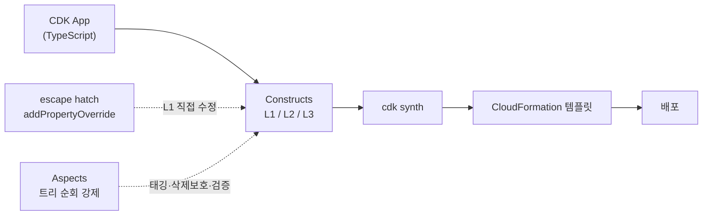

CDK를 처음 쓸 때의 인상은 대개 비슷합니다. `new s3.Bucket(this, 'Assets')` 한 줄로 버킷이 생기고, `grantRead`로 IAM 정책이 알아서 붙습니다. Terraform의 장황한 HCL을 겪어본 분이라면 해방감마저 느끼실 겁니다.

문제는 그 다음입니다. 서비스가 프로덕션에 올라가고, 리소스가 수백 개가 되고, 팀이 늘어나면 CDK의 "알아서 해주는" 추상화가 정확히 그 지점에서 발목을 잡습니다. L2 construct가 노출하지 않는 속성을 건드려야 하고, 누군가 stateful 리소스를 실수로 교체(replace)해 데이터를 날리고, `cdk deploy` 결과가 매번 미묘하게 달라집니다.

이 글에서는 CDK를 "편한 장난감"에서 "운영 가능한 IaC"로 끌어올리는 세 가지 도구 — **escape hatch**, **Aspects**, **커스텀 construct** — 와 그 위에 얹는 **안정화 전략**을 함께 살펴보려 합니다. CDK v2 / TypeScript 기준입니다.

## 추상화 계층부터 다시 보기

CDK 코드를 디버깅하려면 먼저 추상화 레벨을 구분하는 게 좋습니다.

| 레벨 | 예시 | 정체 |
|---|---|---|
| **L1 (Cfn*)** | `CfnBucket` | CloudFormation 리소스의 1:1 매핑. 모든 속성이 그대로 노출 |
| **L2** | `Bucket` | 합리적 기본값 + 헬퍼 메서드(`grantRead` 등) |
| **L3 (Pattern)** | `ApplicationLoadBalancedFargateService` | 여러 리소스를 묶은 의견 있는 조합 |

L2·L3가 편한 이유와 발목을 잡는 이유는 사실 **같습니다**. 결정을 대신 내려주기 때문입니다. 그래서 그 결정이 내 요구와 어긋나는 순간, 우리는 추상화를 *뚫고 내려가야* 합니다. 그 통로가 escape hatch입니다.

여기서 한 가지 더 짚고 싶은 게 있습니다. **레벨이 높을수록 편하지만, 탈출 비용도 함께 커집니다.** L3 패턴은 ALB·Fargate 서비스·로그 그룹·보안 그룹·타깃 그룹을 한 번에 만들어주지만, 그중 보안 그룹 규칙 하나만 손보려 해도 패턴이 감싼 내부 구조를 헤집어야 합니다. 그래서 실무에서는 "처음엔 L3로 빠르게 띄우고, 커스터마이징 요구가 쌓이면 L2 조합으로 풀어 쓰는" 전환이 자주 일어납니다. 어느 레벨이 정답인지는 **"이 리소스를 앞으로 얼마나 세밀하게 제어할 것인가"**로 가늠하면 대체로 맞습니다. 한 번 만들고 거의 안 건드릴 보조 리소스는 L3로 편하게, 두고두고 튜닝할 핵심 리소스는 L2로 직접 조립하는 식입니다.

아래는 CDK가 코드에서 CloudFormation으로 바뀌는 흐름과, escape hatch·Aspects가 끼어드는 지점입니다.



## 1. escape hatch — 추상화가 막힐 때 L1으로 내려가기

L2 construct가 원하는 속성을 노출하지 않을 때, construct를 버리고 L1으로 새로 짜는 건 권하고 싶지 않습니다. 대신 모든 L2는 내부에 L1 자식을 품고 있고, 거기에 직접 접근할 수 있습니다.

```typescript
import { Bucket } from 'aws-cdk-lib/aws-s3';
import { CfnBucket } from 'aws-cdk-lib/aws-s3';

const bucket = new Bucket(this, 'Assets');

// L2가 감싸고 있는 L1 자식을 꺼냅니다
const cfnBucket = bucket.node.defaultChild as CfnBucket;

// L2 API에 없는 속성을 CloudFormation 레벨에서 직접 지정
cfnBucket.addPropertyOverride('VersioningConfiguration.Status', 'Enabled');
cfnBucket.addPropertyOverride('AccelerateConfiguration.AccelerationStatus', 'Enabled');
```

`addPropertyOverride`는 점 표기법으로 중첩 속성에 꽂힙니다. 더 낮은 레벨로 가야 한다면 `addOverride`로 합성 트리의 임의 경로를 덮어쓸 수 있습니다.

```typescript
// Properties 바깥, 리소스 메타데이터까지 덮어쓰기
cfnBucket.addOverride('Metadata.guardduty.scan', 'enabled');

// CDK가 생성한 속성을 아예 제거
cfnBucket.addDeletionOverride('Properties.Tags');
```

`addOverride`의 경로는 합성될 CloudFormation 템플릿의 구조를 그대로 따라갑니다. 배열에는 인덱스로 접근하는데, 예를 들어 첫 번째 태그의 값을 바꾸려면 `addOverride('Properties.Tags.0.Value', 'prod')`처럼 씁니다. 다만 이 경로는 **L2가 만들어내는 CloudFormation 구조에 의존**하기 때문에, CDK 버전이 올라가며 내부 구조가 바뀌면 경로가 어긋나 override가 조용히 무력화될 수 있습니다. 컴파일 에러도 안 나고 합성도 통과하는데 결과만 달라지는, 추적하기 까다로운 부류의 문제입니다. 그래서 raw override를 쓸 때는 뒤에서 다룰 **스냅샷 테스트로 합성 결과를 묶어두어**, 경로가 깨지면 테스트에서 바로 드러나게 해두는 편이 안전합니다.

기억해두면 좋은 원칙이 하나 있습니다. **escape hatch는 "탈출구"이지 "정문"이 아닙니다.** 한두 곳에서 L1을 건드리는 건 자연스럽지만, 코드베이스 전체에 `addPropertyOverride`가 흩뿌려져 있다면 그건 추상화가 잘못됐다는 신호로 봐도 좋습니다. 반복되는 override는 다음 절의 Aspect나 커스텀 construct로 끌어올리는 편이 낫습니다.

> 한 가지 주의할 점이 있습니다. `defaultChild`가 항상 원하는 L1을 가리키진 않습니다. L3 패턴처럼 자식이 여럿이면 `node.findChild('Resource')`나 `node.children`을 직접 탐색해야 합니다. 합성 트리는 `cdk synth`로 언제든 들여다볼 수 있습니다.

## 2. Aspects — 횡단 관심사를 강제하기

"모든 S3 버킷은 암호화돼야 한다", "모든 stateful 리소스는 실수로 삭제되면 안 된다", "prod 스택의 모든 리소스에 비용 태그가 붙어야 한다" — 이런 규칙은 construct 하나가 아니라 **트리 전체**에 걸립니다. 각 construct 생성부에 일일이 끼워 넣으면 누군가는 빠뜨리기 마련입니다.

Aspect는 합성된 construct 트리를 순회하며 모든 노드에 한 가지 일을 적용하는 방문자(visitor)입니다.

```typescript
import { IAspect, Annotations, RemovalPolicy } from 'aws-cdk-lib';
import { IConstruct } from 'constructs';
import { CfnBucket } from 'aws-cdk-lib/aws-s3';
import { CfnTable } from 'aws-cdk-lib/aws-dynamodb';

/**
 * stateful 리소스(S3, DynamoDB)에 RETAIN 정책과 삭제 보호를 강제합니다.
 * 누가 어디서 리소스를 만들든, 합성 시점에 일괄 적용됩니다.
 */
class EnforceStatefulProtection implements IAspect {
  visit(node: IConstruct): void {
    if (node instanceof CfnBucket) {
      node.applyRemovalPolicy(RemovalPolicy.RETAIN);
    }
    if (node instanceof CfnTable) {
      node.applyRemovalPolicy(RemovalPolicy.RETAIN);
      node.addPropertyOverride('DeletionProtectionEnabled', true);
    }
  }
}

// 스택 전체에 적용
import { Aspects } from 'aws-cdk-lib';
Aspects.of(stack).add(new EnforceStatefulProtection());
```

비슷한 결로 **비용 태깅**도 한 곳에서 강제할 수 있습니다. 다만 단순 태깅이라면 Aspect를 직접 짤 필요 없이, CDK가 제공하는 `Tags.of(scope).add(...)`가 더 간단합니다. 이것도 내부적으로는 Aspect로 동작해 하위 트리 전체에 태그를 전파합니다.

```typescript
import { Tags } from 'aws-cdk-lib';

// 이 스택 아래 모든 리소스에 태그가 전파됩니다
Tags.of(stack).add('CostCenter', 'platform');
Tags.of(stack).add('Environment', 'prod');
```

여기서 기억할 건 도구 이름이 아니라 성질입니다. **"한 곳에서 선언하면 트리 전체에 적용된다"**는 Aspect의 성질이, 태깅·삭제 보호·보안 규칙처럼 빠뜨리면 안 되는 일들을 사람의 주의력 대신 합성 단계가 책임지게 만들어 줍니다.

Aspect가 진짜 강력해지는 건 **단순 적용을 넘어 검증·차단**에 쓸 때입니다. `Annotations.of(node).addError(...)`로 에러를 달면 `cdk synth` 자체가 실패합니다. 즉 잘못된 인프라가 배포 파이프라인에 진입하기 전에 멈춰 세울 수 있습니다.

```typescript
class DenyPublicBuckets implements IAspect {
  visit(node: IConstruct): void {
    if (node instanceof CfnBucket) {
      const acl = node.accessControl;
      if (acl && acl.toString().includes('Public')) {
        // 합성 단계에서 실패시킵니다 → CI에서 배포 차단
        Annotations.of(node).addError(
          'public-read 버킷은 정책상 금지됩니다. CloudFront + OAC 를 쓰세요.',
        );
      }
    }
  }
}
```

이 패턴을 제대로 구현한 도구가 **cdk-nag**입니다. AWS Solutions / HIPAA / NIST 등 규칙팩을 Aspect로 제공해 합성 시점에 보안 위반을 잡아줍니다. 직접 규칙을 다 짜기 전에 한 번 검토해볼 만합니다.

```typescript
import { AwsSolutionsChecks } from 'cdk-nag';
Aspects.of(app).add(new AwsSolutionsChecks({ verbose: true }));
```

**적용 순서는 한 번 짚고 넘어가면 좋습니다.** Aspect는 합성 마지막에 트리를 순회합니다. 같은 노드에 여러 Aspect가 속성을 건드리면 우선순위(`AspectPriority`)와 적용 순서가 결과를 좌우합니다. 정책 강제(mutating) Aspect와 검증(read-only) Aspect를 섞을 땐, 검증이 *나중에* 돌도록 우선순위를 명시해두면 안전합니다.

## 3. 커스텀 construct — 의견을 코드로 캡슐화

escape hatch와 Aspect로 "예외"와 "전역 규칙"을 다뤘다면, 커스텀 construct는 **반복되는 조합**을 위한 도구입니다. 팀에서 S3 버킷을 만들 때마다 암호화·버전관리·퍼블릭 차단·로깅을 똑같이 붙이고 있다면, 그건 construct로 굳히는 게 좋습니다.

```typescript
import { Construct } from 'constructs';
import { Bucket, BucketEncryption, BlockPublicAccess, IBucket } from 'aws-cdk-lib/aws-s3';
import { RemovalPolicy } from 'aws-cdk-lib';

interface SecureBucketProps {
  /** prod 에서는 RETAIN, 그 외에는 DESTROY 가 기본 */
  retain?: boolean;
}

/**
 * 우리 조직의 "올바른 S3 버킷"을 하나의 진실로 정의합니다.
 * 새 버킷은 무조건 이걸 쓰게 만들면, 보안 기본값이 코드로 보장됩니다.
 */
export class SecureBucket extends Construct {
  readonly bucket: IBucket;

  constructor(scope: Construct, id: string, props: SecureBucketProps = {}) {
    super(scope, id);

    this.bucket = new Bucket(this, 'Default', {
      encryption: BucketEncryption.S3_MANAGED,
      blockPublicAccess: BlockPublicAccess.BLOCK_ALL,
      enforceSSL: true,
      versioned: true,
      removalPolicy: props.retain ? RemovalPolicy.RETAIN : RemovalPolicy.DESTROY,
    });
  }
}
```

여기서 자주 하게 되는 실수가 하나 있습니다. construct를 만들면서 내부 리소스의 id를 `'Default'`나 `'Resource'`로 두지 않고 매번 다르게 주는 것입니다. 이게 왜 문제인지는 바로 다음 절, 안정화의 핵심과 이어집니다.

## 4. 안정화 — logical ID, drift, 그리고 회귀

도구를 갖췄어도 CDK가 *예측 가능하게* 동작하지 않으면 프로덕션에서 쓰기 어렵습니다. 안정화의 90%는 아래 네 가지입니다.

### logical ID를 함부로 바꾸지 않기

CloudFormation은 **logical ID로 리소스의 정체성을 추적**합니다. CDK는 construct 트리의 경로(path)를 해싱해 logical ID를 만듭니다. 즉 construct의 id를 바꾸거나, 부모 construct를 끼워 넣어 트리 경로가 달라지면 logical ID가 바뀌고, CloudFormation은 그것을 "**기존 리소스 삭제 + 새 리소스 생성**"으로 해석합니다.

stateless 리소스라면 잠깐의 교체로 끝나지만, RDS·S3·DynamoDB라면 **데이터가 사라질 수 있습니다.** 리팩터링 한 번에 프로덕션 DB가 replace 대상이 되는 사고가 여기서 나옵니다.

```typescript
// 위험: 리팩터링으로 construct 경로가 바뀌면 logical ID 변경 → 리소스 교체
// 안전장치: 기존 리소스의 logical ID 를 명시적으로 고정
const cfnTable = table.node.defaultChild as CfnTable;
cfnTable.overrideLogicalId('UsersTableLegacyId');
```

리팩터링 전후로 `cdk diff`를 돌려 **Replacement가 뜨는지 확인하는 습관**이 가장 든든한 안전장치입니다.

### stateful 리소스는 별도 스택으로 분리

logical ID 사고를 구조적으로 줄이는 방법이 하나 더 있습니다. **데이터가 있는 리소스(RDS·DynamoDB·S3)를 애플리케이션 스택과 분리해 별도 스택에 두는 것**입니다. 자주 바뀌는 애플리케이션 스택(Fargate·Lambda·ALB)은 부담 없이 갈아엎되, 좀처럼 바뀌지 않는 데이터 스택은 손대지 않는 구조를 만드는 겁니다. 이렇게 나누면 잦은 리팩터링이 데이터 리소스의 logical ID를 건드릴 일 자체가 줄어듭니다.

다만 스택을 나누면 **교차 스택 참조(cross-stack reference)** 가 생기고, 여기에도 함정이 있습니다. 한 스택이 다른 스택의 값을 `export`하면, 그 값을 누군가 쓰는 동안에는 export한 쪽을 마음대로 바꾸거나 지울 수 없습니다(`Export ... cannot be deleted as it is in use` 오류). 자주 바뀌는 값을 export로 주고받으면 두 스택이 사실상 한 몸처럼 묶여버립니다. 그래서 변동이 잦은 값은 export보다 **SSM Parameter Store나 명시적 props**로 넘겨, 스택 사이의 결합을 느슨하게 유지하는 편이 유연합니다.

### cdk diff를 CI 게이트로

`cdk deploy`를 사람이 로컬에서 돌리는 한 사고는 반복되기 쉽습니다. CI에서 `cdk diff`를 PR 코멘트로 띄우고, 특히 `Replacement: True`나 stateful 리소스 삭제가 보이면 머지를 막아두면 좋습니다.

```yaml
# GitHub Actions: PR 에 cdk diff 를 게이트로
- name: CDK Diff
  run: npx cdk diff --fail 2>&1 | tee diff.txt
  # --fail 은 변경이 있으면 비정상 종료 → 변경 리뷰를 강제
```

### snapshot 테스트로 회귀를 잡기

합성 결과(CloudFormation 템플릿)를 스냅샷으로 고정해두면, 의도치 않은 변경이 테스트에서 빨갛게 떠오릅니다. Aspect나 커스텀 construct를 수정했을 때 *다른 스택까지 영향을 받았는지*를 사람 눈 대신 테스트가 잡아줍니다.

```typescript
import { Template } from 'aws-cdk-lib/assertions';

test('보안 버킷은 퍼블릭 액세스를 차단한다', () => {
  const template = Template.fromStack(stack);
  template.hasResourceProperties('AWS::S3::Bucket', {
    PublicAccessBlockConfiguration: {
      BlockPublicAcls: true,
      RestrictPublicBuckets: true,
    },
  });
});
```

### drift를 정기적으로 감지하기

콘솔에서 누군가 손으로 보안 그룹을 열거나 태그를 바꾸면, 코드와 실제 인프라가 어긋납니다(drift). CloudFormation의 drift detection을 주기적으로 돌려(예: EventBridge 스케줄 + Lambda) 코드가 더 이상 진실이 아닌 상태를 일찍 잡아두는 게 좋습니다. IaC의 가치는 "코드 = 인프라"라는 등식이 유지될 때 비로소 살아납니다.

## 5. 환경을 코드로 분리하기

마지막으로, 안정적인 CDK 운영에서 의외로 자주 어긋나는 지점이 **환경 분리**입니다. prod와 dev가 같은 코드를 공유하되 값만 달라야 한다면, 그 차이를 코드 곳곳의 `if (env === 'prod')` 분기로 흩뿌리지 말고 **타입이 있는 설정 객체** 한 곳에 모으는 게 좋습니다. 그래야 "이 환경에서 무엇이 어떻게 다른지"가 한눈에 보이고, 새 환경을 추가할 때도 객체 하나만 채우면 됩니다.

```typescript
interface EnvConfig {
  readonly minCapacity: number;
  readonly retainData: boolean;
  readonly account: string;
  readonly region: string;
}

const CONFIG: Record<string, EnvConfig> = {
  dev:  { minCapacity: 1, retainData: false, account: '111111111111', region: 'ap-northeast-2' },
  prod: { minCapacity: 3, retainData: true,  account: '222222222222', region: 'ap-northeast-2' },
};
```

그리고 스택의 `env`(계정·리전)는 가능하면 **명시적으로** 지정하는 게 좋습니다. 비워두면 CDK가 실행 환경의 자격증명에서 계정을 추론하는데(environment-agnostic), 이 값이 사람마다·CI마다 달라지면 "내 노트북에선 되는데 파이프라인에선 엉뚱한 계정에 배포되는" 혼란이 생깁니다. 계정·리전을 코드에 박아두면, 어떤 환경에서 합성하든 결과가 같아져 예측 가능성이 한 단계 올라갑니다.

## 정리 — 도구가 아니라 규율의 문제

CDK를 프로덕션에서 다스리는 일은 결국 세 층위의 규율로 압축됩니다.

- **escape hatch**: 추상화가 막히면 깔끔하게 L1으로 내려가되, 반복되면 끌어올립니다.
- **Aspects**: 보안·태깅·삭제 보호 같은 횡단 규칙은 트리 순회로 강제하고, 위반은 합성 단계에서 멈춰 세웁니다.
- **커스텀 construct**: 조직의 "올바른 기본값"을 코드 하나의 진실로 굳힙니다.
- 그 위에 **logical ID 안정성 · stateful 스택 분리 · cdk diff 게이트 · snapshot 테스트 · drift 감지**로 예측 가능성을 보장합니다.
- 환경 차이는 **타입 있는 설정 객체와 명시적 `env`**로 한곳에 모읍니다.

CDK의 진짜 강점은 "프로그래밍 언어로 인프라를 쓴다"가 아니라, **인프라에 추상화·테스트·정적 검증 같은 소프트웨어 엔지니어링 규율을 그대로 적용할 수 있다**는 데 있다고 생각합니다. 그 규율을 세우는 순간 CDK는 편한 장난감에서 운영 가능한 플랫폼 코드로 바뀝니다.
