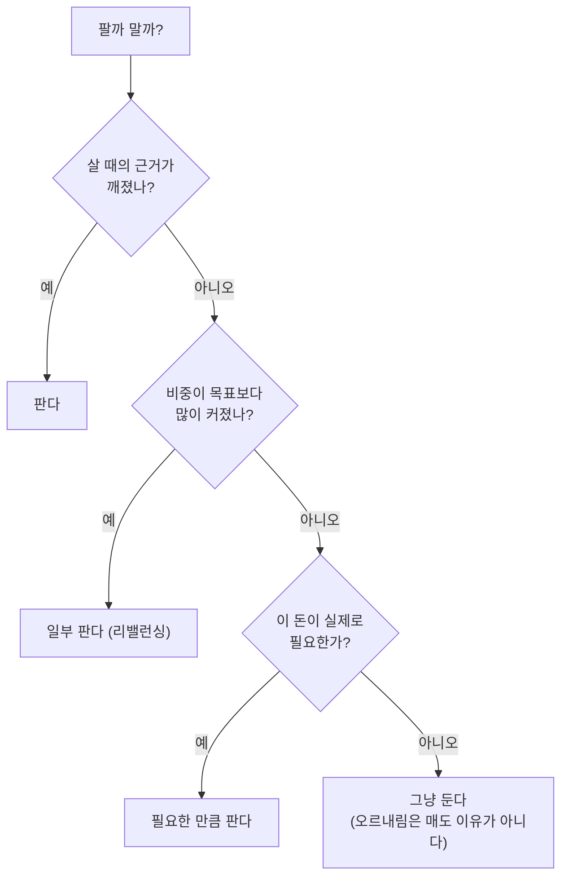

시리즈를 여기까지 오며 우리는 무엇을 살지([가치](/reading-valuation-metrics)·[성장](/valuing-growth-stocks)·[인덱스](/etf-and-index-investing)), 어떻게 나눌지([분산](/diversification-and-portfolio))를 이야기했습니다. 그런데 이 모든 지식에도 불구하고, 정작 사람들이 돈을 잃는 건 **"사고파는 그 순간"** 에서입니다. 아는 것과 하는 것은 전혀 다릅니다. 오를 때 흥분해서 더 사고, 빠질 때 공포에 팔아버리는 — 머리로는 다 아는 실수를 막상 내 돈이 걸리면 반복합니다.

그래서 마지막 편은 **매매의 규율과 리스크 관리**입니다. [첫 편](/stocks-before-you-start)에서 "투자는 종목 분석보다 자기 감정을 다루는 싸움에 가깝다"고 했는데, 그 싸움의 실전 무기를 다룹니다.

> ⚠️ 이 글은 개인적으로 공부한 내용을 정리한 것이며, 투자 권유나 자문이 아닙니다. 특정 종목에 대한 이야기도 없습니다.

## 규칙을 먼저, 감정은 나중

핵심 원칙을 하나로 요약하면 이렇습니다. **매매 규칙은 냉정할 때 미리 정해두고, 흥분하거나 공포에 질렸을 때는 그 규칙을 따른다.**

시장이 급등하거나 급락하는 순간의 나는 평소의 내가 아닙니다. 그 순간에 판단하면 거의 항상 감정에 휘둘립니다. 그래서 성숙한 투자자는 **평온할 때** "이 종목은 왜 샀고, 어떤 근거가 깨지면 팔 것이며, 얼마까지만 담을 것인가"를 글로 적어둡니다. 일종의 **투자 일지**이자 나 자신과의 계약이죠. 그리고 시장이 요동칠 때는 새로 판단하는 대신, 그 적어둔 규칙을 꺼내 봅니다.

이게 왜 중요하냐면, 감정은 **정확히 잘못된 타이밍에** 잘못된 행동을 부추기기 때문입니다. 모두가 환호할 때(고점) 사고 싶고, 모두가 절망할 때(저점) 팔고 싶어집니다. 규칙은 이 본능의 반대편에서 나를 붙잡아주는 장치입니다.

## 언제 사나 — 타이밍을 맞히려 하지 마라

사는 것부터 봅시다. 초보가 가장 빠지기 쉬운 함정이 **"싸게 살 타이밍"을 맞히려는 것**입니다. [첫 편](/stocks-before-you-start)에서 말했듯, 바닥을 꾸준히 맞히는 사람은 사실상 없습니다.

그래서 현실적인 답은 [4편](/diversification-and-portfolio)에서 다룬 **시간 분산**입니다. 한 번에 목돈을 넣지 않고, 정해진 금액을 정해진 주기로 나눠 삽니다(적립식·분할매수). 그러면 "언제 살까"라는 맞히기 어려운 질문 자체를 우회합니다. 값이 쌀 때는 더 많은 수량을, 비쌀 때는 더 적은 수량을 자동으로 사게 되어 매수 단가가 평균에 수렴합니다. 무엇보다, **타이밍을 고민하지 않으니 감정이 개입할 틈이 줄어듭니다.**

"쌀 때 몰아서 사면 더 벌지 않나?"는 생각이 들 수 있습니다. 이론적으로는 그렇지만, 그러려면 "지금이 싼 때"임을 알아야 하는데 그걸 아는 게 애초에 불가능합니다. 확실하지 않은 큰 이익을 좇다 확실한 실수를 반복하느니, 지루하지만 꾸준한 쪽이 대다수에게 낫습니다.

## 언제 파나 — 가장 어려운 결정

사는 것보다 **파는 것이 훨씬 어렵습니다.** 왜일까요? 감정 때문입니다.

- **손실 회피** — 사람은 이익의 기쁨보다 손실의 고통을 훨씬 크게 느낍니다. 그래서 손실을 확정(매도)하기가 고통스러워, 내린 주식을 "언젠간 오르겠지" 하며 붙잡습니다.
- **본전 심리** — "산 가격까지만 오르면 팔아야지"라고 생각합니다. 그런데 시장은 내가 산 가격을 모르고 관심도 없습니다. 본전은 내 심리일 뿐, 매도 근거가 될 수 없습니다.

그래서 매도도 **규칙**으로 해야 합니다. 파는 이유는 대체로 셋 중 하나여야 합니다.

- **근거가 깨졌을 때** — 살 때 세웠던 이유(2·3편의 밸류에이션, 성장 논리)가 더 이상 유효하지 않다면 팝니다. 회사의 사업이 망가졌거나, 애초의 판단이 틀렸을 때죠.
- **리밸런싱** — [4편](/diversification-and-portfolio)에서 본, 비중이 목표보다 커졌을 때 일부를 덜어냅니다.
- **돈이 필요할 때** — 실제로 그 자금이 필요해진 경우.

여기 없는 이유가 있습니다. **"올랐으니까"와 "내렸으니까"** 입니다. 단지 가격이 움직였다는 건 매도의 근거가 아닙니다. 오른 걸 팔면(이익 실현) 더 오를 걸 놓치고, 내린 걸 팔면(공포 매도) 회복을 놓칩니다. 규칙이 없으면 이 두 실수를 오갑니다.

## 리스크 관리 — 잃지 않는 것이 먼저다

[첫 편](/stocks-before-you-start)에서 "가장 중요한 건 크게 버는 게 아니라 게임에서 퇴출당하지 않는 것"이라 했습니다. 리스크 관리가 바로 그 퇴출을 막는 일입니다.

- **포지션 크기(position sizing)** — 한 종목에 얼마까지 담을지 미리 정합니다. 아무리 확신이 서도 한 종목에 전 재산을 걸지 않습니다. 그 하나가 무너져도 다시 일어설 수 있어야 하니까요. 확신의 크기가 아니라 **감당할 수 있는 손실의 크기**로 비중을 정합니다.
- **손절(stop loss)** — 손실이 정해둔 선을 넘으면 감정 없이 자릅니다. "여기까지 내려가면 내 판단이 틀린 것"이라는 선을 살 때 미리 정해두는 겁니다. 손절이 어려운 건 손실을 인정하는 고통 때문인데, 규칙으로 자동화하면 그 고통을 우회할 수 있습니다.
- **잃어도 되는 돈으로** — 다시 강조하지만, 당장 필요한 돈으로 투자하면 하필 최악의 시점(하락장 바닥)에 팔 수밖에 없게 됩니다. 시간을 견딜 수 있는 돈이라야 규칙을 지킬 수 있습니다.

한 가지 유의할 점은, 손절 규칙은 **개별 종목**에 특히 중요하다는 것입니다. 개별 회사는 영영 회복하지 못할 수도 있으니까요. 반면 [넓은 인덱스](/etf-and-index-investing)는 성격이 조금 다릅니다 — 시장 전체가 장기적으로 회복해온 역사가 있어, 하락장에서 손절보다 오히려 꾸준히 사 모으는 전략이 통하기도 합니다. 무엇에 투자했느냐에 따라 규칙도 달라집니다.

## 감정을 다스리는 장치들

의지력만으로 감정을 이기려는 건 대개 실패합니다. 대신 **감정이 개입할 여지를 구조적으로 줄이는** 장치를 씁니다.

- **자동화** — 적립식 자동이체처럼, 매수를 아예 자동으로 만들면 매번 "지금 살까?"를 고민하지 않게 됩니다. 판단의 횟수를 줄이는 게 실수의 횟수를 줄입니다.
- **확인 빈도 줄이기** — 계좌를 매일, 매시간 들여다보면 하루하루의 소음([첫 편](/stocks-before-you-start)의 그 "단기 심리")에 감정이 흔들립니다. 장기 투자자일수록 덜 자주 보는 게 낫습니다. 자주 보면 자주 팔고 싶어집니다.
- **뉴스·군중과 거리두기** — "지금 사야 한다", "지금 팔아야 한다"는 소음이 가장 시끄러울 때가 대개 가장 위험한 순간입니다. 남들이 다 하는 것과 반대가 정답이라는 뜻이 아니라, **군중의 감정에 휩쓸려 내 규칙을 버리지 말라**는 뜻입니다.
- **투자 일지** — 왜 샀고 무엇이 바뀌면 팔 것인지를 적어두면, 나중에 감정이 판단을 흐릴 때 과거의 냉정한 나를 다시 불러올 수 있습니다.

## 하락장을 견디는 법

결국 이 모든 규율이 진짜로 시험받는 순간은 **하락장**입니다. 계좌가 파랗게 물들고, 뉴스는 종말을 이야기하고, 모두가 팔 때. 여기서 지금까지의 규칙이 무너지면 앞의 모든 공부가 소용없습니다.

기억할 것은, 역사적으로 **넓은 시장은 위기를 겪고도 결국 회복해왔다**는 점입니다(개별 종목은 아닐 수 있습니다). 공포에 질려 바닥에서 팔면, 그 회복의 열매를 놓칠 뿐 아니라 손실을 영구히 확정하는 셈입니다. "시장에 머무는 시간"이 "시장의 타이밍을 맞히는 것"보다 중요하다는 오랜 격언이 여기서 힘을 발휘합니다.

이때 **현금 비중**이 심리적 안전판이 됩니다. 어느 정도 현금을 쥐고 있으면, 하락장이 공포가 아니라 기회로 보입니다 — 규칙에 따라 싸진 자산을 더 담을 여력이 있으니까요. 반대로 전부 투자에 넣어둔 사람은 하락장에서 할 수 있는 게 견디거나 파는 것뿐이라, 감정에 더 취약해집니다.

## 시리즈를 마치며

여섯 편의 시리즈를 여기서 매듭짓습니다. 전체를 한 줄기로 꿰면 이렇습니다.

- **1편** — 투자와 투기를 구분하고, 가격의 원리와 자기 감정을 먼저 이해하기.
- **2편** — PER·PBR·ROE로 기업 가치를 재보기.
- **3편** — 지표가 안 통하는 성장주는 다른 렌즈로 보기.
- **4편** — 분산과 포트폴리오로 위험을 다스리기.
- **5편** — ETF·인덱스로 시장을 통째로, 손쉽게 사기.
- **6편** — 규칙과 리스크 관리로 실제 매매의 감정을 다스리기.

돌아보면 이 시리즈는 "무엇을 사면 오르는가"에 대한 답이 아니었습니다. 그건 애초에 아무도 확실히 모르고, 저 역시 모릅니다. 대신 이 시리즈가 이야기한 건 **"어떻게 하면 큰 실수를 피하고, 오래 살아남으며, 시장의 장기 성장을 내 것으로 만들 수 있는가"** 였습니다. 투자의 성패는 좋은 종목을 고르는 능력보다, **자기 자신을 다스리는 규율**에서 더 크게 갈립니다. 화려한 필살기가 아니라, 지루한 원칙을 오래 지키는 사람이 결국 웃는 게 이 게임의 속성입니다.

부디 즐겁고 건강한 투자 되시길 바랍니다. 그리고 다시 한번 — 이 글은 투자 권유가 아니며, 모든 판단과 책임은 본인에게 있습니다. 시리즈를 끝까지 읽어주셔서 감사합니다. 🙇
