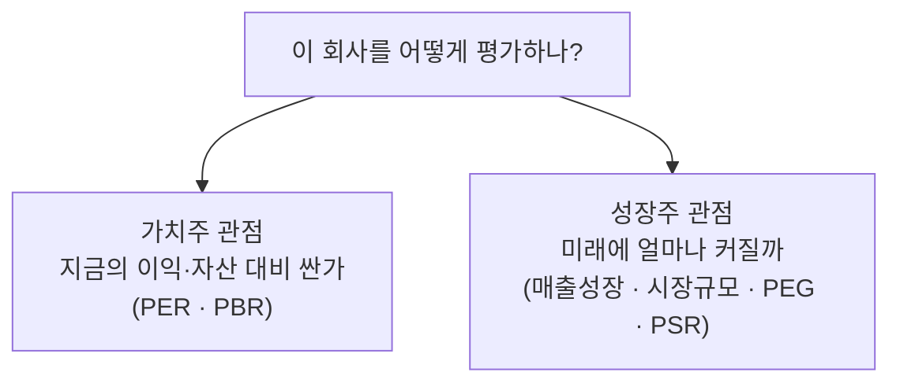

[지난 편](/reading-valuation-metrics)에서 PER·PBR·ROE로 "이 회사가 싼지 비싼지"를 재는 법을 봤습니다. 그런데 그 잣대를 들이대는 순간 도무지 설명이 안 되는 회사들이 있습니다. PER이 100배가 넘는데도, 심지어 **아직 적자라 PER 계산조차 안 되는데도** 주가가 계속 오르는 회사들입니다. 지표로만 보면 "미친 듯이 비싼" 이 회사들을, 사람들은 왜 사는 걸까요?

답은 간단합니다. 그들은 **지금의 이익이 아니라 미래의 성장을 사고 있기 때문**입니다. 이런 성장주에는 지난 편의 지표가 잘 통하지 않고, 다른 렌즈가 필요합니다. 이번 편은 그 렌즈에 대한 이야기입니다.

> ⚠️ 이 글은 개인적으로 공부한 내용을 정리한 것이며, 투자 권유나 자문이 아닙니다. 특정 종목에 대한 이야기도 없습니다.

## 가치주와 성장주 — 무엇이 다른가

주식은 크게 두 부류로 나눠 이야기하곤 합니다.

- **가치주(value stock)** — 지금 벌고 있는 이익이나 가진 자산에 비해 **싸게** 거래되는 회사입니다. 성숙해서 성장은 느리지만 안정적으로 돈을 법니다. 지난 편의 PER·PBR이 잘 통하는 영역입니다.
- **성장주(growth stock)** — 지금은 이익이 작거나 없지만, **앞으로 빠르게 커질 것**이라 기대받는 회사입니다. 사람들이 그 미래를 미리 값에 반영하기 때문에 현재 기준으로는 비싸 보입니다.

핵심은 이 둘이 **다른 것을 사는** 행위라는 점입니다. 가치주는 "지금 여기 있는 가치를 싸게 사는 것"이고, 성장주는 "아직 오지 않은 가치를 미리 사는 것"입니다. 그러니 재는 잣대도 달라야 합니다.

## 왜 전통 지표가 안 통하나

성장주에 PER·PBR을 들이대면 왜 어긋나는지, 이유를 뜯어보겠습니다.

- **PER은 현재 이익이 기준입니다.** 성장주는 지금 이익을 일부러 안 냅니다. 번 돈을 곧바로 성장(연구·마케팅·인프라)에 재투자해버리기 때문입니다. 그래서 이익이 작아 PER이 폭발적으로 커지거나, 적자라 아예 계산이 안 됩니다. 아마존이 오랫동안 이익을 거의 안 내면서도 기업 가치가 계속 커진 것이 대표적인 예입니다. "지금 이익이 작다"가 "나쁜 회사다"를 뜻하지 않는 겁니다.
- **PBR은 자산이 기준입니다.** 성장주 상당수는 소프트웨어·플랫폼처럼 공장 같은 유형자산이 거의 없습니다. 순자산이 작으니 PBR이 구조적으로 높게 나옵니다. 이런 회사의 진짜 가치는 장부에 안 잡히는 기술·브랜드·사용자에 있습니다.

즉 이 지표들은 "현재의 스냅샷"을 재는 도구인데, 성장주의 가치는 **미래에** 있습니다. 스냅샷으로 동영상을 판단하려니 어긋나는 겁니다.

## 그럼 성장주는 무엇을 보나

현재의 이익 대신, 성장주를 볼 때 흔히 함께 살피는 것들이 있습니다. 하나씩 보겠습니다.

- **매출 성장률** — 이익이 아직 작으니, 이익보다 **매출이 얼마나 빠르게 느는지**를 봅니다. 성장주의 생명은 성장의 속도이고, 그 속도가 유지되는지가 핵심입니다. 성장이 꺾이는 순간이 성장주에는 가장 위험합니다.
- **시장 규모(TAM)** — 이 회사가 최대 얼마나 커질 수 있는지, 즉 노리는 시장 자체가 큰지를 봅니다. 아무리 빨리 커도 시장 자체가 작으면 금방 천장에 부딪힙니다.
- **단위 경제성(unit economics)** — "하나 더 팔 때마다 남는 구조인가"입니다. 지금은 전체가 적자여도, 고객 하나당으로 뜯어보면 남는 장사라면, 규모가 커질수록 흑자로 전환될 수 있습니다. 반대로 팔수록 손해라면 성장은 오히려 독입니다.
- **이익률의 방향** — 지금 적자인 것보다, 그 적자가 **줄어드는 추세인지**가 중요합니다. 손실 폭이 매 분기 좁혀지고 있다면 흑자 전환의 신호일 수 있습니다.
- **해자(moat)** — 빠른 성장을 **지켜낼 수 있는지**입니다. 경쟁자가 쉽게 따라올 수 있는 사업이라면, 성장이 곧 남 좋은 일이 됩니다.

밸류에이션 지표에도 성장주용 변형이 있습니다.

- **PEG = PER ÷ 이익성장률** — PER이 높아도 그만큼 이익이 빠르게 크면 정당화될 수 있다는 발상입니다. 대략 PEG가 1 근처면 "성장을 감안하면 적정"이라고 보는 식입니다. PER 40이 비싸 보여도 이익이 연 40%씩 큰다면 PEG는 1이 됩니다.
- **PSR = 주가 ÷ 주당매출** — 이익이 없어 PER을 못 쓸 때, 이익 대신 **매출** 대비로 값을 매기는 지표입니다. 적자 성장주를 비교할 때 자주 등장합니다.

## 성장주의 위험 — 기대는 이미 값에 들어있다

성장주 이야기에서 가장 중요한데 자주 빠지는 게 이 부분입니다. **성장주의 높은 주가에는 이미 "빠른 성장이 계속될 것"이라는 기대가 담겨 있습니다.**

그래서 성장주는 성장이 실제로 빨라서가 아니라, **기대만큼 빠르지 않은 순간** 무너집니다. 매출이 40% 늘었어도 시장이 50%를 기대했다면 주가는 급락합니다. 실적 발표 후 좋은 숫자에도 주가가 빠지는 이른바 어닝 쇼크가 이래서 생깁니다. 기대가 값에 미리 반영돼 있으니, 그 기대를 넘어서야만 오르는 구조입니다.

두 가지를 더 기억해두면 좋습니다.

- **금리에 민감합니다.** 성장주의 가치는 대부분 먼 미래의 이익에 있는데, 금리가 오르면 그 미래 이익의 현재가치가 깎입니다. 그래서 금리 인상기에 성장주가 유독 크게 흔들립니다.
- **"좋은 회사"와 "좋은 주식"은 다릅니다.** 훌륭하게 성장하는 회사라도, 그 성장이 이미 다 반영된 비싼 값에 사면 좋은 투자가 아닐 수 있습니다. 회사의 질과 내가 치르는 가격은 별개의 문제입니다.

## 그래서 어떻게 접근할까

성장주를 대하는 태도를 정리하면 두 축입니다. **성장의 지속 가능성**과 **가격의 합리성**입니다.

- 성장이 **일시적인 유행인지, 구조적으로 지속될 것인지**를 냉정하게 봅니다. 매력적인 스토리에 취해 "이건 무조건 오른다"가 되는 순간이 가장 위험합니다.
- 아무리 좋은 성장주라도 **밸류에이션을 완전히 무시하면 안 됩니다.** "성장주는 원래 비싸"라는 말로 어떤 가격이든 정당화하기 시작하면, 그건 투자가 아니라 [첫 편](/stocks-before-you-start)에서 이야기한 투기에 가까워집니다.

성장주는 크게 벌 수도, 크게 잃을 수도 있는 영역입니다. 그래서 초보일수록 **전부를 성장주에 걸기보다, 이해하는 만큼만** 담는 게 안전합니다. 이 "한 곳에 몰지 않는다"는 이야기가 바로 다음 편의 주제, 분산과 포트폴리오로 이어집니다.

## 정리

- 성장주는 **지금의 이익이 아니라 미래의 성장**을 사는 것이라, PER·PBR 같은 현재 기준 지표가 잘 안 통합니다.
- 대신 **매출 성장률·시장 규모·단위 경제성·이익률의 방향·해자**, 그리고 **PEG·PSR** 같은 렌즈로 봅니다.
- 높은 주가엔 **기대가 이미 들어있어**, 기대에 미치지 못하면 무너집니다. 금리에도 민감합니다.
- **좋은 회사 ≠ 좋은 주식** — 성장의 지속성과 가격의 합리성을 함께 따지고, 밸류에이션을 아주 버리진 마세요.

성장주는 이해와 절제가 특히 많이 필요한 영역입니다. 다음 편에서는 이런 위험을 다스리는 가장 기본적인 도구 — 분산과 포트폴리오 — 를 다루겠습니다.

> 다시 한번, 이 글은 투자 권유가 아니며 모든 판단과 책임은 본인에게 있습니다.
