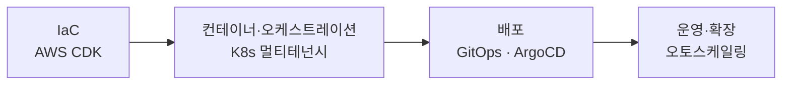

## 왜 블로그를 시작하나

실무에서 한 번쯤 검색해 본 문제들 — `GitHub Actions로 배포 자동화하기`, `Docker 다음에 왜 Kubernetes인가`, `AWS CDK로 인프라를 코드로 관리하기` — 막상 한글 자료를 찾으면 입문 글은 넘치지만 **실제 판단과 트레이드오프**가 담긴 글은 드뭅니다.

이 블로그는 그 빈자리를 메우려고 합니다. 중급 개발자 눈높이에서, 개념과 따라하기, 그리고 직접 부딪힌 함정까지 함께 정리합니다.

## 앞으로 다룰 주제

- **IaC** — AWS CDK를 프로덕션에서 안정적으로 운영하기
- **컨테이너 / 오케스트레이션** — Kubernetes 멀티테넌시와 리소스 격리
- **CI/CD** — 빌드·테스트·배포 파이프라인 설계
- **GitOps** — ArgoCD로 쿠버네티스 배포 자동화

큰 흐름은 "인프라를 정의하고 → 배포하고 → 운영·확장하는" 순서로 이어집니다.



## 코드도 이렇게 보입니다

```yaml
# .github/workflows/deploy.yml
name: deploy
on:
  push:
    branches: [main]
jobs:
  build:
    runs-on: ubuntu-latest
    steps:
      - uses: actions/checkout@v4
      - run: yarn install --frozen-lockfile
      - run: yarn build
```

> 첫 정식 글은 **[프로덕션에서 AWS CDK 길들이기](/taming-aws-cdk-in-production)** 입니다. escape hatch, Aspects, 안정화 전략까지 — CDK를 운영 가능한 IaC로 만드는 실전 이야기를 다룹니다.

읽어주셔서 감사합니다. 🙇
