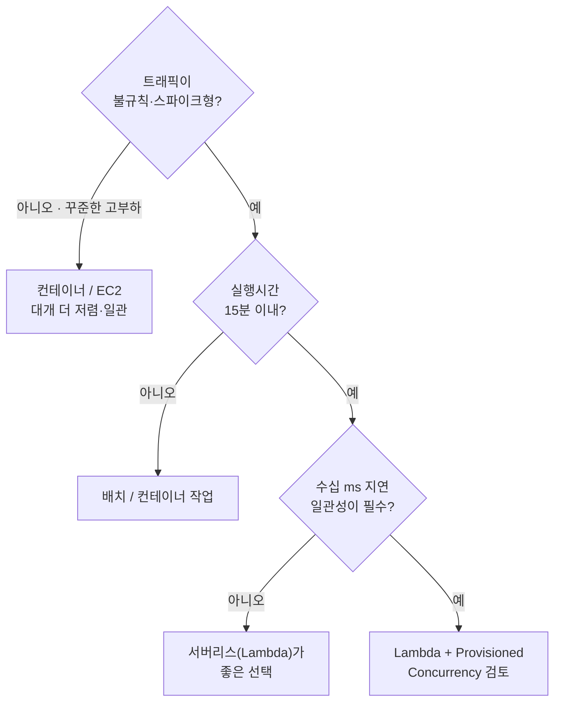

"이거 그냥 Lambda로 하면 안 되나요?"라는 질문은 이제 거의 모든 설계 회의에 등장합니다. 서버를 직접 띄우고 관리하던 부담을 생각하면, 코드만 올리면 알아서 돌아가는 서버리스는 분명 매력적입니다.

다만 서버리스는 **"서버가 없다"가 아니라 "서버를 내가 신경 쓰지 않는다"는 뜻**입니다. 서버는 여전히 어딘가에서 돌고, 그 추상화의 대가로 cold start·실행시간 제한·비용 구조 같은 새로운 제약이 따라옵니다. 그래서 서버리스는 "기본값으로 깔고 보는" 기술이 아니라, **워크로드마다 따져봐야 하는 선택지**입니다.

이 글에서는 Lambda가 빛나는 워크로드와 오히려 독이 되는 워크로드를, cold start·비용·동시성·실행시간이라는 네 축으로 따져보려 합니다. 저도 실제로 상시 떠 있던 서버의 일부 작업을 Lambda로 옮겨 부하를 절반 가까이 줄인 적이 있는데, 그게 가능했던 건 그 워크로드가 **서버리스에 잘 맞는 모양**이었기 때문이었습니다.

## 서버리스가 빛나는 지점

먼저 잘 맞는 경우부터 보겠습니다. 아래 특징을 가진 워크로드라면 서버리스는 거의 항상 좋은 선택입니다.

- **이벤트 기반** — 파일 업로드, 큐 메시지, 웹훅, 스케줄처럼 "어떤 일이 생겼을 때만" 도는 작업
- **불규칙·스파이크 트래픽** — 평소엔 한가하다가 가끔 몰리는 패턴. 상시 서버를 띄워두면 대부분의 시간이 낭비입니다
- **운영 부담을 줄이고 싶을 때** — 패치·스케일링·가용성을 클라우드가 맡아주니, 작은 팀일수록 이득이 큽니다
- **사용한 만큼만 내고 싶을 때** — 요청이 없으면 비용도 0에 가깝습니다

제 경우도 "상시 트래픽은 아닌데 가끔 무겁게 도는" 작업이 서버를 계속 점유하고 있었고, 그걸 Lambda로 떼어내자 평상시 서버 부하가 크게 떨어졌습니다. 핵심은 그 작업이 **간헐적**이었다는 점입니다.

## cold start의 실체

서버리스를 이야기할 때 빠지지 않는 게 cold start입니다. 요청이 없어 잠들어 있던 함수가 깨어날 때, 런타임을 초기화하느라 생기는 첫 지연입니다.

무엇이 cold start를 키우는지 알면 대응이 쉬워집니다.

- **런타임** — JVM·.NET처럼 무거운 런타임은 초기화가 깁니다. Node·Python·Go는 상대적으로 가볍습니다
- **패키지 크기** — 의존성이 많고 번들이 크면 로딩이 길어집니다
- **VPC 연결** — 함수를 VPC에 붙이면 ENI 구성 때문에 지연이 더 붙을 수 있습니다

완화 방법도 있습니다. **Provisioned Concurrency**로 미리 데워둔 인스턴스를 유지하거나, 경량 런타임·작은 번들을 쓰거나, Java라면 **SnapStart** 같은 기능으로 초기화를 건너뛰는 식입니다. 다만 Provisioned Concurrency는 "상시 켜두는" 비용이 들어서, 그걸 많이 써야 한다면 **애초에 서버리스가 맞는지** 다시 물어야 합니다.

## 비용 — 언제 싸고 언제 비싼가

서버리스 비용은 대략 **요청 수 × 실행 시간 × 할당 메모리**로 매겨집니다. 이 구조가 곧 장점이자 함정입니다.

- **간헐적 트래픽**: 안 돌면 0원이라 압도적으로 저렴합니다
- **꾸준한 고부하**: 함수가 사실상 24시간 돌게 되면, **같은 일을 하는 컨테이너/EC2보다 오히려 비싸지는** 구간이 옵니다

즉 트래픽이 일정 수준 이상으로 꾸준해지면 손익분기를 넘어 서버리스가 더 비싸집니다. "서버리스는 무조건 싸다"는 오해인데, 정확히는 "**한가할 때 싸다**"입니다. 트래픽 패턴이 평평한 상시 서비스라면 비용만으로도 컨테이너가 유리할 때가 많습니다.

## 동시성과 상태 — 숨은 함정

Lambda는 요청마다 인스턴스를 늘리는 식으로 **수평 확장**합니다. 빠르고 좋지만, 여기서 자주 놓치는 함정이 둘 있습니다.

- **다운스트림 폭발** — 함수가 1,000개로 늘면 그 뒤의 DB로도 커넥션이 1,000개 몰릴 수 있습니다. 전통적인 커넥션 풀 가정이 깨집니다. RDS라면 **RDS Proxy**로 커넥션을 모아주는 식의 대비가 필요합니다
- **상태 없음** — Lambda는 무상태가 기본입니다. 인스턴스 사이에 메모리를 공유할 수 없으니, 상태는 외부(캐시·DB)에 둬야 합니다

이런 특성 때문에, 기존 서버 코드를 그대로 Lambda에 올리면 **확장은 되는데 그 뒤가 무너지는** 상황이 생깁니다. 서버리스는 아키텍처를 거기에 맞춰 설계할 때 제값을 합니다.

한 가지 더, 서버리스는 **관찰성**의 그림도 다릅니다. 상시 서버라면 익숙한 "서버에 붙어서 들여다보기"가 통하지 않고, 짧게 떴다 사라지는 수많은 실행을 흩어진 채로 추적해야 합니다. 그래서 분산 추적(예: AWS X-Ray)으로 "API Gateway → Lambda → DB"의 한 요청을 끝까지 따라가고, cold start 비율과 꼬리 지연을 지표로 띄워두는 게 중요합니다. cold start는 "느껴지긴 하는데 눈에는 안 보이는" 부류의 문제라, 측정해두지 않으면 원인 모를 사용자 불만으로만 돌아옵니다.

## 서버리스가 독이 되는 지점

반대로 아래 경우라면 서버리스를 피하거나 신중해야 합니다.

- **장시간 작업** — Lambda는 실행시간 상한(최대 15분)이 있습니다. 긴 배치·인코딩·학습 작업은 맞지 않습니다
- **일정한 고부하** — 앞서 봤듯 비용·일관성 모두 컨테이너가 유리합니다
- **엄격한 지연 일관성** — cold start 때문에 꼬리 지연(tail latency)이 튈 수 있어, 수십 ms 일관성이 생명인 경로엔 부담입니다
- **복잡한 로컬 개발·디버깅** — 로컬 재현과 통합 테스트가 컨테이너보다 번거롭습니다
- **벤더 종속** — 특정 클라우드의 이벤트·런타임에 깊게 묶이면 이전이 어려워집니다

다만 "장시간"이나 "복잡한 절차"라고 해서 서버리스를 통째로 포기할 필요는 없습니다. 긴 작업은 잘게 쪼개 **Step Functions** 같은 오케스트레이션으로 엮으면, 각 단계는 짧은 Lambda로 유지하면서 전체 흐름은 길게 — 심지어 며칠에 걸쳐 — 가져갈 수 있습니다. "한 함수가 15분을 꽉 채워 도는" 대신 "짧은 함수들이 순서와 분기, 재시도까지 갖춰 도는" 모양으로 바꾸는 겁니다. 이 패턴까지 고려하면 서버리스의 적용 범위는 처음 생각보다 꽤 넓어집니다.

## 의사결정 — "서버리스 우선"이 아니라 "워크로드별로"

정리하면, 선택의 기준은 기술 선호가 아니라 **워크로드의 모양**입니다. 트래픽 패턴·실행시간·지연 민감도로 갈라보면 대체로 이렇게 정리됩니다.

이 그림이 절대 기준은 아니지만, 적어도 "일단 Lambda"라는 반사적 선택은 막아줍니다. 같은 서비스 안에서도 **간헐적 이벤트 처리는 서버리스로, 상시 API는 컨테이너로** 나누는 혼합 구성이 현실에서 가장 흔하고, 또 가장 합리적입니다.

## 정리

서버리스를 한 문장으로 압축하면 이렇게 말하고 싶습니다. **서버리스는 "한가하고 짧고 이벤트성인" 워크로드에서 빛나고, "꾸준하고 길고 지연에 민감한" 워크로드에서는 오히려 비싸고 까다로워집니다.**

- **잘 맞는 곳**: 이벤트 기반, 스파이크 트래픽, 운영 부담을 줄이고 싶은 작은 팀
- **cold start**: 런타임·번들·VPC가 원인. Provisioned Concurrency를 많이 써야 한다면 적합성을 다시 의심
- **비용**: 한가할 때 싸고, 꾸준한 고부하에선 컨테이너가 유리
- **동시성**: 수평 확장은 강점이지만 다운스트림(DB 커넥션) 대비가 필요
- **피할 곳**: 장시간 작업, 일정한 고부하, 엄격한 지연 일관성

결국 좋은 답은 "서버리스냐 아니냐"가 아니라, **이 워크로드에 무엇이 맞느냐**입니다. 워크로드의 모양을 먼저 보고 도구를 고르면, 서버리스는 만능도 함정도 아닌 — 제자리에서 제값을 하는 좋은 선택지가 됩니다.
